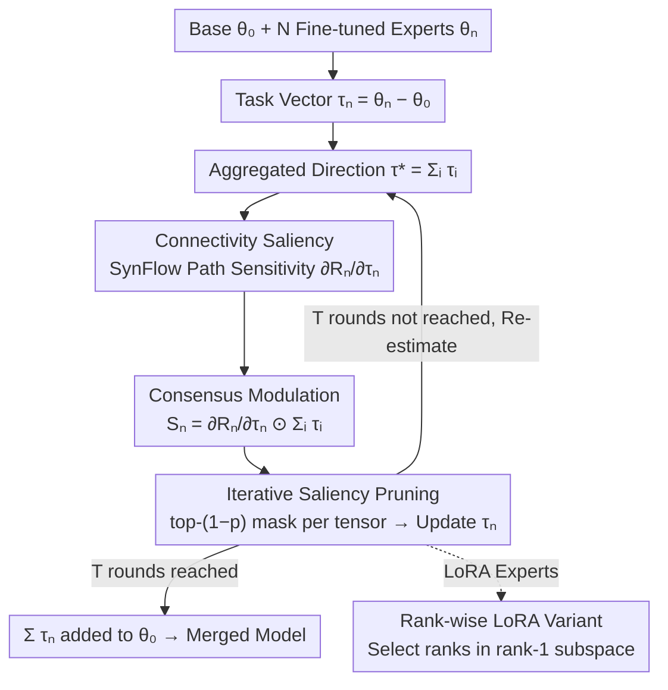

# Saliency-Aware Model Merging

**Conference**: ICML 2026  
**arXiv**: [2606.00511](https://arxiv.org/abs/2606.00511)  
**Code**: Not released  
**Area**: Model Compression / Model Merging / Data-Free Parameter Selection  
**Keywords**: model merging, task vector, SynFlow, connectivity saliency, LoRA merging  

## TL;DR
SA-Merging transfers the SynFlow connectivity score from structured pruning to the data-free model merging scenario. It calculates "end-to-end path sensitivity × aggregation direction consistency" as the saliency for each expert's task vector and iteratively removes low-saliency updates. This approach pushes data-free merging performance across vision, language, and LoRA multi-task scenarios close to the level of test-time adaptation.

## Background & Motivation

**Background**: Starting from foundations like CLIP, ViT, LLaMA, and T5, the community has trained numerous task-specific fine-tuned experts. Merging these into a unified model is a popular research direction. Task Arithmetic represents each expert as a task vector $\tau_n = \theta_n - \theta_0$ for linear superposition. Based on this, methods like TIES, DARE, PCB, and WUDI introduce magnitude pruning, sign election, and sparsification to reduce interference.

**Limitations of Prior Work**: These data-free methods almost all assume that "parameters are independent and identically distributed (i.i.d.)"—where the importance of each weight is determined by its own absolute magnitude. However, the functionality of deep networks is formed through cross-layer cascades. A large magnitude update may have zero impact on the final output if it is "blocked" by small weights in the next layer. Conversely, a small update on a high-capacity path might be crucial. Pruning based solely on magnitude (top-k) might remove small weights on critical paths while retaining large weights on dead ends, resulting in merged models that significantly lag behind Multi-Task Learning (MTL).

**Key Challenge**: Merging requires "equivalent compression of task functionality," whereas magnitude provides only local parameter information, lacking global signals like inter-layer coupling and cross-expert direction consistency. Furthermore, "functional importance" must be estimated under strict data-free conditions without access to task samples or calibration sets.

**Goal**: To calculate a saliency score for each coordinate of every task vector that accounts for inter-layer coupling under strict data-free constraints and perform iterative pruning accordingly. The framework should also seamlessly migrate to LoRA experts without breaking the low-rank structure.

**Key Insight**: The authors noted that SynFlow (Tanaka et al. 2020) from structural pruning provides a "data-free + end-to-end connectivity" metric. While originally used for single-model pruning, it could be adapted into a saliency measure for task vectors. Another observation is "cross-expert consensus direction"—if an expert's update direction at a specific coordinate opposes many other experts, it is likely noise rather than a valid update.

**Core Idea**: Structural sensitivity is measured using SynFlow-style connectivity gradients, which are then modulated by point-wise multiplication with the sum of all task vectors as the "consensus direction" to obtain saliency $\mathcal{S}_n$. The task vectors are refined via iterative top-k masking, and the remaining vectors are summed to produce the merged model.

## Method

### Overall Architecture
The method addresses the selection problem of "which task vector coordinates are worth retaining in the merged model" without touching any task data. Given base parameters $\theta_0$ and $N$ fine-tuned experts $\{\theta_n\}$, task vectors $\tau_n := \theta_n - \theta_0$ are computed, followed by $T$ iterations of refinement. In each iteration, the current updates of all experts are summed to obtain the aggregated direction $\tau^* = \sum_i \tau_i$. An end-to-end connectivity score $\mathcal{R}_n$ is calculated for each expert, and the gradient with respect to $\tau_n$ is taken as the structural sensitivity. This is multiplied element-wise by $\tau^*$ to yield saliency $\mathcal{S}_n$. Masks $m_n$ are generated based on the top-$(1-p)$ values within the tensor to update $\tau_n \leftarrow m_n \odot \tau_n$. After $T$ rounds, these sparsified task vectors are added back to $\theta_0$. For LoRA experts, the same saliency is applied to rank-1 subspaces for rank-level selection to maintain the low-rank structure.

### Key Designs

**1. Connectivity Saliency: Measuring End-to-End Importance via SynFlow**

A long-standing problem in data-free merging is coordinate selection based only on magnitude. Functional capacity in deep networks depends on cross-layer cascades; a large update sandwiched between small weights contributes nothing to the output. The authors address this by adapting SynFlow from structural pruning: treating the network as $L$ consecutive parameter blocks, they define a connectivity score $\mathcal{R}_n(\theta_0, \tau_n) = \mathbf{1}^\top (\prod_{l=1}^{L} |\theta_0^l + \tau_n^l|) \mathbf{1}$, which measures how many strong paths the signal can pass through. Taking the gradient $\partial \mathcal{R}_n / \partial \tau_n$ essentially measures "how many strong paths this coordinate participates in." Consequently, large updates blocked by small weights receive near-zero gradients and drop in priority, while small updates on high-capacity paths are elevated. This provides a data-free structural importance measure orthogonal to magnitude/sign signals.

**2. Aggregation Direction Modulation: Integrating Sign Election into Saliency Multipliers**

Structural sensitivity alone is insufficient—an update might be "structurally important" for one expert but oppose the general direction of others, indicating noise. The authors incorporate cross-expert consensus by defining saliency as $\mathcal{S}_n := \frac{\partial \mathcal{R}_n}{\partial \tau_n} \odot \sum_{i=1}^{N} \tau_i$. If an update's sign opposes the aggregated direction $\sum_i \tau_i$, the product becomes negative or minimal. Only coordinates that are "structurally important AND consistent with the majority consensus" receive high saliency. While TIES uses explicit sign voting to suppress interference, this method integrates sign election directly into the saliency score, retaining multiplicative smoothing (where magnitude automatically determines weight) without introducing new hyperparameters.

**3. Iterative Saliency Pruning and Rank-wise LoRA Variant: Gradual Contraction and Lossless Extension**

One-shot pruning ignores the drift of inter-layer dependencies as the model sparsifies. Therefore, the authors follow the iterative approach of SynFlow: in each round, a mask is generated based on the top-$(1-p)$ values per tensor (avoiding pruning entire small layers), reaching a retention rate of approximately $(1-p)^T$ after $T$ rounds. With $T=10$ and a target of $10\%$ retention, $p=0.2$ is used, allowing the mask to self-align through the prune-reevaluate-prune cycle. For LoRA, element-wise pruning destroys the low-rank structure. Instead, the selection is performed in the rank-1 subspace: treating $\Delta W_n^l = s B_n^l A_n^l$ as the task vector, the saliency for the $k$-th rank component is $s_{n,k}^l = |\gamma_{n,k}^l \eta_{n,k}^l|$, where $\gamma_{n,k}^l$ is structural sensitivity and $\eta_{n,k}^l$ is consistency with the aggregated update. Ranks are selected by saliency, and pruning is applied via $B_n^l \leftarrow B_n^l \mathrm{Diag}(m_n^l)$ and $A_n^l \leftarrow \mathrm{Diag}(m_n^l) A_n^l$, preserving the LoRA structure and rank.

### Loss & Training
The method involves no training loss; the entire merging process requires zero backpropagation on task data and zero hyperparameter search. Calculating $\partial \mathcal{R}_n / \partial \tau_n$ requires only one automatic differentiation pass over parameters. For LoRA, gradients can be computed directly on low-rank factors via $\partial \mathcal{R}/\partial B = s G (A)^\top$ and $\partial \mathcal{R}/\partial A = s B^\top G$ without explicitly materializing $\Delta W$.

## Key Experimental Results

### Main Results
Evaluations cover four scenarios: an 8-task vision suite (SUN397/Cars/RESISC45/EuroSAT/SVHN/GTSRB/MNIST/DTD) for CLIP ViT-B/32, B/16, and L/14; 8-task GLUE for RoBERTa-Base/Large; LoRA merging for Flan-T5-base; and decoder (Instruct/Math/Code) merging.

| Dataset | Metric | Ours (SA-Merging) | Prev. SOTA data-free (WUDI) | Gain |
|--------|------|------|----------|------|
| CLIP ViT-B/32 (8-task vision avg) | Top-1 acc | 85.9 | 85.2 | +0.7 |
| CLIP ViT-L/14 (8-task vision avg) | Top-1 acc | 93.4 | 92.6 | +0.8 |
| GLUE RoBERTa-Base | Norm. Avg | 87.1 | 85.3 | +1.8 |
| GLUE RoBERTa-Large | Norm. Avg | 90.2 | 88.8 | +1.4 |

Note: On CLIP ViT-L/14, SA-Merging's 93.4 score is marginally close to Traditional MTL's 93.5 and exceeds all test-time / data-assisted methods (AdaMerging 90.8 / AdaMerging++ 91.0 / Representation Surgery 89.0), implying that strict data-free merging can finally stand on equal footing with sample-dependent methods.

### Ablation Study

| Configuration | Key Findings | Description |
|------|---------|------|
| Full SA-Merging | 8-task vision avg ≈ 85.9 (B/32) | Sensitivity + Consensus + Iteration |
| Magnitude + Consensus | Significant drop to TIES level | Rejection of structural sensitivity leads to degradation |
| Sensitivity only, no Consensus | Intermediate performance | Failure to suppress directional conflicts |
| Single-step pruning (T=1) | Weaker than T=10 | Validates the value of iterative refinement |
| Different pruning rates $p$ | Stable with larger $T$ | Performance rises monotonically with $T$ |

### Key Findings
- Structural sensitivity $\partial \mathcal{R}_n / \partial \tau_n$ has low correlation with traditional magnitude ranking, confirming it captures "functional importance" beyond magnitude and complements existing magnitude-based methods.
- The iteration count $T$ is the most robust hyperparameter: a monotonic "better with higher $T$" trend is observed across vision and language tasks without mask overfitting.
- Rank-wise LoRA saliency makes data-free LoRA merging significantly superior to naive element-wise pruning and preserves rank structure for direct integration into inference paths.

## Highlights & Insights
- Reinterpreting "SynFlow from structural pruning" as a "data-free saliency for task vectors" is a lightweight yet effective cross-domain migration, providing a new merging basis that can be combined with magnitude/sign methods.
- The consensus modulation $\odot \sum_i \tau_i$ is elegantly designed—it integrates the sign election of TIES into the saliency multiplier, removing explicit sign votes and thresholds while adjusting intensity (magnitude determines weight rather than a binary ±1).
- The rank-wise saliency for LoRA is highly practical: using the inner product $(b_{n,k}^l)^\top G a_{n,k}^l$ allows for automatic differentiation on low-rank factors without materializing $\Delta W$, making it nearly free even for ultra-large models.

## Limitations & Future Work
- The connectivity score $\mathcal{R}_n$ relies on $|\cdot|$ products, which may face numerical explosion or underflow in deep networks; this requires log-domain normalization in practice (details not fully discussed).
- The consensus direction $\sum_i \tau_i$ is a simple summation; when experts have high variance (e.g., LLM experts from vastly different domains), it might be skewed by dominant experts. Weighted or robust aggregation is a natural future direction.
- Experiments focus on medium-scale merging (8 experts). It remains to be seen if iterative pruning overhead and mask drift remain controllable when $N$ reaches hundreds (target for modular/sparse merging).

## Related Work & Insights
- **vs TIES-Merging / DARE / PCB**: These use magnitude pruning + sign election/random drops. This paper replaces magnitude with structural sensitivity and integrates sign election into a saliency multiplier. It positions itself as a "supplement rather than a replacement."
- **vs WUDI-Merging**: Both are recent data-free SOTAs. WUDI uses task vector weighting, while this paper addresses the foundational "which coordinates to merge" problem. They are orthogonal, though SA-Merging shows slightly better performance.
- **vs AdaMerging / Representation Surgery**: These rely on unlabeled test inputs for test-time tuning. SA-Merging’s data-free results on ViT-L/14 match or exceed these data-assisted methods, highlighting the potential of the structural saliency signal.

## Rating
- Novelty: ⭐⭐⭐⭐ Clever migration of SynFlow to merging; concise consensus modulation; valuable LoRA variant.
- Experimental Thoroughness: ⭐⭐⭐⭐ Covers Vision, GLUE, LoRA, and Decoders with comprehensive baselines.
- Writing Quality: ⭐⭐⭐⭐ Clear derivations, unified notation, and well-explained motivations.
- Value: ⭐⭐⭐⭐ Adds a new, stackable basis to data-free model merging; LoRA extension is meaningful for deployment.

<!-- RELATED:START -->

## Related Papers

- [\[CVPR 2026\] Saliency-Driven Token Merging for Vision Transformers](../../CVPR2026/model_compression/saliency-driven_token_merging_for_vision_transformers.md)
- [\[CVPR 2026\] Bridging Domains through Subspace-Aware Model Merging](../../CVPR2026/model_compression/bridging_domains_through_subspace-aware_model_merging.md)
- [\[ICML 2026\] Model Merging Scaling Laws in Large Language Models](model_merging_scaling_laws_in_large_language_models.md)
- [\[ICML 2026\] Decouple Searching from Training: Scaling Data Mixing via Model Merging for Large Language Model Pre-training](decouple_searching_from_training_scaling_data_mixing_via_model_merging_for_large.md)
- [\[ICML 2026\] FRISM: Fine-Grained Reasoning Injection via Subspace-Level Model Merging for Vision–Language Models](frism_fine-grained_reasoning_injection_via_subspace-level_model_merging_for_visi.md)

<!-- RELATED:END -->
