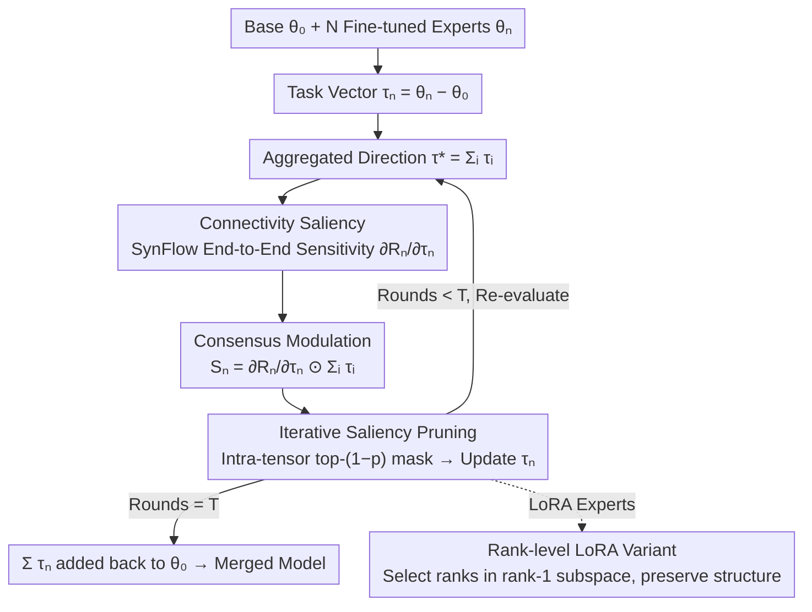

# Saliency-Aware Model Merging

**Conference**: ICML 2026  
**arXiv**: [2606.00511](https://arxiv.org/abs/2606.00511)  
**Code**: Not released  
**Area**: Model Compression / Model Merging / Data-Free Parameter Selection  
**Keywords**: model merging, task vector, SynFlow, connectivity saliency, LoRA merging  

## TL;DR
SA-Merging adapts the SynFlow connectivity score from structured pruning to data-free model merging scenarios. For each expert's task vector, it computes "end-to-end path sensitivity × aggregation direction consistency" as the saliency, iteratively removing updates with low saliency. This pushes data-free merging performance close to test-time adaptation levels across vision, language, and LoRA multi-task benchmarks.

## Background & Motivation

**Background**: Starting from foundation models such as CLIP, ViT, LLaMA, and T5, the community has trained a large number of task-specific fine-tuned experts. Merging these into a single unified model is a popular research direction. Task Arithmetic represents each expert as a task vector $\tau_n = \theta_n - \theta_0$ and performs linear summation. Methods like TIES, DARE, PCB, and WUDI build on this by introducing magnitude pruning, sign election, and sparsification to reduce interference.

**Limitations of Prior Work**: These data-free methods almost all assume that "parameters are independent and identically distributed"—the importance of each weight is determined solely by its own absolute value. However, the functionality of deep networks is formed through cross-layer cascades. A high-magnitude update may have zero effect on the final output if it is "blocked" by small weights in subsequent layers; conversely, a small update on a high-capacity path may be crucial. Selecting only by top-$k$ magnitude tends to prune small weights on key paths while retaining large weights on "dead ends," resulting in merged models that significantly lag behind MTL.

**Key Challenge**: Merging requires "functional equivalent compression," but magnitude is only local parameter information, lacking global signals like inter-layer coupling and cross-expert directional consistency. To maintain a data-free approach, one cannot call upon any forward or backward gradient data to estimate "functional importance."

**Goal**: Under strictly data-free conditions (no task samples, no calibration sets), compute a saliency for every coordinate of each task vector that accounts for inter-layer coupling and iteratively prune based on it. Additionally, the framework should seamlessly migrate to LoRA experts without destroying the low-rank structure.

**Key Insight**: The authors noted that SynFlow (Tanaka et al. 2020) from structured pruning provides a "data-free + end-to-end connectivity" score. It was originally used for single-model pruning; the question is whether it can be adapted into a saliency measure for task vectors. Another observation is "cross-expert consensus direction"—if an expert's update at a specific coordinate is opposite to the majority of other experts, it is likely noise rather than a valid update.

**Core Idea**: Use SynFlow-style connectivity gradients to measure structural sensitivity, then modulate it by the sum of all task vectors as the "consensus direction" to obtain saliency $\mathcal{S}_n$. Refine this iteratively using top-$k$ masks, and sum the remaining task vectors to obtain the merged model.

## Method

### Overall Architecture
The method solves the selection problem of "which task vector coordinates are worth retaining in the merged model" without ever touching task data. The inputs are the base parameters $\theta_0$ and $N$ fine-tuned experts $\{\theta_n\}$, first converted into task vectors $\tau_n := \theta_n - \theta_0$, followed by $T$ rounds of iterative refinement. In each round, the current updates of all experts are summed to obtain the aggregated direction $\tau^* = \sum_i \tau_i$. Then, an end-to-end connectivity score $\mathcal{R}_n$ is calculated for each expert, and its gradient with respect to $\tau_n$ is taken to obtain structural sensitivity. This is multiplied coordinate-wise with $\tau^*$ to yield saliency $\mathcal{S}_n$. An intra-tensor top-$(1-p)$ mask $m_n$ is generated to update $\tau_n \leftarrow m_n \odot \tau_n$. After $T$ rounds, these sparsified task vectors are added back to $\theta_0$ to form the final merged model. For LoRA experts, the same saliency logic is mapped to rank-1 subspaces for rank-level selection, preserving the low-rank structure.

### Key Designs

**1. Connectivity Saliency: Measuring End-to-End Importance via SynFlow on Task Vectors**

The long-standing issue with data-free merging is selecting coordinates based solely on magnitude. However, deep network functionality is a result of cross-layer cascades; a large update may contribute nothing to the final output if sandwiched between small weights. The authors address this by adapting SynFlow from structured pruning: viewing the network as $L$ consecutive parameter blocks, they define a connectivity score $\mathcal{R}_n(\theta_0, \tau_n) = \mathbf{1}^\top (\prod_{l=1}^{L} |\theta_0^l + \tau_n^l|) \mathbf{1}$, which measures how many strong paths the end-to-end signal can pass through. Taking the gradient with respect to $\tau_n$ yields structural sensitivity $\partial \mathcal{R}_n / \partial \tau_n$, which essentially counts "how many strong paths this coordinate participates in." Consequently, a large update blocked by small weights will receive a near-zero gradient and drop in priority, while small updates on high-capacity paths are elevated. This provides a data-free structural importance metric orthogonal to magnitude/sign signals.

**2. Aggregation Direction Modulation: Integrating Sign Election into the Saliency Multiplier**

Structural sensitivity alone is insufficient—an expert's update might be "structurally important" but opposite in direction to the general consensus of other experts, likely representing noise. The authors add a layer of cross-expert consensus, defining saliency as $\mathcal{S}_n := \frac{\partial \mathcal{R}_n}{\partial \tau_n} \odot \sum_{i=1}^{N} \tau_i$. If a coordinate update sign conflicts with the aggregated direction $\sum_i \tau_i$, the product becomes negative or minimal. Only coordinates that are "structurally important AND consistent with the majority" receive high saliency. While TIES uses explicit sign voting to suppress such interference, this method integrates sign election into the saliency itself—retaining multiplicative smoothing (where magnitude automatically determines weight, unlike the hard ±1 in voting) without introducing new hyperparameters, and naturally coupling with connectivity sensitivity.

**3. Iterative Saliency Pruning and Rank-level LoRA Variant: Gradual Contraction and LoRA Compatibility**

One-shot pruning ignores the drift of inter-layer dependencies as the model sparsifies. Thus, the authors follow SynFlow's lead with multi-round iterations: each round applies an intra-tensor top-$(1-p)$ mask (sorting within tensors rather than globally to avoid wiping out entire small layers). After $T$ rounds, the retention rate is approximately $(1-p)^T$. The paper sets $T=10$ and a target retention of 10%, thus choosing $p=0.2$, allowing the mask to self-align through prune-reevaluate-prune cycles. For LoRA, pruning matrix elements directly would destroy the low-rank structure, so the selection is moved to the rank-1 subspace. Treating $\Delta W_n^l = s B_n^l A_n^l$ as the task vector, the saliency of the $k$-th rank component is $s_{n,k}^l = |\gamma_{n,k}^l \eta_{n,k}^l|$, where $\gamma_{n,k}^l = (b_{n,k}^l)^\top G_n^l a_{n,k}^l$ is structural sensitivity and $\eta_{n,k}^l = (b_{n,k}^l)^\top \overline{\Delta W}^l a_{n,k}^l$ is consistency with the aggregated update. Ranks are selected by saliency using $B_n^l \leftarrow B_n^l \mathrm{Diag}(m_n^l)$ and $A_n^l \leftarrow \mathrm{Diag}(m_n^l) A_n^l$, keeping the LoRA structure intact for inference.

### Loss & Training
The method involves no training loss; the entire merging process features zero backpropagation on task data and zero hyperparameter search. Calculating $\partial \mathcal{R}_n / \partial \tau_n$ only requires a single automatic differentiation pass over parameters. For LoRA, gradients can be computed directly on low-rank factors via $\partial \mathcal{R}/\partial B = s G (A)^\top$ and $\partial \mathcal{R}/\partial A = s B^\top G$ without explicitly materializing $\Delta W$.

## Key Experimental Results

### Main Results
The evaluation covers 4 scenarios: 8-task vision suites for CLIP ViT-B/32, B/16, and L/14; 8-task GLUE for RoBERTa-Base/Large; LoRA merging for Flan-T5-base; and a decoder merging suite (Instruct/Math/Code).

| Dataset | Metric | Ours (SA-Merging) | Prev. SOTA data-free (WUDI) | Gain |
|--------|------|------|----------|------|
| CLIP ViT-B/32 (8-task vision avg) | Top-1 acc | 85.9 | 85.2 | +0.7 |
| CLIP ViT-L/14 (8-task vision avg) | Top-1 acc | 93.4 | 92.6 | +0.8 |
| GLUE RoBERTa-Base | Norm. Avg | 87.1 | 85.3 | +1.8 |
| GLUE RoBERTa-Large | Norm. Avg | 90.2 | 88.8 | +1.4 |

Note: On CLIP ViT-L/14, SA-Merging's 93.4 is nearly equal to Traditional MTL (93.5) and higher than all test-time / data-assisted methods (AdaMerging 90.8 / AdaMerging++ 91.0 / Representation Surgery 89.0), implying that strictly data-free merging can, for the first time, compete with methods relying on test samples.

### Ablation Study

| Configuration | Key Findings | Description |
|------|---------|------|
| Full SA-Merging | 8-task vision avg ≈ 85.9 (B/32) | Structural sensitivity + Consensus modulation + Iteration |
| Magnitude + Consensus only | Significant drop to TIES level | Degenerates to weighted TIES without structural sensitivity |
| Sensitivity only, no Consensus | Intermediate performance | Cannot suppress conflicting counter-updates |
| One-step pruning (T=1) | Weaker than T=10 | Confirms value of iterative refinement |
| Different pruning rates $p$ | More stable with larger $T$ | Performance rises monotonically with $T$ (Figure 3b) |

### Key Findings
- Structural sensitivity $\partial \mathcal{R}_n / \partial \tau_n$ has low correlation with traditional magnitude ranking, confirming it captures "functional importance beyond magnitude information" and complements existing magnitude-based methods.
- The number of iterations $T$ is the most robust hyperparameter: a monotonic "larger $T$, better performance" trend is observed across vision and language tasks, with no evidence of mask overfitting.
- Rank-level LoRA saliency makes data-free LoRA merging significantly superior to naive element-wise pruning while maintaining the rank structure for direct deployment.

## Highlights & Insights
- Reinterpreting "SynFlow from structured pruning" as a "data-free saliency for task vectors" is a lightweight yet highly practical cross-domain transfer: it provides a new merging basis that can be combined with existing magnitude/sign methods.
- The consensus modulation $\odot \sum_i \tau_i$ design is elegant—it integrates TIES's sign election into the saliency multiplier, eliminating explicit sign voting and thresholds while allowing for intensity adjustment (magnitude determines weight rather than a hard ±1).
- The rank-level saliency for LoRA is the most engineering-friendly part: through inner product forms like $(b_{n,k}^l)^\top G a_{n,k}^l$, it reuses automatic differentiation on low-rank factors without needing to materialize $\Delta W$, making it almost free for large models.

## Limitations & Future Work
- The connectivity score $\mathcal{R}_n$ depends on products of $|\cdot|$, which can face numerical explosion or underflow in deep networks; log-domain normalization is needed in engineering (not discussed in detail).
- The consensus direction $\sum_i \tau_i$ is a simple sum; it might be skewed by dominant experts when variance between experts is naturally large (e.g., LLM experts with massive domain gaps). Introducing weighted or robust aggregation is a natural next step.
- Experiments focus on merging around 8 experts; whether iterative pruning overhead and mask drift remain controllable when $N$ scales to dozens or hundreds (the goal of modular/sparse merging) remains to be verified.

## Related Work & Insights
- **vs TIES-Merging / DARE / PCB**: These use magnitude pruning + sign election/random dropping. This paper replaces magnitude with structural sensitivity and integrates sign election into saliency; it is positioned as a complement rather than a replacement.
- **vs WUDI-Merging**: Another recent data-free SOTA. WUDI uses task vector weighting, while this paper addresses the fundamental "which coordinates participate" question. The mechanisms are orthogonal, and while SA-Merging outperforms WUDI, the margin suggests the two approaches could be combined.
- **vs AdaMerging / Representation Surgery**: These rely on unlabeled test inputs for test-time tuning. SA-Merging's data-free results on ViT-L/14 catch up to or exceed these data-assisted methods, highlighting the potential of the structural saliency signal.

## Rating
- Novelty: ⭐⭐⭐⭐ Clever transfer of SynFlow to merging; consensus modulation is concise; LoRA rank-level variant adds engineering value.
- Experimental Thoroughness: ⭐⭐⭐⭐ Covers Vision, GLUE, LoRA, and Decoders; comprehensive baselines.
- Writing Quality: ⭐⭐⭐⭐ Clear derivations and algorithm descriptions; consistent notation and well-explained motivation.
- Value: ⭐⭐⭐⭐ Adds a new, stackable basis to data-free model merging; LoRA extension is meaningful for real-world deployment.

<!-- RELATED:START -->

## Related Papers

- [\[CVPR 2026\] Bridging Domains through Subspace-Aware Model Merging](../../CVPR2026/model_compression/bridging_domains_through_subspace-aware_model_merging.md)
- [\[ICML 2026\] Model Merging Scaling Laws in Large Language Models](model_merging_scaling_laws_in_large_language_models.md)
- [\[ICML 2026\] Decouple Searching from Training: Scaling Data Mixing via Model Merging for Large Language Model Pre-training](decouple_searching_from_training_scaling_data_mixing_via_model_merging_for_large.md)
- [\[ICML 2026\] FRISM: Fine-Grained Reasoning Injection via Subspace-Level Model Merging for Vision–Language Models](frism_fine-grained_reasoning_injection_via_subspace-level_model_merging_for_visi.md)
- [\[ICML 2026\] When Shared Knowledge Hurts: Spectral Over-Accumulation in Model Merging](when_shared_knowledge_hurts_spectral_over-accumulation_in_model_merging.md)

<!-- RELATED:END -->
