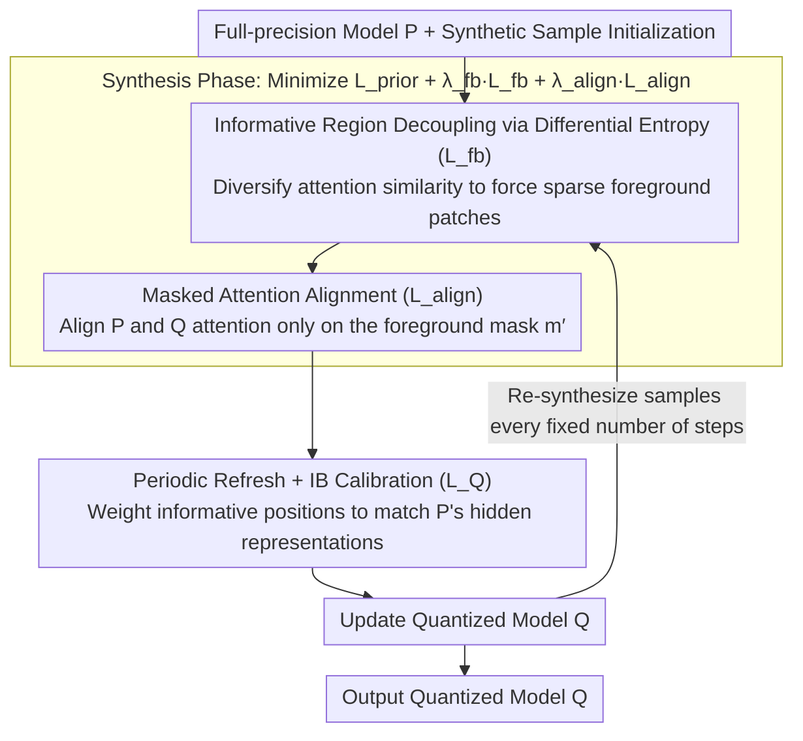

# Selective Coupling of Decoupled Informative Regions: Masked Attention Alignment for Data-Free Quantization of Vision Transformers

**Conference**: ICML 2026  
**arXiv**: [2606.04373](https://arxiv.org/abs/2606.04373)  
**Code**: https://github.com/hfutqian/MaskAQ  
**Area**: Model Compression / Data-Free Quantization / ViT  
**Keywords**: Data-Free Quantization, ViT, Attention Alignment, Information Bottleneck, Sample Synthesis

## TL;DR
MaskAQ redefines Data-Free Quantization (DFQ) for ViTs as "aligning the attention of the full-precision model $P$ and the quantized model $Q$ specifically on the sparse informative regions of synthetic samples." By utilizing differential entropy maximization to decouple foreground patches, an adaptive mask to align attention, and periodic refreshing to allow samples to evolve alongside $Q$, it improves ImageNet Top-1 accuracy by 3.1% on 3-bit DeiT-T compared to previous SOTA.

## Background & Motivation

**Background**: Deploying pre-trained ViTs on edge devices necessitates quantizing the full-precision model $P$ into a low-bit model $Q$. In scenarios with data security constraints where the original training set is inaccessible, Data-Free Quantization (DFQ) is employed to recover $Q$'s accuracy via synthetic samples. While CNN-era DFQ methods utilize BatchNorm statistics as priors to push synthetic samples toward the real distribution, ViTs use LayerNorm, which lacks such built-in "distribution keys." Consequently, PSAQ-ViT uses patch similarity to distinguish foreground, CLAMP-ViT introduces patch-level contrastive learning, and MimiQ enhances structural information using multi-head attention similarity.

**Limitations of Prior Work**: These methods focus on making "synthetic images look more like real images" but fail to address a more critical question: **Do synthetic samples retain the essential information required for $Q$'s calibration?** The authors observe two common issues: (1) **semantic dispersion**, where synthetic semantics are scattered across the image without coherent object structures; and (2) **attentional disparity**, where synthetic images lack discriminative regions recognizable by $Q$, preventing $Q$ from aligning its attention with the locations focused on by $P$. This is particularly severe in ultra-low bit settings.

**Key Challenge**: Existing DFQ methods aim to "approximate the real distribution." However, quantization errors inherently cause $Q$'s attention to shift. **Approximating the real distribution is not equivalent to assisting $Q$'s calibration.** Forcing $P$ and $Q$ to align attention across the entire image over-regularizes background patches, pushing synthetic samples away from a direction that recovers accuracy.

**Goal**: (a) Explicitly decouple sparse regions that are "truly important to $Q$" from synthetic samples; (b) Perform attention alignment between $P$ and $Q$ only on these regions rather than the full image; (c) Ensure synthetic samples continuously remain "useful to the current $Q$" throughout its training trajectory.

**Key Insight**: Self-attention mechanisms are inherently sparse—most semantics are concentrated on a few patches. Elevating this observation to the proposition that "informative regions are the primary carriers of mutual information between $P$ and $Q$," DFQ evolves from "distribution reconstruction" to "key mutual information reconstruction."

**Core Idea**: Treat DFQ as an **Information Bottleneck (IB)** problem—maximizing $I(z_q; y)$ under the information budget $C$ introduced by quantization—and implement this through a three-step process: decoupling informative regions, aligning attention under a mask, and periodically refreshing samples.

## Method

### Overall Architecture
MaskAQ follows the standard DFQ framework of "synthesis followed by calibration" but introduces the core concept of informative regions at both ends. First, sparse foreground patches that carry actual semantics are identified using $P$'s attention. Both synthesis and calibration then revolve around these patches. The synthesis objective $\mathcal{L}_S = \mathcal{L}_{prior} + \lambda_{fb}\mathcal{L}_{fb} + \lambda_{align}\mathcal{L}_{align}$ encourages diverse attention distributions to resolve semantic dispersion while aligning $P$ and $Q$ attention on an adaptive mask $m'$ to eliminate attentional disparity. During calibration, these foreground positions are weighted so $Q$ prioritizes matching $P$'s hidden representations in these areas. An outer "periodic refresh" loop re-synthesizes samples using the current $Q$ at fixed intervals to ensure samples track $Q$'s evolution.

### Key Designs

**1. Informative Region Decoupling via Differential Entropy ($\mathcal{L}_{fb}$): Pushing redundant patches apart to isolate semantic-bearing foregrounds**

A common issue in synthetic samples is semantic dispersion—semantics are blurred across the image without coherent objects, making subsequent masking difficult. MaskAQ defines the informative region as the set of patches $IR = \{x_n \mid \alpha_n \geq \alpha_{[k_{ir}]}\}$ whose attention weights $\alpha_n$ are not smaller than the $k_{ir}$-th largest value. To make this foreground stand out, the method takes the $l$-th layer attention matrix $A_l^p \in \mathbb{R}^{N \times N}$, extracts the attention vectors $a_i$ for each row, and calculates pairwise cosine similarities $S_{ij} = a_i \cdot a_j / (\|a_i\| \|a_j\|)$. Maximizing the entropy of the similarity distribution increases the distinctness between patches, making the foreground easier to isolate. Since directly maximizing "foreground clarity" is non-differentiable, making attention vectors distinct serves as a proxy. While Shannon entropy $H(p_l) = -\sum_k p_l(s_k) \log p_l(s_k)$ requires histogram estimation and causes gradient jitter, the authors approximate the similarity distribution as a Gaussian $\mathcal{N}(\mu_l, \sigma_l^2)$ and use differential entropy $H_l = \frac{1}{2}\log(2\pi e \sigma_l^2)$ as a proxy. The final loss $\mathcal{L}_{fb} = -\frac{1}{L} \sum_l H_l$ smooths the gradients at minimal cost.

**2. Adaptive Masked Attention Alignment ($\mathcal{L}_{align}$): Aligning only where $P$ is confident to give $Q$ room to adapt to quantization errors**

In ultra-low bit settings, $Q$'s attention naturally drifts. If forced to align with $P$ across the entire image, background patches dominated by quantization noise become over-regularized, absorbing errors into the gradients—the source of attentional disparity. MaskAQ's strategy is foreground-only alignment: it selects the top $k$ positions from $P$'s attention to form a binary mask $m[n] = \mathbb{1}[\alpha_n \geq \alpha_{[k]}]$. A stochastic mask $m'$ is then generated by randomly dropping positions from the set $\mathcal{P}$ with probability $p_{drop}$, keeping $k_{keep} = \max(k_{min}, \lfloor |\mathcal{P}| (1-p_{drop}) \rfloor)$ positions. The alignment loss averages the $L1$ attention difference only at masked positions:

$$\mathcal{L}_{align} = \sum_l \|m' \odot (A_l^p - A_l^q)\|_1 / \|m'\|_0$$

Aligning only where $P$ is most confident ensures semantic transfer without forcing $Q$ to struggle with the background. The stochastic dropout prevents synthetic samples from degenerating into a few fixed bright patches.

**3. Periodic Sample Refreshing + Information Bottleneck Perspective for Calibration: Evolving samples with $Q$ and prioritizing foreground in calibration**

A common failure in DFQ is that samples synthesized at the start of training become obsolete as $Q$ evolves. MaskAQ frames this within the Information Bottleneck (IB) theory: maximizing $I(z_q; y)$ s.t. $I(x; z_q) \leq C$, where $C$ is determined by bit-width. Theorem 1 states that as long as the Total Variation (TV) distance between $P$ and $Q$ on the informative region is $\leq \varepsilon_r$, the gap in predicted mutual information is bounded. Theorem 2 states that if the mutual information gap between synthetic and real samples on the informative region is small, synthetic samples suffice for $Q$'s alignment. This theoretically justifies why foreground-only alignment maintains predictive mutual information even in 3-bit scenarios. During calibration, informative positions are weighted by $w_{l,n} = 1 + m^c_{l,n} \cdot (w-1)$, using the objective:

$$\mathcal{L}_Q = \frac{1}{LN_h} \sum_{l, n_h} \frac{\sum_n w_{l,n} D(h^p_{l,n_h,n}, h^q_{l,n_h,n})}{\sum_n w_{l,n}}$$

The outer loop periodically re-synthesizes samples to ensure they remain consistent with $Q$'s current state.

### Loss & Training
The synthesis phase uses $\mathcal{L}_S = \mathcal{L}_{prior} + \lambda_{fb} \mathcal{L}_{fb} + \lambda_{align} \mathcal{L}_{align}$, where $\mathcal{L}_{prior}$ consists of a one-hot loss $\mathcal{L}_{OH} = CE(z_p, y)$, TV loss $\mathcal{L}_{TV}$, and inter-head SSIM loss $\mathcal{L}_{IH}$. The calibration phase uses $\mathcal{L}_Q$ with weight $w$ for informative patches. The algorithm alternates between synthesis and calibration iterations within a refresh loop to ensure continuous alignment.

## Key Experimental Results

### Main Results (ImageNet Top-1 Accuracy, 3-bit Quantization vs MimiQ)

| Setting | Model | MimiQ (AAAI'25) | MaskAQ (Ours) | Gain |
|------|------|------------------|-----------------|----------|
| 3w3a | ViT-T | 8.64% | 11.50% | +2.86 |
| 3w3a | ViT-B | 41.28% | 43.39% | +2.11 |
| 3w3a | DeiT-T | 19.55% | 22.65% | +3.10 |
| 3w3a | DeiT-S | 27.39% | 30.41% | +3.02 |
| 3w3a | DeiT-B | 41.86% | 43.28% | +1.42 |
| 3w3a | Swin-T | 42.90% | 44.98% | +2.08 |

Full-precision (FP) baselines: ViT-T 72.01 / ViT-B 84.53 / DeiT-T 72.21 / DeiT-S 79.85 / DeiT-B 81.85 / Swin-T 81.35. While a gap remains compared to FP at 3-bit, MaskAQ significantly advances DFQ usability in this extreme setting.

### Ablation Study

| Configuration | Effect | Description |
|------|------|------|
| Full MaskAQ | 3w3a DeiT-T 22.65% | Complete model |
| w/o $\mathcal{L}_{fb}$ | Significant Drop | Semantic dispersion recurs; mask loses basis |
| w/o $\mathcal{L}_{align}$ | Degenerates to MimiQ-like performance | Attentional disparity recurs |
| w/o Periodic Refresh | Performance plateau | Samples mismatch with the evolving $Q$ |
| w/o Adaptive Mask Randomness | Overfitting | Samples degenerate into a few fixed bright patches |

### Key Findings
- **3-bit shows the highest gain**: The improvement of MaskAQ over MimiQ is largest at 3w3a (e.g., +3.10% for DeiT-T), proving that "aligning only informative regions" is most beneficial when quantization error is severe.
- **Cross-architecture consistency**: Results across ViT, DeiT, and Swin backbones demonstrate that the sparsity of information in patches is a universal structural property of ViTs.
- **Downstream task extension**: MaskAQ also shows superior performance in detection and segmentation, indicating that informative regions remain discriminative for dense prediction tasks.

## Highlights & Insights
- **Objective Reframing**: Shifting DFQ from "approximating real distribution" to "maximizing mutual information under an information budget" is a paradigm shift that provides a theoretically grounded optimization guide.
- **Differential Entropy**: Using differential entropy instead of histograms for attention diversity regularization is an engineering detail that smoothes gradients with almost zero cost.
- **Adaptive Mask + Dropout**: Ensures that informative regions are stable yet non-degenerate; random dropout prevents the model from overfitting to fixed sparse points.
- **Periodic Evolution**: Acknowledges that $Q$ is evolving and therefore the samples must evolve too, whereas previous works traditionally froze samples after synthesis.

## Limitations & Future Work
- For **backbones dominated by outliers** (e.g., some distilled ViTs), where attention is already skewed, the sparsity assumption of informative regions may require further verification.
- Periodic refreshing increases total training time; future work could explore refreshing only informative patches to save costs.
- Currently, masks are derived solely from $P$; incorporating feedback from $Q$ into mask generation might further mitigate attentional disparity.
- The IB theory results rely on TV distance assumptions, but practical proxies for these bounds during training were not provided.

## Related Work & Insights
- **vs PSAQ-ViT / PSAQ-ViT V2**: While the prior uses patch similarity for foregrounding, Ours upgrades this to "align $P$ and $Q$ on the foreground" and introduces IB theory.
- **vs CLAMP-ViT**: CLAMP-ViT uses contrastive learning for inter-patch relations but still targets "realism"; MaskAQ focuses on $P$-$Q$ alignment for calibration mutual information.
- **vs MimiQ (AAAI'25)**: MimiQ focuses on inter-head similarity for structure, but global alignment causes attentional disparity at low bits; MaskAQ addresses this directly via masking.
- **vs CNN-era GDFQ / ZeroQ**: As BN statistics fail in LN architectures, Ours provides a solution for the ViT era by anchoring synthesis on attention sparsity rather than distribution statistics.

## Rating
- Novelty: ⭐⭐⭐⭐⭐ 
- Experimental Thoroughness: ⭐⭐⭐⭐ 
- Writing Quality: ⭐⭐⭐⭐ 
- Value: ⭐⭐⭐⭐⭐ 

<!-- RELATED:START -->

## Related Papers

- [\[ICCV 2025\] OuroMamba: A Data-Free Quantization Framework for Vision Mamba](../../ICCV2025/model_compression/ouromamba_a_data-free_quantization_framework_for_vision_mamba.md)
- [\[CVPR 2026\] BinaryAttention: One-Bit QK-Attention for Vision and Diffusion Transformers](../../CVPR2026/model_compression/binaryattention_one-bit_qk-attention_for_vision_and_diffusion_transformers.md)
- [\[ICML 2026\] Float8@2bits: Entropy Coding Enables Data-Free Model Compression](float82bits_entropy_coding_enables_data-free_model_compression.md)
- [\[ICML 2026\] From Per-Image Low-Rank to Encoding Mismatch: Rethinking Feature Distillation in Vision Transformers](from_per-image_low-rank_to_encoding_mismatch_rethinking_feature_distillation_in_.md)
- [\[ACL 2026\] Alignment Tuning for Large Language Models: A Data-Centric Lens on Alignment Data Pipelines](../../ACL2026/model_compression/alignment_tuning_for_large_language_models_a_data-centric_lens_on_alignment_data.md)

<!-- RELATED:END -->
