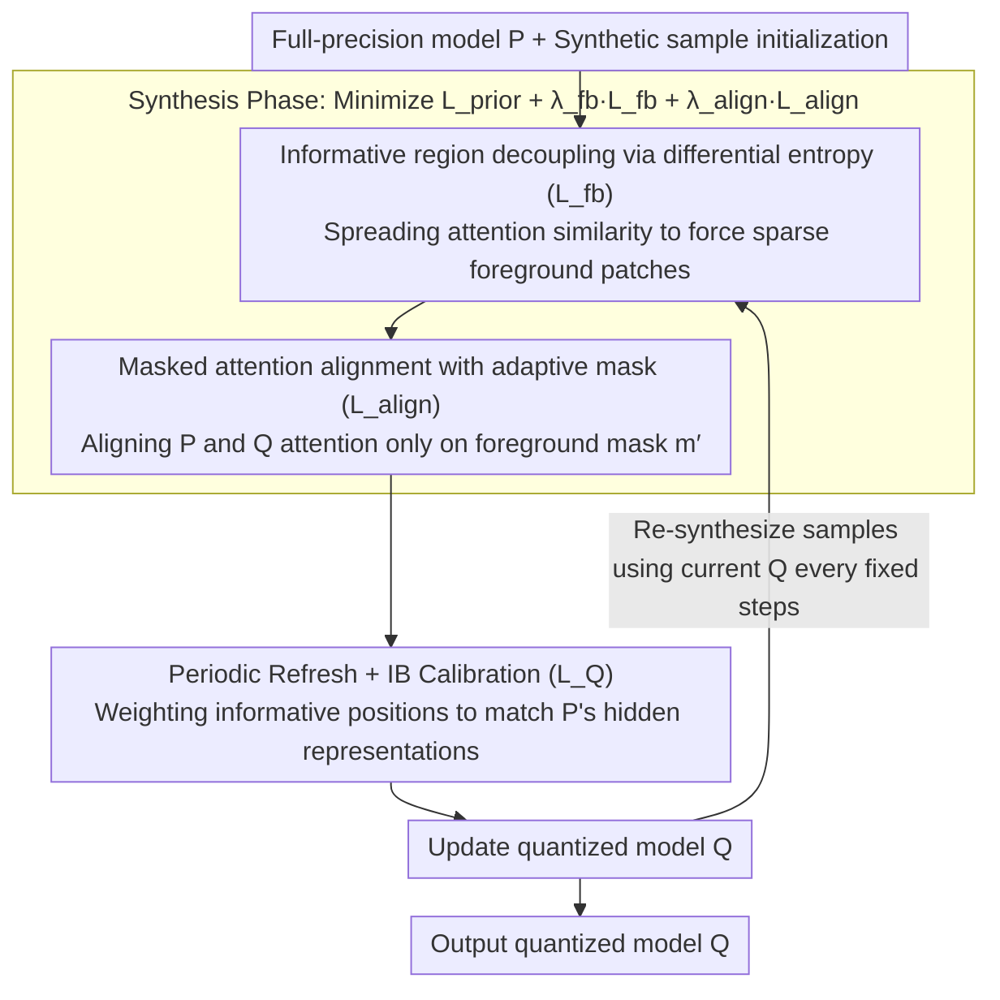

# Selective Coupling of Decoupled Informative Regions: Masked Attention Alignment for Data-Free Quantization of Vision Transformers

**Conference**: ICML 2026  
**arXiv**: [2606.04373](https://arxiv.org/abs/2606.04373)  
**Code**: https://github.com/hfutqian/MaskAQ  
**Area**: Model Compression / Data-Free Quantization / ViT  
**Keywords**: Data-Free Quantization, ViT, Attention Alignment, Information Bottleneck, Sample Synthesis

## TL;DR
MaskAQ redefines Data-Free Quantization (DFQ) for ViTs as "aligning the attention of the full-precision model $P$ and quantized model $Q$ on sparse informative regions of synthetic samples." By decoupling foreground patches through differential entropy maximization, aligning attention with adaptive masks, and utilizing periodic refreshing to let samples evolve with $Q$, MaskAQ improves ImageNet Top-1 accuracy by 3.1% over the previous SOTA on 3-bit DeiT-T.

## Background & Motivation

**Background**: Deploying pre-trained ViTs to edge devices requires quantizing the full-precision model $P$ into a low-bit model $Q$. In data-secure scenarios where the original training set is unavailable, Data-Free Quantization (DFQ) recovers $Q$'s accuracy using synthetic samples. DFQ in the CNN era used BatchNorm statistics as priors to guide synthetic samples toward the real distribution. However, ViTs use LayerNorm, which lacks such "distribution keys." Consequently, PSAQ-ViT uses patch similarity to distinguish foreground/background, CLAMP-ViT introduces patch-level contrastive learning, and MimiQ enhances structure via multi-head attention similarity.

**Limitations of Prior Work**: Existing methods focus on making "synthetic images look more like real images" but fail to address a critical question: **do synthetic samples preserve the key information required for $Q$'s calibration?** The authors observe two common issues: (1) **semantic dispersion**, where synthetic semantics spread across the entire image without coherent object structures; and (2) **attentional disparity**, where synthetic images lack discriminative regions that $Q$ can easily recognize, preventing $Q$ from aligning its attention with $P$, which is fatal at ultra-low bitwidths.

**Key Challenge**: Prior DFQ methods aim to "approximate the real distribution," yet quantization errors inherently shift $Q$'s attention. **Approximating the real distribution is not equivalent to aiding $Q$ in calibration.** Forcing alignment between $P$ and $Q$ across the entire image over-regularizes background patches, pushing synthetic samples away from directions that actually recover accuracy.

**Goal**: (a) Explicitly isolate sparse regions from synthetic samples that are "truly important to $Q$"; (b) Perform attention alignment between $P$ and $Q$ only on these regions; (c) Ensure synthetic samples continuously remain "useful for the current $Q$" throughout its training trajectory.

**Key Insight**: Self-attention mechanisms are inherently sparse—most semantics are concentrated on a few patches. Elevating this to the proposition that "informative regions are the primary carriers of mutual information between $P$ and $Q$" transforms DFQ from "distribution reconstruction" to "key mutual information reconstruction."

**Core Idea**: Treat DFQ as an **Information Bottleneck** problem—maximizing $I(z_q; y)$ under an information budget $C$ introduced by quantization—implemented via three steps: decoupling informative regions, aligning attention under masks, and periodic sample refreshing.

## Method

### Overall Architecture
MaskAQ follows the standard "synthesis $\to$ calibration" DFQ framework but introduces the concept of informative regions at both ends. First, sparse foreground patches carrying true semantics are identified using $P$'s attention. Synthesis and calibration then revolve around these patches. The synthesis objective $\mathcal{L}_S = \mathcal{L}_{prior} + \lambda_{fb}\mathcal{L}_{fb} + \lambda_{align}\mathcal{L}_{align}$ encourages diverse attention distributions to resolve semantic dispersion while aligning $P$ and $Q$ attention on an adaptive mask $m'$ to eliminate attentional disparity. Calibration weights these foreground positions, prioritizing the matching of $Q$'s hidden representations to $P$'s. A "periodic refresh" loop re-synthesizes samples using the current $Q$ every few training iterations, ensuring samples keep pace with the evolving model.

### Key Designs

**1. Informative Region Decoupling via Differential Entropy ($\mathcal{L}_{fb}$): Spreading redundant patches to extract semantic-bearing foregrounds**

A common issue in synthetic samples is semantic dispersion—semantics are blurred across the image without coherent objects, making subsequent masking difficult. MaskAQ defines the informative region ($IR$) as the set of patches where attention weights $\alpha_n$ are not smaller than the $k_{ir}$-th largest value: $IR = \{x_n \mid \alpha_n \geq \alpha_{[k_{ir}]}\}$. To make this foreground stand out, the method computes row-wise attention vectors $a_i$ from the attention matrix $A_l^p \in \mathbb{R}^{N \times N}$ at layer $l$, calculates pairwise cosine similarities $S_{ij} = a_i \cdot a_j / (\|a_i\| \|a_j\|)$, and maximizes the entropy of the $S_{ij}$ distribution. Higher entropy implies more distinct patches, making it easier to separate foreground from background. Since maximizing "foreground clarity" lacks a differentiable objective, "making attention vectors distinctive" serves as a proxy. Instead of Shannon entropy $H(p_l) = -\sum_k p_l(s_k) \log p_l(s_k)$ which requires histogram estimation (leading to gradient jitter), the authors approximate the similarity distribution as Gaussian $\mathcal{N}(\mu_l, \sigma_l^2)$ and use differential entropy $H_l = \frac{1}{2}\log(2\pi e \sigma_l^2)$ as a proxy. Thus, $\mathcal{L}_{fb} = -\frac{1}{L} \sum_l H_l$, smoothing the gradient at almost zero cost.

**2. Masked Attention Alignment ($\mathcal{L}_{align}$): Aligning only where $P$ is confident, allowing $Q$ flexibility for quantization errors**

At ultra-low bitwidths, $Q$'s attention naturally drifts. Forcing it to match $P$ across the entire image causes background patches (dominated by quantization noise) to be over-regularized, absorbing errors into the gradient—the source of attentional disparity. MaskAQ's countermeasure is foreground-only alignment. A binary mask $m[n] = \mathbb{1}[\alpha_n \geq \alpha_{[k]}]$ is created from the top $k$ positions where $P$ is most confident. A stochastic mask $m'$ is then generated by randomly dropping positions from the retention set $\mathcal{P}$ with probability $p_{drop}$, keeping $k_{keep} = \max(k_{min}, \lfloor |\mathcal{P}| (1-p_{drop}) \rfloor)$ positions. The alignment loss averages the $L1$ attention difference only at masked positions:

$$\mathcal{L}_{align} = \sum_l \|m' \odot (A_l^p - A_l^q)\|_1 / \|m'\|_0$$

Aligning only where $P$ is "most confident" ensures semantic transfer without forcing $Q$ to compete on background noise. The random dropout prevents synthetic samples from collapsing into a few fixed bright patches, keeping foreground anchors stable yet non-overfitted.

**3. Periodic Sample Refreshing + IB-view Calibration: Evolving samples with $Q$ and prioritizing foreground in calibration**

A failure mode in DFQ is that samples synthesized early in training become obsolete as $Q$ evolves. MaskAQ frames this within the Information Bottleneck (IB) principle—seeking $\max I(z_q; y)$ s.t. $I(x; z_q) \leq C$, where $C$ is determined by bitwidth. Theorem 1 states that if the TV distance between $P$ and $Q$ on informative regions is $\leq \varepsilon_r$, the predictive mutual information difference is bounded by $\Delta_r(\varepsilon_r)$. Theorem 2 states that if the mutual information difference between synthetic and real samples on $IR$ is $\leq \xi$, synthetic samples suffice for aligning $Q$. This justifies why aligning only the foreground maintains predictive mutual information—a theoretical backbone for 3-bit gains. During calibration, informative positions are weighted $w_{l,n} = 1 + m^c_{l,n} \cdot (w-1)$, and the objective is:

$$\mathcal{L}_Q = \frac{1}{LN_h} \sum_{l, n_h} \frac{\sum_n w_{l,n} D(h^p_{l,n_h,n}, h^q_{l,n_h,n})}{\sum_n w_{l,n}}$$

The outer loop re-synthesizes new samples every fixed interval using the current $Q$, ensuring samples always match $Q$'s state.

### Loss & Training
Synthesis phase: $\mathcal{L}_S = \mathcal{L}_{prior} + \lambda_{fb} \mathcal{L}_{fb} + \lambda_{align} \mathcal{L}_{align}$, where $\mathcal{L}_{prior}$ combines one-hot loss $\mathcal{L}_{OH} = CE(z_p, y)$, TV loss $\mathcal{L}_{TV}$, and inter-head SSIM loss $\mathcal{L}_{IH}$. Calibration uses $\mathcal{L}_Q$ with weight $w$ on informative patches. Algorithm 1 is a nested loop: the outer loop handles the refresh number, and the inner loop alternates between synthesis and calibration iterations, ensuring the two stages remain aligned.

## Key Experimental Results

### Main Results (ImageNet Top-1 Accuracy, 3-bit Quantization vs. MimiQ)

| Setting | Model | MimiQ (AAAI'25) | MaskAQ (Ours) | Gain |
|------|------|------------------|-----------------|----------|
| 3w3a | ViT-T | 8.64% | 11.50% | +2.86 |
| 3w3a | ViT-B | 41.28% | 43.39% | +2.11 |
| 3w3a | DeiT-T | 19.55% | 22.65% | +3.10 |
| 3w3a | DeiT-S | 27.39% | 30.41% | +3.02 |
| 3w3a | DeiT-B | 41.86% | 43.28% | +1.42 |
| 3w3a | Swin-T | 42.90% | 44.98% | +2.08 |

Full-precision (FP) baselines: ViT-T 72.01 / ViT-B 84.53 / DeiT-T 72.21 / DeiT-S 79.85 / DeiT-B 81.85 / Swin-T 81.35. While a gap to FP remains at 3-bit, MaskAQ pushes the boundaries of 3-bit DFQ usability.

### Ablation Study (Attributed Gains)

| Configuration | Effect | Description |
|------|------|------|
| Full MaskAQ | 3w3a DeiT-T 22.65% | Complete Model |
| w/o $\mathcal{L}_{fb}$ | Significant Drop | Semantic dispersion recurs; masks lose basis |
| w/o $\mathcal{L}_{align}$ | Recedes to MimiQ-style | Attentional disparity recurs |
| w/o Periodic Refresh | Late-stage failure | Samples mismatch evolving $Q$ |
| w/o Adaptive Mask Randomness | Overfitting | Samples collapse to fixed bright patches |

### Key Findings
- **3-bit yields the largest relative gains**: The improvement of MaskAQ over MimiQ at 3w3a (e.g., +3.10% for DeiT-T) exceeds that at 4-bit, proving that "aligning only informative regions" is most beneficial when quantization error is severe.
- **Cross-architecture consistency**: Stable superiority across ViT, DeiT, and Swin backbones suggests that the "information concentration on sparse patches" is a universal structural property of ViTs.
- **Downstream Task Extensibility**: MaskAQ also reports advantages in detection and segmentation, indicating that informative regions are equally discriminative for dense prediction tasks.

## Highlights & Insights
- **Objective Reformulation**: Shifting DFQ from "approximating real distribution" to "maximizing mutual information under an information budget" is a paradigm shift relative to PSAQ-ViT/MimiQ. The IB perspective provides a quantifiable optimization roadmap.
- **Differential Entropy Engineering**: Using differential entropy as a proxy for attention diversity is a clever, zero-cost engineering detail that smooths gradients in distribution-based synthesis.
- **Adaptive Mask + Dropout**: Ensures informative regions are stable yet not degenerate. Pure Top-k selection would overfit to specific locations; stochasticity preserves semantic anchors while preventing collapse.
- **Periodic Freshing**: Acknowledges that $Q$ is a moving target. While previous works often froze samples after synthesis, MaskAQ ensures samples evolve alongside the model.

## Limitations & Future Work
- For **backbones dominated by outliers** (e.g., certain distilled ViTs), where attention itself is skewed, the sparsity assumption of informative regions may require further verification.
- Periodic refreshing significantly increases total training time. Future work could consider refreshing only informative patches while keeping backgrounds static to save cost.
- Masks are currently derived solely from $P$. Incorporating feedback from $Q$ into mask generation might further mitigate attentional disparity.
- The IB theoretical results rely on TV distance assumptions; the paper lacks measured proxies for $\varepsilon_r, \varepsilon_s$ during training, leaving room for improved empirical verification.

## Related Work & Insights
- **vs. PSAQ-ViT / PSAQ-ViT V2**: While pioneers used patch similarity to distinguish foreground, Ours upgrades this to "aligning $P$ and $Q$ on the foreground" and introduces differential entropy and IB theory.
- **vs. CLAMP-ViT**: CLAMP-ViT uses contrastive learning for inter-patch relations but still aims for "real-looking" images. MaskAQ's alignment is between $P$ and $Q$, prioritizing calibration mutual information over visual realism.
- **vs. MimiQ (AAAI'25)**: MimiQ focuses on inter-head similarity for structure, but whole-image alignment causes attentional disparity at low bits. MaskAQ resolves this by restricting alignment to informative regions.
- **vs. GDFQ / ZeroQ (CNN era)**: As BN statistics fail in LN architectures, Ours provides a solution for the ViT era—anchoring synthetic samples via attention sparsity rather than distribution statistics.

## Rating
- Novelty: ⭐⭐⭐⭐⭐ Paradigm shift to IB, paired with differential entropy and masked alignment.
- Experimental Thoroughness: ⭐⭐⭐⭐ Covers 6 backbones and 3 tasks at 3/4 bits; could benefit from even more aggressive 2-bit evaluations.
- Writing Quality: ⭐⭐⭐⭐ Clear motivation and notation; IB derivations are well-structured.
- Value: ⭐⭐⭐⭐⭐ Establishes a new SOTA for 3-bit ViT DFQ, with direct implications for privacy-sensitive edge deployment.

## Rating
- Novelty: To be rated
- Experimental Thoroughness: To be rated
- Writing Quality: To be rated
- Value: To be rated

<!-- RELATED:START -->

## Related Papers

- [\[ICCV 2025\] OuroMamba: A Data-Free Quantization Framework for Vision Mamba](../../ICCV2025/model_compression/ouromamba_a_data-free_quantization_framework_for_vision_mamba.md)
- [\[CVPR 2026\] BinaryAttention: One-Bit QK-Attention for Vision and Diffusion Transformers](../../CVPR2026/model_compression/binaryattention_one-bit_qk-attention_for_vision_and_diffusion_transformers.md)
- [\[ICML 2026\] From Per-Image Low-Rank to Encoding Mismatch: Rethinking Feature Distillation in Vision Transformers](from_per-image_low-rank_to_encoding_mismatch_rethinking_feature_distillation_in_.md)
- [\[ICML 2026\] Float8@2bits: Entropy Coding Enables Data-Free Model Compression](float82bits_entropy_coding_enables_data-free_model_compression.md)
- [\[AAAI 2026\] Distillation Dynamics: Towards Understanding Feature-Based Distillation in Vision Transformers](../../AAAI2026/model_compression/distillation_dynamics_towards_understanding_feature-based_di.md)

<!-- RELATED:END -->
