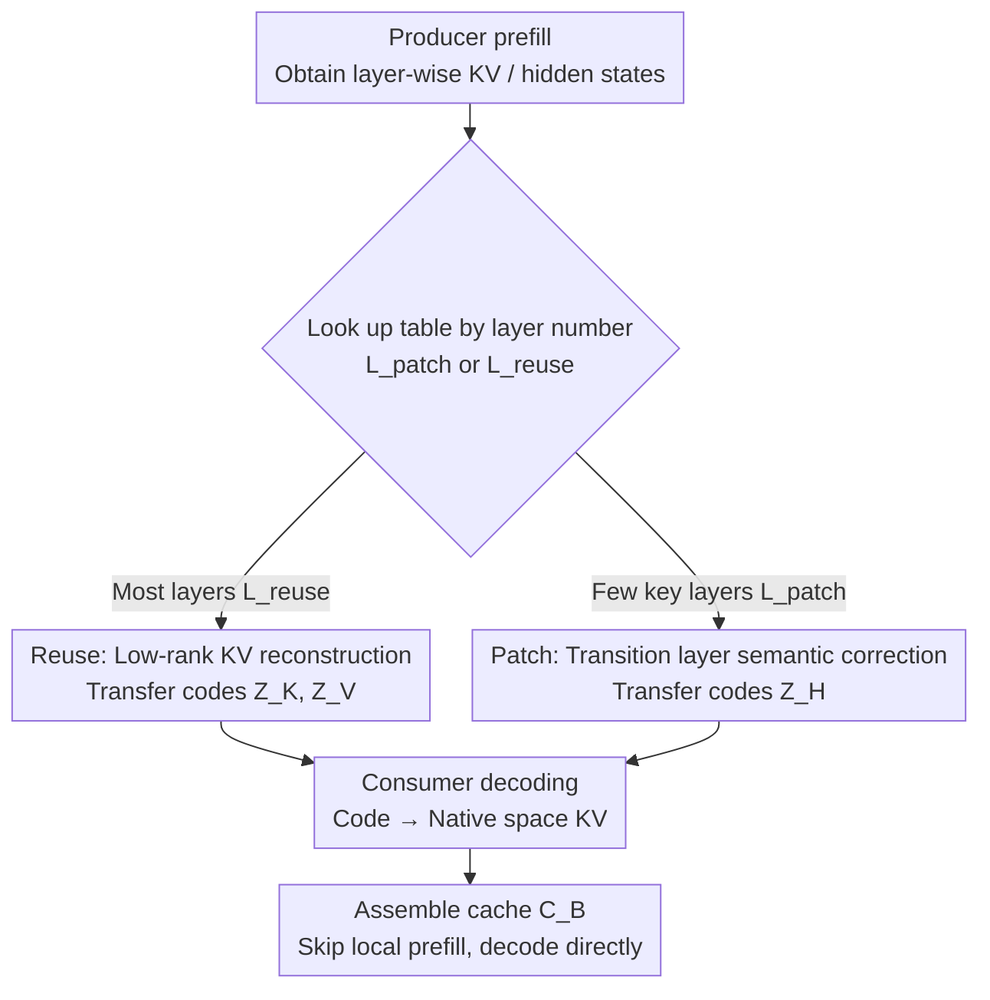

# Semantic Cache Distillation: Efficient State Transfer via Reuse and Selective Patching

**Conference**: ICML2026  
**arXiv**: [2606.07684](https://arxiv.org/abs/2606.07684)  
**Code**: To be confirmed  
**Area**: Model Compression / LLM Efficient Inference  
**Keywords**: KV Cache Compression, Disaggregated Serving, Cross-model Cache Reuse, Low-rank Reconstruction, Semantic Alignment

## TL;DR
Targeting the disaggregated LLM serving scenario where a "base model acts as the producer and a fine-tuned model acts as the consumer," this paper proposes SCD: replacing raw KV Cache transferred across devices with offline-learned low-rank semantic codes. Most layers use "Reuse" for bandwidth-saving low-rank reconstruction, while a few key layers use "Patch" to recompute pre-normalization inputs to truncate error accumulation. At 200 Gbps bandwidth, it achieves a 2.65× TTFT speedup relative to the Oracle with an F1 drop of less than 3%.

## Background & Motivation
**Background**: Modern LLM serving generally splits inference into a "computation-limited prefill phase" and a "memory-bandwidth-limited decode phase," placed on different devices (disaggregated serving). After prefill is completed, the KV Cache of each layer must be transferred to the decode side before the first token can be generated.

**Limitations of Prior Work**: The volume of KV Cache grows linearly with context length $T$ and the number of layers $L$. Under slow interconnects, the transfer time of this raw cache often dominates the time-to-first-token (TTFT). Existing works (quantization like KIVI/KVQuant, token eviction like H2O/SnapKV, streaming like CacheGen) mostly assume the producer and consumer **share the same weights and hidden space**, thus focusing only on compressing "volume."

**Key Challenge**: In real-world deployment, a practical scenario involves producers and consumers with the **same architecture but different weights** (e.g., base model vs. fine-tuned expert, draft vs. verifier). When weights differ, the producer's KV states fall into a different feature space than the consumer's, causing **semantic drift** if used directly, which **accumulates and amplifies layer by layer**. Existing work like DroidSpeak uses "selective recomputation of key layers and reuse of raw KV for others" to mitigate this, but it forces a rigid trade-off: favoring reuse loses quality, while favoring recomputation loses the latency benefits of disaggregated inference.

**Goal**: Within a **fixed online execution path** (avoiding per-request layer searching), minimize both transfer overhead and semantic drift—achieving small payloads while keeping the consumer's output distribution close to the Oracle.

**Key Insight**: The authors observe two phenomena: (1) KV tensors in Transformer layers are inherently low-rank, and corresponding layers between two models have highly overlapping subspaces, allowing "most layers" to be reconstructed cheaply across models; (2) severe drift is triggered only by a few "transition layers," and handling errors in these specific layers is sufficient.

**Core Idea**: Upgrade "sending raw KV" to "sending compact semantic codes"—using low-rank projection for cross-model reconstruction in most layers (Reuse to save bandwidth) and predicting the consumer's normalized pre-inputs in a few key layers to regenerate KV using the consumer's own weights (Patch to truncate errors). This evolves from a "binary choice" into a "learnable transformation."

## Method

### Overall Architecture
SCD treats cross-device state transfer as a **rate-distortion problem**: minimizing total transfer latency $\mathcal{T}_{\mathrm{transfer}} = |\mathbf{Z}|/\mathrm{BW} + \mathcal{T}_{\mathrm{recon}} + \mathcal{T}_{\mathrm{fill}}$ subject to the constraint that the KL divergence between consumer output and Oracle distribution is $\le \epsilon$. The system is divided into **offline calibration** and **online serving**: during calibration, run full prefills of producer $\mathcal{M}_A$ and consumer $\mathcal{M}_B$ on the same calibration prefixes $\mathcal{D}_{\mathrm{cal}}$ (100–500 samples), record paired layer-wise KV tensors and normalized hidden states, and fit two sets of "translators"; during serving, the producer only runs prefill and encoding to transmit low-dimensional codes, while the consumer decodes them into its native KV space, **skipping local prefill** to enter decoding.

Layers are partitioned into two fixed sets: $\mathcal{L}_{\mathrm{patch}}$ (a few key layers using Patch, default $k=6$) and $\mathcal{L}_{\mathrm{reuse}}$ (all remaining layers using Reuse). This partition is determined once during offline calibration and remains fixed for all online requests, making online branch selection a constant-time lookup ($\mathcal{T}_{\mathrm{fill}}=0$ because Reuse and Patch jointly cover all layers).

### Key Designs

**1. Cross-model Low-rank KV Reconstruction (Reuse): Reducing transfer from $O(Td)$ to $O(Tr)$**

Reuse addresses "transfer overhead" by exploiting the low-rank structure of KV tensors and subspace overlap. Offline, rotary positional embeddings are removed from Keys ($\tilde{\mathbf{K}}_A^\ell=\operatorname{deRoPE}(\mathbf{K}_A^\ell)$) to operate in content space. Samples from both producer and consumer layers are concatenated into a joint matrix $\mathbf{X}_K^\ell=[\mathbf{A}_K^\ell\;\mathbf{B}_K^\ell]$, then a rank-$r_K$ decomposition yields a **shared latent code** $\mathbf{Z}_K^\ell$ and model-specific decoders $\mathbf{W}_{\mathrm{dec},A}^\ell, \mathbf{W}_{\mathrm{dec},B}^\ell$, such that $\mathbf{A}_K^\ell\approx\mathbf{Z}_K^\ell\mathbf{W}_{\mathrm{dec},A}^\ell$ and $\mathbf{B}_K^\ell\approx\mathbf{Z}_K^\ell\mathbf{W}_{\mathrm{dec},B}^\ell$. An encoder $\mathbf{W}_{\mathrm{enc}}^\ell$ is learned on the producer side via ridge regression to map new observations to the latent space.

Online, the producer only computes $\mathbf{Z}_K^\ell=\tilde{\mathbf{K}}_A^\ell\mathbf{W}_{\mathrm{enc},K}^\ell$ (similarly for Value). The consumer decodes $\tilde{\mathbf{K}}_B^\ell=\mathbf{Z}_K^\ell\mathbf{W}_{\mathrm{dec},B}^\ell$ and reapplies RoPE. Since $r\ll d$, transfer complexity is significantly reduced. A key engineering detail is using **independent ranks** $r_K, r_V, r_H$; experiments show $r_K$ can be smaller than $r_V$ with minimal quality loss, suggesting Values carry more fine-grained semantic information.

**2. Transition Layer Semantic Correction (Patch): Truncating error accumulation via recomputation**

Low-rank reconstruction is insufficient for critical layers where mismatch is amplified. Patching addresses this by intercepting the consumer's **pre-normalization input** (post-norm state $\mathbf{H}_{\mathrm{in}}^\ell$ before the attention block). The producer compresses its $\mathbf{H}_{\mathrm{in},A}^\ell$ into code $\mathbf{Z}_H^\ell$ and transfers it; the consumer uses a non-linear aligner $g_\theta^\ell$ (an MLP) to map the code back to its native space $\hat{\mathbf{H}}_{\mathrm{in},B}^\ell=g_\theta^\ell(\mathbf{Z}_H^\ell)$, then generates this layer's KV using **its own weights** $\mathbf{W}_{k,B}^\ell, \mathbf{W}_{v,B}^\ell$.

This is effective because recomputing with native weights **explicitly resets** the layer's state, locking errors to the Patch's own reconstruction quality rather than allowing preceding drift to propagate. This achieves significant quality recovery with minimal recomputation.

**3. Piecewise Error Bounds: Theoretical justification for "Reuse-many, Patch-few"**

The authors analyze the link between layer-wise reconstruction error and consumer output distribution shift. Assuming Transformer layer mappings are Lipschitz continuous, errors in Reuse layers follow a recurrence $\|\hat{\mathbf{h}}_B^{\ell+1}-\mathbf{h}_B^{\ell+1}\|\le\alpha_\ell\|\hat{\mathbf{h}}_B^\ell-\mathbf{h}_B^\ell\|+\beta_\ell\varepsilon_{\mathrm{reuse}}^\ell$, leading to **multiplicative accumulation**. Patch layers reduce the bound to a local term $\|\hat{\mathbf{h}}_B^\ell-\mathbf{h}_B^\ell\|\le\varepsilon_{\mathrm{patch}}^\ell$, acting as a "reset."

This yields a piecewise error bound (Lemma 5.1): for a layer $\ell$ in segment $(s_j,s_{j+1}]$, the cumulative error is $\le(\prod_{i=s_j}^{\ell-1}\alpha_i)\varepsilon_{\mathrm{patch}}^{s_j}+\sum_{k=s_j}^{\ell-1}(\prod_{m=k+1}^{\ell-1}\alpha_m)\beta_k\varepsilon_{\mathrm{reuse}}^k$. Without Patching, error is dominated by $\prod_{i=1}^L\alpha_i$; since residual connections often lead to $\alpha_i\gtrsim 1$, small mismatches in deep stacks explode. Inserting a Patch at $s_j$ replaces the accumulation with a smaller local term $\varepsilon_{\mathrm{patch}}^{s_j}$, truncating the drift.

## Key Experimental Results

### Main Results
Evaluation includes QA (CMRC2018, HotpotQA) F1, WikiText-2 PPL, and token-level KL/TV distance; latency measures TTFT under 100 Gbps–1 Tbps bandwidth. Baselines include Raw KV (BF16), 4-bit quantization, DroidSpeak-style selective recomputation, and a Reuse-only ablation of SCD.

The table below shows results for MistralLite→Mistral-7B at $B_{\mathrm{net}}=200$ Gbps:

| Method | Payload (MB/req) | TTFT (ms) | Gain (vs Oracle) | F1 (CMRC) | KL Divergence | PPL (WikiText) |
|------|------|------|------|------|------|------|
| Oracle | 0.00 | 331.9 | 1.00× | 0.8105 | 0.0000 | 4.15 |
| Raw KV (BF16) | 115.02 | 145.5 | 2.28× | 0.2725 | 3.1209 | >100 |
| Quantized (4-bit) | 28.76 | 59.2 | 5.60× | 0.1289 | 6.1887 | >100 |
| DroidSpeak-style | 127.34 | 198.7 | 1.67× | 0.7052 | 0.1459 | 5.33 |
| SCD (Reuse-only) | 69.02 | 118.2 | 2.81× | 0.6421 | 0.1661 | 6.11 |
| **SCD** | 87.31 | 125.2 | **2.65×** | **0.7850** | **0.1105** | **4.65** |

Key finding: While 4-bit quantization has the smallest payload and lowest TTFT, its F1 collapses to 0.13, proving standard compression **cannot bridge the semantic gap caused by cross-model weight mismatch**. SCD almost recovers full Oracle quality (F1 0.785 vs 0.81) with only +7.0 ms additional latency over Reuse-only, a benefit that scales to Qwen-32B pairs.

### Ablation Study
Impact of Patch budget $k$ on WikiText-2 (starting from Reuse-only):

| Configuration | Patch Layers | TTFT (ms) | PPL | ΔPPL |
|------|------|------|------|------|
| Reuse-only | 0 | 112.3 | 6.788 | 0.00 |
| + Patch $\ell_0$ | 1 | 115.9 | 5.971 | -0.82 |
| + Patch Top-3 | 3 | 125.7 | 5.326 | -1.46 |
| + Patch Top-5 | 5 | 136.4 | 5.017 | -1.77 |
| + Patch Top-8 | 8 | 145.9 | 4.816 | -1.97 |

### Key Findings
- **Patch is essential**: Adding just 5 Patch layers reduces PPL from 6.788 to 5.017, approaching Oracle and confirming that drift is concentrated in key layers.
- **Selection of $k=6$**: This is derived from the argmax of the cumulative efficiency curve $\Delta F(\mathcal{S}_k)/(c\cdot k)$; too few layers leave quality on the table, while too many increase costs faster than quality gains.
- **K is more compressible than V**: The Pareto front shows $r_K$ can be compressed more aggressively than $r_V$, indicating Value states carry more fine-grained semantic information for generation.

## Highlights & Insights
- **Upgrading "Selection" to "Transformation"**: Compared to DroidSpeak's binary decision (reuse original vs. full recompute), SCD uses learnable low-rank reconstruction and targeted correction to flatten the latency-quality trade-off curve.
- **Transferring "Semantic Codes"**: Formulating cross-device state handovers as a rate-distortion problem and removing policy search from the critical path through offline calibration is a clean joint design of systems and learning.
- **Physical Meaning of Patch**: Intercepting pre-normalization inputs and regenerating KV with native weights is equivalent to a state reset, theoretically corresponding to the "truncation term" in piecewise error bounds.
- **Compatibility**: SCD focuses solely on the "state handover" phase and is compatible with orthogonal acceleration methods like speculative decoding (Medusa/EAGLE) once the cache is reconstructed.

## Limitations & Future Work
- **Scope**: SCD specifically targets "same architecture, different weights" (producer-consumer) pairs and does not replace intra-model KV reuse or work across different architectures.
- **Calibration Cost**: Each fixed model pair requires collecting traces and fitting translators; it struggles with environments frequently changing fine-tuned experts.
- **Fixed Layer Sets**: $\mathcal{L}_{\mathrm{patch}}$ is determined once offline; whether these layers remain optimal for prefixes with vastly different distributions remains to be verified.
- **Theoretical Dependency**: The error bounds rely on Lipschitz continuity and stable constants $\alpha_\ell$, the estimation of which remains empirical.

## Related Work & Insights
- **vs. DroidSpeak (Liu et al., 2024a)**: Both handle cross-model cache reuse, but SCD utilizes learnable reconstruction rather than binary selection, achieving higher compression ratios and lower latency.
- **vs. Intra-model Compression (KIVI, H2O, CacheGen, etc.)**: These assume shared feature spaces; SCD is designed for inter-model scenarios where semantic gaps exist.
- **vs. Cache-to-Cache / Semantic Communication (Fu et al., 2026)**: C2C often involves multi-agent KV fusion; SCD's goal is **acceleration**—allowing the consumer to entirely skip prefill for latency-sensitive services.

## Rating
- Novelty: ⭐⭐⭐⭐ Advances cross-model reuse from "selection" to "transformation" with theoretical support.
- Experimental Thoroughness: ⭐⭐⭐⭐ Covers multiple scales, benchmarks, and bandwidths, though limited to base→fine-tuned pairs.
- Writing Quality: ⭐⭐⭐⭐ Clear formulation, methodology, and experimental consistency.
- Value: ⭐⭐⭐⭐ Directly addresses transmission bottlenecks in disaggregated serving, highly relevant for expert-based deployment.

<!-- RELATED:START -->

## Related Papers

- [\[ICML 2026\] Semantic Integrity Matters: Benchmarking and Preserving High-Density Reasoning in KV Cache Compression](semantic_integrity_matters_benchmarking_and_preserving_high-density_reasoning_in.md)
- [\[NeurIPS 2025\] ChunkKV: Semantic-Preserving KV Cache Compression for Efficient Long-Context LLM Inference](../../NeurIPS2025/model_compression/chunkkv_semanticpreserving_kv_cache_compression_for_efficien.md)
- [\[CVPR 2026\] SelecTKD: Selective Token-Weighted Knowledge Distillation for LLMs](../../CVPR2026/model_compression/selectkd_selective_token-weighted_knowledge_distillation_for_llms.md)
- [\[CVPR 2026\] Memory-Efficient Transfer Learning with Fading Side Networks via Masked Dual Path Distillation](../../CVPR2026/model_compression/memory_efficient_transfer_learning_with_fading_side_networks.md)
- [\[ICML 2026\] ZipMoE: Efficient On-Device MoE Serving via Lossless Compression and Cache-Affinity Scheduling](zipmoe_efficient_on-device_moe_serving_via_lossless_compression_and_cache-affini.md)

<!-- RELATED:END -->
