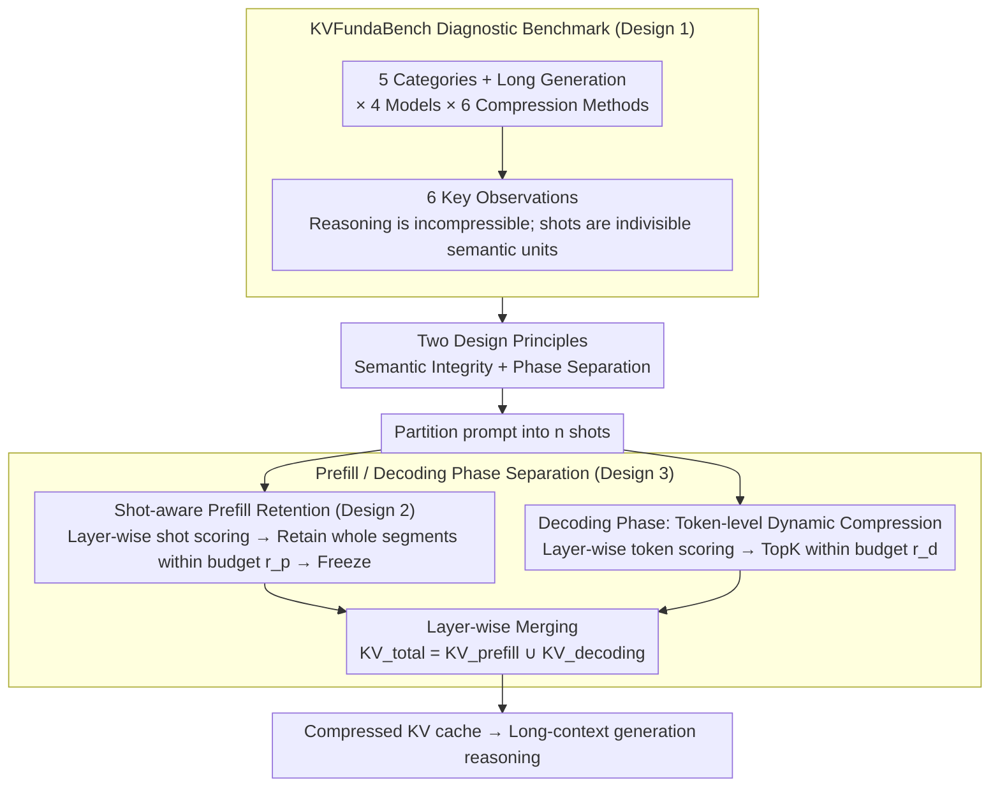

# Semantic Integrity Matters: Benchmarking and Preserving High-Density Reasoning in KV Cache Compression

**Conference**: ICML 2026  
**arXiv**: [2502.01941](https://arxiv.org/abs/2502.01941)  
**Code**: None (No public link provided in the paper)  
**Area**: Model Compression / LLM Efficiency  
**Keywords**: KV cache compression, high-density reasoning, few-shot semantic units, prefill-decoding separation, long-context generation

## TL;DR
This paper first introduces a new benchmark, KVFundaBench, to systematically reveal the critical asymmetry where "retrieval-based long contexts are easy to compress, while reasoning-based ones are not." The authors attribute this to KV compression destroying the integrity of "semantic units" (few-shot examples). Consequently, they propose ShotKV—preserving entire shots as indivisible units during the prefill phase and performing dynamic token-level compression during the decoding phase. This approach improves LG-GSM8K performance from a baseline of 46.0 to 47.33 at a 40% compression rate and reduces end-to-end latency by 11.3% in long-input settings.

## Background & Motivation

**Background**: Mainstream KV cache compression methods (H2O, SnapKV, StreamingLLM, PyramidKV, ChunkKV, Quest, etc.) are almost exclusively evaluated on "retrieval-positioning" benchmarks like LongBench and NIAH. These lead to the conclusion that retaining only ~50% of tokens preserves accuracy.

**Limitations of Prior Work**: The authors observe a neglected workload: "High-Density Reasoning," where nearly every token in the prompt is critical for reasoning (CoT few-shot examples, multi-step arithmetic), rather than just a small "needle." In these scenarios, arithmetic tasks suffer much sharper performance drops than retrieval tasks at the same compression rate, and breaking a single semantic link in a reasoning chain can cause catastrophic failure.

**Key Challenge**: Existing token-level KV compression methods score or evict tokens individually based on attention scores, which fragments the complete "semantic unit" of a few-shot example. Conversely, while chunk-level methods preserve blocks, they often treat prefill and decoding with a unified strategy, failing to balance "static instruction integrity" with "dynamic generation freshness."

**Goal**: (1) Provide a systematic benchmark, KVFundaBench, covering 5 categories of basic capabilities plus long generation; (2) Quantify which tasks are most sensitive to compression and which model types are most stable; (3) Operationalize "semantic integrity" as a compression principle and construct a lightweight proof-of-concept, ShotKV, to validate the hypothesis.

**Key Insight**: Treat each shot in a few-shot prompt as an indivisible "Semantic Unit." Perform scoring and retention at the shot granularity during the prefill phase, while independently conducting token-level attention-top-k dynamic compression during the decoding phase to explicitly separate the two information requirements.

**Core Idea**: "Compression should be performed on semantic units, and the prefill and decoding phases must be handled separately"—this is the core conclusion derived from the benchmark, with ShotKV serving as the minimum viable implementation.

## Method

### Overall Architecture
This paper follows a path of "first building a benchmark, then proposing a minimal method based on it," resulting in two parallel lines in the methodology. The first is the diagnostic benchmark **KVFundaBench**: it covers 5 categories of basic capability tasks (MMLU World Knowledge WK, CommonsenseQA CSR, GSM8K Arithmetic AR, HumanEval Code CG, JailBreakV Safety SA) plus LG-GSM8K for long generation. It cross-evaluates six KV compression methods across LLaMA-3.1-8B/Instruct, Mistral-7B-Instruct, and DeepSeek-R1-Distill-Llama-8B models, quantifying "performance loss after compression" using relative performance $\Delta P = (P_C - P_{\text{base}})/P_{\text{base}}$. The second is the validation method **ShotKV**: it partitions the prompt into $n$ shots $\{s_1,\dots,s_n\}$. During the prefill phase, it scores and retains whole shots; during the decoding phase, it performs independent token-level dynamic compression. Finally, it merges the two caches per layer: $KV_{\text{total},l}=KV^C_{\text{prefill},l}\cup KV^C_{\text{decoding},l}$.

### Key Designs

**1. KVFundaBench: Quantifying Differential Degradation Across Capabilities**

Mainstream KV compression methods are tested almost exclusively on retrieval-based benchmarks, leading to the optimistic conclusion that "retaining 50% of tokens loses no precision," which hides fragile reasoning workloads under the average. KVFundaBench systematically scans across tasks, models, and compression rates, deriving six key observations: (O1) WK/CSR are resilient, but AR/CG/SA collapse when the compression rate is below 20%; (O2) Reasoning-distilled DeepSeek-R1 is much more stable than instruct-tuned models; (O3) Short prompts are more fragile than long ones (e.g., 1-shot performance drops from 0.5 to 0.05 at a 10% ratio); (O4) Chunk-level ChunkKV is the most stable on many-shot tasks; (O5) Tasks with higher prompt gains are more sensitive (AR improves 50.41% from 0-shot to CoT, but is also the easiest to degrade via compression); (O6) Long-context generation (LG-GSM8K) suffers over 20% loss even with randomized compression. The root cause is attributed to attention structures: existing token-level methods concentrate importance on "sink tokens + retrieval heads," masking the semantic chains that arithmetic tasks truly depend on. Attention heatmaps (Fig 3b) show more diffused non-sink attention in arithmetic tasks, thus token-level eviction easily severs critical reasoning chains. This observation directly defines the objects to be protected.

**2. Shot-aware Prefill Retention: Treating Few-shot Examples as Atomic Units**

Since single-token scoring fragments complete examples, ShotKV shifts to "shot" granularity. It first identifies $n$ shots based on prompt boundaries. For each layer $l$, it calculates the average attention importance of a shot as $\text{Score}_{\text{prefill}}^l(s_i)=\frac{1}{k_i}\sum_{t\in s_i}\sum_h \alpha_{t,h}^l$ (where $k_i$ is the token count of the shot), and retains shots in descending order until the budget $r_p \cdot |KV_{\text{prefill}}|$ is met. Selected shots enter the cache in their entirety, ensuring no internal tokens are evicted. Once the prefill compression is done, it is frozen for the entire generation process. Crucially, scoring is "layer-independent"—allowing different layers to select different shots to leverage inter-layer attention specialization. This is effective because token-level methods like H2O/SnapKV might retain a shot's question but discard the answer, breaking the causal chain of CoT.

**3. Prefill / Decoding Phase Separation: Distinct Strategies for Instructions and Generation**

Few-shot examples in the prefill phase are static, "write-once-read-many" information, while decoding-side caches grow continuously and require dynamic eviction, presenting fundamentally opposite compression needs. ShotKV decouple these: prefill uses shot-level segment retention (ratio $r_p$), while decoding uses independent token-level TopK importance $\text{Score}_{\text{decoding}}^l(t)=\sum_h \alpha_{t,h}^l$ per layer (ratio $r_d$). The two components are merged at each layer. Observation O6 motivates this: long generation (4k+ tokens) is particularly incompatible with unified compression—static methods like ChunkKV/SnapKV cause the decoding cache to explode, while dynamic methods applied to the prefill side repeatedly damage preserved in-context examples.

### Loss & Training
ShotKV is a training-free inference-time method. It introduces no extra training, with the only hyperparameters being the compression ratio pair $(r_p, r_d)$. In experiments, temperature is set to 0, and LG-GSM8K uses $K=35, T=20$. Its dependency on prompt structure is light—for tasks like HotpotQA without ICL, treating each sentence as a "shot" allows for direct adaptation without retraining.

## Key Experimental Results

### Main Results

| Task / Method (Compression Rate) | FullKV | StreamingLLM | H2O | PyramidInfer | ChunkKV | SnapKV | **ShotKV** |
|---|---|---|---|---|---|---|---|
| LG-GSM8K @40% | 46.00 | 39.50 | 32.66 | 38.33 | — | — | **47.33** |
| LG-GSM8K @30% | 46.00 | 14.83 | 19.83 | 20.50 | — | — | **38.33** |
| LG-GSM8K @25% | 46.00 | 6.33 | 14.83 | 16.67 | — | — | **26.83** |
| Many-shot AR @10% | 82.35 | 74.32 | 51.27 | 70.37 | 79.32 | 68.27 | **80.37** |
| HotpotQA (LLaMA-3) @10% | 45.55 | 40.27 | 40.84 | 43.36 | 43.27 | — | **43.60** |

### Ablation Study

| Configuration | Many-shot AR @10% | Description |
|------|---------------------|------|
| ShotKV (full) | 80.37 | Complete method |
| Random Shot (same granularity, random selection) | 51.34 | Validates necessity of attention-based scoring (29-point gap) |
| Prefill shot-aware only (no dynamic decoding compression) | Rapid loss in long generation | Validates phase separation |
| ChunkKV (chunks without shot boundaries) | 79.32 | Shows shot semantic boundaries outperform generic chunks |

| Latency & Throughput | Input×Output | Latency (s) ↓ | Throughput (T/S) ↑ |
|------------|----------|----------------|---------------------|
| FullKV | 4096×4096 | 175.50 | 37.73 |
| ShotKV | 4096×4096 | 162.85 (**-7.2%**) | 41.12 (+9.0%) |
| FullKV | 8192×4096 | 183.42 | 55.93 |
| ShotKV | 8192×4096 | 162.78 (**-11.3%**) | 63.24 (+13.1%) |

### Key Findings
- **Positive correlation between prompt-gain and compression sensitivity**: Tasks that benefit most from CoT are the most sensitive to KV compression (AR vs. WK gains: +50.41 vs. +6.20, with sensitivity gaps following the same trend), implying that "tasks most reliant on in-context examples are most afraid of cache compression."
- **DeepSeek-R1-Distill resilience**: Maintains ~0.60 accuracy at 10% compression, significantly higher than the 0.50 of instruct-tuned LLaMA. The attention patterns of reasoning models are more compression-resilient, providing empirical support for the "reasoning model + aggressive compression" deployment strategy.
- **HotpotQA adaptation**: In document-based QA scenarios without ICL, treating "sentences" as shots allows ShotKV to remain near-optimal at 10% compression, demonstrating that the semantic unit concept transfers to long texts with natural segmentation boundaries.

## Highlights & Insights
- This is a rare work that "builds a serious benchmark first, then proposes a minimal method based on it." The authors explicitly state that ShotKV "is not an algorithmic innovation" but a way to validate the "preserving semantic units > preserving tokens" hypothesis. This honest approach makes the benchmark and insights the primary value of the paper.
- The "prefill-compressed-and-frozen, decoding-dynamic-scoring" structure can be reused by other KV compression methods as a fundamental adaptation for long-context generation. It is orthogonal and combinable with KV quantization and cross-layer KV sharing.
- The strong correlation between prompt-gain and compression sensitivity serves as a practical deployment heuristic: one can estimate the compression safety threshold based on how sensitive a task is to CoT, without running full benchmarks for every task.

## Limitations & Future Work
- ShotKV requires direct access to the KV cache, making it applicable only to self-hosted or open-source models (LLaMA, Mistral, DeepSeek, Qwen) and ineffective for closed APIs. It still relies on an attention-derived heuristic score, which the authors acknowledge is not a "principled measure of semantic importance."
- The shot concept breaks down in "zero-shot long document summarization" without few-shot structures or explicit sentence boundaries. The authors only demonstrated sentence-level adaptation; more complex structures like dialogue or code reviews remain unverified.
- The benchmark covers 5 basic categories but lacks real-world long-context loads like agentic tool use, multi-turn long dialogues, or RAG multi-document splicing.

## Related Work & Insights
- **vs ChunkKV (Liu et al., 2025)**: ChunkKV preserves contiguous blocks but use a unified strategy. ShotKV semanticizes chunks as shot boundaries and adds prefill/decoding separation.
- **vs SCOPE (Wu et al., 2025)**: SCOPE proposed prefill/decoding separation but did not integrate the semantic unit concept. ShotKV combines both into a complete POC.
- **vs H2O / SnapKV**: Both use token-level attention top-k. The Random Shot experiment indirectly proves that "correct granularity + correct scoring" are both essential; even with shot granularity, random selection lags by 29 points.

## Rating
- Novelty: ⭐⭐⭐⭐ The value of exposing the neglected dimension of high-density reasoning via the benchmark outweighs the method itself.
- Experimental Thoroughness: ⭐⭐⭐⭐⭐ 6 observations × multiple models × multiple compression methods × multiple rates.
- Writing Quality: ⭐⭐⭐⭐ Clear three-act narrative (benchmark → insight → POC); honest disclaimer regarding method simplicity.
- Value: ⭐⭐⭐⭐ ShotKV is immediately usable and orthogonal to quantization; the benchmark could become a de facto standard for future KV compression papers.

<!-- RELATED:START -->

## Related Papers

- [\[NeurIPS 2025\] ChunkKV: Semantic-Preserving KV Cache Compression for Efficient Long-Context LLM Inference](../../NeurIPS2025/model_compression/chunkkv_semanticpreserving_kv_cache_compression_for_efficien.md)
- [\[ACL 2026\] The Pitfalls of KV Cache Compression](../../ACL2026/model_compression/the_pitfalls_of_kv_cache_compression.md)
- [\[ICML 2026\] EpiCache: Episodic KV Cache Management for Long-Term Conversation on Resource-Constrained Environments](epicache_episodic_kv_cache_management_for_long-term_conversation_on_resource-con.md)
- [\[ICML 2026\] xKV: Cross-Layer KV-Cache Compression via Aligned Singular Vector Extraction](xkv_cross-layer_kv-cache_compression_via_aligned_singular_vector_extraction.md)
- [\[ICML 2026\] Semantic Cache Distillation: Efficient State Transfer via Reuse and Selective Patching](semantic_cache_distillation_efficient_state_transfer_via_reuse_and_selective_pat.md)

<!-- RELATED:END -->
