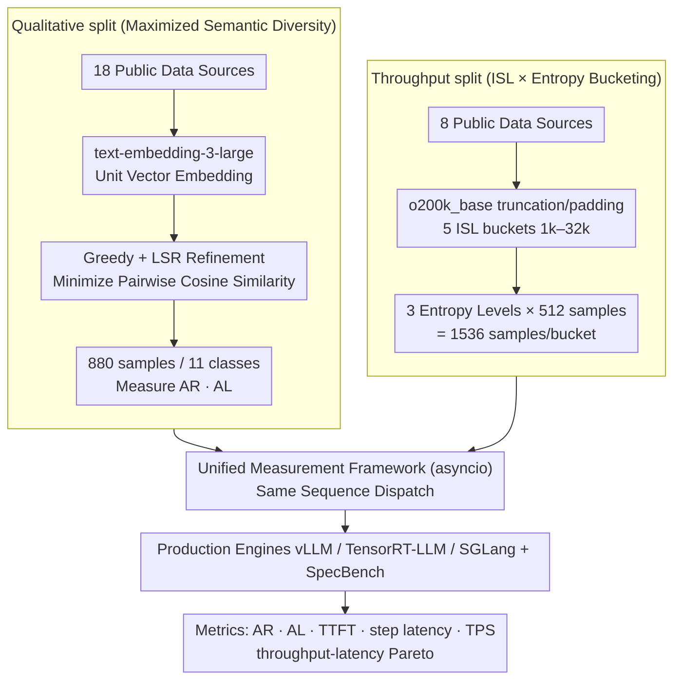

# SPEED-Bench: A Unified and Diverse Benchmark for Speculative Decoding

**Conference**: ICML 2026  
**arXiv**: [2604.09557](https://arxiv.org/abs/2604.09557)  
**Code**: HuggingFace dataset open-sourced (Paper footnote 1)  
**Area**: Model Compression / LLM Efficiency  
**Keywords**: Speculative Decoding, Inference Acceleration, Evaluation Benchmark, Throughput-Latency, Production Engines

## TL;DR
SPEED-Bench is a unified benchmark for Speculative Decoding (SD). By combining a *Qualitative split* (880 samples maximizing semantic diversity) and a *Throughput split* (large-batch data organized by 1k–32k input length buckets across three entropy levels) with a measurement framework interfacing with vLLM / TensorRT-LLM / SGLang, it reveals the actual deployment behavior often obscured by "small data + single batch + HuggingFace" evaluations in previous SD papers.

## Background & Motivation

**Background**: Speculative decoding has become the mainstream method for accelerating LLM autoregressive inference—using a lightweight draft model to predict $\gamma$ tokens at once, verified in parallel by a target model in a single forward pass. This leverages the property of modern GPUs where "moving weights is slower than computation" to achieve near-lossless speedup. From vanilla SD to Medusa and EAGLE3, to cutting-edge models like Qwen3-Next / DeepSeek-R1 / Nemotron-3 that integrate multi-token prediction (MTP) heads natively, the community has accumulated a full suite of drafter designs.

**Limitations of Prior Work**: Evaluation of these techniques remains in a "fragmented" stage. The authors of SPEED-Bench identify four specific gaps: (1) Acceptance rates are highly sensitive to text distribution and entropy, yet datasets used across papers are inconsistent, lacking baselines for cross-method comparison; (2) Mainstream papers still use research-grade runtimes like HuggingFace, failing to reflect the real overheads of CUDA Graphs, continuous batching, and kernel fusion in production engines like vLLM / TensorRT-LLM; (3) Most experiments only look at latency for batch size = 1, while industrial deployment cares about high-throughput multi-user scenarios where systems shift from memory-bound to compute-bound, often severely overestimating SD gains; (4) Input Sequence Length (ISL) is rarely tested above 8k, despite real workloads like coding assistants entering long-context domains.

**Key Challenge**: SD performance is **data-dependent**, but samples and intra-class diversity in existing benchmarks (e.g., MT-Bench, SpecBench) are insufficient to stably measure this dependency—most categories in SpecBench have only 10 samples with average ISL < 100 tokens, and its multilingual subset is 100% "Translate German to English:" templates, fundamentally failing to reflect modern LLM input distributions.

**Goal**: Deliver a **single, reproducible** evaluation suite that simultaneously answers two questions: (a) How stable is the drafter's acceptance rate across rich semantic domains? (b) How much end-to-end speedup remains under real serving configurations with varying batches and ISLs?

**Key Insight**: Split the benchmark into "Qualitative" and "Throughput" halves. The former uses semantic embedding for de-redundancy sampling to maximize diversity while minimizing sample size; the latter discards fine-grained domains to ensure sufficient samples per ISL bucket for stable Pareto curves, explicitly interfacing with production engines rather than building a separate runtime.

**Core Idea**: Replace the previous "small assortment + HuggingFace" evaluation style with a **compact dataset maximizing semantic diversity + a unified measurement framework in production engines**, ensuring SD paper metrics truly correspond to observable acceleration in industrial deployment.

## Method

### Overall Architecture
SPEED-Bench aims to bridge the gap between "SD paper metrics and industrial deployment" by splitting the benchmark into two targeted datasets and a unified measurement framework. The Qualitative split answers if the drafter's acceptance rate is stable, selecting 880 samples from 18 public sources organized into 11 semantic categories (Coding / Humanities / Math / Multilingual / QA / RAG / Reasoning / Roleplay / STEM / Summarization / Writing), specifically measuring Acceptance Rate (AR) and Acceptance Length (AL). The Throughput split answers what speedup remains under real serving, using 5 fixed ISL buckets (1k / 2k / 8k / 16k / 32k) × 3 entropy levels (Low / Mixed / High) with 1536 samples per bucket to plot throughput-latency Pareto curves. Both are fed into a single asyncio measurement framework that distributes the same token sequences to SGLang / vLLM / TensorRT-LLM / SpecBench, calculating AR based on "tokens per chunk" in streaming responses and recording TTFT, step latency, User TPS, and Output TPS. The consistent trade-off is: **External factors (tokenizer, BOS, chat template) are normalized for apples-to-apples comparison, while internal factors (kernels / scheduler / continuous batching) are preserved to reflect real deployment.**

### Key Designs

**1. Qualitative split with Maximized Semantic Diversity: Maximizing coverage with a minimal subset**

Addressing the pain point that "acceptance rates are sensitive to distribution and inconsistent datasets lack baselines," the authors pick only 80 samples per category but ensure they are as dissimilar as possible. Each prompt is embedded into a unit vector $x_i$ via OpenAI `text-embedding-3-large`. The goal is to select a subset $S$ where $|S|=k$ from $N$ candidates to minimize the sum of pairwise cosine similarities $\mathcal{L}(S) = \sum_{i \in S} \sum_{j \in S, j \neq i} x_i^\top x_j$. This is NP-hard, so the paper uses "Greedy + Local Search Refinement" (LSR) for an approximate solution: starting from a random point, nodes are added via $i^\ast = \arg\min_{i \notin S} \sum_{j \in S} x_i^\top x_j$, followed by repeated attempts to swap $i_{out} \in S$ with $i_{in} \notin S$ only if the loss decreases ($\Delta < 0$) to escape local minima. This is effective because exhaustive Cartesian products are too costly and random sampling leaves redundancy; this algorithm reduces average semantic similarity by 40% compared to SpecBench (83% for multilingual) while including metadata like subcategory/multi-turn/difficulty for fine-grained analysis.

**2. Throughput split by ISL × Entropy Bucketing: Replacing "random token prompts" with real long-context workloads**

This design targets the fact that "no one tests ISL above 8k and synthetic tokens deceive benchmarks." Samples are truncated or padded to fixed ISL buckets (1k / 2k / 8k / 16k / 32k) using the `o200k_base` tokenizer and categorized into Low / Mixed / High entropy (Coding is low, STEM is mixed, Creative Writing is high). With 1536 samples per bucket, Pareto curves become stable. An analytical proxy for "domain speedup" is also provided: if autoregressive per-step latency $t_{ar}$ and SD per-step latency $t_{sd}$ are measured, then $\text{Speedup} = (t_{ar} \cdot AL) / t_{sd}$. This decouples the data-dependent AL from system-level per-step latency, allowing speedup prediction in new domains by measuring two pure quantities. Using real prompts instead of synthetic tokens is crucial: the authors found synthetic tokens trigger "trivial response" (model treats noise as greetings, inflating AR) or "topic latching" (hallucinating coherent text from noise keywords, deflating AR), and cause MoE routers to collapse, skewing latency measurements.

**3. Unified Measurement Framework: Separating "Algorithm" from "Engineering Implementation"**

To ensure comparable AR / AL / TTFT / step latency / User TPS / Output TPS across runtimes, the framework uses asyncio for concurrent requests to simulate multi-user serving. It calculates acceptance length by parsing the number of tokens in each chunk of the streaming response—a chunk with multiple tokens represents a successful speculation. AL is defined as: $\text{AL} = \mathbb{E}[L_t] = 1 + \sum_{i=1}^{\gamma} \prod_{j=1}^{i} \text{AR}_j$, where $\text{AR}_i$ is the conditional acceptance rate of the $i$-th draft token given the prefix is accepted. Crucially, it unifies external differences like BOS and templates at the client side while preserving engine-internal optimizations like CUDA Graphs / continuous batching / kernel fusion—the very reasons why "HuggingFace-based SD testing" deviates from production. It remains compatible with SpecBench, ensuring research assets aren't discarded while shifting the focus back to deployment feasibility.

### Loss & Training
This work does not train any drafters; all conclusions come from benchmark evaluation. Hyperparameters primarily relate to data ($k=80$ samples per category, ISL buckets = {1k, 2k, 8k, 16k, 32k}) and evaluation (draft length $\gamma$, batch size, and temperatures $T=0$ and $T=1$).

## Key Experimental Results

### Main Results
On the Qualitative split, covering five LLMs (Llama 3.3 70B / GPT-OSS 120B / DeepSeek R1 / Qwen3 235B / Qwen3-Next) and four drafter types (N-Gram / Vanilla SD / EAGLE3 / Native MTP), on NVIDIA B200 with batch size = 32, draft length = 3, and temp = 0:

| Model | Drafter | Mean AL | Mean Speedup (T=0) | Mean Speedup (T=1) |
|-------|---------|---------|--------------------|--------------------|
| Llama 3.3 70B | N-Gram | 1.41 | 0.88× | 0.85× |
| Llama 3.3 70B | Vanilla SD | 2.44 | 1.60× | 1.15× |
| Llama 3.3 70B | EAGLE3 | 2.44 | 1.90× | 1.75× |
| GPT-OSS 120B | EAGLE3 | 2.25 | 1.34× | 1.06× |
| GPT-OSS 120B | Native MTP | 2.55 | 1.45× | — |
| DeepSeek R1 | Vanilla SD | 2.43 | 1.17× | 1.06× |
| Qwen3-Next | Native MTP | 2.81 | 1.20× | 1.18× |

Key findings: (a) N-Gram speedup is < 1× on most models (only 0.29× on GPT-OSS 120B), showing heuristic drafters provide negative returns at moderate concurrency ($BS=32$); (b) Increasing temperature from 0 to 1 generally costs 0.1–0.5× in speedup, though external drafters like EAGLE3 degrade less than native MTP.

### Ablation Study (Semantic Diversity and Benchmark Sensitivity)

| Configuration | Avg Semantic Similarity | vs SpecBench | Explanation |
|---------------|-------------------------|--------------|-------------|
| SpecBench Original | Baseline | — | MT-Bench dominant, low diversity |
| Same Source + Random | Lower in most classes | Data source validation | Proves 18 new sources are better |
| Same Source + Greedy (No LSR) | Further reduction | Lower bound of algorithm | Better than random |
| Same Source + Greedy + LSR (Ours) | 40% lower (83% for Multilingual) | Best in all classes | LSR escapes local minima |

### Key Findings
- **Production Engine vs HuggingFace**: Speedups for the same drafter on vLLM / TensorRT-LLM are often partially consumed by system-level optimizations; ignoring this leads to paper metrics that are inexplicably different from deployment experience.
- **Synthetic Tokens Deceive**: Random token batches on MoE cause router collapse, distorting baseline step latency. Throughput measured with real long prompts differs from synthetic prompts enough to flip conclusions on which drafter is superior.
- **Draft Length and Batch Size are Coupled**: The optimal $\gamma$ shifts significantly as $BS$ moves from 1 to 32. Reporting only $BS=1$ speedup systematically overestimates real-world gains.
- **Side Effects of Vocabulary Pruning**: Common "vocab pruning" in SOTA drafters is harmless on low-diversity data but reveals AR collapse for long-tail tokens in SPEED-Bench.

## Highlights & Insights
- **Formalizing "Evaluation Methodology" as a contribution**: The core value is not a new algorithm but the formalization of "what, how, and where to measure," indicating SD research has matured enough to require standardization.
- **Semantic Embedding + Greedy Swap for sampling** is clever: Minimizing pairwise similarity replaces the fuzzy concept of "coverage," applicable to NLP evaluation and RLHF prompt pool selection.
- **Decoupling "System per-step latency" from "Algorithm AL"** via an analytical formula allows predicting speedup in any domain using two pure measurements, avoiding large-scale data collection for every new domain.

## Limitations & Future Work
- The framework is limited by Python GIL when $BS > 256$; authors acknowledge this bottleneck, suggesting multi-processing or a Rust client as future improvements.
- Qualitative split has only 880 samples, insufficient for training autoregressive drafters, making it more for "evaluation" than "development."
- Does not cover encrypted/private scenarios (e.g., drafters under differential privacy) or treat speculative attacks/prompt injection as evaluation dimensions.
- The five ISL buckets are discrete; real log-based workloads between 2k–8k ISL require interpolation, suggesting a need for continuous ISL evaluation.

## Related Work & Insights
- **vs SpecBench (Xia et al., 2024)**: SpecBench is the de facto standard but 70%+ of its data is MT-Bench with small samples and short ISL. SPEED-Bench upgrades data sources, sampling, ISL coverage, and engine integration, while keeping SpecBench as a callable backend.
- **vs Drafter Papers (EAGLE3 / Medusa)**: These works pick their own evaluation sets, making numbers incomparable. SPEED-Bench doesn't invent drafters but provides the data/runtime to make their metrics additive and comparable.
- **vs LongSpec / MagicDec**: These focus on long-context drafters. SPEED-Bench’s 32k ISL bucket is a perfect testing ground for them.

## Rating
- Novelty: ⭐⭐⭐⭐ (Not a new algorithm, but formalizes and implements an evaluation methodology for production engines.)
- Experimental Thoroughness: ⭐⭐⭐⭐⭐ (Covers 5 models × 4 drafters × 2 temperatures × multi-batch × 5 ISL buckets.)
- Writing Quality: ⭐⭐⭐⭐ (Clear sections with a complete chain of motivation-problem-method-evidence; appendices are heavy but necessary.)
- Value: ⭐⭐⭐⭐⭐ (Highly likely to become the de facto standard for comparing drafters in the next stage.)

## Rating
- Novelty: TBD
- Experimental Thoroughness: TBD
- Writing Quality: TBD
- Value: TBD

<!-- RELATED:START -->

## Related Papers

- [\[ICML 2026\] LK Losses: Direct Acceptance Rate Optimization for Speculative Decoding](lk_losses_direct_acceptance_rate_optimization_for_speculative_decoding.md)
- [\[ACL 2026\] SSSD: Simply-Scalable Speculative Decoding](../../ACL2026/model_compression/sssd_simply-scalable_speculative_decoding.md)
- [\[AAAI 2026\] Steering Pretrained Drafters during Speculative Decoding](../../AAAI2026/model_compression/steering_pretrained_drafters_during_speculative_decoding.md)
- [\[ICML 2025\] VocabTrim: Vocabulary Pruning for Efficient Speculative Decoding in LLMs](../../ICML2025/model_compression/vocabtrim_vocabulary_pruning_for_efficient_speculative_decoding_in_llms.md)
- [\[ICML 2025\] Gumiho: A Hybrid Architecture to Prioritize Early Tokens in Speculative Decoding](../../ICML2025/model_compression/gumiho_a_hybrid_architecture_to_prioritize_early_tokens_in_speculative_decoding.md)

<!-- RELATED:END -->
