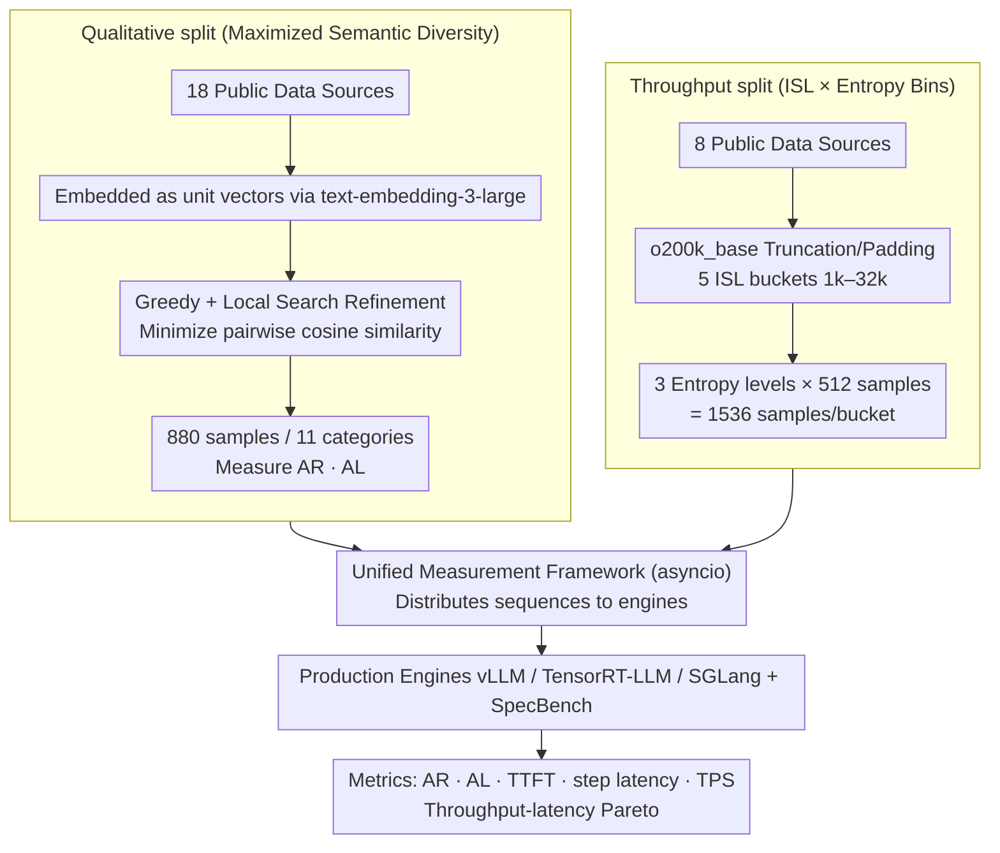

# SPEED-Bench: A Unified and Diverse Benchmark for Speculative Decoding

**Conference**: ICML 2026  
**arXiv**: [2604.09557](https://arxiv.org/abs/2604.09557)  
**Code**: HuggingFace dataset open-sourced (Paper footnote 1)  
**Area**: Model Compression / LLM Efficiency  
**Keywords**: Speculative Decoding, Inference Acceleration, Benchmarking, Throughput-Latency, Production Engines

## TL;DR
SPEED-Bench is a unified benchmark for Speculative Decoding (SD). By combining a *Qualitative split* (880 samples maximizing semantic diversity) and a *Throughput split* (large-batch data organized by 1k–32k input length buckets across three entropy levels) with a measurement framework integrated with vLLM / TensorRT-LLM / SGLang, it reveals the true deployment behavior of SD overlooked by "small data + single batch + HuggingFace" evaluations in previous papers.

## Background & Motivation

**Background**: Speculative Decoding (SD) has become a mainstream method for accelerating LLM autoregressive inference. It uses a lightweight draft model to predict $\gamma$ tokens at once, followed by parallel verification by the target model in a single forward pass, leveraging the modern GPU characteristic where "weight movement is slower than computation" to achieve nearly lossless speedup. From vanilla SD to Medusa and EAGLE3, and further to cutting-edge models like Qwen3-Next / DeepSeek-R1 / Nemotron-3 that integrate Multi-Token Prediction (MTP) heads natively, the community has accumulated a comprehensive set of drafter designs.

**Limitations of Prior Work**: Evaluating these technologies remains in a "workshop" stage. The authors of SPEED-Bench identify four specific gaps: (1) Acceptance rates are highly sensitive to text distribution and entropy, yet datasets used across papers are inconsistent, lacking baselines for cross-method comparison; (2) Mainstream papers still run on research-level runtimes like HuggingFace, which do not reflect real overheads from CUDA Graph, continuous batching, and kernel fusion in production engines like vLLM / TensorRT-LLM; (3) Most experiments only consider latency at batch size = 1, while industrial deployment focuses on high-throughput scenarios where systems shift from memory-bound to compute-bound, often resulting in grossly overestimated SD gains; (4) Input sequence length (ISL) is rarely tested above 8k, despite real-world workloads like coding assistants already entering the long-context range.

**Key Challenge**: The performance of SD is **data-dependent**, but existing benchmarks (e.g., MT-Bench, SpecBench) lack the sample size and intra-class diversity required to stably measure this dependency. Most categories in SpecBench contain only 10 samples with an average ISL < 100 tokens, and its multilingual subset consists 100% of the "Translate German to English:" template, fundamentally failing to reflect the input distribution of modern LLMs.

**Goal**: Deliver a **single, reproducible** evaluation suite that answers two questions: (a) How stable is the drafter's acceptance rate across rich semantic domains? (b) Under real serving configurations with different batch sizes and ISLs, how much end-to-end speedup actually remains?

**Key Insight**: The benchmark is divided into "Qualitative" and "Throughput" halves. The former uses semantic embedding for redundancy-free sampling to maximize diversity while minimizing sample count. The latter abandons fine-grained domains to ensure sufficient samples per ISL bucket for stable Pareto curves, explicitly interfacing with production engines rather than building a separate runtime.

**Core Idea**: Replace the previous evaluation approach of "small medleys + HuggingFace" with a **compact dataset maximizing semantic diversity + a unified measurement framework in production engines**, ensuring that SD paper figures correspond to observable acceleration in industrial deployment.

## Method

### Overall Architecture
SPEED-Bench aims to resolve the discrepancy between SD paper figures and industrial deployment by providing two specialized datasets and a unified measurement framework. The Qualitative split addresses whether the drafter's acceptance rate is stable, featuring 880 samples selected from 18 public sources and organized into 11 semantic categories (Coding / Humanities / Math / Multilingual / QA / RAG / Reasoning / Roleplay / STEM / Summarization / Writing) to measure Acceptance Rate (AR) and Acceptance Length (AL). The Throughput split addresses the remaining speedup under real serving, using 5 fixed ISL buckets (1k / 2k / 8k / 16k / 32k) × 3 entropy levels (Low / Mixed / High) with 1536 samples per bucket to plot throughput-latency Pareto curves. Both are fed into a unified asyncio measurement framework that distributes identical token sequences to SGLang / vLLM / TensorRT-LLM / SpecBench, calculating AR based on "tokens per chunk" in streaming responses and recording TTFT, step latency, User TPS, and Output TPS. The consistent trade-off is: **External factors (tokenizer, BOS, chat template) are normalized for apples-to-apples comparison, while internal factors (kernels / scheduler / continuous batching) are preserved to reflect real deployment.**

### Key Designs

**1. Qualitative split with Maximized Semantic Diversity: Maximizing coverage with a minimal subset**

To address the issue where inconsistent datasets and high sensitivity to text distribution prevent comparable baselines, the authors select only 80 samples per category while ensuring they are as dissimilar as possible. Each prompt is embedded into a unit vector $x_i$ using OpenAI's `text-embedding-3-large`. The goal is to select a subset $S$ of size $|S|=k$ from $N$ candidates to minimize the sum of pairwise cosine similarities $\mathcal{L}(S) = \sum_{i \in S} \sum_{j \in S, j \neq i} x_i^\top x_j$. Since this is NP-hard, the paper uses "Greedy + Local Search Refinement" (Greedy + LSR): starting from a random point, samples are added via $i^\ast = \arg\min_{i \notin S} \sum_{j \in S} x_i^\top x_j$, followed by iterative swaps of $i_{out} \in S$ and $i_{in} \notin S$ only when the objective decreases ($\Delta < 0$). This beats random sampling and avoids the high cost of exhaustive search, reducing average semantic similarity by 40% (83% for multilingual) compared to SpecBench while providing metadata like subcategory and difficulty for fine-grained analysis.

**2. Throughput split via ISL × Entropy Bins: Replacing "randomly synthesized tokens" with real long-context workloads**

This design targets the lack of testing for ISL > 8k and the misleading nature of synthetic tokens. Samples are truncated or padded to fixed ISL buckets (1k / 2k / 8k / 16k / 32k) using the `o200k_base` tokenizer and categorized into Low / Mixed / High entropy (e.g., Coding is low, STEM is mixed, Creative Writing is high). With 1536 samples per bucket, stable Pareto curves can be plotted. The authors also provide an analytical proxy for "domain speedup": given measured autoregressive per-step latency $t_{ar}$ and SD per-step latency $t_{sd}$, then $\text{Speedup} = (t_{ar} \cdot AL) / t_{sd}$. This decouples the data-dependent AL from system-level per-step latency. Using real prompts is crucial; the authors found that random tokens trigger failure modes like "trivial response" (model treats noise as greetings, inflating AR) or "topic latching" (hallucinating coherent text from noise keywords, deflating AR), and also cause MoE routers to collapse, skewing step latency measurements.

**3. Unified Measurement Framework in Production Engines: Separating algorithmic and engineering contributions**

To ensure comparable metrics across different runtimes, the framework uses asyncio for concurrent request dispatching to simulate multi-user serving. It reverses acceptance lengths by parsing the number of tokens in each chunk of the streaming response; a single chunk containing multiple tokens indicates a successful speculation. Here, AL is defined as: $\text{AL} = \mathbb{E}[L_t] = 1 + \sum_{i=1}^{\gamma} \prod_{j=1}^{i} \text{AR}_j$, where $\text{AR}_i$ is the conditional acceptance rate of the $i$-th draft token. While handling external differences like BOS and chat templates at the client level, it preserves engine-internal optimizations like CUDA Graph, continuous batching, and kernel fusion—the very factors that caused previous HuggingFace-based SD measurements to diverge from production. The framework remains compatible with SpecBench (demonstrated with Medusa), maintaining research assets while refocusing evaluation on deployment viability.

### Loss & Training
Ours does not involve training any drafters; all results are derived from benchmark evaluation. Hyperparameters primarily relate to data—$k = 80$ (qualitative samples per category), ISL buckets = {1k, 2k, 8k, 16k, 32k}—and evaluation—draft length $\gamma$, batch size, and temperature (tested at $T=0$ and $T=1$).

## Key Experimental Results

### Main Results
On the Qualitative split, covering five LLMs (Llama 3.3 70B / GPT-OSS 120B / DeepSeek R1 / Qwen3 235B / Qwen3-Next) × four drafter types (N-Gram / Vanilla SD / EAGLE3 / Native MTP), all measured on NVIDIA B200 at batch size = 32, draft length = 3, and temperature = 0:

| Model | Drafter | Mean AL | Avg Speedup (T=0) | Avg Speedup (T=1) |
|------|---------|------------------------|----------------|----------------|
| Llama 3.3 70B | N-Gram | 1.41 | 0.88× | 0.85× |
| Llama 3.3 70B | Vanilla SD | 2.44 | 1.60× | 1.15× |
| Llama 3.3 70B | EAGLE3 | 2.44 | 1.90× | 1.75× |
| GPT-OSS 120B | EAGLE3 | 2.25 | 1.34× | 1.06× |
| GPT-OSS 120B | Native MTP | 2.55 | 1.45× | — |
| DeepSeek R1 | Vanilla SD | 2.43 | 1.17× | 1.06× |
| Qwen3-Next | Native MTP | 2.81 | 1.20× | 1.18× |

Key findings: (a) N-Gram results in speedup < 1× for most large models (only 0.29× on GPT-OSS 120B), indicating heuristic drafters are detrimental at moderate concurrency ($BS=32$); (b) Increasing temperature from 0 to 1 generally reduces speedup by 0.1–0.5×, though external drafters like EAGLE3 degrade less than native MTP.

### Ablation Study (Semantic Diversity and Benchmark Sensitivity)

| Configuration | Mean Semantic Similarity | Vs. SpecBench | Note |
|------|----------------|-------------------|------|
| SpecBench Original | Baseline | — | Dominated by MT-Bench, low diversity |
| Source Data + Random Sampling | Lower for most categories | Data source validation | Proves 18 new sources are inherently better |
| Source Data + Greedy (No LSR) | Further decreased | Algorithm lower bound | Already superior to random |
| Source Data + Greedy + LSR (**Ours**) | 40% lower (83% for Multilingual) | Best in all categories | Local search exits local minima |

### Key Findings
- **Production Engines vs. HuggingFace**: Speedups for the same drafter on vLLM / TensorRT-LLM are often partially offset by "system-level optimizations"; ignoring this leads to discrepancies between paper figures and deployment reality.
- **Synthetic tokens "lie" to evaluations**: Random token batches cause MoE routers to collapse, distorting baseline step latencies. Throughput gaps between real prompts and synthetic tokens can even flip the ranking of drafters.
- **Optimal draft length and batch size are strongly coupled**: As $BS$ increases from 1 to 32, the optimal $\gamma$ shifts significantly. Reporting speedup only at $BS=1$ systematically overestimates real-world gains.
- **Side effects of vocabulary pruning**: Common "vocab pruning" in state-of-the-art drafters is harmless on low-diversity data but reveals acceptance rate collapse for long-tail tokens in SPEED-Bench.

## Highlights & Insights
- **Formalizing "Evaluation Methodology" as a core contribution**: The primary contribution is not a new algorithm but the formalization of "what, how, and where to evaluate," reflecting the maturity of SD towards standardization.
- **Effective sample selection via Semantic Embedding + Greedy Exchange**: Minimizing pairwise similarity instead of vague "coverage" is a clever approach applicable to NLP evaluation and RLHF prompt pool selection.
- **Decoupling "system per-step latency" from "algorithmic AL"**: The analytical speedup formula allows predicting speedup for any domain using only two sets of clean measurements, avoiding large-scale data collection for every new domain.

## Limitations & Future Work
- The framework is limited by Python's GIL at $BS > 256$; the authors acknowledge this as a bottleneck requiring multiprocess or Rust-based clients.
- Qualitative split has only 880 samples, which is insufficient for training autoregressive drafters—it is designed for "evaluation" rather than "development."
- Does not cover encrypted/private scenarios (e.g., SD under differential privacy) nor treats prompt injection or speculative attacks as evaluation dimensions.
- Discrete ISL buckets: real-world log workloads between 2k–8k still require interpolation; future work may involve continuous ISL evaluation.

## Related Work & Insights
- **vs. SpecBench (Xia et al., 2024)**: SpecBench is the research standard but is 70%+ MT-Bench based with short ISLs. SPEED-Bench upgrades data sources, sampling, ISL coverage, and engine integration while remaining compatible as a backend.
- **vs. Drafter Papers (EAGLE3, Medusa, etc.)**: These works pick disparate evaluation sets; SPEED-Bench provides the unified data and runtime needed to make their figures directly comparable for the first time.
- **vs. LongSpec / MagicDec**: These target long-context drafters; SPEED-Bench's 32k ISL bucket provides the ideal testing ground for them.

## Rating
- Novelty: ⭐⭐⭐⭐ 
- Experimental Thoroughness: ⭐⭐⭐⭐⭐ 
- Writing Quality: ⭐⭐⭐⭐ 
- Value: ⭐⭐⭐⭐⭐ 

## Rating
- Novelty: TBD
- Experimental Thoroughness: TBD
- Writing Quality: TBD
- Value: TBD

<!-- RELATED:START -->

## Related Papers

- [\[ICML 2026\] LK Losses: Direct Acceptance Rate Optimization for Speculative Decoding](lk_losses_direct_acceptance_rate_optimization_for_speculative_decoding.md)
- [\[CVPR 2026\] VVS: Accelerating Speculative Decoding for Visual Autoregressive Generation via Partial Verification Skipping](../../CVPR2026/model_compression/vvs_accelerating_speculative_decoding_for_visual_autoregressive_generation_via_p.md)
- [\[ACL 2026\] SSSD: Simply-Scalable Speculative Decoding](../../ACL2026/model_compression/sssd_simply-scalable_speculative_decoding.md)
- [\[AAAI 2026\] Steering Pretrained Drafters during Speculative Decoding](../../AAAI2026/model_compression/steering_pretrained_drafters_during_speculative_decoding.md)
- [\[NeurIPS 2025\] Traversal Verification for Speculative Tree Decoding](../../NeurIPS2025/model_compression/traversal_verification_for_speculative_tree_decoding.md)

<!-- RELATED:END -->
