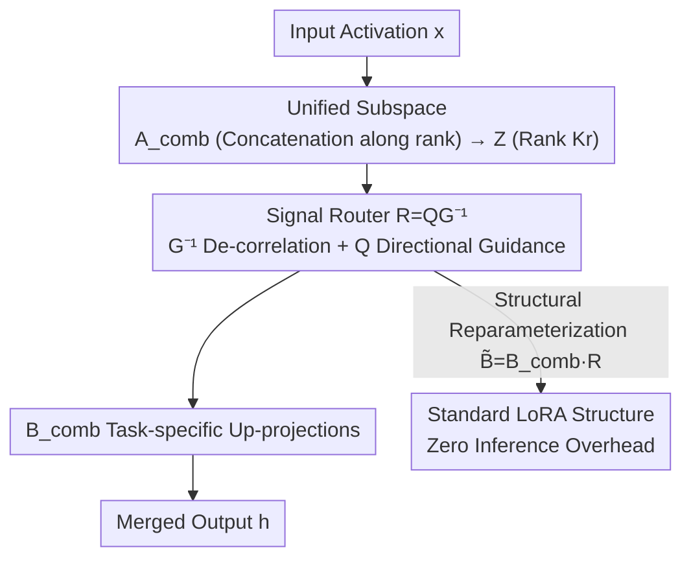

# SSR-Merge: Subspace Signal Routing for Training-Free LoRA Merging in Diffusion Models

**Conference**: ICML 2026  
**arXiv**: [2606.10617](https://arxiv.org/abs/2606.10617)  
**Code**: https://github.com/nagara214/SSR-Merge  
**Area**: Model Compression / LoRA Merging / Diffusion Models  
**Keywords**: LoRA Merging, Training-free, Signal Routing, Subspace, Least Squares

## TL;DR
The authors reconceptualize LoRA merging from "arithmetic in parameter space" to "routing internal signals within a unified subspace." By concatenating LoRAs along the rank dimension and inserting a router $R=\mathbf{Q}\mathbf{G}^{-1}$ constructed via second-order statistics (de-correlation + directional guidance), they achieve a solution theoretically equivalent to the Ordinary Least Squares (OLS) optimum. This method is training-free, supports streaming updates, has zero inference overhead, and significantly outperforms SOTA methods like TIES/DARE on FLUX.1-dev.

## Background & Motivation
**Background**: Diffusion models utilize Parameter-Efficient Fine-Tuning (PEFT) methods like LoRA to adapt to downstream tasks at low cost, resulting in a vast ecosystem of style, character, and instruction LoRAs. A natural requirement is LoRA merging—combining multiple LoRAs into a single model to enable multi-task capabilities simultaneously.

**Limitations of Prior Work**: Most existing merging methods perform **arithmetic in the parameter space**. Simple linear averaging or Task Arithmetic directly superimposes parameters, inevitably introducing interference. Heuristic methods like TIES or DARE mitigate conflicts through pruning, sign election, or random sparsification, but fail to prevent "destructive collisions" as the number of tasks increases. As shown in Figure 1 of the paper, DARE’s activation maps exhibit severe crosstalk, where one instruction erroneously activates unrelated modules. Dynamic methods either learn scalar coefficients (still failing to disentangle conflicts in shared space) or use non-linear gating (breaking reparameterization properties and introducing inference latency).

**Key Challenge**: The root cause of conflict is that **all tasks are squeezed into the same shared parameter space**. Performing addition, subtraction, pruning, or weighting in this fixed-capacity container inevitably leads to task interference once the number of tasks grows.

**Goal**: To eliminate multi-task interference cleanly without training, without adding inference overhead, and while maintaining the standard LoRA structure, backed by provable optimality rather than heuristics.

**Key Insight**: The authors move beyond the "parameter arithmetic" framework. Since conflicts occur during signal aliasing, they propose **routing signals** within the LoRA subspaces rather than merging in the parameter space, ensuring each task's signal is precisely directed to its own task subspace.

**Core Idea**: Merging is redefined as signal routing—constructing a unified subspace and inserting a closed-form router calculated from second-order statistics. This router de-correlates and then directionally guides signals, allowing multi-task coexistence under a linear structure without mutual interference.

## Method

### Overall Architecture
SSR (Subspace Signal Routing) merges $K$ LoRAs trained on different tasks $\{A_k,B_k\}_{k=1}^K$ (where $A_k \in \mathbb{R}^{r \times d}$ is the down-projection and $B_k \in \mathbb{R}^{d \times r}$ is the up-projection, with rank $r \ll d$). It consists of three steps: first, it concatenates individual task subspaces into a **unified subspace** (stacking down-projections vertically and up-projections horizontally along the rank dimension, expanding rank from $r$ to $Kr$); second, it inserts a **training-free router** $R \in \mathbb{R}^{Kr \times Kr}$ between the unified down-projection $\mathbf{A}_{\text{comb}}$ and up-projection $\mathbf{B}_{\text{comb}}$ to control signal flow. The router uses a de-correlation operator $\mathbf{G}^{-1}$ to resolve aliasing in intermediate signals and directional guidance $\mathbf{Q}$ to push purified signals toward task-specific up-projection bases $B_k$. Finally, through structural reparameterization, $R$ is absorbed into the up-projection to yield a standard LoRA structure with zero inference overhead.

### Key Designs

**1. Unified Subspace + Signal Routing: Shifting from Parameter Arithmetic to Intra-subspace Guidance**

To address the limitation that "parameter space cannot accommodate multiple tasks," SSR avoids addition/subtraction in parameter space. It constructs a unified down-projection $\mathbf{A}_{\text{comb}}=[A_1;\dots;A_K] \in \mathbb{R}^{Kr \times d}$ and up-projection $\mathbf{B}_{\text{comb}}=[B_1,\dots,B_K] \in \mathbb{R}^{d \times Kr}$, expanding the rank to $Kr$. The crucial insight is that simply adding $K$ LoRA updates is equivalent to $\sum_k B_k A_k = \mathbf{B}_{\text{comb}} \mathbf{A}_{\text{comb}}$, which is a special case where the router is an identity matrix $R = \mathbf{I}_{Kr}$ (exactly Task Arithmetic). Thus, SSR uses the **same low-rank updates and subspace capacity** as TIES/DARE (no extra budget); the difference lies in replacing identity routing with a statistically derived router $R$. Interference is not removed by hard pruning but by explicitly steering signals in the unified space.

**2. Second-order Statistics Closed-form Router $R=\mathbf{Q}\mathbf{G}^{-1}$: De-correlation + Directional Guidance with OLS Optimality**

The router is constructed via closed-form second-order statistics of calibration data. Let $Z_k = \mathbf{A}_{\text{comb}}X_k$ be the projection of input features $X_k$ for the $k$-th task in the unified space. The **correlation matrix** $\mathbf{G} := \sum_{k=1}^K Z_k Z_k^\top$ measures the total correlation structure in the unified space. The **directional guidance** $\mathbf{Q} := [\mathbf{Q}_1;\dots;\mathbf{Q}_K]$ is stacked from task blocks $\mathbf{Q}_k = (A_k X_k) Z_k^\top$, capturing the cross-covariance between unified projections and task-specific targets. The router is defined as:

$$R := \mathbf{Q}\mathbf{G}^{-1},$$

where $\mathbf{G}^{-1}$ acts as a whitening/de-correlation operator to eliminate correlations in the shared signal space, and $\mathbf{Q}$ directs the purified signals toward the up-projection bases $B_k$. This design is not ad-hoc; the authors use the Moore–Penrose pseudoinverse property $\mathbf{B}_{\text{comb}}^\dagger B_k = \mathbf{E}_k$ to rewrite $\mathbf{Q}$ as $\mathbf{Q} = \mathbf{B}_{\text{comb}}^\dagger (\sum_k Y_k Z_k^\top)$ (where $Y_k = B_k A_k X_k$ is the target signal), which yields:

$$R = \mathbf{B}_{\text{comb}}^\dagger \underbrace{\Big(\sum_k Y_k Z_k^\top\Big) \Big(\sum_k Z_k Z_k^\top\Big)^{-1}}_{\hat\beta_{\text{OLS}}} = \mathbf{B}_{\text{comb}}^\dagger \hat\beta_{\text{OLS}}.$$

Since the target $Y_k$ lies within the range of $\mathbf{B}_{\text{comb}}$, the projection operator $\mathbf{B}_{\text{comb}} \mathbf{B}_{\text{comb}}^\dagger$ reduces to tile identity, making the merged output $\hat Y = \hat\beta_{\text{OLS}} Z$. **Theorem 3.1** guarantees that $R$ strictly minimizes the reconstruction objective $\mathcal{L}(R) = \sum_k \|\mathbf{B}_{\text{comb}} R Z_k - Y_k\|_F^2$, making it the unique analytical optimal solution rather than a heuristic hyperparameter.

**3. Streaming Algorithm + Structural Reparameterization + One-shot Calibration: Making the "Optimal Solution" Deployable**

Pure theory faces engineering hurdles: naive offline construction requires caching all activation maps for all tasks, leading to an unacceptable memory complexity of $\mathcal{O}(K \cdot N_{\text{layer}} \cdot T \cdot D_{\text{feat}})$. Utilizing the additivity of sufficient statistics, the authors design a **streaming algorithm**: for each batch of features $x_t$, they online update $\mathbf{G} \leftarrow \mathbf{G} + (\mathbf{A}_{\text{comb}} x_t)(\mathbf{A}_{\text{comb}} x_t)^\top$ and $\mathbf{Q} \leftarrow \mathbf{Q} + \mathbf{E}_k (A_k x_t)(\mathbf{A}_{\text{comb}} x_t)^\top$, discarding raw features immediately. This reduces space complexity to a constant $\mathcal{O}((Kr)^2)$ while being numerically equivalent to the offline solution. **Structural reparameterization** absorbs the router into the up-projection $\tilde{\mathbf{B}}_{\text{comb}} = \mathbf{B}_{\text{comb}} R$. The resulting $(\mathbf{A}_{\text{comb}}, \tilde{\mathbf{B}}_{\text{comb}})$ is identical to a standard LoRA, allowing it to be merged into the backbone weights with zero inference latency. **One-shot calibration** further simplifies requirements: each task requires only one representative prompt (e.g., "A [V] dog", without ground-truth images) and a single forward pass at one timestep to construct $R$. The aggregated effective sample size $N$ (total tokens) is roughly $10^3$, far exceeding the subspace dimension $Kr$, ensuring $\mathbf{G}$ is well-conditioned and invertible with an estimation error bounded by $\mathcal{O}(\sqrt{Kr/N})$.

## Key Experimental Results

Experiments were conducted on FLUX.1-dev. Ten rank-32 LoRAs representing diverse objects from DreamBooth were trained and merged with varying task numbers $K \in \{1, 3, 5, 7, 9\}$ ($K=1$ serves as the Oracle upper bound). Comparisons were made against training-free SOTA methods: Task Arithmetic, TIES, DARE, RobustMerge, and IterIS.

### Main Results: Preservation of Single-task Capability (FLUX.1-dev, DINOv2 / CLIP)

| Method | $K=3$ DINO | $K=5$ DINO | $K=7$ DINO | $K=9$ DINO | $K=9$ CLIP |
|------|------|------|------|------|------|
| Task Arithmetic | 0.5814 | 0.4935 | 0.5165 | 0.5356 | 0.6831 |
| TIES | 0.6264 | 0.5058 | 0.5095 | 0.4723 | 0.6839 |
| DARE | 0.7171 | 0.6584 | 0.6087 | 0.5837 | 0.7376 |
| IterIS | 0.7030 | 0.6720 | 0.6420 | 0.6240 | 0.7520 |
| **SSR (Ours)** | **0.7342** | **0.7059** | **0.6868** | **0.6713** | **0.7850** |
| Recovery Rate | 98.6% | 94.8% | 92.3% | 90.2% | — |
| Upper Bound (Oracle) | 0.7443 | 0.7443 | 0.7443 | 0.7443 | 0.8452 |

While baselines degrade sharply as the number of tasks grows, SSR remains stable. At the strongest interference ($K=9$), SSR outperforms the strongest baseline IterIS by 0.0473 DINO / 0.0330 CLIP, consistently recovering over 90% of the single-task Oracle performance.

### Multi-task Execution and Editing Generalization

| Experiment | Metric | DARE | TIES | **SSR** |
|------|------|------|------|------|
| Multi-concept Synthesis | DINOv2 ↑ | 0.5050 | 0.4475 | **0.5704** |
| Multi-concept Synthesis | CLIP ↑ | 0.6485 | 0.6498 | **0.7357** |
| Multi-concept Synthesis | Success Rate ↑ | 0.62 | 0.69 | **0.91** |
| Facial Editing | ArcFace ↑ | 0.9471 | 0.9430 | **0.9610** |
| Facial Editing | CLIP ↑ | 0.9464 | 0.9529 | **0.9625** |

In multi-concept synthesis (generating multiple subjects in one image), SSR achieves a Success Rate of 91%, which is 29 percentage points higher than DARE. Baselines rely on sparsification to mitigate conflicts, which leads to task loss (dropping to 62%–69%). In dense facial editing (lipstick/blush/eyeshadow simultaneously), SSR leads in both identity preservation and editing fidelity.

### Key Findings
- **Routing is Essential**: Activation maps in Figure 1 show that severe crosstalk in baselines is replaced by SSR's clean diagonal structure, where each task only activates its target LoRA, visually confirming precise signal steering.
- **Efficiency comparable to DARE**: At $K=9$, merging takes 34.26s, approximately $2.6\times$ faster than the optimization-based TIES (88.93s) and only 13.31s more than DARE (20.95s), thanks to the compute-efficient one-shot calibration.
- **Sparsification is a Double-edged Sword**: TIES/DARE use sparsification to suppress conflicts, which barely maintains single-task fidelity at the cost of significant task loss in multi-task scenarios. SSR avoids suppression in favor of routing, achieving both high fidelity and high success rates.

## Highlights & Insights
- **"Change the Coordinate System, Don't Squeeze the Container"**: By viewing parameter addition $\mathbf{B}_{\text{comb}}\mathbf{A}_{\text{comb}}$ as a special case of identity routing and replacing it with a statistical router, the author elegantly rebuts the concern of "higher capacity" by noting that the rank budget remains fair.
- **Heuristic to Closed-form Optimum**: Proving that an engineering-driven routing design is OLS-projection optimal provides a rare theoretical guarantee for training-free merging.
- **Additivity of Sufficient Statistics → Streaming**: Leveraging the additivity of second-order statistics reduces memory requirements from linear (w.r.t features) to constant $\mathcal{O}((Kr)^2)$. This trick is transferable to any training-free calibration scenario requiring covariance/cross-correlation.
- **Zero Overhead via Structural Reparameterization**: Since the merged module is isomorphic to a standard LoRA, it maintains full ecosystem compatibility and inference efficiency, giving it high practical value.

## Limitations & Future Work
- **Local Linear Reconstruction ≠ Global Optimum**: SSR optimizes for local linear feature reconstruction; it does not guarantee global optimality for the entire non-linear diffusion process, and the gap with the upper bound may widen in extreme conditions.
- **Degradation in High-Overlap Tasks**: When tasks have severe domain conflicts or high semantic overlap, parameter interference is stronger, making routing more difficult and potentially degrading performance.
- **Reliance on One-shot Calibration**: The validity of one-shot single-timestep calibration relies on the effective sample size greatly exceeding the subspace dimension. Its robustness in much deeper/wider subspaces ($Kr$ very large) or tasks with very few tokens requires further validation.
- **Potential Misuse**: High-fidelity multi-concept synthesis could be used to generate deceptive content; the authors call for responsible use.

## Related Work & Insights
- **vs Task Arithmetic / Linear Averaging**: These aggregate directly in parameter space (equivalent to SSR with $R=\mathbf{I}$), leading to interference. SSR replaces the identity router with a statistical one to remove correlations and guide signals.
- **vs TIES / DARE**: These rely on pruning/sign election to delete conflicting weights, causing task loss as $K$ increases. SSR does not delete signals; it routes them, maintaining much higher stability.
- **vs Non-linear Dynamic Merging (e.g., MoE-style gating)**: Those methods break reparameterization, add inference latency, and cannot merge weights into the backbone. SSR maintains a linear structure and can be integrated into the backbone with zero overhead.
- **vs Analytical Merging like RegMean**: The authors found RegMean to be numerically unstable in this setting; SSR explicitly exploits the geometric properties of low-rank subspaces and uses a well-behaved $\mathbf{G}$ inversion for better stability.

## Rating
- Novelty: ⭐⭐⭐⭐⭐ Reframing merging as signal routing plus OLS optimality proof is both a new perspective and theoretically sound.
- Experimental Thoroughness: ⭐⭐⭐⭐ Comprehensive evaluation across single/multi-task/editing with $K$-scans and efficiency checks, though primarily limited to the diffusion image domain.
- Writing Quality: ⭐⭐⭐⭐⭐ Logical flow from motivation to theory to implementation is closed-loop; derivations are clear.
- Value: ⭐⭐⭐⭐⭐ Training-free, zero inference overhead, and ecosystem-compatible; highly practical for LoRA deployment.

<!-- RELATED:START -->

## Related Papers

- [\[CVPR 2026\] Preference-Aligned LoRA Merging: Preserving Subspace Coverage and Addressing Directional Anisotropy](../../CVPR2026/model_compression/preference-aligned_lora_merging_preserving_subspace_coverage_and_addressing_dire.md)
- [\[ICML 2026\] FRISM: Fine-Grained Reasoning Injection via Subspace-Level Model Merging for Vision–Language Models](frism_fine-grained_reasoning_injection_via_subspace-level_model_merging_for_visi.md)
- [\[CVPR 2026\] ManifoldGD: Training-Free Hierarchical Manifold Guidance for Diffusion-Based Dataset Distillation](../../CVPR2026/model_compression/manifoldgd_training-free_hierarchical_manifold_guidance_for_diffusion-based_data.md)
- [\[ACL 2026\] CadLLM: Improving the Throughput of Diffusion-based LLMs via Training-Free Confidence-Aware Calibration](../../ACL2026/model_compression/improving_the_throughput_of_diffusion-based_large_language_models_via_a_training.md)
- [\[ICML 2026\] Task-Driven Subspace Decomposition for Knowledge Sharing and Isolation in LoRA-based Continual Learning](task-driven_subspace_decomposition_for_knowledge_sharing_and_isolation_in_lora-b.md)

<!-- RELATED:END -->
