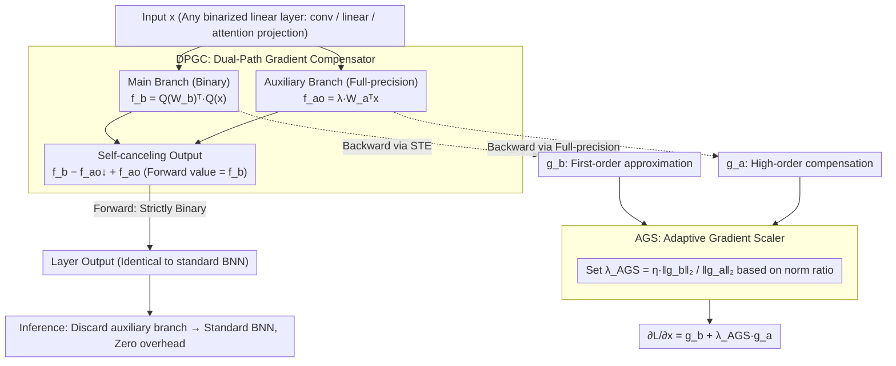

# SURGE: Surrogate Gradient Adaptation in Binary Neural Networks

**Conference**: ICML 2026  
**arXiv**: [2605.10989](https://arxiv.org/abs/2605.10989)  
**Code**: Not yet released  
**Area**: Model Compression / Binary Neural Networks / Quantization-Aware Training  
**Keywords**: BNN, STE, Gradient Mismatch, Dual-Path Compensation, Adaptive Gradient Scaling

## TL;DR
SURGE connects a "full-precision auxiliary branch" in parallel with each binarization layer. While the forward output remains unchanged, the backward pass propagates an additional "non-STE truncated" high-order gradient from the full-precision branch. By using AGS to dynamically balance the contributions based on the gradient norm ratio, SURGE achieves 62.0% top-1 on ResNet-18/ImageNet, outperforming ReCU by 1.0% and IR-Net by 3.9%.

## Background & Motivation

**Background**: Binary Neural Networks (BNNs) quantize weights and activations to $\{-1, +1\}$, theoretically providing $32\times$ memory compression and $58\times$ inference acceleration, making them the most aggressive quantization scheme for edge deployment. Most BNNs rely on the Straight-Through Estimator (STE) for training: using $\text{sign}(\cdot)$ in the forward pass and approximating the gradient as $\frac{\partial\mathbf{B}_W}{\partial W}\approx 1$ and $\frac{\partial\mathbf{B}_x}{\partial x}\approx\mathbb{1}_{\{|x|\le 1\}}$ in the backward pass.

**Limitations of Prior Work**: STE suffers from two fundamental issues. First, the true gradient of the sign function is zero almost everywhere; using an identity function introduces systematic bias, commonly known as "gradient mismatch." Second, activation gradients are zeroed out when they fall outside $[-1, 1]$, causing significant information loss. Existing works (sigmoid approximation in DSQ, asymptotic sign in IR-Net, feature distribution alignment in ReCU) mostly rely on manually designed approximation functions, which cannot guarantee optimality.

**Key Challenge**: There is a core contradiction in BNN training: "strictly binary forward pass (to ensure inference acceleration)" vs. "sufficiently rich gradients in the backward pass (to ensure trainability)." As long as the forward pass uses sign, the backward pass is limited to a first-order identity surrogate.

**Goal**: 1) Supplement the main branch with a "non-STE, low-bias" gradient from an external source without changing the forward output; 2) Prevent magnitude imbalance from destabilizing the main branch; 3) Completely discard the auxiliary branch during inference for zero additional cost.

**Key Insight**: Since STE is a first-order approximation of sign, a parallel "full-precision copy" can be used to compensate for higher-order terms missed by STE. Given the unknown magnitudes of the two gradient paths, a norm-ratio adaptive scaling is employed for dynamic balancing.

**Core Idea**: Utilize a "forward self-canceling, backward opening" detach trick to ensure the full-precision auxiliary branch only participates in the backward pass. Then, apply AGS to scale the gradient by $\frac{\|g_b\|_2}{\|g_a\|_2+\epsilon}$, refining the first-order surrogate of STE into a hybrid estimate closer to the true gradient.

## Method

### Overall Architecture
SURGE supplements each binarized layer with a backward signal closer to the true gradient without altering forward output. Specifically, for each binarized linear operator (conv, linear, attention projection), a full-precision copy (auxiliary branch) of identical size is attached in parallel. Using a detach-based self-canceling formulation, this branch **contributes nothing to the forward pass but activates during the backward pass**. The forward output is strictly equal to a pure BNN, while the backward pass enables the full-precision branch to return high-order gradients clipped by STE back to the input. The Adaptive Gradient Scaler (AGS) then dynamically scales these based on the norm ratio to ensure the compensation does not overwhelm the main branch. This mechanism requires only a "binarized operator + full-precision copy" structure, making it architecture-agnostic and applicable to both CNNs and Transformers. The auxiliary branch is discarded after training, resulting in a standard BNN for inference.

### Key Designs

**1. Dual-Path Gradient Compensator (DPGC): Binary forward, full-precision backward via detach**

The deadlock in BNN training is the mutual exclusivity between "strictly sign forward (for acceleration)" and "rich gradients backward (for learning)." DPGC resolves this by attaching a full-precision copy and using a self-canceling output formula. Let the binary forward be $f_b(x;W_b)=Q_W(W_b)^\top Q_x(x)$, the full-precision forward be $f_a(x;W_a)=W_a^\top x$, and the scaled auxiliary term be $f_{ao}(x)=\lambda f_a(x)$. The output is:

$$\text{output}=f_b(x;W_b)-f_{ao}(x;W_a)\!\downarrow+\,f_{ao}(x;W_a)$$

where $\downarrow$ denotes the stop-gradient operator. In the forward pass, the last two terms cancel out, making the output strictly $f_b$. In the backward pass, the gradient of the detached term is truncated, leaving $f_b$ to use STE and $f_{ao}$ to use full-precision gradients. The resulting gradient at the input is $\frac{\partial\mathcal{L}}{\partial x}=g_b+\lambda g_a$, combining the first-order approximation from STE ($g_b$) and the high-order compensation from the full-precision copy ($g_a$).

**2. Adaptive Gradient Scaler (AGS): Dynamic $\lambda$ based on norm ratio for balanced compensation**

The magnitude of $g_a$ provided by DPGC is unknown; a fixed $\lambda$ that is too large may destabilize the main branch, while one that is too small renders the compensation ineffective. AGS defines the scaling factor as the ratio of the two gradient norms:

$$\lambda_{\text{AGS}}=\eta\,\frac{\|g_b\|_2}{\|g_a\|_2+\epsilon}$$

where $\eta$ is the base scaling coefficient and $\epsilon=10^{-8}$ prevents division by zero. The paper derives this from a second-order moment model, proving that the optimal scaling $\lambda^*=\frac{\langle\delta_b,\mu_a\rangle}{\|\mu_a\|_2^2+\text{tr}(\text{Var}(g_a))}$ (where $\delta_b$ is the STE bias vector) simplifies to $\lambda^*\approx\eta\frac{\|\mu_b\|_2}{\|\mu_a\|_2}$ under stable alignment and noise assumptions. By using mini-batch norm estimates, AGS ensures both paths remain at similar magnitudes, allowing STE to lead the optimization while the auxiliary path provides high-order corrections.

### Loss & Training
End-to-end training using cross-entropy (classification), detection loss (VOC), or NLU loss (GLUE) without additional training losses. $\eta$ is the primary hyperparameter requiring tuning; inference incurs zero additional cost.

## Key Experimental Results

### Main Results
Evaluated on 4 benchmarks: CIFAR-10, ImageNet-1K (ResNet-18/34, ReActNet), PASCAL VOC (Faster-RCNN + ResNet-18), and GLUE (BERT-base).

| Network / Task | Method | W/A | Top-1 / mAP / Avg |
|------------|------|-----|--------------------|
| ResNet-18 / CIFAR-10 | ReCU | 1/1 | 92.8% |
| ResNet-18 / CIFAR-10 | **Ours** | 1/1 | **93.1%** (+0.3 Gain) |
| ResNet-20 / CIFAR-10 | ReCU | 1/1 | 87.4% |
| ResNet-20 / CIFAR-10 | **Ours** | 1/1 | **88.0%** (+0.6 Gain) |
| VGG-Small / CIFAR-10 | ReCU | 1/1 | 92.2% |
| VGG-Small / CIFAR-10 | **Ours** | 1/1 | **92.5%** (+0.3 Gain) |
| ResNet-18 / ImageNet (one-stage) | IR-Net | 1/1 | 58.1% |
| ResNet-18 / ImageNet (one-stage) | BONN | 1/1 | 59.3% |
| ResNet-18 / ImageNet (one-stage) | ReCU | 1/1 | ~61% |
| ResNet-18 / ImageNet (one-stage) | **Ours** | 1/1 | **62.0%** (+3.9 over IR-Net) |

SURGE consistently outperforms Prev. SOTA on VOC and GLUE, maintaining OPs identical to existing BNNs.

### Ablation Study

| Configuration | ImageNet ResNet-18 Top-1 (one-stage) | Description |
|------|----------------------------|------|
| STE baseline | Several % lower than Ours | Only first-order surrogate |
| + DPGC (Fixed $\lambda$) | Significant gain, but unstable | Lacks magnitude balancing |
| + AGS (norm-ratio) = **Ours** | **62.0%** with stable training | Full model |
| AGS replaced with constant $\lambda$ | Large $\lambda$ fails; small $\lambda$ lacks gain | Verifies adaptive necessity |
| DPGC only in final layers | Reduced gain | Mismatch accumulates in deeper layers |

### Key Findings
- Gradient statistics show that SURGE causes the activation gradient distribution to **shift right** with a heavier tail, confirming the auxiliary branch restores information clipped by STE.
- The combination of DPGC + AGS improves ImageNet results by 0.5~1% over DPGC alone, suggesting magnitude balancing is necessary for convergence, not just engineering stability.
- After discarding the auxiliary branch, ResNet-18 inference OPs match standard BNNs ($1.63\times 10^8$), achieving the goal of zero inference overhead.
- Effectiveness on BERT-base/GLUE demonstrates that SURGE is compatible with linear operators like attention projections, not just convolutions.

## Highlights & Insights
- The "detach self-canceling" trick is a clever engineering solution: $f-f\downarrow+f$ acts as $f$ in the forward pass but provides the true gradient of $f$ in the backward pass. This is applicable to knowledge distillation, adversarial training, and differentiable pruning.
- Viewing STE as a low-order approximation and using a full-precision copy for high-order terms refines BNN training from "finding a better sign approximation" to "compensating for first-order Taylor residuals."
- AGS uses a norm-ratio to balance gradients, analogous to GradNorm or PCGrad in multi-task learning, but with a theoretical derivation showing the optimal $\lambda^*$ under isotropic noise.

## Limitations & Future Work
- Memory and FLOPs nearly double during training (since the auxiliary branch is the same size as the main branch), leading to high training costs.
- $\eta$ still requires manual tuning for different backbones; although theoretically $\eta=\kappa c_\theta/(1+\rho)$, these parameters are hard to monitor.
- The assumption that $g_b$ and $g_a$ noise are uncorrelated may not hold strictly in deep networks.
- Lack of comparison with multi-bit quantization (W2A2, W4A4); effectiveness outside 1-bit quantization remains unexplored.

## Related Work & Insights
- **vs. IR-Net / ReCU / BONN**: These methods modify approximation functions or weight distributions (forward pass). SURGE is orthogonal as it uses a backward bypass, allowing potential combination with these methods.
- **vs. DSQ / LSQ**: DSQ uses parametric functions to approximate sign; LSQ introduced learnable scales. SURGE places learnability in a completely independent auxiliary branch, offering higher expressivity with no inference burden.
- **vs. Frequency-domain BNN (FDA-BNN)**: FDA-BNN mitigates mismatch in the frequency domain; SURGE performs compensation directly in the spatial domain, which is simpler to implement.

## Rating
- Novelty: ⭐⭐⭐⭐ The "forward self-canceling, backward opening" detach trick combined with the AGS norm-ratio derivation is an elegant construction.
- Experimental Thoroughness: ⭐⭐⭐⭐ Comprehensive evaluation across 4 benchmarks, 3 tasks, and both CNNs and Transformers is superior for BNN research.
- Writing Quality: ⭐⭐⭐⭐ Core mechanisms are intuitive, and the derivations for Theorem 5.3 and Corollary 5.4 are clear.
- Value: ⭐⭐⭐⭐ Setting a new SOTA for one-stage BNNs on ResNet-18/ImageNet (62.0%) with zero inference overhead makes it industry-friendly.

<!-- RELATED:START -->

## Related Papers

- [\[ICLR 2026\] BEP: A Binary Error Propagation Algorithm for Binary Neural Networks Training](../../ICLR2026/model_compression/bep_a_binary_error_propagation_algorithm_for_binary_neural_networks_training.md)
- [\[ICML 2026\] Partial Fusion of Neural Networks: Efficient Tradeoffs Between Ensembles and Weight Aggregation](partial_fusion_of_neural_networks_efficient_tradeoffs_between_ensembles_and_weig.md)
- [\[CVPR 2026\] AdaBet: Gradient-free Layer Selection for Efficient Training of Deep Neural Networks](../../CVPR2026/model_compression/adabet_gradient-free_layer_selection_for_efficient_training_of_deep_neural_netwo.md)
- [\[AAAI 2026\] BD-Net: Has Depth-Wise Convolution Ever Been Applied in Binary Neural Networks?](../../AAAI2026/model_compression/bd-net_has_depth-wise_convolution_ever_been_applied_in_binary_neural_networks.md)
- [\[ICLR 2026\] Towards Lossless Memory-efficient Training of Spiking Neural Networks via Gradient Checkpointing and Spike Compression](../../ICLR2026/model_compression/towards_lossless_memory-efficient_training_of_spiking_neural_networks_via_gradie.md)

<!-- RELATED:END -->
