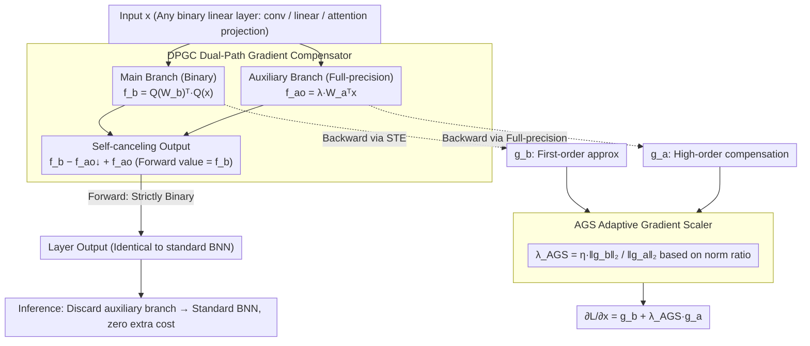

# SURGE: Surrogate Gradient Adaptation in Binary Neural Networks

**Conference**: ICML 2026  
**arXiv**: [2605.10989](https://arxiv.org/abs/2605.10989)  
**Code**: Not yet public  
**Area**: Model Compression / Binary Neural Networks / Quantization-Aware Training  
**Keywords**: BNN, STE, Gradient Mismatch, Dual-Path Compensation, Adaptive Gradient Scaling

## TL;DR
SURGE attaches a "full-precision auxiliary branch" in parallel to each binarization layer. While the forward output remains unchanged, the backward pass retrieves an additional "non-STE truncated" high-order gradient from the full-precision branch. By using AGS to dynamically balance the two paths based on the gradient norm ratio, SURGE achieves 62.0% Top-1 accuracy on ResNet-18/ImageNet, surpassing ReCU by 1.0% and IR-Net by 3.9%.

## Background & Motivation

**Background**: Binary Neural Networks (BNNs) quantize weights and activations to $\{-1, +1\}$, theoretically offering $32\times$ memory compression and $58\times$ inference acceleration, making them the most aggressive quantization scheme for edge deployment. Most BNN training relies on the Straight-Through Estimator (STE): using $\text{sign}(\cdot)$ in the forward pass while treating $\frac{\partial\mathbf{B}_W}{\partial W}\approx 1$ and $\frac{\partial\mathbf{B}_x}{\partial x}\approx\mathbb{1}_{\{|x|\le 1\}}$ as surrogate gradients in the backward pass.

**Limitations of Prior Work**: STE suffers from two fundamental issues. First, the true gradient of sign is zero almost everywhere; using an identity function as an alias introduces systematic bias, known as "gradient mismatch." Second, activation gradients outside $[-1, 1]$ are hard-clipped to zero, discarding substantial information. Existing works (e.g., sigmoid approximation in DSQ, asymptotic sign in IR-Net, feature distribution alignment in ReCU) mostly depend on hand-designed approximation functions, which cannot guarantee optimality.

**Key Challenge**: There is a fundamental contradiction in BNN training: "forward pass must be strictly binary (to ensure inference acceleration)" vs. "backward pass requires sufficiently rich gradients (to ensure learnability)." As long as the forward pass uses sign, the backward pass is limited to first-order identity surrogate approximations.

**Goal**: 1) Provide an external "non-STE, low-bias" gradient compensation to the main branch without altering the forward output; 2) Prevent the magnitude of compensation gradients from disrupting the convergence of the main branch; 3) Completely discard the auxiliary branch during inference for zero additional cost.

**Key Insight**: Since STE is a first-order approximation of sign, a parallel "full-precision replica" for each layer can use its true gradients to compensate for the high-order terms missing in STE. Since the magnitudes of the two gradient paths are unknown, a norm-ratio adaptive scaling is used for dynamic balancing.

**Core Idea**: Utilize a "forward self-canceling, backward transparent" detach trick to allow the full-precision auxiliary branch to participate only in the backward pass. Then, apply AGS according to $\frac{\|g_b\|_2}{\|g_a\|_2+\epsilon}$ for adaptive scaling, refining the first-order surrogate of STE into a hybrid estimate closer to the true gradient.

## Method

### Overall Architecture
SURGE aims to supplement each binarization layer with a backward signal "closer to the true gradient than STE" without touching the forward output. Specifically, a full-precision replica (auxiliary branch) of identical size is attached in parallel to every binary linear operator (conv, linear, attention projection). Using a detach-based self-canceling formulation, this replica **contributes nothing to the forward pass but activates during the backward pass**. The forward output is strictly equal to the pure BNN. During the backward pass, the full-precision replica feeds the high-order gradients (clipped by STE) back to the input. The AGS (Adaptive Gradient Scaler) then dynamically scales these based on the norm ratio of both paths to ensure the compensation magnitude does not overwhelm the main branch. This mechanism relies only on the minimal structure of "one binary linear operator + one full-precision replica," making it architecture-agnostic and plug-and-play for both CNNs and Transformers. During training, three computational states coexist (main branch forward, main branch backward, auxiliary branch backward). After training, the auxiliary branch is discarded, leaving a standard BNN for inference with zero extra cost.

### Key Designs

**1. Dual-Path Gradient Compensator (DPGC): Binary forward, full-precision backward, using detach to resolve contradictions**

The bottleneck of BNN training is the mutual exclusivity between "strict binary forward pass" and "rich backward gradients." Previous improvements (piecewise polynomial, SignSwish, etc.) merely "substituted one smooth function for another" to trick STE. DPGC sidesteps this by attaching a full-precision replica to each layer and separating the two passes via a self-canceling output formula. Let the binary forward be $f_b(x;W_b)=Q_W(W_b)^\top Q_x(x)$, the full-precision forward be $f_a(x;W_a)=W_a^\top x$, and the scaled auxiliary term be $f_{ao}(x)=\lambda f_a(x)$. The output is written as:

$$\text{output}=f_b(x;W_b)-f_{ao}(x;W_a)\!\downarrow+\,f_{ao}(x;W_a)$$

where $\downarrow$ denotes stop-gradient. During the forward pass, the last two terms are numerically identical and cancel out, making the output strictly $f_b$. During the backward pass, the gradient of the detached term is truncated, leaving $f_b$ to follow STE and $f_{ao}$ to provide full-precision gradients. Thus, the input gradient becomes $\frac{\partial\mathcal{L}}{\partial x}=g_b+\lambda g_a$—where $g_b$ is the first-order approximation from STE, and $g_a$ is the high-order compensation from the full-precision replica. This preserves "strict binary output" while providing "full-precision backward signals," with the auxiliary branch being discarded post-training.

**2. Adaptive Gradient Scaler (AGS): Dynamic $\lambda$ based on gradient norm ratio to ensure compensation doesn't "overpower"**

The magnitude of $g_a$ introduced by DPGC is unknown: a fixed $\lambda$ that is too large allows the auxiliary path to disrupt the main branch, while one too small renders the compensation useless. AGS defines the scaling factor as the norm ratio of the two gradients:

$$\lambda_{\text{AGS}}=\eta\,\frac{\|g_b\|_2}{\|g_a\|_2+\epsilon}$$

where $\eta$ is the base scaling coefficient and $\epsilon=10^{-8}$ prevents division by zero. This formula is derived from a second-order moment model, proving that the optimal scaling $\lambda^*=\frac{\langle\delta_b,\mu_a\rangle}{\|\mu_a\|_2^2+\text{tr}(\text{Var}(g_a))}$ (where $\delta_b$ is the STE bias vector) degrades to $\lambda^*\approx\eta\frac{\|\mu_b\|_2}{\|\mu_a\|_2}$ under assumptions that alignment $\cos\theta$, relative bias ratio $\beta=\|\delta_b\|_2/\|\mu_b\|_2$, and noise ratio $\rho$ are stable. By using mini-batch gradient norms to estimate $\|\mu\|_2$, both paths remain comparable in magnitude. STE remains the primary optimization driver, while the auxiliary path provides high-order corrections, effectively forming an optimal convex combination of gradients in terms of mean squared error.

### Loss & Training
End-to-end training using cross-entropy (Classification) / detection loss (VOC) / NLU loss (GLUE) without additional auxiliary losses. $\eta$ is one of the few hyperparameters requiring tuning. Zero additional overhead during inference.

## Key Experimental Results

### Main Results
Evaluated on 4 benchmarks: CIFAR-10, ImageNet-1K (ResNet-18/34, ReActNet), PASCAL VOC (Faster-RCNN + ResNet-18 backbone), and GLUE (BERT-base).

| Network / Task | Method | W/A | Top-1 / mAP / Avg |
|------------|------|-----|--------------------|
| ResNet-18 / CIFAR-10 | ReCU | 1/1 | 92.8% |
| ResNet-18 / CIFAR-10 | **Ours** | 1/1 | **93.1%** (+0.3) |
| ResNet-20 / CIFAR-10 | ReCU | 1/1 | 87.4% |
| ResNet-20 / CIFAR-10 | **Ours** | 1/1 | **88.0%** (+0.6) |
| VGG-Small / CIFAR-10 | ReCU | 1/1 | 92.2% |
| VGG-Small / CIFAR-10 | **Ours** | 1/1 | **92.5%** (+0.3) |
| ResNet-18 / ImageNet (one-stage) | IR-Net | 1/1 | 58.1% |
| ResNet-18 / ImageNet (one-stage) | BONN | 1/1 | 59.3% |
| ResNet-18 / ImageNet (one-stage) | ReCU | 1/1 | ~61% |
| ResNet-18 / ImageNet (one-stage) | **Ours** | 1/1 | **62.0%** (+3.9 over IR-Net) |

Consistently outperforms previous SOTA across VOC and GLUE, with OPs identical to previous BNNs (zero inference overhead gain).

### Ablation Study

| Configuration | ImageNet ResNet-18 Top-1 (one-stage) | Note |
|------|----------------------------|------|
| STE baseline | Several % lower than SURGE | First-order surrogate only |
| + DPGC (fixed $\lambda$) | Significant gain, but occasional instability | Lacks magnitude balancing |
| + AGS (norm-ratio) = **SURGE** | **62.0%** and stable training | Full model |
| Changing AGS to constant $\lambda$ | Large $\lambda$ fails; small $\lambda$ has no impact | Verifies necessity of adaptation |
| DPGC in last few layers only | Gain significantly reduced | Mismatch accumulates in deeper layers |

### Key Findings
- Gradient statistics in Figure 1 show that after adding SURGE, the activation gradient distribution clearly **shifts right** with a heavier tail, confirming that the auxiliary branch successfully recovers the information discarded by STE.
- The combination of DPGC + AGS improves ImageNet results by 0.5–1% over DPGC alone, suggesting magnitude balancing is a prerequisite for convergence rather than just "engineering stability."
- For ResNet-18, discarding the auxiliary branch post-training results in OPs identical to standard BNNs ($1.63\times 10^8$), perfectly meeting the "training compensation, zero inference cost" goal.
- Effectiveness on BERT-base/GLUE proves SURGE is not limited to convolutions but also applies to linear operators like attention projections.

## Highlights & Insights
- The "detach self-canceling" trick is the most clever engineering aspect: $f - f\downarrow + f$ equals $f$ in the forward pass but uses the true gradient of $f$ in the backward pass. This is applicable to any scenario requiring "Path A for forward, Path B for backward," such as knowledge distillation, adversarial training, or differentiable pruning.
- Viewing STE as a low-order approximation and using a full-precision replica for high-order terms reframes BNN training from "finding a smarter sign approximation" to "compensating for the first-order Taylor residual," which offers much clearer physical intuition.
- AGS balancing via norm-ratio is essentially isomorphic to multi-task gradient balancing (e.g., GradNorm, PCGrad). However, the theoretical derivation provides a clear basis ($\lambda^*$ degrades to $\eta\|\mu_b\|_2/\|\mu_a\|_2$ under isotropic noise), making it more convincing than pure heuristics.

## Limitations & Future Work
- VRAM and FLOPs nearly double during training (since the auxiliary branch is the same size as the main branch), leading to high training costs.
- $\eta$ still requires manual tuning, with different optimal values for different backbones. Theoretically, $\eta = \kappa c_\theta / (1+\rho)$, but since these quantities are not monitored, grid search is still used in practice.
- The assumption that $g_b$ and $g_a$ noise is uncorrelated may not hold precisely in very deep networks.
- Lack of comparison with multi-bit quantization (W2A2, W4A4); the transferability beyond pure 1-bit remains unknown.

## Related Work & Insights
- **vs. IR-Net / ReCU / BONN**: These works modify the sign approximation function or weight distribution (modifying the forward pass). SURGE leaves the forward pass intact and opens a backward bypass; the approaches are orthogonal and can be combined.
- **vs. DSQ / LSQ**: DSQ uses a parametric sigmoid to approximate sign; LSQ introduces learnable scales. SURGE places learnability into a completely independent full-precision replica, offering higher expressivity with zero inference burden.
- **vs. Frequency-domain BNN (FDA-BNN)**: FDA-BNN transforms sign into the frequency domain to mitigate mismatch. SURGE compensates via full-precision gradients in the spatial domain, which is easier to implement.

## Rating
- Novelty: ⭐⭐⭐⭐ The combination of the "forward self-canceling, backward opening" detach trick and the AGS norm-ratio derivation is an elegant construction.
- Experimental Thoroughness: ⭐⭐⭐⭐ Spans 4 benchmarks, 3 task types, and both CNN + Transformer architectures—top-tier for BNN papers.
- Writing Quality: ⭐⭐⭐⭐ Figures 1 and 2 make the core mechanism intuitive; derivations for Theorem 5.3 and Corollary 5.4 are clear.
- Value: ⭐⭐⭐⭐ 62.0% on ResNet-18/ImageNet set a new ceiling for one-stage BNNs at the time, and the zero inference overhead is industry-friendly.

<!-- RELATED:START -->

## Related Papers

- [\[CVPR 2026\] AdaBet: Gradient-free Layer Selection for Efficient Training of Deep Neural Networks](../../CVPR2026/model_compression/adabet_gradient-free_layer_selection_for_efficient_training_of_deep_neural_netwo.md)
- [\[AAAI 2026\] BD-Net: Has Depth-Wise Convolution Ever Been Applied in Binary Neural Networks?](../../AAAI2026/model_compression/bd-net_has_depth-wise_convolution_ever_been_applied_in_binary_neural_networks.md)
- [\[ICML 2026\] Partial Fusion of Neural Networks: Efficient Tradeoffs Between Ensembles and Weight Aggregation](partial_fusion_of_neural_networks_efficient_tradeoffs_between_ensembles_and_weig.md)
- [\[ICML 2025\] An Efficient Matrix Multiplication Algorithm for Accelerating Inference in Binary and Ternary Neural Networks](../../ICML2025/model_compression/an_efficient_matrix_multiplication_algorithm_for_accelerating_inference_in_binar.md)
- [\[ICLR 2026\] Adaptive Width Neural Networks](../../ICLR2026/model_compression/adaptive_width_neural_networks.md)

<!-- RELATED:END -->
