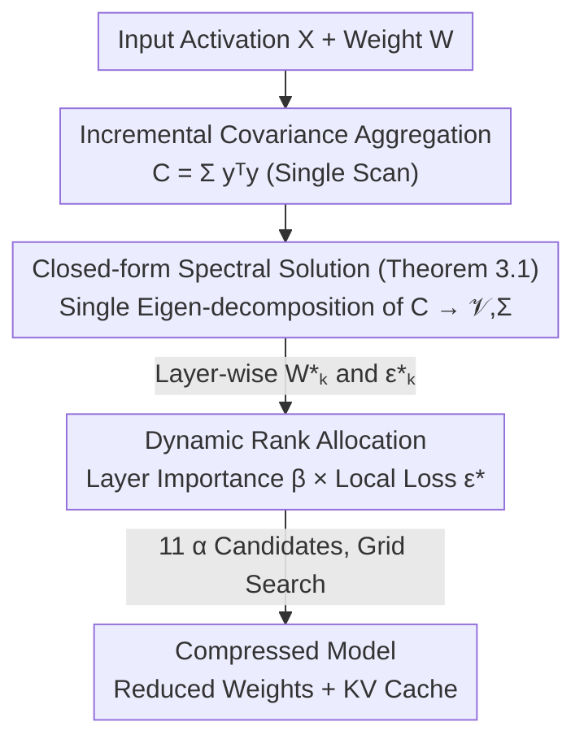

# Swift-SVD: Theoretical Optimality Meets Practical Efficiency in Low-Rank LLM Compression

**Conference**: ICML 2026  
**arXiv**: [2604.01609](https://arxiv.org/abs/2604.01609)  
**Code**: https://github.com/hiahei/Swift-SVD  
**Area**: Model Compression / Low-Rank Compression / LLM Inference Acceleration  
**Keywords**: SVD Compression, Activation-aware, Closed-form Spectral Solution, KV cache, Dynamic Rank Allocation

## TL;DR
Addressing the dilemma where existing SVD low-rank compression either yields suboptimal reconstruction errors or achieves optimality at the cost of slow and numerically unstable Cholesky + multiple SVD operations, this paper proves a closed-form spectral solution theorem—optimal activation-aware compression is achieved by a single eigen-decomposition of $Y=XW$. Combined with incremental covariance aggregation and dynamic rank allocation driven by the "negative correlation between layer importance and local compressibility," the proposed method achieves state-of-the-art compression accuracy across 6 LLMs and 8 datasets while accelerating end-to-end compression by 3–70×.

## Background & Motivation
**Background**: LLM deployment is constrained by memory and bandwidth, stemming from two sources: the massive static weights that must remain in VRAM and the KV cache maintained during autoregressive decoding, which grows with sequence length. Beyond quantization and pruning, **low-rank compression** reduces the intrinsic dimensions of linear layers. It is hardware-friendly (retaining dense operators and compatibility with existing software/hardware stacks) and orthogonal to quantization/pruning, typically utilizing SVD for optimal projection.

**Limitations of Prior Work**: Current low-rank compression approaches are unsatisfactory. One path involves **early direct SVD truncation of weights $W$**, which completely ignores input activation $X$ distribution, leading to significant performance degradation. The other path involves **activation-aware methods** (e.g., ASVD, SVD-LLM series), which consider data dependency but often require Cholesky decomposition and/or multiple SVDs, introducing numerical instability and plummeting efficiency as data scale increases. Furthermore, while **non-uniform compression** across layers has been explored, it lacks efficient layer-wise loss estimation and relies on heuristic rank allocation, sometimes performing worse than uniform allocation.

**Key Challenge**: There is a tension between "theoretical optimality" and "practical efficiency + numerical stability"—existing methods either sacrifice optimality for efficiency or pay the price of Cholesky/multiple SVDs for optimality.

**Goal**: The problem is decomposed into three sub-questions: (1) Can optimal activation-aware low-rank projection be obtained with a single decomposition? (2) Can layer-wise compression loss be calculated fast enough to enable grid search for non-uniform rank allocation? (3) How should the rank for each layer be determined?

**Key Insight**: The authors observe that the activation-aware compression objective $\min_{W_k}\|XW - XW_k\|_F$ essentially approximates the output $Y=XW$. Therefore, the optimal solution should be determined by the spectral structure of $Y$ (rather than $W$). Following this intuition avoids repeated SVD operations with whitening on $W$.

**Core Idea**: Use a **single eigen-decomposition** of the covariance $Y^TY$ from $Y=XW$ to directly provide the closed-form optimal projection, and use the "free" spectral information to support fast dynamic rank allocation.

## Method

### Overall Architecture
Swift-SVD is a training-free, activation-aware low-rank compression framework that simultaneously compresses static weights and KV cache in two stages: **Stage a (Optimal Activation-Aware Low-Rank Compression)**—output activations $Y=XW$ are hooked at each Transformer layer to incrementally aggregate covariance $Y^TY$. A **single eigen-decomposition** is performed to obtain eigenvalues $\Sigma$ and right singular vectors $\mathcal V$, providing the optimal compression matrix $W_k^*$ and minimum reconstruction loss $\epsilon_k^*$ via a closed-form formula. **Stage b (Dynamic Compression)**—leveraging the "free" $\epsilon^*$ and end-to-end layer importance $\beta$ to generate candidate rank allocation schemes, followed by a lightweight grid search to select the configuration with the best end-to-end performance.

### Key Designs

**1. Closed-form Spectral Solution: Optimality Determined by Spectrum of $Y=XW$, not $W$**

The limitation of direct SVD truncation on $W$ is its neglect of activation distribution, while existing activation-aware methods are circuitous. Theorem 3.1 in this paper provide a clean answer: Let $\mathcal{V}$ and $\Sigma$ be the right singular vectors and singular values of $Y=XW$. For any $k<\text{rank}(Y)$, the optimal solution to the activation-aware compression problem $\min_{W_k}\|XW-XW_k\|_F$ is:

$$W_k^* = W\mathcal V_k \mathcal V_k^T, \qquad \epsilon_k^* = \Big(\sum_{j=k+1}^{\text{rank}(Y)}\sigma_j^2\Big)^{1/2}$$

where $\mathcal V_k$ represents the top-$k$ right singular vectors. The key to the proof is that $XW_k^* = XW\mathcal V_k\mathcal V_k^T = \mathcal U_k\Sigma_k\mathcal V_k^T$ is exactly the rank-$k$ truncated SVD of $Y$, which, by the Eckart–Young–Mirsky theorem, is the best rank $\le k$ approximation in terms of Frobenius error. Meanwhile, it can be proven that $\text{rank}(W_k^*)=k$, satisfying the rank constraint. Thus, the **optimal activation-aware projection is entirely characterized by the right singular subspace of the output $Y$**, eliminating the need for whitening or repeated decomposition of $W$.

**2. Incremental Covariance Aggregation + Single Eigen-decomposition: Avoiding Cholesky and Multiple SVDs**

Theorem 3.1 reduces the problem to "finding $\mathcal V$ and $\Sigma$ of $Y$." However, performing SVD directly on $Y\in\mathbb R^{l\times n}$ (which can be very large) is slow and memory-intensive. Swift-SVD calculates the covariance $C=Y^TY$ instead, because:

$$Y^TY = (\mathcal U\Sigma\mathcal V^T)^T\mathcal U\Sigma\mathcal V^T = \mathcal V\Sigma^2\mathcal V^T$$

(using $\mathcal U^T\mathcal U=I$). Therefore, a **single eigen-decomposition** of $C$ yields both $\mathcal V$ and $\Sigma$. Algorithmically (Algorithm 1), $C$ is built incrementally by accumulating $\mathbf y_t^T\mathbf y_t$ for each input vector, requiring only the storage of an $n\times n$ covariance matrix. This avoids Cholesky decomposition and multiple SVDs, making it **both fast and numerically stable, with costs independent of data scale and sequence length**—a core advantage over SVD-LLM methods that are "theoretically optimal but practically inefficient."

**3. Dynamic Rank Allocation: Guiding Allocation via "Negative Correlation between Layer Importance and Local Compressibility"**

Uniform rank allocation is often suboptimal due to varying redundancy across layers, but non-uniform allocation previously lacked efficient layer-wise loss estimation, relying on heuristics. Swift-SVD makes a key observation: **local compressibility** (how well a layer can be approximated by low-rank, measured by effective rank $\text{erank}(\Sigma)=\exp(-\sum_i p_i\ln p_i)$, where $p_i=\sigma_i/\sum_j\sigma_j$; lower means more compressible) and **end-to-end compressibility** (the impact of compression on overall performance, measured by layer importance $\beta$; lower means more compressible) are **negatively correlated**—important layers often have lower effective rank. This implies that neither signal can be used in isolation.

Thus, a compressibility score is calculated for each layer by fusing global importance and local loss using a hyperparameter $\alpha$:

$$\boldsymbol s_i = (\boldsymbol\beta_i)^\alpha \cdot \big(\log(e+\epsilon^*_{\bar k,i})\big)^{1-\alpha}$$

where $\beta_i$ is the layer importance (min-max normalized and shifted to $[1,2]$) and $\epsilon^*_{\bar k,i}$ is the minimum reconstruction loss under uniform rank $\bar k$ calculated by Eq. (4). A base rank of $\bar k\cdot\delta$ ($\delta=0.5$) is allocated to each layer, and the remaining "elastic rank pool" is distributed proportionally to $\boldsymbol s_i$. Since the closed-form solution allows for compression and evaluation without retraining, the authors generate 11 candidates with $\alpha=[0,0.1,\dots,1]$ and perform a lightweight grid search on a validation set—a process made feasible by the efficient Stage a.

### Loss & Training
The entire process is **training-free**, involving no backpropagation or fine-tuning. The compression loss is the activation-aware Frobenius reconstruction error $\epsilon_k^* = \|XW - XW_k^*\|_F$, provided in closed-form by Theorem 3.1. Dynamic rank allocation involves only forward-pass grid search (evaluating each closed-form compressed candidate on a validation set), which can be parallelized. All experiments were conducted on a single RTX 5090 (32GB) in inference mode.

## Key Experimental Results

### Main Results
Evaluation was conducted on 6 LLMs (LLaMA-7B, LLaMA2-7B, OPT-6.7B, Mistral-7B, Qwen3-4B/8B) across 8–9 datasets (WikiText-2 / C4 / Alpaca for Perplexity; OpenBookQA / WinoGrande / HellaSwag / ARC-Easy / PIQA / MathQA for zero-shot accuracy). Baselines include FWSVD, ASVD, SVD-LLM, SVD-LLM v2, and Dobi-SVD. The following table compares core characteristics:

| Method | Activation-aware | Closed-form Optimal | Computation | Rank Allocation |
|------|---------|---------|---------|--------|
| Direct SVD (Truncate $W$) | ✗ | ✗ (Ignore Activation) | Single SVD | Uniform |
| ASVD / SVD-LLM | ✓ | Approximate | Cholesky/Whitening + SVD | Heuristic/Uniform |
| SVD-LLM v2 | ✓ | Approximate | Multiple SVDs | Reconstruction Heuristic |
| Dobi-SVD | ✓ | End-to-end Trained | Requires Training | Trained |
| **Swift-SVD** | ✓ | ✓ (Theorem 3.1) | Covariance + **Single Eigen-decomp** | Dynamic Grid Search ($\alpha$) |

The LLaMA-7B uncompressed baseline yields WikiText-2 PPL 5.68, C4 PPL 7.34, and a 6-task zero-shot average accuracy of 0.57 (VRAM 12.6GB). Swift-SVD consistently outperforms the aforementioned low-rank compression baselines (including gradient-based Dobi-SVD) across various compression ratios.

### Ablation Study

| Dimension | Swift-SVD Performance | Source |
|------|------------------|------|
| Compression Accuracy | Achieves optimal low-rank compression accuracy on PPL / QA, surpassing SOTA baselines. | Main Results |
| End-to-end Time | Accelerated by **3–70×** compared to baselines. | Abstract / §4.2 |
| Numerical Stability | Superior to methods relying on repetitive SVD; independent of data scale. | §4.3 |
| Uniform (Swift-SVD) vs Dynamic (Swift-SVD\*) | Dynamic rank allocation performs better end-to-end at the same compression ratio. | Table 1 |

### Key Findings
- **Closed-form + Single Eigen-decomposition drives speedup**: Avoiding Cholesky and multiple SVDs results in 3–70× faster end-to-end compression, with costs that do not explode with dataset size or sequence length.
- **Compressibility is multifaceted**: Layer importance is negatively correlated with local compressibility; this observation directly informs the design of dynamic rank allocation (ablation shows dynamic > uniform).
- **Closed-form solutions enable grid search**: Since each candidate rank allocation can be compressed and evaluated quickly without training, the cost of searching 11 $\alpha$ candidates is minimal—overcoming the previous bottleneck for effective non-uniform allocation.

## Highlights & Insights
- **"Spectral decomposition on $Y$ rather than $W$" is the key shift**: Reducing the activation-aware optimal solution to the right singular subspace of $Y$, and using covariance to turn $l\times n$ SVD into $n\times n$ eigen-decomposition, elegantly achieves optimality, efficiency, and stability.
- **Dual-use of free spectral information**: The $\epsilon^*$ and eigenvalues from Stage a are fed directly into Stage b for dynamic allocation (effective rank, layer-wise loss) at no extra cost, embodying the philosophy of "one computation serving multiple goals."
- **Negative correlation insight is transferable**: The discovery that "important layers are more locally low-rank" provides insights for budget allocation in pruning and quantization—one cannot rely on a single compressibility signal.
- **Simultaneous compression of weights and KV cache**: By caching intermediate latent variables $XA_k$ ($k<n$) instead of output activations $XW$, the benefits of low-rank compression extend from static weights to dynamic KV cache.

## Limitations & Future Work
- **Reliance on validation set for grid search**: Dynamic rank allocation requires evaluation of 11 candidates on a validation set; while lightweight, this introduces dependency on validation data, and the optimal $\alpha$ might shift under distribution drift.
- **Storage of $n\times n$ covariance matrix**: For layers with extremely large hidden dimensions, the cost of storing and decomposing $C=Y^TY$ grows with $n$; the paper does not extensively discuss overhead for massive dimensions.
- **Joint compression with quantization/pruning**: While the authors emphasize that low-rank compression is orthogonal to other methods, the interaction and optimal ratio when stacking all three remain open questions.
- **Wide range of efficiency gains (3–70×)**: Acceleration ratios depend on specific models, data scales, and baselines; a single figure cannot be directly extrapolated without considering full experimental settings.

## Related Work & Insights
- **vs SVD-LLM / SVD-LLM v2**: Also activation-aware, but they rely on whitening + Cholesky/multiple SVDs, which is numerically unstable and inefficient at scale. Swift-SVD provides a closed-form optimal solution via single eigen-decomposition, ensuring speed and stability.
- **vs Dobi-SVD**: Dobi-SVD determines rank through end-to-end training, which is costly. Swift-SVD is entirely training-free and uses closed-form loss to support grid search for dynamic allocation.
- **vs Direct SVD of $W$**: The latter ignores activation distribution and suffers severe performance drops; this paper fundamentally corrects the objective by proving the optimal activation-aware solution depends on the spectrum of $Y=XW$.

## Rating
- Novelty: ⭐⭐⭐⭐⭐ Reduces activation-aware optimality to a single eigen-decomposition of $Y$ covariance, balancing optimality, efficiency, and stability.
- Experimental Thoroughness: ⭐⭐⭐⭐ Covers 6 LLMs × 8–9 datasets × 5 SVD baselines, including ablations on efficiency, stability, and dynamic allocation.
- Writing Quality: ⭐⭐⭐⭐ Clear theorem proofs and algorithms with standard notation; some specific data for compression ratios requires cross-referencing tables/appendix.
- Value: ⭐⭐⭐⭐⭐ Training-free, plug-and-play, simultaneously compresses weights and KV cache; highly practical for real-world deployment.

<!-- RELATED:START -->

## Related Papers

- [\[ICLR 2026\] SAES-SVD: Self-Adaptive Suppression of Accumulated and Local Errors for SVD-based LLM Compression](../../ICLR2026/model_compression/saes-svd_self-adaptive_suppression_of_accumulated_and_local_errors_for_svd-based.md)
- [\[ICML 2026\] Energy-Structured Low-Rank Adaptation for Continual Learning](energy-structured_low-rank_adaptation_for_continual_learning.md)
- [\[ICML 2026\] ProjQ: Project-and-Quantize for Adapter-Aware LLM Compression](projq_project-and-quantize_for_adapter-aware_llm_compression.md)
- [\[ICML 2026\] ScaLoRA: Optimally Scaled Low-Rank Adaptation for Efficient High-Rank Fine-Tuning](scalora_optimally_scaled_low-rank_adaptation_for_efficient_high-rank_fine-tuning.md)
- [\[CVPR 2026\] What Matters in Practical Learned Image Compression](../../CVPR2026/model_compression/what_matters_in_practical_learned_image_compression.md)

<!-- RELATED:END -->
