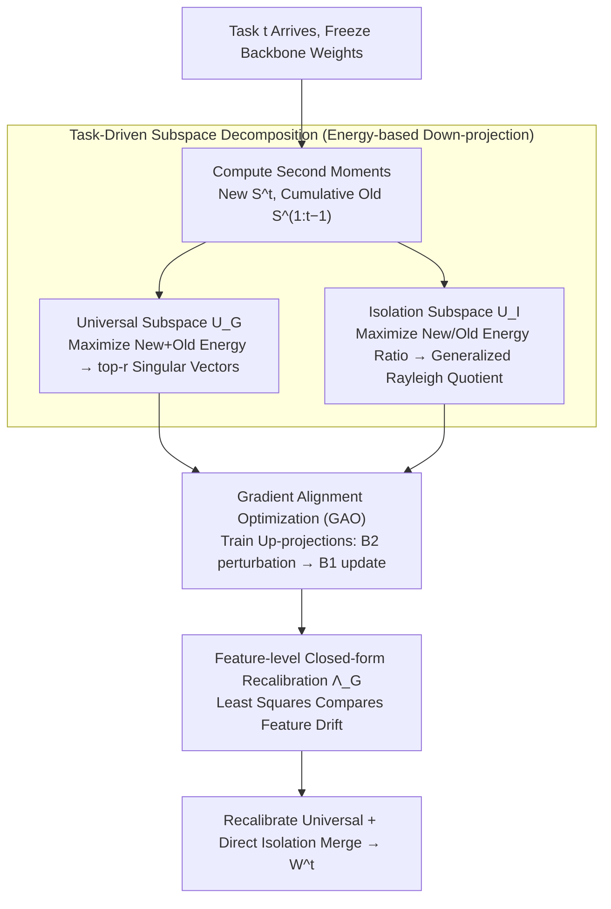

# Task-Driven Subspace Decomposition for Knowledge Sharing and Isolation in LoRA-based Continual Learning

**Conference**: ICML 2026  
**arXiv**: [2603.00191](https://arxiv.org/abs/2603.00191)  
**Code**: None  
**Area**: Model Compression / LoRA / Continual Learning  
**Keywords**: LoRA, Continual Learning, Subspace Decomposition, Projection Energy, Feature-level Recalibration

## TL;DR
LoDA decomposes the LoRA down-projection matrix into a shared universal subspace and a task-specific isolation subspace based on "projection energy." It utilizes gradient alignment optimization (GAO) to train up-projections and applies a closed-form feature recalibration during fusion, consistently outperforming existing LoRA-CL methods across multiple benchmarks.

## Background & Motivation
**Background**: Continual Learning (CL) based on pre-trained ViTs is dominated by Parameter-Efficient Fine-Tuning (PEFT) approaches, including prompt pooling (L2P, DualPrompt, CODAPrompt) and LoRA-based methods (O-LoRA, InfLoRA, Bi-LoRA, PLAN, SD-LoRA). These aim to maintain the "stability-plasticity" balance with minimal trainable parameters.

**Limitations of Prior Work**: Dominant LoRA-CL strategies restrict new task updates to the "null space of prior tasks" to prevent forgetting. This faces two issues: (1) Tasks naturally share directions; strictly using the null space discards transferable information, hurting performance. (2) When task distributions are highly correlated (common in real-world CL), the null space of prior tasks is often inactive for new tasks. Preliminary tests on 10S-ImageNetA show $r^t(\mathbf{U}_{\text{null}})\approx 1.0$, proving null-space directions are inactive for both old and new tasks.

**Key Challenge**: Existing methods treat "isolation" and "transfer" as opposites and rely on a negative space approximation defined by old tasks. This approach simultaneously discards shared knowledge and selects incorrect directions for learning new tasks.

**Goal**: (i) Explicitly preserve cross-task transferable directions to promote knowledge transfer; (ii) Identify isolation directions that exhibit high response for new tasks and low interference for old tasks; (iii) Approximate the global optimum for all tasks during LoRA fusion.

**Key Insight**: From a gradient perspective of LoRA learning, it is proven that the first-order loss reduction when only updating the up-projection $\mathbf{B}$ is determined by the projection energy $E=\|\mathbf{A}\mathbf{X}^\top\|_2^2$. Thus, the down-projection $\mathbf{A}$ acts as an "energy gate" determining which features are updated. This reduces the design of $\mathbf{A}$ to an energy optimization problem.

**Core Idea**: Fix the LoRA down-projection $\mathbf{A}$ as two sets of data-driven orthogonal bases: a "high energy for all tasks" set for the universal branch, and a "maximum new/old energy ratio" set for the isolation branch, combined with gradient alignment and closed-form recalibration.

## Method

### Overall Architecture
LoDA aims to bridge the gap between knowledge sharing and isolation. It attaches a dual-branch LoRA to each ViT layer: a universal branch $(\mathbf{A}_G,\mathbf{B}_G)$ for sharing and an isolation branch $(\mathbf{A}_I,\mathbf{B}_I)$ for task-specific increments. When task $t$ arrives, the backbone $\mathbf{W}^{t-1}$ is frozen. Two energy objectives are solved using the second moment of new data $\mathbf{S}^t$ and cumulative old data $\mathbf{S}^{1:t-1}$ to derive orthogonal bases $\mathbf{U}_G, \mathbf{U}_I$. These are frozen into the down-projections. The up-projections are trained via GAO. After the task concludes, the universal branch is merged into the backbone after closed-form recalibration, while the isolation branch is merged directly.

### Key Designs

**1. Task-Driven Subspace Decomposition: Positive Energy Objectives**

Rather than approximating the null space, LoDA uses a gradient perspective (Theorem 3.1) showing that loss reduction is governed by projection energy $E=\|\mathbf{A}\mathbf{X}^\top\|_2^2$. The universal subspace maximizes $E_{\text{old}} + E_{\text{new}}$, solved via the top-$r$ singular vectors of $(\mathbf{S}^{1:t-1} + \mathbf{S}^t)$. The isolation subspace maximizes the ratio $\mathrm{tr}(\mathbf{U}^\top\mathbf{S}^t\mathbf{U})/\mathrm{tr}(\mathbf{U}^\top\mathbf{S}^{1:t-1}\mathbf{U})$. By applying Cholesky decomposition $\mathbf{S}^{1:t-1} = \mathbf{L}\mathbf{L}^\top$, this is transformed into an SVD of $\tilde{\mathbf{S}}^t = \mathbf{L}^{-1}\mathbf{S}^t\mathbf{L}^{-\top}$. This defines isolation as "high energy for new, low energy for old," ensuring learning efficacy even in correlated task scenarios.

**2. Gradient Alignment Optimization (GAO): Avoiding Fragile Directions**

To prevent feature collapse caused by inter-class gradient conflicts, GAO splits a batch $\mathcal{B}$ into disjoint subsets $\mathcal{B}_1, \mathcal{B}_2$. Each step applies a small random perturbation $\rho \sim U(0,\rho_{\max})$ using the gradient of $\mathcal{B}_2$, then performs the actual update using $\mathcal{B}_1$ on the perturbed parameters. This identifies directions favored by both subsets, suppressing fragile directions susceptible to interference from future tasks.

**3. Feature-level Closed-form Recalibration $\mathbf{\Lambda}_G$: Compensating for Feature Drift**

Merging the universal branch inevitably causes feature drift for old tasks. Unlike prior weight-space merging (CoMA, BECAME) that relies on EMA or Fisher approximations, LoDA formulates feature-level error as a least-squares problem. It derives an exact closed-form solution for a correction matrix $\mathbf{\Lambda}_G$ to minimize drift. The isolation branch, having minimal energy on old tasks, is merged directly. This avoids approximation errors inherent in weight-level merging.

### Loss & Training
The objective is standard cross-entropy. Gradient alignment regularization is implicitly injected through the GAO structure. Key hyperparameters include the subspace rank $r$, universal branch weight $w_G$, and GAO's $\rho_{\max}$. The second moment $\mathbf{S}^{1:t-1}$ is updated incrementally without storing raw data.

## Key Experimental Results

### Main Results
Evaluation on 10-task CL protocols across ImageNetR, ImageNetA, CIFAR100, and CUB benchmarks.

| Dataset | Metric | Ours | Prev. SOTA (CoSO/LoRA-P&M) | Gain |
|---------|--------|-------|---------------------------|------|
| 10S-ImageNetR | $\mathcal{A}_{Last}$ | **81.93** | 81.10 | +0.83 |
| 10S-ImageNetA | $\mathcal{A}_{Last}$ | **62.59** | 56.57 | **+6.02** |
| 10S-CIFAR100 | $\mathcal{A}_{Last}$ | **90.47** | 88.77 | +1.70 |
| 10S-CUB | $\mathcal{A}_{Last}$ | **81.74** | 78.29 | +3.45 |

Under feature replay settings, LoDA+CA achieves 66.71 on 10S-ImageNetA, outperforming MACIL (64.14) by 2.57 points.

### Ablation Study

| Configuration | Key Finding |
|---------------|-------------|
| Full LoDA | Baseline performance. |
| Universal Branch Only | Loss of task isolation leads to catastrophic interference and significant drop. |
| Isolation Branch Only | Lack of knowledge transfer results in underfitting on related tasks. |
| Null-space Approximation | Performance degrades most on ImageNetA, confirming null-space failure in correlated tasks. |
| w/o GAO | Increased inter-class gradient conflict; features collapse more easily as tasks progress. |
| w/o Recalibration | Features of old tasks drift significantly due to the universal branch. |

### Key Findings
- **ImageNetA Gains**: The +6.02 improvement is attributed to high task correlation where null-space methods fail. LoDA's ratio-based isolation excels here.
- **Efficiency**: LoDA without feature replay outperforms SLCA, SSIAT, and VQ-Prompt which use replay, indicating that superior subspace design is more cost-effective than storing features.
- **Scalability**: Performance remains robust when increasing from 10 to 20 tasks (+3.47 gain), suggesting slower degradation over long sequences.

## Highlights & Insights
- **Ratio Maximization**: Defining isolation "positively" (what direction to take) is superior to "negative" null-space definitions (what to avoid), especially when tasks are correlated.
- **Energy-Weighted Linear Structure**: Fixing the down-projection makes the LoRA optimization linear with respect to energy (Theorem 3.1). This framework allows for a rigorous "input space vs. parameter space" analysis of PEFT modules.
- **Feature-level Recalibration**: Solving drift in feature space bypasses the approximation errors of weight merging, offering a useful technique for RLHF and multi-task LoRA fusion.

## Limitations & Future Work
- **Computational Cost**: Each task requires SVD/generalized eigenvalue decomposition ($D \times D$ for $D=768$), which may become substantial. Incremental updates or caching may be required.
- **Rank Sensitivity**: The rank $r$ is uniform across layers; depth-sensitive analysis (varying $r$ for semantic vs. task features) is unexplored.
- **Task Boundaries**: The method assumes clear task boundaries (task-aware); extension to task-free CL is needed.
- **Numerical Stability**: Cholesky decomposition of $\mathbf{S}^{1:t-1}$ assumes full rank, which may be unstable with extremely few samples.

## Related Work & Insights
- **vs. InfLoRA / O-LoRA**: These rely on "null-space" constraints. LoDA uses ratio maximization to fix learning impotence in correlated tasks and recovers shared directions.
- **vs. Bi-LoRA / PLAN**: These use fixed orthogonal bases (e.g., DCT). LoDA uses data-driven spectral decomposition, making it more sensitive to task-specific features.
- **vs. BECAME / CoMA**: These merge in weight space using EMA or Fisher estimates. LoDA merges in feature space with exact solutions, avoiding local linear approximation errors.

## Rating
- **Novelty**: ⭐⭐⭐⭐ Ratio-based energy decomposition for LoRA-CL is theoretically sound and novel.
- **Experimental Thoroughness**: ⭐⭐⭐⭐ Comprehensive evaluation against state-of-the-art baselines.
- **Writing Quality**: ⭐⭐⭐⭐ Clear mathematical derivations and well-justified motivations.
- **Value**: ⭐⭐⭐⭐ A significant upgrade to the LoRA-CL pipeline with techniques transferable to other PEFT domains.

<!-- RELATED:START -->

## Related Papers

- [\[ICML 2026\] Energy-Structured Low-Rank Adaptation for Continual Learning](energy-structured_low-rank_adaptation_for_continual_learning.md)
- [\[AAAI 2026\] Beyond Sharpness: A Flatness Decomposition Framework for Efficient Continual Learning](../../AAAI2026/model_compression/beyond_sharpness_a_flatness_decomposition_framework_for_efficient_continual_lear.md)
- [\[CVPR 2025\] LoRA Subtraction for Drift-Resistant Space in Exemplar-Free Continual Learning](../../CVPR2025/model_compression/lora_subtraction_for_drift-resistant_space_in_exemplar-free_continual_learning.md)
- [\[ACL 2026\] SAMoRA: Semantic-Aware Mixture of LoRA Experts for Task-Adaptive Learning](../../ACL2026/model_compression/samora_semantic-aware_mixture_of_lora_experts_for_task-adaptive_learning.md)
- [\[ICML 2026\] SSR-Merge: Subspace Signal Routing for Training-Free LoRA Merging in Diffusion Models](ssr-merge_subspace_signal_routing_for_training-free_lora_merging_in_diffusion_mo.md)

<!-- RELATED:END -->
