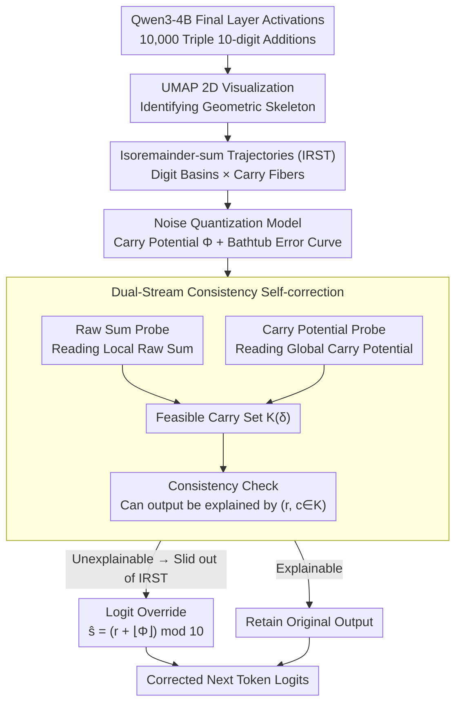

# The Shape of Addition: Geometric Structures of Arithmetic in Large Language Models

**Conference**: ICML 2026  
**arXiv**: [2606.03645](https://arxiv.org/abs/2606.03645)  
**Code**: https://github.com/RL-MIND/Shape-of-Addition  
**Area**: Interpretability / Mechanistic Analysis / LLM Arithmetic  
**Keywords**: Residual stream geometry, isoremainder-sum trajectories, noise quantization model, carry potential, inference-time self-correction  

## TL;DR
The authors discover that activations in the final layer residual stream of Qwen3-4B are organized into a hierarchical manifold of "digit basins × carry fibers" during multi-operand addition. "Off-by-one" errors are reinterpreted as geometric slippage across quantization thresholds of a continuous carry potential along Isoremainder-sum Trajectories (IRST). Based on this, a dual-stream consistency check is proposed to correct off-by-one errors—where the model "internally knows" the truth but outputs the wrong token—during inference.

## Background & Motivation
**Background**: Existing work on explaining LLM arithmetic capabilities generally follows two paths: one models internal states as symbolic lookup tables or discrete addition circuits (e.g., circuit reverse-engineering by Quirke and Nanda on small models), while the other uses linear probes to scan the residual stream, proving that LLM internals indeed encode intermediate variables like ground truth, carry, and raw sum. Both paths have accumulated significant phenomenal evidence.

**Limitations of Prior Work**: Although probes can extract multiple contradictory signals—such as the correct answer, the incorrect output, and the carry—from the activations of a single "failed sample" (termed "probe versatility"), two things remain unexplained: first, why a single vector can host both "correct" and "incorrect" semantics simultaneously; and second, how this internal representation geometry mechanistically induces specific failure modes (notably the common off-by-one carry error in multi-operand addition).

**Key Challenge**: Previous discretization perspectives assume internal states are categorical. However, continuous scalars extracted by probes (e.g., carry potential) suggest the internal states are actually continuous manifolds. The lack of a bridge between discrete outputs and continuous representations is the root cause of LLMs repeatedly being "off by one" in simple arithmetic.

**Goal**: To provide a unified geometric framework at the representation level that explains (i) probe versatility, (ii) off-by-one error distribution, and (iii) the "internal knowledge vs. output failure" observation, and to design a training-free interface for inference-time error correction.

**Key Insight**: The authors select 3-operand 10-digit integer addition—a task that is "sufficiently difficult yet regular." They extract final-layer activations $\boldsymbol{h}_p^{(L)}$ at each generation position $p$ and use UMAP (cosine distance) with logit embeddings as "semantic anchors" to project the high-dimensional manifold into 2D while preserving readable semantic coordinates.

**Core Idea**: The residual stream is viewed as a set of "Isoremainder-sum Trajectory (IRST)" fibers. The position along a fiber is controlled by a continuous "carry potential $\Phi$," and the output digit is the result of noisy quantization of $\Phi$. An error is a geometric slip caused by noise pushing $\Phi$ past an integer quantization threshold.

## Method

### Overall Architecture
The study does not train any new models; instead, it performs a closed-loop analysis of "phenomenon observation → geometric hypothesis → analytical modeling → causal validation" on a fixed Qwen3-4B (36 layers). The authors run 10,000 triple 10-digit addition problems and record the final-layer activation vectors $\boldsymbol h_p^{(L)}$. UMAP is first used for 2D visualization to identify the geometric skeleton. A set of mathematical hypotheses is then proposed to explain why this geometry induces off-by-one errors. Finally, causal validation is performed via probes and logit intervention—if the hypotheses hold, two lightweight probes should be able to correct "internal knowledge vs. output error" failures. Thus, the "Method" comprises geometric hypotheses plus probes to read them; the input is the activation vector, and the output is the corrected next-token logits.

### Key Designs

**1. Isoremainder-sum Trajectories (IRST): Using a two-level geometric structure to accommodate "correctness" and "error" in one vector**

The most counter-intuitive aspect of probe versatility is that correct answers, incorrect outputs, and carries can be read simultaneously from the activation of a failed sample. The authors explain this as follows: the residual stream is not chaotic but organized into a two-level structure of "digit basins anchored by digits 0–9 × parallel fibers distinguished by carry $c_p$." Formally, all activations satisfying $r_p = r$ (same intra-column raw sum) are defined as a continuous manifold $\mathcal{T}_r$, called an Isoremainder-sum Trajectory. From the identity $\hat s_p \equiv (r_p + \hat c_p)\bmod 10$, an IRST does not stay trapped in one digit basin; instead, as $\hat c_p$ increases, it passes through adjacent basins, forming a topology like $(1,1,0,0)\leftrightarrow(2,2,1,1)\leftrightarrow(3,3,2,2)$, where "sliding one unit along the fiber = carry +1." Error samples (red dots in UMAP) almost always fall on sparse transition segments between two stable nodes, which the authors call "geometric slippage." Thus, probe versatility is no longer mysterious: ground truth is read from "which basin the activation falls into," while hallucination is read from "how far it slid along the fiber." Since these two exist in orthogonal directions, they coexist without contradiction.

**2. Noise Quantization Model: Formulating "why errors cluster near integers" as a bathtub curve**

Since errors are caused by sliding across adjacent basins along fibers, the occurrence of slippage needs a quantifiable mechanism rather than being dismissed as random noise. The authors define the carry potential $\Phi_p = \sum_{j\ge 1} r_{p+j}/10^j$, treating all lower-order raw sums to the right as continuous pressure flowing into the current position. The true carry is its floor $c_p = \lfloor \Phi_p \rfloor$. The model internally estimates a noisy version $\hat\Phi_p = \Phi_p + \epsilon,\ \epsilon\sim\mathcal N(0,\sigma^2)$, outputting $\hat c_p = \lfloor\hat\Phi_p\rfloor$. Letting the fractional part be $\delta(\Phi)=\Phi\bmod 1$, the single-step off-by-one error rate is:

$$P(\text{err}\mid\Phi) = Q\!\left(\frac{\delta}{\sigma}\right) + Q\!\left(\frac{1-\delta}{\sigma}\right),$$

which peaks at integer $\Phi$ and flattens at $\Phi\approx i+0.5$, forming a periodic "bathtub" curve. The empirical fit yields $R^2 = 0.80$, implying an effective internal noise of $\sigma\approx 0.05$ for Qwen3-4B. This formula treats every failure as a specific threshold-crossing event—noise only pushes $\Phi$ across the boundary when it is close to an integer—thereby providing a "danger zone" prior for correction: the closer to an integer, the higher the risk.

**3. Dual-Stream Consistency Self-correction: Directly translating geometric hypotheses into inference-time interventions**

If the IRST hypothesis is true, combining "local raw sum + global carry potential" should suffice to recover the correct digit, allowing for correction without retraining or modifying the decoder. The authors attach two probes to the final layer: a classification probe $f_{\theta_r}$ to read the local raw sum $\hat r_p$, and a regression probe $f_{\theta_\phi}$ to read the global carry potential $\hat\Phi_p$. A feasible carry set is defined as $\mathcal K_p(\delta) = \{\lfloor\phi\rfloor : \phi\in[\hat\Phi_p-\delta,\ \hat\Phi_p+\delta]\}$, where $\delta$ is a tolerance corresponding to the "stable zone" in bathtub theory. If the model output $\hat s_p$ cannot be explained by any $(\hat r_p,\ c\in\mathcal K_p(\delta))$ via $\hat s_p\equiv(\hat r_p + c)\bmod 10$, it is determined that the vector has strayed from the correct IRST, and the logits are overridden with $\hat s_{\text{new}} = (\hat r_p + \lfloor\hat\Phi_p\rfloor)\bmod 10$. Because this intervention is built entirely on the IRST hypothesis, the accuracy gain itself serves as causal evidence for the hypothesis, rather than mere correlation.

### Loss & Training
The LLM itself is not trained; the probes are trained on a balanced dataset using logistic regression / MLP / linear regression with standard cross-entropy or MSE. Hyperparameters are not sensitive. All interventions occur only during forward inference, acting on the final layer activations and output logits.

## Key Experimental Results

### Main Results
All figures are from Qwen3-4B, 3-operand 10-digit addition, position $p=4, N=10,000$. Table 1 shows probing accuracy at the final layer, and Table 2 compares dual-stream consistency correction methods.

| Probe Target | Symbol | Accuracy |
|----------|------|------|
| Ground Truth | $s_p$ | 94.85% |
| Model Output | $\hat s_p$ | 98.81% |
| Correctness | $\mathbb{I}(\hat s_p\ne s_p)$ | 82.41% |
| Raw Sum (mod 10) | $r_p\bmod 10$ | 98.60% |
| Input Carry | $c_p$ | 96.84% |
| Carry Potential | $\Phi_p$ | 92.08% (after floor) |

| Method | Token Acc | TP Corr | FP Pres |
|------|-----------|---------|---------|
| Original Model | 86.26% | / | / |
| Re-Prompting | 79.90% | 0.08% | 99.98% |
| Linear Steering | 88.27% | 30.58% | 96.97% |
| Hard Replacement | 89.13% | 31.73% | 97.65% |
| Ours ($\delta=0$) | 87.27% | 44.39% | 94.07% |
| Ours ($\delta=0.1$) | **89.56%** | 30.46% | 98.13% |

### Ablation Study
Table 3 decouples the contributions of the "raw sum probe" and the "carry probe" in the dual-stream setup.

| Configuration | Token Acc | TP Corr | FP Pres |
|------|-----------|---------|---------|
| R + C (Both are probes) | 86.7% | 42.3% | 93.9% |
| R + TC (Probe raw sum + True carry) | 96.0% | 69.3% | 99.0% |
| TR + C (True raw sum + Probe carry) | 90.5% | 65.4% | 94.6% |

### Key Findings
- The bathtub error rate formula fits with $R^2=0.80$, implying $\sigma\approx 0.05$. Internal noise is significantly less than 1; thus, thresholds are crossed only when $\Phi$ is near an integer, quantitatively validating the geometric slippage hypothesis.
- R+TC reaches 96.0%, while TR+C only reaches 90.5%, indicating that the internal representation of raw sum is nearly perfect, while the bottleneck is noise in the carry potential. Models do not "fail to calculate"; they "fail to decide whether to carry."
- The correctness probe achieves only 82.41% because IRST is a continuous manifold with no hard boundaries—explaining why traditional "detect then fix" two-stage approaches often fail.
- Causal steering experiments (injecting perturbations along $\vec v_{\text{steer}} = (\boldsymbol\mu_b-\boldsymbol\mu_a)/\lVert\cdot\rVert$) show that states near basin boundaries flip at $|\alpha|\approx 0.1$–$0.3$, while stable centers require $|\alpha|\approx 0.5$. This sigmoid-shaped phase transition further confirms the existence of a "continuous carry direction."

## Highlights & Insights
- Clarifies the "mysterious" phenomenon of probe versatility: correct and incorrect signals in the same activation are not contradictory but live on orthogonal geometric coordinates (basins vs. fiber offsets). This perspective of "decomposing semantics via geometry" can be applied to other tasks with discrete outputs but continuous intermediate representations, such as LLM counting or tokenized time-series prediction.
- The bathtub error formula $P(\text{err}\mid\Phi)=Q(\delta/\sigma)+Q((1-\delta)/\sigma)$ transforms error rates from empirical observations into fittable physical quantities. The inferred internal noise $\sigma$ provides, for the first time, a comparable metric for LLM arithmetic precision—future model comparisons can look at $\sigma$ rather than just accuracy.
- Test-time correction requires no gradient updates or fine-tuning, using only two linear probes with almost zero cost to throughput and memory. This "probe-as-interface" idea is equally promising for alignment and safety scenarios, such as replacing hallucination detectors with "probes + consistency voting."

## Limitations & Future Work
- Experiments were conducted solely on Qwen3-4B and limited to 3-operand 10-digit addition. Whether geometric structures persist in larger models, more operands, floating-point addition, or multiplication remain open questions.
- The IRST framework essentially provides a geometric naming of phenomena observed in the final layer; it does not explain *how* the model calculates $\Phi$—the carry accumulation mechanism in earlier layers remains a black box.
- Although dual-stream consistency correction pushes accuracy to 89.56%, there is a significant trade-off between TP Corr and FP Pres (higher TP but more mis-overrides at $\delta=0$). Automating $\delta$ to adapt to query difficulty (e.g., based on the distance of $\hat\Phi$ to an integer) is a direct path for improvement.
- The assumption $\hat r_p\approx r_p$ (nearly perfect local raw sum) holds for simple addition but may not hold for symbolic reasoning or code generation, where the dual-stream framework might need to be extended to "multi-stream."

## Related Work & Insights
- **vs. Nanda et al. (2023) Circular Manifolds in Modular Addition**: While they found modular addition follows rotational representations in toy transformers, this work extends the idea to multi-digit addition in large models, proving that "continuous phase" exists as carry potential and providing a geometric explanation for discrete output failures.
- **vs. Kantamneni & Tegmark (2025) Spiral/Trigonometric Coding Hypotheses**: They assume high-dimensional spirals; this work further "slices" the spiral into IRST fibers and digit basins, providing a local structure closer to actual failure modes.
- **vs. Sun et al. (2025) / Su et al. (2024) Ground-truth Probes**: They proved truth can be read from failed samples; this work provides a geometric explanation for *why* it can be read and turns this capability into a usable inference-time correction interface.
- **vs. Quirke et al. (2025) Symbolic Circuit Reverse-Engineering**: While they try to explain arithmetic as discrete lookup tables, this work argues for internal continuous potentials + quantization; both might coexist at different scales or for different tasks.

<!-- RELATED:START -->

## Related Papers

- [\[ICML 2026\] Model Merging Scaling Laws in Large Language Models](model_merging_scaling_laws_in_large_language_models.md)
- [\[ICML 2026\] NanoQuant: Efficient Sub-1-Bit Quantization of Large Language Models](nanoquant_efficient_sub-1-bit_quantization_of_large_language_models.md)
- [\[ICML 2026\] Beyond Temperature: Hyperfitting as a Late-Stage Geometric Expansion](beyond_temperature_hyperfitting_as_a_late-stage_geometric_expansion.md)
- [\[ACL 2026\] LightReasoner: Can Small Language Models Teach Large Language Models Reasoning?](../../ACL2026/model_compression/lightreasoner_can_small_language_models_teach_large_language_models_reasoning.md)
- [\[ICML 2026\] Bounded Hyperbolic Tangent: A Stable and Efficient Alternative to Pre-Layer Normalization in Large Language Models](bounded_hyperbolic_tangent_a_stable_and_efficient_alternative_to_pre-layer_norma.md)

<!-- RELATED:END -->
