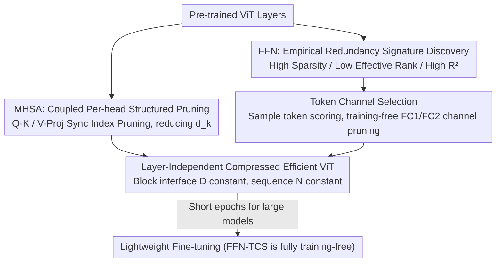

# ToaSt: Token Channel Selection and Structured Pruning for Efficient ViT

**Conference**: ICML 2026  
**arXiv**: [2602.15720](https://arxiv.org/abs/2602.15720)  
**Code**: https://github.com/SHANNonLab-HUFS/ToaSt  
**Area**: Model Compression / Efficient ViT  
**Keywords**: ViT compression, structured pruning, channel selection, training-free, layer-independent compression

## TL;DR
ToaSt "decouples" ViT compression into two targeted strategies: for Multi-Head Self-Attention (MHSA), which accounts for less than 40% of FLOPs, it employs coupled per-head structured weight pruning to preserve the mathematical integrity of attention; for the Feed-Forward Network (FFN), which accounts for over 60% of FLOPs, it uses a training-free, plug-and-play "Token Channel Selection (TCS)" during inference to filter redundant noisy channels. This achieves a superior accuracy–efficiency trade-off across nine ViT models, such as 88.52% Top-1 (+1.64%p) on ViT-MAE-Huge while reducing FLOPs by 39.4%.

## Background & Motivation
**Background**: ViT has flourished in classification, detection, and segmentation by capturing global dependencies via self-attention and has become a foundation for multimodal tasks. However, its computational cost is significantly higher than CNNs of similar accuracy, making deployment on mobile or edge devices challenging. Mainstream ViT compression follows two paths: structured weight pruning (removing channels/heads/blocks) and token compression (reducing sequence length $N$).

**Limitations of Prior Work**: Both paths have significant drawbacks. Structured pruning relies on magnitude/gradient criteria to remove structures, but drastically cutting entire structural blocks often leads to significant accuracy drops, necessitating **expensive full-model retraining**, which is almost unbearable for large foundation models. Furthermore, it does not specifically target the actual computational bottleneck of ViT. Token compression directly reduces sequence length $N$, targeting the quadratic complexity $\mathcal{O}(N^2)$ of attention, but it only operates in the sequence dimension—FFN computation only decreases linearly with $N$, while the **dominant hidden dimension $\mathcal{O}(D^2)$ complexity remains untouched**. Worse, token-level decisions propagate to subsequent layers, creating cross-layer dependencies that complicate the optimization landscape.

**Key Challenge**: FFN is the primary FLOPs bottleneck (approx. 61% in standard ViT, MHSA < 40%), yet mainstream methods either require retraining or only reduce the sequence dimension, failing to efficiently eliminate FFN channel redundancy without training. Simultaneously, the cross-layer propagation of token compression makes layer-independent optimization difficult.

**Goal + Key Insight**: The authors advocate for a **Layer-Independent Compression** philosophy—compressing each layer independently without allowing effects to diffuse across layers, while applying the most suitable strategy to ViT’s two distinct components. The key observation is that MHSA consists of coupled linear transformations where incorrect pruning leads to collapse, whereas FFN in deep layers exhibits a redundancy "signature" characterized by high sparsity, low effective rank, and high linear reconstruction fidelity, allowing for training-free channel selection.

**Core Idea**: Decoupling—MHSA uses coupled per-head structured pruning (modifying internal head dimension $d_k$ without changing block interface $D$), and FFN uses training-free, layer-adaptive Token Channel Selection (TCS) to directly reduce $D^2$. Both modify only the channel dimension and preserve the token sequence, thereby cutting cross-layer dependencies and simplifying the optimization landscape.

## Method

### Overall Architecture
The input is a pre-trained ViT, and the output is an efficient ViT compressed layer-independently. ToaSt consists of two decoupled stages: (1) **MHSA Compression**—for each head, the four weight matrices (Q/K/V/Proj) are pruned synchronously at the same internal dimension indices based on coupled constraints. Geometric Median (GM) scores are used to identify the most redundant dimensions, and a uniform pruning rate is applied per head (skipping the first layer, approx. 90% for others) to reduce internal head dimension $d_k$ while keeping the external embedding dimension $D$ unchanged. (2) **FFN Compression**—following an empirical analysis of deep FFN redundancy signatures, training-free TCS is applied: channel importance is calculated based on a small number of sampled tokens, and low-importance channels are cut independently for FC1 and FC2, forming dense sub-matrices for efficient GEMM. Since both stages only modify the channel dimension and preserve $D$, compression effects do not propagate across layers.

### Key Designs

**1. MHSA Coupled Per-head Structured Pruning: Preserving Mathematical Integrity via Synchronized Indexing**

Attention involves coupled linear transformations: $\mathbf{Q}^h=\mathbf{X}\mathbf{W}_Q^h$, $\mathbf{K}^h=\mathbf{X}\mathbf{W}_K^h$, $\mathbf{A}^h=\mathrm{softmax}(\mathbf{Q}^h(\mathbf{K}^h)^\top/\sqrt{d_k})$, and $\mathbf{O}^h=\mathbf{A}^h(\mathbf{X}\mathbf{W}_V^h)\mathbf{W}_{\text{proj}}^h$. Pruning indices independently for Q, K, V, and Proj breaks the alignment of dot products and output projections, leading to catastrophic collapse (see "Non-Align" in Fig. 3). ToaSt therefore prunes the **internal head dimension $d_k$** instead of global $D$ (ensuring compatibility with residuals and preserving downstream feature landscapes) and enforces two synchronization constraints: pruning the $j$-th column of $\mathbf{W}_Q^h$ requires pruning the $j$-th column of $\mathbf{W}_K^h$ (dot product alignment), and pruning the $j$-th column of $\mathbf{W}_V^h$ requires removing the $j$-th row of $\mathbf{W}_{\text{proj}}^h$ (output projection alignment). Importance is statically scored via **Geometric Median (GM)**: dimensions closest to the center of the weight distribution are most redundant (most easily approximated by other dimensions). For coupled pairs $\mathbf{W}_{QK}^h$ and $\mathbf{W}_{VO}^h$, importance is calculated as $I^h[j]=\|\mathbf{w}_j^h-\mathrm{GM}(\cdot)\|_2$. A **uniform per-head** strategy ensures all heads are pruned to the same $d_k'$, enabling batched GEMM without padding; following a schedule that skips the first layer and prunes ~90% of others, MHSA FLOPs are reduced by approximately 90%.

**2. Empirical Characterization of FFN Redundancy Signatures: Pruning as Denoising**

The validity of TCS is built on empirical analysis of FFN activations in pre-trained ViTs (e.g., Swin-Base). Four metrics characterize deep redundancy: ① **High Linear Reconstruction Fidelity $R^2$**—reconstructing a channel via least squares using other channels in the same layer yields $R^2=1-\frac{\sum_i(y_i-\hat y_i)^2}{\sum_i(y_i-\bar y)^2} > 0.9$ in most layers, indicating high linear correlation and that global importance can be estimated from a small subset. ② **Effective Rank Collapse**—using a PCA-based effective rank ratio (percentage of singular values needed to cover 90% variance), deep layers show significant collapse, proving hidden redundancy in the $4D$ expansion. ③ **Rising Sparsity**—the proportion of "dead neurons" ($|x_c|<0.1\cdot\overline{|x|}$) increases significantly in deep layers, driven by GELU. ④ **Channel SNR gap**—in FC2-pruned blocks, the signal-to-noise ratio of retained channels is $3$–$5.5\times$ higher than pruned ones, proving that removed channels are noise-dominant. This explains why TCS often improves accuracy—it acts as an **implicit noise filter**.

**3. Token Channel Selection (TCS): Training-free, Sampled, and Adaptive FFN Pruning**

Based on the signatures above, TCS compresses FFN in three training-free steps. **Sampling Importance Estimation**: Calculating importance usually requires aggregating magnitudes across all $N$ tokens, costing $O(N\cdot C)$. Since $R^2\approx1$ ensures strong correlation, randomly sampling a $2\%$–$20\%$ subset $\mathcal{S}$ of tokens is sufficient to estimate the distribution, reducing overhead. **Importance Scoring** (Architecture-dependent): For CLS-distilled models (e.g., DeiT), $I_c=\lambda_{cls}|x_{cls}^{(c)}|+\lambda_{patch}\frac{1}{|\mathcal{S}|}\sum_{i\in\mathcal{S}}(A_{cls,i}\cdot|x_i^{(c)}|)$, with $\lambda_{cls}=2.0, \lambda_{patch}=1.0$ prioritizing channels encoding global semantics. For models without CLS signals (ViT-MAE, Swin), this degrades to magnitude selection $I_c=\frac{1}{|\mathcal{S}|}\sum_{i\in\mathcal{S}}|x_i^{(c)}|$. **Hardware-friendly Structured Pruning + Adaptive Layer Strategy**: Entire columns are cut along the input dimension for FC1/FC2, forming dense sub-matrices for GPU GEMM without sparse libraries. Scheduling is conservative for FC1 (where rank is higher) and aggressive for FC2 (up to 90% in late layers), converting "rank collapse" directly into computational savings.

### Loss & Training
TCS for FFN is entirely training-free and plug-and-play during inference. MHSA structured pruning is followed by lightweight fine-tuning to recover accuracy. Notably, recovery costs for large models are lower: ViT-MAE-Huge requires only ~15 epochs (~15 hours on 4×H100) to exceed the baseline, whereas DeiT-Small requires 290 epochs. This is significantly less than the 300 epochs of full retraining typically required by traditional pruning.

## Key Experimental Results

### Main Results
Evaluated on ImageNet-1K, measuring throughput with batch size 128 on H100, compared against token compression SOTAs (ToMe, DiffRate). ToaSt generally dominates in accuracy, FLOPs reduction, and throughput, with larger models benefiting more.

| Model | Method | Top-1 (%) | FLOPs↓ (%) | Speedup |
|------|------|------|------|------|
| DeiT-Tiny | Baseline | 72.20 | – | 1.00× |
| DeiT-Tiny | ToMe | 71.25 | 46.2 | 1.19× |
| DeiT-Tiny | **ToaSt** | **74.25** | 41.5 | **2.03×** |
| DeiT-Small | **ToaSt** | **83.40** | 45.7 | **2.07×** |
| ViT-MAE-Large | Baseline | 85.96 | – | 1.00× |
| ViT-MAE-Large | DiffRate | 85.66 | 31.3 | 1.36× |
| ViT-MAE-Large | **ToaSt** | **88.94** | 37.5 | 1.51× |
| ViT-MAE-Huge | Baseline | 86.88 | – | 1.00× |
| ViT-MAE-Huge | **ToaSt** | **88.52 (+1.64%p)** | 39.4 | 1.51× |

Notably, ToaSt often **increases** accuracy on large models (DeiT-Tiny +2.05, ViT-MAE-Large +2.98%p), confirming the implicit denoising effect of TCS.

### Ablation Study

| Configuration | Effect | Description |
|------|------|------|
| Coupled Sync Pruning (Align) | Stable at high ratios | Removing sync (Non-Align) → Catastrophic collapse at high ratios (Fig. 3) |
| GM Importance Criterion | Superior to $L_1$/$L_2$ | Geometric Median better identifies replaceable dimensions (App. C) |
| TCS Attention Weighting | +2.2 to +8.0%p for CLS | Neutral for MAE/Swin, hence architecture-specific formulas |
| 2–20% Sampling Rate | Negligible accuracy loss | $R^2\approx1$ ensures small subsets accurately estimate global importance |

### Key Findings
- Synchronization is the lifeline of MHSA pruning: without it, high pruning rates lead to failure; with coupling, functional integrity is preserved even under aggressive pruning.
- Larger models are easier to compress: ViT-MAE-Huge recovers and exceeds baseline in just 15 epochs, whereas DeiT-Small takes 290. Large model FFNs have higher redundancy.
- TCS is "Compression + Denoising": pruned channels have $3$–$5.5\times$ lower SNR; removing them improves precision.
- Downstream transfer is effective: COCO detection 52.2 vs 51.9 mAP (Cascade R-CNN, Swin-Base), with similar results in ADE20K and CIFAR-100.

## Highlights & Insights
- Accurate "Decoupling": Splitting ViT into the sensitive MHSA (coupled, prone to collapse) and the redundant FFN (training-free channel selection possible) is more structurally aligned than uniform pruning.
- By modifying only the channel dimension, preserving the token sequence, and maintaining the block interface $D$, ToaSt cuts cross-layer dependencies. This layer-independent compression is the key engineering insight for avoiding retraining.
- Reinterpreting "Pruning" as "Noise Filtering": Empirical SNR gaps prove that pruned channels are noise, ensuring compression and accuracy gains are no longer contradictory.

## Limitations & Future Work
- TCS training-free properties depend on the "high $R^2$, low effective rank" signature; whether this holds for ViT variants with different training paradigms or less sparse activations remains to be verified.
- Importance scoring requires architecture-specific formulas (CLS vs. non-CLS) and hyperparameters ($\lambda_{cls}, \lambda_{patch}$), which may need tuning for new architectures.
- MHSA still requires lightweight fine-tuning; it is not entirely training-free. The uniform per-head pruning rate is a coarse global schedule without fine-grained per-layer search.
- Evaluation is primarily on classification and some detection/segmentation; assessment for generative/multimodal ViTs and extreme compression ratios is missing.

## Related Work & Insights
- **vs. Token Compression (ToMe / DiffRate / PiToMe)**: These target $\mathcal{O}(N^2)$ but ignore the dominant $D^2$ in FFN. ToaSt is orthogonal and can be combined with sequence reduction.
- **vs. Traditional Structured Pruning (Yu 2022 / DepGraph)**: Traditional methods require expensive full-model retraining after removing structures; ToaSt uses activation statistics and GM for structural removal, making it friendlier to large foundation models.
- **vs. Joint/Hybrid Methods (Pruning+Token / Pruning+Quantization)**: Joint pruning often involves complex coupled optimization. ToaSt simplifies the landscape by decoupling components and focusing on channel dimensions.

## Rating
- Novelty: ⭐⭐⭐⭐ "Decoupling + Layer-Independent + Training-Free FFN Selection" is a fresh combination.
- Experimental Thoroughness: ⭐⭐⭐⭐⭐ Nine models + downstream tasks + extensive ablations.
- Writing Quality: ⭐⭐⭐⭐ Solid characterization of redundancy signatures, though dual scoring formulas add minor complexity.
- Value: ⭐⭐⭐⭐⭐ Accuracy gains on large models without retraining, significant FLOPs savings, high deployment relevance.

<!-- RELATED:START -->

## Related Papers

- [\[ICML 2026\] Token Sparse Attention: Efficient Long-Context Inference with Interleaved Token Selection](token_sparse_attention_efficient_long-context_inference_with_interleaved_token_s.md)
- [\[ACL 2026\] Adaptive Layer Selection for Layer-Wise Token Pruning in LLM Inference](../../ACL2026/model_compression/adaptive_layer_selection_for_layer-wise_token_pruning_in_llm_inference.md)
- [\[ICML 2025\] OrthoRank: Token Selection via Sink Token Orthogonality for Efficient LLM Inference](../../ICML2025/model_compression/orthorank_token_selection_via_sink_token_orthogonality_for_efficient_llm_inferen.md)
- [\[ACL 2026\] Two-Stage Regularization-Based Structured Pruning for LLMs](../../ACL2026/model_compression/two-stage_regularization-based_structured_pruning_for_llms.md)
- [\[NeurIPS 2025\] Recurrent Attention-based Token Selection for Efficient Streaming Video-LLMs](../../NeurIPS2025/model_compression/recurrent_attention-based_token_selection_for_efficient_streaming_video-llms.md)

<!-- RELATED:END -->
