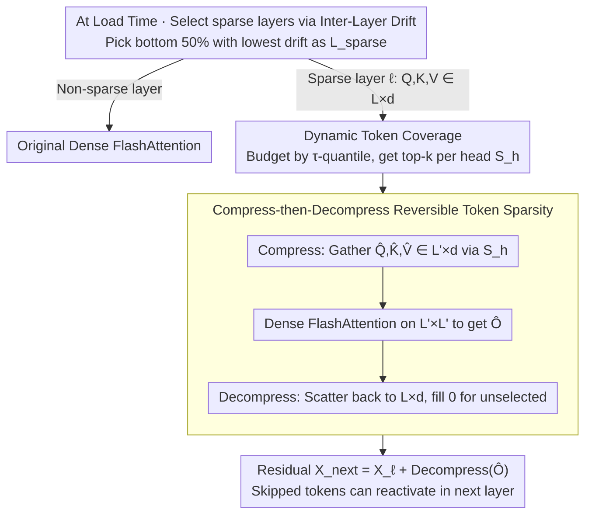

# Token Sparse Attention: Efficient Long-Context Inference with Interleaved Token Selection

**Conference**: ICML 2026  
**arXiv**: [2602.03216](https://arxiv.org/abs/2602.03216)  
**Code**: https://github.com/dongwonjo/Token-Sparse-Attention  
**Area**: Model Compression / Long-context Inference Acceleration  
**Keywords**: Sparse Attention, prefill acceleration, reversible token selection, FlashAttention compatible, dynamic sparsity

## TL;DR
The authors observe that token "importance" fluctuates drastically across layers and heads, making traditional one-time token eviction an irreversible early-stage error. They propose Token Sparse Attention, where each attention head in each layer independently selects $L' \ll L$ tokens for dense attention. The output is then scattered back to the original sequence length, combined with a residual path that allows skipped tokens to be re-selected in subsequent layers. This preserves head/layer-level dynamics while remaining compatible with dense kernels like FlashAttention. On 128K context, it reaches ×3.23 attention speedup when combined with FlexPrefill, with accuracy loss <1%.

## Background & Motivation
**Background**: As LLM context windows reach 100K+, the $O(L^2)$ complexity of attention becomes the primary bottleneck. Two acceleration paths exist: (i) sparse attention (e.g., Minference, FlexPrefill), which uses block-level patterns to skip low-importance regions; (ii) token eviction (PyramidInfer, FastKV, GemFilter), which selects top-k tokens in early layers and computes only those in deeper layers.

**Limitations of Prior Work**: Sparse attention is block-level; if low-relevance tokens are mixed within a block, they are still computed, limiting the sparsity ceiling. Token eviction makes hard decisions in early layers about token importance; once a token is evicted, it cannot be recovered even if it becomes important in deeper layers—violating the true dynamic nature of token importance.

**Key Challenge**: Empirical tests on LLaMA-3.1-8B-Instruct reveal: (i) the overlap rate of top-1% tokens between layers drops rapidly as layer distance increases, showing importance drift; (ii) top token rankings vary significantly across different heads within the same layer, as heads attend to different semantics. Eviction using a "one-size-fits-all" token set ignores both layer and head dynamics.

**Goal**: (i) Design a token-level sparsity mechanism that allows independent selection per head/layer while remaining reversible; (ii) Ensure compatibility with optimized dense kernels like FlashAttention without requiring new CUDA kernels; (iii) Ensure orthogonality with existing block-level sparse attention mechanisms.

**Key Insight**: Instead of performing sparsity on the attention map (limited by block boundaries) or performing eviction on KV cache (irreversible), the authors propose **reversible compression-decompression** of $Q, K, V$. Tokens are gathered into a short sequence for dense attention, and the output is scattered back to the original length and added to the residual. The residual path allows information from "unselected tokens" to flow from the previous layer to the next, equivalent to providing a recovery channel.

**Core Idea**: Use "compress-then-decompress + residual" to transform token-level sparsification into a reversible operation, allowing every layer and head to re-decide importance.

## Method

### Overall Architecture
Token Sparse Attention aims to follow the attention dynamics of individual layers/heads while ensuring skipped tokens are not permanently lost and maintaining compatibility with dense kernels. In selected sparse layers, it follows a three-step "Compress—Dense Attention—Decompress" process: First, Dynamic Token Coverage estimates a token set $S_h$ of size $L'$ for each head $h$. Tokens are gathered from $Q,K,V \in \mathbb R^{L\times d}$ according to $S_h$ to form $\hat Q,\hat K,\hat V \in \mathbb R^{L'\times d}$. FlashAttention computes dense attention in the $L'\times L'$ compressed space to obtain $\hat O$. Finally, $\hat O$ is scattered back to a zero-initialized $\mathbb R^{L\times d}$ (unselected positions remain 0) and added to the residual. Complexity is reduced from $O(L^2 d)$ to $O(L'^2 d)$. Sparse layers are pre-selected at load time via Inter-Layer Representation Drift (defaulting to the bottom 50% of layers with the least drift), making the process training-free.

### Key Designs

**1. Compress-then-Decompress: Replacing "Token Eviction" with "Temporary Exclusion"**

Traditional token eviction treats $L\to L'$ as an irreversible KV deletion. If an evicted token becomes important in deeper layers, it cannot return—violating the observed "inter-layer importance drift." This method changes the structure: Stage 1 independently selects $S_h$ for each head $h$, gathers $\hat Q_h, \hat K_h, \hat V_h$, and computes $\hat O_h$ directly in the compressed $\mathbb R^{L'\times L'}$ space. Stage 2 scatters $\hat O_h$ back to the corresponding rows of $\mathbb R^{L\times d}$ (unselected rows are 0, equivalent to a hard mask), followed by the residual $X_{\ell+1} = X_\ell + \text{Decompress}(\hat O_h)$. The residual is key: representation of skipped tokens flows directly to the next layer, which can re-select them if they become important. No tokens are physically deleted, preserving dynamic importance. Additionally, compressed $\hat Q\hat K\hat V$ are dense and contiguous, compatible with any dense attention kernel (FlashAttention, FlexPrefill, etc.) without custom CUDA code.

**2. Dynamic Token Coverage: Adaptive Budgeting via "Attention Noise Tail"**

Fixed retention ratios fail across different context lengths or tasks due to varying information density; a 30% ratio might be wasteful for long contexts but excessive for short ones. This design uses data-adaptive budgeting: for each head, a lightweight attention $\hat A$ is computed using recent queries against all keys. Column-wise sums are pooled to get head-level token scores $s_h[t]$, which are aggregated into layer-level scores $s_l$. By sorting $s_l$ ascendingly, the minimum $k_{\text{sparse}}$ is found such that the cumulative weight $\sum_{j=1}^{k_{\text{sparse}}} s_l[I[j]] \ge \tau$ (default $\tau=0.005$). In other words, the least important tokens whose total attention weight is below $\tau$ are discarded, keeping $k_{\text{keep}} = L - k_{\text{sparse}}$ tokens. Each head then takes its own top-$k_{\text{keep}}$ subset $S_h$. Sparsity scales naturally with context—longer contexts with more attention noise result in higher sparsity (e.g., 54% at 128K vs 17% at 4K). Scoring is implemented with a Triton fused kernel for negligible overhead.

**3. Inter-Layer Representation Drift: Data-Driven Sparse Layer Selection**

Not all layers tolerate sparsity; applying it to unstable layers accumulates error. A simple yet effective prior is defined for selection: the normalized representation drift $R_\ell = \mathbb E_t[\|h_{\ell+1,t} - h_{\ell,t}\|_2 / (\|h_{\ell,t}\|_2 + \epsilon)]$. Small drift indicates stable token representations that can withstand sparsification. $R_\ell$ is calculated on calibration data, and the sparse set is $\mathcal L_{\text{sparse}} = \{\ell \mid \hat R_\ell \le \delta\}$ (default $\delta=0.5$, selecting the 50% most stable layers). Experiments on 200 random 3-layer combinations show that average drift correlates strongly with accuracy. This step transforms "which layers to sparsify" from a hyperparameter into a data-driven preprocessing step during model loading.

### Loss & Training
The method is entirely training-free at inference. It requires a one-time calibration during model loading to identify $\mathcal L_{\text{sparse}}$. Hyperparameter $\tau$: 0.005 for LLaMA-3.1-8B, 0.008 for Mistral-Nemo-12B. Token scoring utilizes a Triton fused kernel, and attention uses unmodified FlashAttention.

## Key Experimental Results

### Main Results
Average accuracy on the RULER benchmark with baselines and speedup at 128K (LLaMA-3.1-8B-Instruct):

| Method | 4K | 32K | 128K | Avg. | 128K Speedup |
|---|---|---|---|---|---|
| FlashAttention | 95.82 | 84.87 | 74.15 | 87.01 | ×1.00 |
| + Token Sparse | 96.06 | 84.81 | 73.68 | 87.02 | ×1.36 |
| Minference | 93.46 | 85.34 | 73.63 | 86.49 | ×1.12 |
| + Token Sparse | 93.05 | 85.10 | 72.18 | 86.05 | ×1.38 |
| FlexPrefill | 95.48 | 87.20 | 73.75 | 87.27 | ×2.44 |
| + Token Sparse | 95.33 | 87.68 | 73.58 | 87.27 | **×2.76** |

Comparison with token eviction methods at similar speedup ratios (128K, LLaMA-3.1-8B):

| Method | Avg. Acc | Speedup |
|---|---|---|
| FlashAttention | 87.01 | ×1.00 |
| PyramidInfer | 78.49 | ×1.49 |
| GemFilter | 85.12 | ×1.53 |
| FastKV | 85.64 | ×1.50 |
| **Token Sparse Attention** | **86.84** | ×1.51 |

### Ablation Study

| Configuration | Key Findings |
|---|---|
| Dynamic $\tau=0.005$ vs Fixed $s=0.3$ | 87.02 vs 86.91 at same speedup | Dynamic budget outperforms fixed ratio |
| Dynamic $\tau=0.010$ vs Fixed $s=0.5$ | 86.84 vs 85.43 at high sparsity | Dynamic advantage grows with higher sparsity |
| Speedup Decomposition (128K) | Total overhead <11% | Lightweight implementation |
| Sparsity vs Context Length | 17% @ 4K, 54% @ 128K | Long contexts naturally contain more discardable tokens |

### Key Findings
- **Addition to FlashAttention**: Accuracy remains nearly unchanged (87.01 → 87.02) while providing an independent ×1.36 speedup.
- **Synergy with Block-level Sparsity**: The combination with FlexPrefill (×2.44 → ×2.76) demonstrates that token-level and block-level sparsity are complementary.
- **Superiority over Eviction**: TSA beats all token eviction methods at comparable speedups, with a significant margin in short contexts (where PyramidInfer drops 17 points vs FlashAttention).

## Highlights & Insights
- **Compress-then-Decompress is an elegant "pseudo-sparse" mechanism**: It computes a dense $L'\times L'$ attention and maps it back, but the residual path preserves unselected tokens. This "logical sparsity + physical density" design could be extended to MoE or sparse expert routing.
- **Zero New Kernels is a Major Engineering Advantage**: By leveraging FlashAttention/FlexPrefill kernels, it offers zero-barrier deployment. Compared to eviction methods that modify KV cache structures, the deployment cost is significantly lower.
- **Drift-based Layer Selection as a Powerful Prior**: Converting "layer-wise sparsity" into a data-driven decision avoids manual hyperparameter tuning and could be generalized to other layer-compression tasks like pruning.

## Limitations & Future Work
- Dependency on recent queries for token scoring is a heuristic; if the model uses sliding window or chunked attention, the statistical significance of recent queries might be compromised.
- While unselected tokens are preserved via residuals, the cross-attention contribution between selected and unselected tokens is lost in the scattered 0 rows; the paper does not quantify this specific loss.
- Varying $L'$ across heads/layers in a batch may break tensor regularity, potentially affecting efficiency in multi-sample batches (though FlashAttention supports ragged tensors).
- Evaluated only on prefill; not directly suitable for decoding where the bottleneck is KV cache loading rather than computation.
- Future improvements: Making drift-based selection adaptive per prompt, replacing scoring with a learnable router, or combining with KV cache quantization.

## Related Work & Insights
- **vs Minference / FlexPrefill (Block-level Sparsity)**: These methods skip blocks in the attention map but are limited by block boundaries; TSA operates at the token level and provides an additional ×1.13 speedup to FlexPrefill.
- **vs PyramidInfer / FastKV / GemFilter (Token Eviction)**: These make hard, irreversible decisions in early layers; TSA allows re-selection in every layer, providing 1-8 points higher accuracy at similar speedups.
- **vs FlashAttention**: FlashAttention optimizes I/O for dense attention but remains $O(L^2)$. TSA introduces algorithmic sparsity to reduce this to $O(L'^2)$ while reusing the optimized kernels.
- **vs KV Cache Quantization (KIVI/H2O)**: Quantization reduces memory bandwidth overhead, while TSA reduces computation overhead; the two are orthogonal and can be used together.

## Rating
- Novelty: ⭐⭐⭐⭐ The reversible Compress-then-Decompress design and head-specific selection are simple yet effective; drift-based selection is a clean engineering contribution.
- Experimental Thoroughness: ⭐⭐⭐⭐ Covers 2 models, 4 baselines, varying lengths, and multiple benchmarks (RULER/InfiniteBench), including iso-speedup comparisons with eviction methods.
- Writing Quality: ⭐⭐⭐⭐ Clear logical flow from empirical observations of "importance drift" to method design; the workflow diagram is well-illustrated.
- Value: ⭐⭐⭐⭐ Directly applicable to industrial deployment for long-context LLM services; orthogonality with existing sparse methods is a key selling point.

<!-- RELATED:START -->

## Related Papers

- [\[ICML 2025\] OrthoRank: Token Selection via Sink Token Orthogonality for Efficient LLM Inference](../../ICML2025/model_compression/orthorank_token_selection_via_sink_token_orthogonality_for_efficient_llm_inferen.md)
- [\[NeurIPS 2025\] Recurrent Attention-based Token Selection for Efficient Streaming Video-LLMs](../../NeurIPS2025/model_compression/recurrent_attention-based_token_selection_for_efficient_streaming_video-llms.md)
- [\[ICML 2026\] T3S: 训练轨迹感知的 token 选择，破解推理蒸馏的「Imitation Shock」](training-trajectory-aware_token_selection.md)
- [\[ACL 2026\] Adaptive Layer Selection for Layer-Wise Token Pruning in LLM Inference](../../ACL2026/model_compression/adaptive_layer_selection_for_layer-wise_token_pruning_in_llm_inference.md)
- [\[ICML 2026\] Provably Learning Attention with Queries](provably_learning_attention_with_queries.md)

<!-- RELATED:END -->
