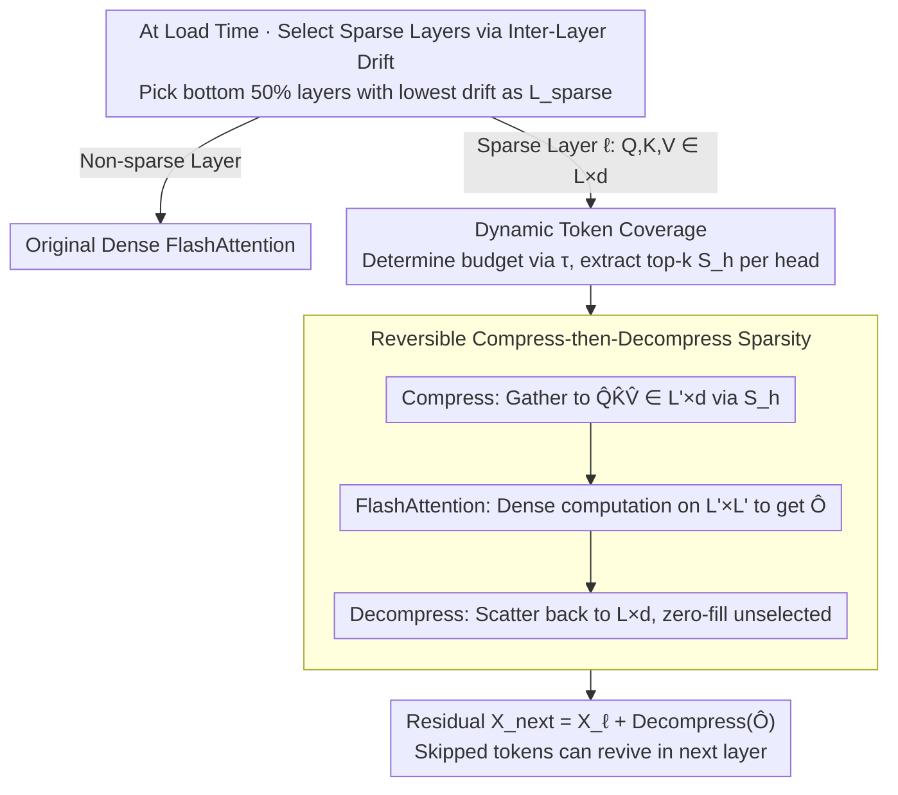

# Token Sparse Attention: Efficient Long-Context Inference with Interleaved Token Selection

**Conference**: ICML 2026  
**arXiv**: [2602.03216](https://arxiv.org/abs/2602.03216)  
**Code**: https://github.com/dongwonjo/Token-Sparse-Attention  
**Area**: Model Compression / Long-Context Inference Acceleration  
**Keywords**: Sparse attention, prefill acceleration, reversible token selection, FlashAttention compatibility, dynamic sparsity

## TL;DR
The authors observe that token "importance" fluctuates drastically across layers and heads, making traditional one-time token eviction an irreversible early decision error. They propose Token Sparse Attention, where each layer and attention head independently selects $L' \ll L$ tokens for dense attention. The output is then scattered back to the original sequence length, coupled with a residual path that allows skipped tokens to be re-evaluated in subsequent layers. This mechanism maintains dynamic layer/head selection while remaining compatible with dense kernels like FlashAttention, achieving ×3.23 attention speedup on 128K context when combined with FlexPrefill with <1% accuracy loss.

## Background & Motivation
**Background**: As LLM context windows expand to 100K+, the $O(L^2)$ complexity of attention becomes the primary bottleneck. Two acceleration paths exist: (i) sparse attention (e.g., Minference, FlexPrefill), which uses block-sparse patterns to skip low-importance regions; (ii) token eviction (PyramidInfer, FastKV, GemFilter), which selects top-k tokens in early layers and restricts deeper layers to this subset.

**Limitations of Prior Work**: Sparse attention is block-level; if low-relevance tokens are mixed within a block, they are still computed, limiting the sparsity ceiling. Token eviction makes hard decisions in early layers about token importance; tokens removed early cannot be recovered even if they become significant in deeper layers, violating the true dynamics of token importance.

**Key Challenge**: Empirical analysis on LLaMA-3.1-8B-Instruct reveals: (i) the overlap rate of top-1% tokens decreases rapidly as layer distance increases, indicating importance drift across layers; (ii) top token rankings vary significantly across different heads within the same layer, as heads attend to different semantics. Eviction using a "one-size-fits-all" token set ignores both layer and head dynamics.

**Goal**: (ii) Design a token-level sparsity mechanism that allows head/layer-specific selection while remaining reversible; (ii) ensure compatibility with optimized dense kernels like FlashAttention without requiring new CUDA kernels; (iii) achieve orthogonality with existing block-level sparse attention.

**Key Insight**: Instead of applying sparsity to the attention map (constrained by block boundaries) or deleting KV cache (irreversible), this work performs **reversible compression-decompression** on $Q, K, V$. Tokens are compressed into a shorter sequence for dense attention, and results are scattered back to the original length with a residual connection. This residual path allows information from "unselected tokens" to flow from the previous layer to the next, effectively providing a "revivication" channel.

**Core Idea**: Transforming token-level sparsification into a reversible operation via "compress-then-decompress + residuals," allowing every head in every layer to re-decide token importance.

## Method

### Overall Architecture
Token Sparse Attention addresses the need for dynamic token selection per head/layer while ensuring skipped tokens are not permanently lost and maintaining compatibility with dense kernels. For each selected sparse layer, a "compress-dense attention-decompress" cycle is performed: first, Dynamic Token Coverage estimates a token set $S_h$ of size $L'$ for each head $h$. $\hat Q,\hat K,\hat V \in \mathbb R^{L'\times d}$ are gathered from $Q,K,V \in \mathbb R^{L\times d}$ based on $S_h$. FlashAttention is invoked on the $L'\times L'$ compressed space to produce $\hat O$. Finally, $\hat O$ is scattered back to a zero-initialized $\mathbb R^{L\times d}$ tensor, and a residual connection is applied. Complexity is reduced from $O(L^2 d)$ to $O(L'^2 d)$. Sparse layers are pre-selected at load time via Inter-Layer Representation Drift (defaulting to the bottom 50% of layers with the lowest drift) in a training-free manner.

### Key Designs

**1. Reversible Compress-then-Decompress: Replacing "Deletion" with "Temporary Exclusion"**
Traditional token eviction treats $L\to L'$ as an irreversible KV deletion, preventing tokens from returning in deeper layers. This method changes the structure: Stage 1 independently selects $S_h$ for each head $h$, gathering $\hat Q_h,\hat K_h,\hat V_h$ so FlashAttention computes $\hat O_h$ in the compressed $\mathbb R^{L'\times L'}$ space. Stage 2 scatters $\hat O_h$ back to the corresponding rows of $\mathbb R^{L\times d}$ (filling unselected rows with 0, equivalent to a hard mask), followed by the residual $X_{\ell+1} = X_\ell + \text{Decompress}(\hat O_h)$. The residual path allows unselected representation from the previous layer to flow through; if the next layer deems it important, it can be re-selected. This design preserves inter-layer/head dynamics. Furthermore, the compressed tensors are dense and contiguous, allowing direct use of standard attention kernels (FlashAttention, FlexPrefill).

**2. Dynamic Token Coverage: Adaptive Budgeting via "Attention Noise Tail"**
Fixed retention ratios fail across varying context lengths and tasks. This work introduces a data-adaptive approach: for each head, a lightweight attention score $\hat A$ is computed relative to recent queries. Column sums are pooled into head-level token scores $s_h[t]$ and normalized to layer-level scores $s_l$. By sorting $s_l$ in ascending order, the smallest $k_{\text{sparse}}$ is found such that the cumulative weight $\sum_{j=1}^{k_{\text{sparse}}} s_l[I[j]] \ge \tau$ (default $\tau=0.005$). This discards tokens contributing less than $\tau$ to the total weight, retaining $k_{\text{keep}} = L - k_{\text{sparse}}$. Each head then selects its own top-$k_{\text{keep}}$ subset $S_h$. Sparsity scales naturally—long contexts containing more attention noise automatically trigger higher sparsity (e.g., 54% reduction at 128K vs 17% at 4K). Scoring is implemented via Triton fused kernels with negligible I/O overhead.

**3. Inter-Layer Representation Drift: Data-Driven Selection of Sparse Layers**
Not every layer tolerates sparsity equally; targeting unstable layers can lead to error accumulation. The method uses a data-driven prior: normalized representation drift for layer $\ell$ is defined as $R_\ell = \mathbb E_t[\|h_{\ell+1,t} - h_{\ell,t}\|_2 / (\|h_{\ell,t}\|_2 + \epsilon)]$. Low drift implies stable token representations that can withstand sparsification. $R_\ell$ is calculated on calibration data at load time, and layers are ranked to select $\mathcal L_{\text{sparse}} = \{\ell \mid \hat R_\ell \le \delta\}$ (default $\delta=0.5$). Experiments show a high correlation between average drift and accuracy across 200 random 3-layer sparse combinations, validating that stable layers preserve representations under sparsity.

### Loss & Training
This is a training-free inference-time method requiring no fine-tuning. Calibration for $\mathcal L_{\text{sparse}}$ is performed once during model loading. Hyperparameter $\tau$ is set to 0.005 for LLaMA-3.1-8B and 0.008 for Mistral-Nemo-12B. Token scoring uses Triton fused kernels, while attention relies on unmodified FlashAttention.

## Key Experimental Results

### Main Results
Average accuracy and 128K acceleration ratio on RULER benchmark (LLaMA-3.1-8B-Instruct):

| Method | 4K | 32K | 128K | Avg. | 128K Gain |
|---|---|---|---|---|---|
| FlashAttention | 95.82 | 84.87 | 74.15 | 87.01 | ×1.00 |
| + Token Sparse | 96.06 | 84.81 | 73.68 | 87.02 | ×1.36 |
| Minference | 93.46 | 85.34 | 73.63 | 86.49 | ×1.12 |
| + Token Sparse | 93.05 | 85.10 | 72.18 | 86.05 | ×1.38 |
| FlexPrefill | 95.48 | 87.20 | 73.75 | 87.27 | ×2.44 |
| + Token Sparse | 95.33 | 87.68 | 73.58 | 87.27 | **×2.76** |

Comparison with token eviction methods at similar speedup (128K, LLaMA-3.1-8B):

| Method | Avg. Acc | Gain |
|---|---|---|
| FlashAttention | 87.01 | ×1.00 |
| PyramidInfer | 78.49 | ×1.49 |
| GemFilter | 85.12 | ×1.53 |
| FastKV | 85.64 | ×1.50 |
| **Ours** | **86.84** | ×1.51 |

### Ablation Study

| Configuration | Key Findings |
|---|---|
| Dynamic $\tau=0.005$ vs Fixed $s=0.3$ | 87.02 vs 86.91 at same speedup |
| Dynamic $\tau=0.010$ vs Fixed $s=0.5$ | 86.84 vs 85.43; dynamic is better at high sparsity |
| Speedup Breakdown (128K) | Total overhead (scoring/compress/decompress) <11% |
| Sparsity vs Context Length | 17% at 4K, rising to 54% at 128K |

### Key Findings
- Combined with FlashAttention: Accuracy remains nearly constant (87.01 → 87.02) while contributing ×1.36 standalone acceleration.
- Synergy with block-level sparsity (FlexPrefill): Acceleration increases from ×2.44 to ×2.76, proving token-level and block-level sparsity are complementary.
- Outperforms all token eviction methods at equal speedup, with the gap particularly significant at 4K short contexts (PyramidInfer is 17 pts lower than FlashAttn).

## Highlights & Insights
- **Compress-then-Decompress as an Elegant "Pseudo-Sparsity"**: Calculating dense attention in a $L' \times L'$ space and scattering back preserved via residuals is functionally a lightweight, reversible, head-specific token selection. This "logically sparse, physically dense" design is extensible to MoE or sparse expert routing.
- **Kernel Compatibility as a Deployment Advantage**: The ability to call FlashAttention/FlexPrefill without modification ensures zero-threshold adoption for downstream users. This contrast sharply with token eviction, which requires modifying KV cache structures.
- **Drift-based Layer Selection as a Robust Prior**: Converting "layer sparsity" from a hyperparameter to a data-driven decision is highly effective and could be generalized to other layer-wise compression tasks.

## Limitations & Future Work
- Dependency on recent queries for token scoring remains a heuristic; sliding window or chunked attention might disrupt the statistical significance of these queries.
- While residuals preserve information, the zeroed rows in the scatter operation ignore the cross-attention contribution between selected and unselected tokens; this loss is not quantified.
- Heterogeneous $L'$ across heads in a batch may disrupt tensor regularity (though FlashAttention supports ragged tensors, efficiency may be impacted).
- Validated only on prefill; not yet applied to decoding, where the bottleneck is typically KV cache I/O rather than attention computation.
- Future directions: adaptive drift-based layer selection (per prompt), replacing scoring with learnable routers, and combining with KV cache quantization.

## Related Work & Insights
- **vs Minference / FlexPrefill (Block Sparse)**: These skip blocks in the attention map based on boundaries. Ours operates at the token level and is orthogonal, providing an additional ×1.13 gain over FlexPrefill.
- **vs PyramidInfer / FastKV / GemFilter (Token Eviction)**: These make hard decisions in early layers. Ours allows re-selection in every layer, yielding 1-8 pts higher accuracy at similar speedups.
- **vs FlashAttention**: FlashAttention optimizes I/O for dense attention but remains $O(L^2)$. Ours provides algorithmic sparsification to $O(L'^2)$ while reusing its kernels.
- **vs KV Cache Quantization (KIVI/H2O)**: These reduce KV memory loading overhead. Ours reduces computation overhead; the two are fully orthogonal.

## Rating
- Novelty: ⭐⭐⭐⭐ Reversible design + head-specific selection is a clean, effective contribution.
- Experimental Thoroughness: ⭐⭐⭐⭐ Extensive coverage across models, baselines, and benchmarks (RULER/InfiniteBench).
- Writing Quality: ⭐⭐⭐⭐ Strong logical flow from empirical observation to design.
- Value: ⭐⭐⭐⭐ Highly practical for industrial deployment due to orthogonality and kernel compatibility.

<!-- RELATED:START -->

## Related Papers

- [\[ICML 2025\] OrthoRank: Token Selection via Sink Token Orthogonality for Efficient LLM Inference](../../ICML2025/model_compression/orthorank_token_selection_via_sink_token_orthogonality_for_efficient_llm_inferen.md)
- [\[ICML 2026\] T3S: 训练轨迹感知的 token 选择，破解推理蒸馏的「Imitation Shock」](training-trajectory-aware_token_selection.md)
- [\[NeurIPS 2025\] Recurrent Attention-based Token Selection for Efficient Streaming Video-LLMs](../../NeurIPS2025/model_compression/recurrent_attention-based_token_selection_for_efficient_streaming_video-llms.md)
- [\[ACL 2026\] Adaptive Layer Selection for Layer-Wise Token Pruning in LLM Inference](../../ACL2026/model_compression/adaptive_layer_selection_for_layer-wise_token_pruning_in_llm_inference.md)
- [\[ICML 2026\] ToaSt: Token Channel Selection and Structured Pruning for Efficient ViT](toast_token_channel_selection_and_structured_pruning_for_efficient_vit.md)

<!-- RELATED:END -->
