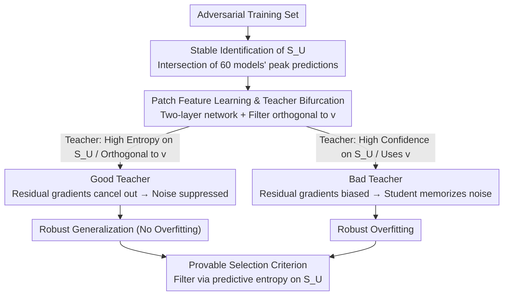

# Toward Understanding Adversarial Distillation: Why Robust Teachers Fail

**Conference**: ICML 2026  
**arXiv**: [2605.21999](https://arxiv.org/abs/2605.21999)  
**Code**: None  
**Area**: Model Compression / Adversarial Robustness / Knowledge Distillation  
**Keywords**: Adversarial Distillation, Robust Overfitting, Unlearnable Samples, Feature Learning Theory, Teacher Selection

## TL;DR
Ours identifies a "robustly unlearnable set" that remains stable across different training methods. Through feature learning theory on a two-layer network, it is proved that when a strongly robust teacher provides high-confidence supervision on these samples, it forces the student to memorize pseudo-noise, triggering robust overfitting. Conversely, maintaining high entropy on these samples suppresses noise gradients. Based on this, a teacher selection criterion using the predictive entropy of unlearnable samples is proposed.

## Background & Motivation
**Background**: Adversarial Training (AT) via min-max optimization against $\ell_\infty$ perturbations is currently the most effective empirical defense. Adversarial Distillation (AD) builds on this by matching student outputs to a robust teacher's soft labels, which is believed to mitigate robust overfitting and transfer robustness from large models to resource-constrained students.

**Limitations of Prior Work**: The success of AD is highly unstable—stronger teachers do not necessarily result in stronger students and can even exacerbate robust overfitting (where robust test accuracy peaks and then continuously declines). Early works like Zi et al. (2021) reported "robust saturation," and Lee & Chung (2026) attributed these failures to a "scarcity of transferable adversarial samples (TAS)," but these are merely symptoms and lack mechanical explanations.

**Key Challenge**: The authors observe a counter-intuitive phenomenon—AD using an independently weaker teacher often outperforms a stronger one, provided the teacher is not overfitted. The issue is not whether the teacher is "robust," but where the teacher and student are "aligned." This suggests an overlooked factor: certain samples in the training set are naturally unlearnable for a specific student capacity, and the teacher's behavior on these samples dictates the outcome.

**Goal**: (1) Identify this critical subset at the data level; (2) explain how it dominates robust overfitting at the theoretical level; (3) provide an a priori metric for selecting effective teachers in practice.

**Key Insight**: By taking the "prediction intersection" across 6 robust training paradigms and 10 random seeds, the authors find a group of samples consistently misclassified by all models at peak robust accuracy. This "robustly unlearnable set ($\mathcal{S}_U$)" decreases monotonically with model capacity, and feature inversion on these samples yields only collapsed pseudo-features. This suggests that unlearnability is a property of the "data-architecture" pair rather than noise inherent in the data itself.

**Core Idea**: Robust overfitting is attributed to a mismatch between "teacher confidence on the student's representation blind spots" and "student capacity constraints"—the more confident the teacher is on $\mathcal{S}_U$, the more the student is forced to complete this confidence using noise, leading to the dominance of noise responses.

## Method

### Overall Architecture
This paper answers a counter-intuitive question: why might a stronger robust teacher make a distilled student worse? It provides an answer in three progressive stages: first, **empirically** isolating a stable subset $\mathcal{S}_U$ from the training set; second, **theoretically** proving a bifurcation theorem for both AT and AD using an analyzable patch feature learning model, linking student robust overfitting to teacher confidence on $\mathcal{S}_U$; finally, **implementing** these findings into a prior-calculable teacher selection metric: the predictive entropy of candidate teachers on $\mathcal{S}_U$. These three designs follow a single thread: the identified $\mathcal{S}_U$ corresponds to the "unlearnable feature $\mathbf{v}$" in the theoretical model and serves as the sample set for the final entropy metric; the bifurcation theorem distinguishes between Good and Bad Teachers based on the trajectories corresponding to high and low entropy.

### Key Designs

**1. Stable Identification of $\mathcal{S}_U$: Turning "Hard Samples" into Reproducible Causal Triggers**

To argue that "certain samples dominate robust overfitting," they must first be isolated stably. The authors train 6 robust paradigms (PGD-AT / TRADES / AD under 4 teachers) × 10 random seeds for a total of 60 models. Only predictions at the **peak robust accuracy** epoch are used. $\mathcal{S}_U$ is defined as samples misclassified by all 60 models, while $\mathcal{S}_L$ contains those consistently correctly classified. Using the peak robust accuracy epoch isolates "unlearnability" from "difficulty," making it an intrinsic property of the "capacity-data" pair. Evidence shows $|\mathcal{S}_U|$ decreases monotonically with capacity—MobileNet-V2 has ~9,000 samples while WRN-34-10 has ~1,500—and feature inversion on these samples yields collapsed semantics.

**2. Patch Feature Learning Framework: Encoding Capacity via Orthogonal Constraints**

The model constructs data from $P$ patches containing two orthogonal robust features $\mathbf{u}=\mathbf{e}_1$ (learnable) and $\mathbf{v}=\mathbf{e}_d$ (unlearnable). For $\mathcal{S}_L$ samples, the signal is $\alpha y\mathbf{u}$; for $\mathcal{S}_U$, it is $\alpha y\mathbf{v}$. The student is a two-layer network with cubic activation $\phi(z)=(\max\{0,z\})^3$. The **Key Insight** is a structural constraint where all filters $\langle \mathbf{w}_r,\mathbf{v}\rangle=0$, simulating a student's capacity being too low to "see" certain features. Adversarial perturbations affect signal patches ($\|\delta\|_\infty\le\epsilon$). AT optimizes $\ell(yf_W(\tilde X))$, while AD optimizes teacher-weighted targets $\sigma(\pm yf_{W_T}(X))\ell(\pm yf_W(\tilde X))$.

**3. Good vs Bad Teachers & Provable Selection Criterion**

In the "unlearnable sparse" regime $CN^{-1}\le p_{un}\le C^{-1}N^{-1}\log d$ and signal-to-noise condition $\alpha\ge\tilde\Omega(\sigma_n\sqrt{d}/N^{1/3})$, both AT and AD learn the feature $\mathbf{u}$. Whether noise is memorized (triggering overfitting) depends on the residual gradients on $\mathcal{S}_U$. A "Good Teacher" is orthogonal to $\mathbf{v}$ and remains uncertain on $\mathcal{S}_U$ ($y_i f_{W_G}(X_i)=0$), keeping the teacher sigmoid factor $\sigma(-yf_{W_T}(X))$ at $\Theta(1)$ and allowing gradients to cancel out. A "Bad Teacher" is confident on $\mathbf{v}$ ($y_i f_{W_B}(X_i)\ge\Gamma$), causing the student to memorize noise to "complete" the teacher's labels. This leads to the **Unlearnable-Entropy Criterion**: use the predictive entropy of candidate teachers on $\mathcal{S}_U$ as an a priori metric—higher entropy implies a "Good Teacher."

### Loss & Training
The AT objective is $\mathcal{L}_{AT}=\ell(yf_W(\tilde X))$, and the AD objective is $\mathcal{L}_{AD}=\sigma(yf_{W_T}(X))\ell(yf_W(\tilde X))+\sigma(-yf_{W_T}(X))\ell(-yf_W(\tilde X))$. Optimization uses full-batch gradient descent $W^{(t+1)}=W^{(t)}-\frac{\eta}{N}\sum\nabla_W\mathcal{L}$ for $T\ge\tilde\Omega(N/(\eta\sigma_0\sigma_n^3 d^{3/2}))$ steps to capture both signal learning and noise memorization phases.

## Key Experimental Results

### Main Results: Coupling of Unlearnable Sets and Robust Overfitting
Statistics for $|\mathcal{S}_U|$ and $|\mathcal{S}_L|$ show that **robust unlearnability is a function of capacity**:

| Architecture | PGD-AT Unlearnable | TRADES Unlearnable | Intersection (Unlearnable) | Intersection (Learnable) |
| :--- | :--- | :--- | :--- | :--- |
| MobileNet-V2 | 13,898 | 12,261 | 8,979 | 19,385 |
| ResNet-18 | 8,360 | 10,217 | 5,217 | 21,899 |
| WRN-28-10 | 2,816 | 5,084 | 1,697 | 19,610 |
| WRN-34-10 | 2,608 | 4,511 | 1,559 | 16,397 |

### Ablation Study: Teacher Type vs Student Overfitting
Comparing two robust teachers and their distillation effects:

| Configuration | Student Peak Robust Acc | Student Final Robust Acc | Overfitting? | Interpretation |
| :--- | :--- | :--- | :--- | :--- |
| Standard PGD-AT | Moderate | Significant Drop | Yes | No mechanism to suppress $\mathcal{S}_U$ gradients |
| Self-Distill (Best) | High | Near Peak | No | Early teacher: low confidence on $\mathcal{S}_U$ |
| Self-Distill (Last) | Moderate | Significant Drop | Yes | Late teacher: high confidence on $\mathcal{S}_U$ |
| AD (Gowal teacher) | High | Sustained | No | High entropy on $\mathcal{S}_U \approx$ Good Teacher |
| AD (Chen teacher) | Moderate | Continuous Drop | Yes | Low entropy on $\mathcal{S}_U \approx$ Bad Teacher |

### Key Findings
- **$\mathcal{S}_U$ Drives Overfitting**: If $p_{un}=0$, noise responses remain suppressed and robust test error $\to 0$. If $p_{un} > 0$, noise responses reach $\tilde\Omega(1)$, locking robust error $\ge 1/2$.
- **Teacher Strength is Not Sufficient**: Two equally robust teachers yield opposite outcomes based solely on their behavior on $\mathcal{S}_U$.
- **Entropy as a Prior Metric**: High correlation between a teacher's entropy on $\mathcal{S}_U$ and the final student robustness allows for a selection process without training students.
- **Structural Blindness Hypothesis**: The capacity-dependent size of $\mathcal{S}_U$ justifies the theoretical constraint of orthogonality to $\mathbf{v}$ for low-capacity models.

## Highlights & Insights
- **From Heuristic to Theoretical Object**: By using cross-method prediction intersections, unlearnability is defined as a stable attribute, a concept transferable to robust fairness and long-tail learning.
- **Teacher Orthogonality as a Mechanism**: The structural blindness assumption allows the first analytical treatment of asymmetric information in adversarial distillation using a feature learning framework.
- **Drop-in Entropy Metric**: Unlike TAS which requires training a student, calculating softmax entropy on $\mathcal{S}_U$ (once) allows pre-selection of teachers with $O(N)$ efficiency.

## Limitations & Future Work
- Theory is based on a simplified two-layer cubic network and patch data; moving to deep CNN features remains empirical.
- Identifying $\mathcal{S}_U$ requires training 60 models initially; future work could use capacity-aware proxies (like loss curvature) to estimate $\mathcal{S}_U$ online.
- Good and Bad Teachers are treated as binary in theory, whereas real-world teachers exist on a continuous spectrum.

## Related Work & Insights
- **vs Lee & Chung (2026, TAS)**: TAS is a symptom; entropy on $\mathcal{S}_U$ is the causal mechanism and more calculable a priori.
- **vs Li & Li (2025, AT Feature Learning)**: Extends their AT analysis to the asymmetric distillation setting.
- **vs Goldblum et al. (2020, ARD)**: Explains the "stronger teacher, worse student" paradox that ARD did not touch.

## Rating
- Novelty: ⭐⭐⭐⭐⭐ 
- Experimental Thoroughness: ⭐⭐⭐⭐ 
- Writing Quality: ⭐⭐⭐⭐⭐ 
- Value: ⭐⭐⭐⭐⭐ 

## Rating
- Novelty: To be rated
- Experimental Thoroughness: To be rated
- Writing Quality: To be rated
- Value: To be rated

<!-- RELATED:START -->

## Related Papers

- [\[ICML 2026\] Critique-Guided Distillation for Robust Reasoning via Refinement](critique-guided_distillation_for_robust_reasoning_via_refinement.md)
- [\[CVPR 2026\] Continual Distillation of Teachers from Different Domains](../../CVPR2026/model_compression/continual_distillation_of_teachers_from_different_domains.md)
- [\[CVPR 2026\] Adversarial Concept Distillation for One-Step Diffusion Personalization](../../CVPR2026/model_compression/adversarial_concept_distillation_for_one-step_diffusion_personalization.md)
- [\[ICML 2026\] The Bridge-Garden Dilemma in LLM Distillation: Why Mixing Hard and Soft Labels Works](the_bridge-garden_dilemma_in_llm_distillation_why_mixing_hard_and_soft_labels_wo.md)
- [\[ICML 2026\] Detecting Fluent Optimization-Based Adversarial Prompts via Sequential Entropy Changes](detecting_fluent_optimization-based_adversarial_prompts_via_sequential_entropy_c.md)

<!-- RELATED:END -->
