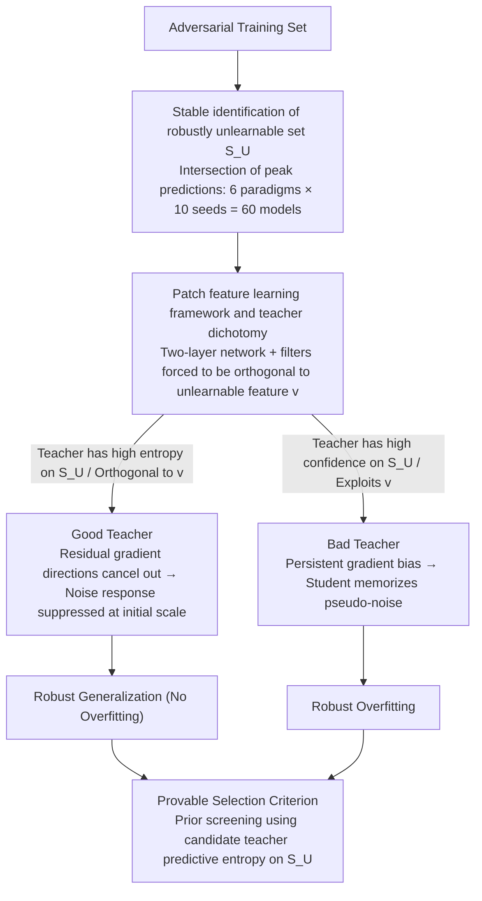

# Toward Understanding Adversarial Distillation: Why Robust Teachers Fail

**Conference**: ICML 2026  
**arXiv**: [2605.21999](https://arxiv.org/abs/2605.21999)  
**Code**: None  
**Area**: Model Compression / Adversarial Robustness / Knowledge Distillation  
**Keywords**: Adversarial Distillation, Robust Overfitting, Unlearnable Samples, Feature Learning Theory, Teacher Selection

## TL;DR
This paper identifies a "robustly unlearnable set" that remains stable across various adversarial training methods. Through the feature learning theory of two-layer networks, it proves that when a strongly robust teacher provides high-confidence supervision on these samples, it forces the student to memorize pseudo-noise, thereby triggering robust overfitting. Conversely, maintaining high entropy on these samples suppresses noise gradients. Based on this, a teacher selection criterion based on the predictive entropy of unlearnable samples is proposed.

## Background & Motivation
**Background**: Adversarial Training (AT) via min-max optimization is currently the most effective empirical defense against $\ell_\infty$ perturbations. Adversarial Distillation (AD) builds on this by having students match the soft labels of robust teachers, which is believed to mitigate robust overfitting and transfer the robustness of large models to resource-constrained students.

**Limitations of Prior Work**: The success of AD is highly unstable—stronger teachers do not necessarily yield stronger students and may even exacerbate the student's robust overfitting (where robust test accuracy continuously declines after peaking at a certain epoch). Early works like Zi et al. (2021) reported "robust saturation," and Lee & Chung (2026) attributed this failure to a "scarcity of transferable adversarial samples (TAS)," but these are merely symptoms of failure without a mechanistic explanation.

**Key Challenge**: The authors observe a counter-intuitive phenomenon—as long as the teacher is not overfitted, AD often performs better with a teacher that appears independently weaker than a stronger one. The issue is not whether the teacher is "robust," but whether the teacher and student are "in sync" regarding specific samples. This implies an overlooked factor: certain samples in the training set are naturally robustly unlearnable for students of specific capacities, and the teacher's behavior on these samples dictates the outcome.

**Goal**: (1) Identify this critical subset at the data level; (2) explain how it dominates robust overfitting at the theoretical level; (3) provide an a priori metric for selecting effective teachers in practice.

**Key Insight**: The authors take the "prediction intersection" across 6 robust training methods $\times$ 10 random seeds. They find a group of samples consistently misclassified by all models at their peak robust accuracy. This "robustly unlearnable set ($\mathcal{S}_U$)" decreases monotonically in size as model capacity increases, and feature inversion on these samples yields only collapsed pseudo-features. This suggests that unlearnability is a property of the "data-architecture" pair rather than noise inherent to the data itself.

**Core Idea**: Robust overfitting is attributed to a mismatch between "teacher confidence on student representation blind zones" and "student capacity limits"—the more confident the teacher is on $\mathcal{S}_U$, the more the student is forced to use noise to fulfill that confidence, leading to noise responses dominating the model.

## Method

### Overall Architecture
This paper addresses a counter-intuitive question: why might a stronger robust teacher make a distillation student worse? It provides an answer in three progressive stages: first, **empirically** isolating a stable subset $\mathcal{S}_U$ that "cannot be learned" across methods and seeds; second, **theoretically** proving a dichotomy theorem for both AT and AD using an analyzable patch feature learning model, binding "student robust overfitting" to "teacher confidence on $\mathcal{S}_U$"; finally, **implementing** this conclusion as a prior-calculable teacher screening metric: the predictive entropy of candidate teachers on $\mathcal{S}_U$. The three designs follow a single logic: $\mathcal{S}_U$ corresponds to the "unlearnable feature $\mathbf{v}$" in the theory and serves as the evaluation set for the final entropy metric; the Good/Bad Teacher trajectories identified by the dichotomy theorem correspond to high/low entropy scores.

### Key Designs

**1. Stable Identification of the Robustly Unlearnable Set $\mathcal{S}_U$**

To argue that "certain samples dominate robust overfitting," these samples must be isolated stably. The authors run 6 robust training paradigms (PGD-AT / TRADES / AD under 4 different teachers) $\times$ 10 random seeds for a total of 60 models. Predictions are taken only at the epoch of **peak robust accuracy**. Samples misclassified by all 60 models are defined as the unlearnable set $\mathcal{S}_U$, while those correctly classified by all are the learnable set $\mathcal{S}_L$. Taking the intersection at "peak robust accuracy" is crucial because hard samples often drift during training if partitioned by loss or confidence thresholds. Peak time represents a hard constraint at the "capacity upper bound," making "unlearnable" an intrinsic property of the "capacity-data" pair. Evidence shows $|\mathcal{S}_U|$ decreases monotonically with model capacity—from ~9000 samples for MobileNet-V2 to ~1500 for WRN-34-10—and feature inversion on these samples yields only semantic noise.

**2. Patch Feature Learning Framework and Teacher Dichotomy**

The authors construct data from $P$ patches containing two orthogonal robust features: $\mathbf{u}=\mathbf{e}_1$ (learnable) and $\mathbf{v}=\mathbf{e}_d$ (unlearnable). For $\mathcal{S}_L$ samples, the signal patch is $\alpha y\mathbf{u}$; for $\mathcal{S}_U$, it is $\alpha y\mathbf{v}$. Other patches are orthogonal Gaussian noise $\mathcal{N}(\mathbf{0},\sigma_n^2(\mathbf{I}_d-\Pi_{\mathcal{F}}))$. The student is a two-layer network with cubic activation $\phi(z)=(\max\{0,z\})^3$. A **key design** is the explicit constraint that all filters satisfy $\langle \mathbf{w}_r,\mathbf{v}\rangle=0$. This encodes the real-world "capacity bottleneck" where students cannot perceive certain robust features into a structural blindness toward the $\mathbf{v}$ direction. Adversarial perturbations are applied to the signal patch direction ($\|\delta\|_\infty\le\epsilon$). AT optimizes $\ell(yf_W(\tilde X))$, and AD optimizes the teacher soft-label weighted objective $\sigma(\pm yf_{W_T}(X))\ell(\pm yf_W(\tilde X))$.

**3. Good vs Bad Teacher and Provable Selection Criterion**

Under the "unlearnable sparsity" interval $CN^{-1}\le p_{un}\le C^{-1}N^{-1}\log d$ and "signal stronger than noise" condition $\alpha\ge\tilde\Omega(\sigma_n\sqrt{d}/N^{1/3})$, both AT and AD first learn the learnable feature $\mathbf{u}$ such that $w_{r,1}^{(T)}\ge\tilde\Omega(\alpha^{-1})$. Whether the noise response eventually reaches $\tilde\Omega(1)$ (triggering overfitting) depends on the residual gradients on $\mathcal{S}_U$. A "Good Teacher" is orthogonal to $\mathbf{v}$ and remains uncertain on $\mathcal{S}_U$, i.e., $y_i f_{W_G}(X_i)=0$. A "Bad Teacher" is highly confident in the $\mathbf{v}$ direction, $y_i f_{W_B}(X_i)\ge\Gamma$. Using the "Unlearnable-Entropy Criterion," the authors show that higher entropy on $\mathcal{S}_U$ suppresses the noise memmory. In practice, a **proxy $\mathcal{S}_U$** is constructed from a single peak PGD-AT model to calculate the candidate teacher's average predictive entropy under PGD-10 attack.

### Loss & Training
The AT objective is $\mathcal{L}_{AT}=\ell(yf_W(\tilde X))$, and the AD objective is $\mathcal{L}_{AD}=\sigma(yf_{W_T}(X))\ell(yf_W(\tilde X))+\sigma(-yf_{W_T}(X))\ell(-yf_W(\tilde X))$. Optimization uses full-batch gradient descent $W^{(t+1)}=W^{(t)}-\frac{\eta}{N}\sum\nabla_W\mathcal{L}$ for $T\ge\tilde\Omega(N/(\eta\sigma_0\sigma_n^3 d^{3/2}))$ steps to cover both signal learning and potential noise memorization phases. Theoretical results hold with high probability $1-\delta$.

## Key Experimental Results

### Main Results: Coupling of Unlearnable Sets and Robust Overfitting
The statistics for $|\mathcal{S}_U|$ and $|\mathcal{S}_L|$ based on the intersection of 60 models reflect that **robust unlearnability is a function of capacity**:

| Model Architecture | PGD-AT Unlearnable | TRADES Unlearnable | Intersection (Unlearnable) | Intersection (Learnable) |
|--------------------|--------------------|--------------------|----------------------------|--------------------------|
| MobileNet-V2       | 13,898             | 12,261             | 8,979                      | 19,385                   |
| ResNet-18          | 8,360              | 10,217             | 5,217                      | 21,899                   |
| WRN-28-10          | 2,816              | 5,084              | 1,697                      | 19,610                   |
| WRN-34-10          | 2,608              | 4,511              | 1,559                      | 16,397                   |

### Ablation Study: Teacher Type vs. Student Overfitting

| Configuration | Student Peak robust acc | Student Last robust acc | Overfitting? | Interpretation |
|---------------|-------------------------|-------------------------|--------------|----------------|
| Standard PGD-AT | Medium | Significant drop | Yes | Unopposed residual gradients on $\mathcal{S}_U$ |
| Self-Distill (Best teacher) | High | Near peak | No | Teacher uncertain on $\mathcal{S}_U$ → suppresses noise gradients |
| Self-Distill (Last teacher) | Medium | Severe drop | Yes | Overfitted teacher confident on $\mathcal{S}_U$ → noise memory amplified |
| AD with Gowal teacher | High | Sustained | No | Teacher high entropy on $\mathcal{S}_U$ → Good Teacher |
| AD with Chen teacher | Medium | Continuous drop | Yes | Strong but low entropy on $\mathcal{S}_U$ → Bad Teacher |

### Key Findings
- **Overfitting is driven by $\mathcal{S}_U$, not AT itself**: Theorem 4.7 shows if $p_{un}=0$, noise response is suppressed at $\tilde O(\sigma_0\sigma_n\sqrt{d})$, and robust error $\to 0$. If $p_{un}$ is in the sparse interval, noise response reaches $\tilde\Omega(1)$, locking robust error at $\ge 1/2-o(1)$.
- **Teacher strength is not a sufficient condition**: Theorem 4.8 proves that two equally robust teachers can lead to opposite student outcomes based solely on their behavior on $\mathcal{S}_U$.
- **Entropy as a prior metric**: Experiments confirm a positive correlation between "teacher predictive entropy on $\mathcal{S}_U$" and the final student robust accuracy.
- **Validity of the structural blindness assumption**: The monotonic relationship between capacity and $|\mathcal{S}_U|$ explains why the same samples are unlearnable for small models but learnable for large ones.

## Highlights & Insights
- **Elevating "hard samples" to theoretical objects**: By using the predicted intersection across 60 models, the authors decouple unlearnability from training randomness and define it as a stable property.
- **Teacher orthogonality as a clever design**: Encoding the student's inability to see certain features as hard orthogonality constraints allows the asymmetric information in AD to be treated analytically.
- **Plug-and-play entropy metric**: Unlike TAS, which requires training the student to evaluate, the proposed metric is a priori and requires only one forward pass on $\mathcal{S}_U$.

## Limitations & Future Work
- The theory is built on two-layer cubic networks and patch data with perturbations limited to signal patches; the transfer to ResNet/WRN remains empirical.
- Identifying $\mathcal{S}_U$ requires training 60 models, which is an expensive one-time cost for new datasets.
- The teacher orthogonality assumption treats Good/Bad teachers as binary, whereas real-world entropy is a continuous spectrum.

## Related Work & Insights
- **vs Lee & Chung (2026, TAS)**: They use "TAS scarcity" as an empirical signal; this paper provides a mechanistic explanation and a more computable a priori criterion.
- **vs Li & Li (2025, AT feature learning)**: This paper extends the feature learning framework from AT to AD with soft labels and new branching conclusions on asymmetric information.
- **vs Goldblum et al. (2020, ARD)**: ARD focuses on robustness transfer but does not address the paradox of stronger teachers failing; this paper resolves that paradox using entropy on $\mathcal{S}_U$.

## Rating
- **Novelty**: ⭐⭐⭐⭐⭐ First to explain robust overfitting as information mismatch on unlearnable sets with a dichotomy theorem.
- **Experimental Thoroughness**: ⭐⭐⭐⭐ Solid coverage across architectures and seeds, though primarily on CIFAR-10/100.
- **Writing Quality**: ⭐⭐⭐⭐⭐ Clear progression from empirical phenomenon to theoretical model to practical metric.
- **Value**: ⭐⭐⭐⭐⭐ Provides a nearly zero-cost a priori teacher screening criterion for AD practitioners.

## Rating
- **Novelty**: TBD
- **Experimental Thoroughness**: TBD
- **Writing Quality**: TBD
- **Value**: TBD

<!-- RELATED:START -->

## Related Papers

- [\[ICML 2026\] Critique-Guided Distillation for Robust Reasoning via Refinement](critique-guided_distillation_for_robust_reasoning_via_refinement.md)
- [\[CVPR 2026\] Continual Distillation of Teachers from Different Domains](../../CVPR2026/model_compression/continual_distillation_of_teachers_from_different_domains.md)
- [\[ICML 2026\] The Bridge-Garden Dilemma in LLM Distillation: Why Mixing Hard and Soft Labels Works](the_bridge-garden_dilemma_in_llm_distillation_why_mixing_hard_and_soft_labels_wo.md)
- [\[ICML 2026\] Detecting Fluent Optimization-Based Adversarial Prompts via Sequential Entropy Changes](detecting_fluent_optimization-based_adversarial_prompts_via_sequential_entropy_c.md)
- [\[ACL 2025\] Who Taught You That? Tracing Teachers in Model Distillation](../../ACL2025/model_compression/who_taught_you_that_tracing_teachers_in_model_distillation.md)

<!-- RELATED:END -->
