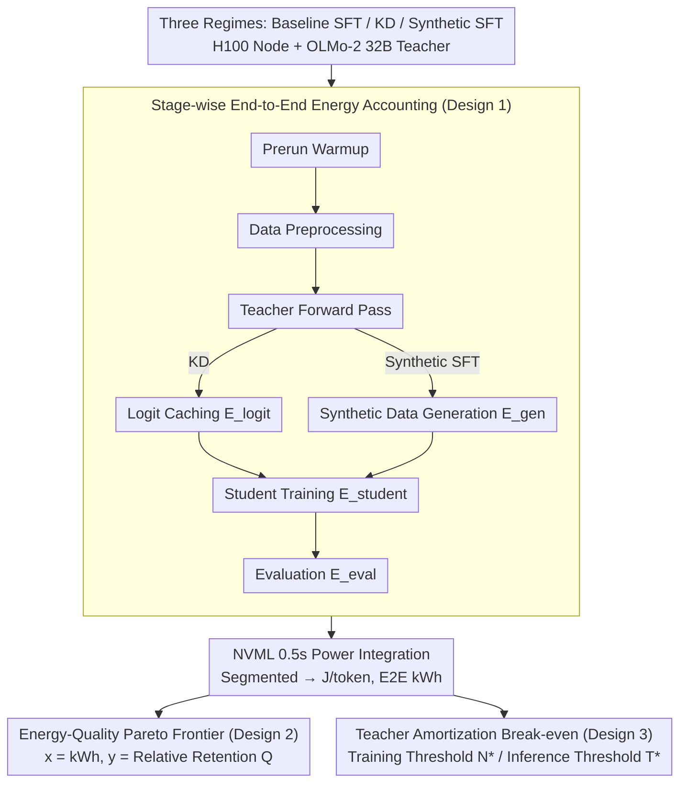

# Towards Resource-Efficient LLMs: End-to-End Energy Accounting of Distillation Pipelines

**Conference**: ICML 2026  
**arXiv**: [2605.13981](https://arxiv.org/abs/2605.13981)  
**Code**: https://github.com/StellarLuminosity/Energy (Available)  
**Area**: LLM Efficiency / Green AI / Knowledge Distillation  
**Keywords**: Distillation Energy Consumption, End-to-End Accounting, Teacher-Side Cost, Pareto Frontier, Teacher Reuse

## TL;DR
The authors developed a multi-stage GPU energy collection framework based on NVML, decomposing the distillation pipeline into "Teacher-side + Student-side + Evaluation" for segmented measurement. They found that in one-off runs, teacher logit caching or synthetic data generation constitutes the majority of the cost, causing KD and synthetic SFT on 1B–13B OLMo-2 students to consume approximately $2.4\times$ more energy than direct SFT. A closed-form break-even formula is provided to demonstrate that distillation is only truly "energy-efficient" when teacher outputs are reused $N^*$ times or more.

## Background & Motivation

**Background**: The surge in LLM deployments has increased GPU and electricity demand, leading the "Green AI" movement to advocate for evaluating energy consumption alongside accuracy. In this context, knowledge distillation (KD) is widely regarded as a "cheaper and greener" production line for small models. Papers typically report student-side FLOPs, training duration, or inference energy as evidence of greenness.

**Limitations of Prior Work**: Existing reports almost exclusively calculate student-side costs, treating teacher-side costs—such as generating logits, synthetic data, and hyperparameter sweeps—as "sunk costs." Once the cost of a 32B teacher generating billions of tokens for a 1B student is included, the claim that "distillation is more energy-efficient" becomes questionable. However, the community lacks a unified, reproducible, and stage-decomposed energy protocol to either debunk or support this claim.

**Key Challenge**: Teacher-side cost is a nearly fixed, large-scale expenditure that can only be diluted when amortized across multiple students or hyperparameter sweeps. In contrast, student-side cost is a variable expenditure that scales linearly with model size. The relative magnitude of these two determines where the entire pipeline falls on the energy-quality plane—a factor that has rarely been quantified in previous work.

**Goal**: (a) Determine when KD/synthetic SFT achieves a better energy-quality trade-off than a strong SFT baseline under a fixed budget; (b) Quantify the teacher-side cost relative to student training and identify when it dominates; (c) Establish when distillation is "truly energy-efficient" across dimensions of student scale, sequence length, teacher reuse, and quality targets.

**Key Insight**: Distillation is not inherently "green"; its energy efficiency is entirely a **workflow** issue. By measuring the pipeline in stages, one can derive a closed-form break-even reuse frequency formula and prescribe actionable design guidelines for when to employ distillation.

**Core Idea**: Energy efficiency depends on the workflow. By decomposing the pipeline and measuring segments, authors provide a break-even formula to guide practical decisions.

## Method

### Overall Architecture
This work does not propose a new algorithm but rather answers whether distillation is energy-efficient. It decomposes the same distillation pipeline into non-overlapping segments, measures energy per segment, and uses a closed-form formula to calculate the break-even point. Specifically, three comparative regimes (baseline SFT, logit-based KD, and synthetic SFT) were run on an identical H100 80 GB exclusive node, using a fixed OLMo-2 tokenizer, Adafactor optimizer, bf16 precision, sequence length of 1024, effective batch size of 4, and early stopping with a tolerance of $\epsilon = 2\times 10^{-3}$. The teacher was a 32B OLMo-2-SFT, with students ranging from 1B to 13B. Datasets included TULU-3 instructions, OpenR1-Math, and Open-R1 Codeforces. Each stage was timestamped and token-counted. GPU energy was calculated via numerical integration of power time series from NVML: $E_{\text{GPU}} \approx \int_{t_s}^{t_e} P_{\text{GPU}}(t)\,dt$. CPU energy was estimated using CodeCarbon. All values were normalized to Joules/token to plot the Pareto frontier.

### Key Designs

**1. Stage-wise End-to-End Energy Accounting Protocol: Making "Teacher Sunk Cost" Explicit**

Previous Green AI reports almost exclusively calculated student-side costs, treating logit generation or synthetic data creation as sunk costs. This work decomposes total energy into $E_{\text{prerun}} + E_{\text{teacher}} + E_{\text{student}} + E_{\text{eval}}$, where the teacher stage is further divided into logit caching $E_{\text{logit}}$ or synthetic generation $E_{\text{gen}}$, with explicit start/end boundaries and token counts. NVML power sampling every 0.5s served as the ground truth for GPU energy, while CodeCarbon estimated CPU energy in process-tracking mode. All units were unified to $1\,\text{kWh}=3.6\times 10^{6}\,\text{J}$. To allow comparison across scales, energy was normalized to $\text{J/token}=E^{(\text{stage})}_{\text{total}}/N_{\text{tokens}}$. CO₂e was treated as a derived metric based on deployment assumptions.

**2. Energy-Quality Pareto Frontier and Unified Quality Metrics**

To identify which (pipeline, scale) combinations are dominated in the energy-quality plane, the authors consolidated five benchmarks into a scalar—a relative retention rate $Q_i = \frac{1}{B}\sum_{b=1}^{B}\frac{s_{i,b}}{s_{\text{teacher},b}}$ (where $B=5$, including AlpacaEval 2, IFEval, MT-Bench-101, GSM8K, and MMLU). Pareto scatter plots were generated with total kWh as the $x$-axis and $Q$ as the $y$-axis. This visualization clearly identifies "suboptimal" configurations where electricity is wasted for negligible or negative quality gains.

**3. Teacher Amortization and Closed-form Break-even Thresholds**

Whether distillation saves energy is a workflow issue determined by the reuse frequency of teacher outputs. The average energy per student is expressed as $E_{\text{teacher}}/N + E_{\text{student}}^{\text{distill}}$. The critical reuse count $N^*$ to break even with the baseline is $N^* = \dfrac{E_{\text{teacher}}}{E_{\text{student}}^{\text{baseline}}-E_{\text{student}}^{\text{distill}}}$. The denominator represents the training energy savings of the distilled student; breakeven only occurs if the distilled student trains more efficiently and is reused enough times. For the inference side, the threshold is $T^* = \dfrac{E_{\text{extra-train,kWh}}\cdot 3{,}600{,}000}{j_{\text{ref}}-j_{\text{student}}}$, indicating how many inference tokens must be served to offset the extra training energy.

### Loss & Training
The objective for KD is the classic Hinton-style mixture: $\mathcal{L}_{\text{KD}}(\theta_s) = \alpha\,\mathrm{CE}(y_{\mathrm{hard}}, p_s) + (1-\alpha)\,T^2\,\mathrm{KL}(p_t^{(T)} \,\|\, p_s^{(T)})$, with default $\alpha=0.5$ and $T=1$. SFT uses pure autoregressive loss $\mathcal{L}_{\text{SFT}}(\theta_s; x, y) = -\sum_{t=1}^s \log p_{\theta_s}(y_t \mid x, y_{<t})$. Synthetic SFT utilizes teacher generation via nucleus sampling once, then reuses it. Hyperparameter sweeps include $T \in \{1, 2, 4\}$, $\alpha \in \{0.3, 0.5, 0.8\}$, and variations in prompt count and max tokens.

## Key Experimental Results

### Main Results
Comparison of 32B Teacher → 1B/7B/13B Students across three datasets.

| Pipeline | Scale | $E$ (kWh) | J/token | $Q$ | Notes |
|---|---|---|---|---|---|
| Baseline SFT | 1B | 7.00 | 0.84 | 0.69 | Lowest energy |
| Baseline SFT | 7B | 19.50 | 2.34 | 0.90 | Pareto dominant at 7B/13B |
| Baseline SFT | 13B | 34.60 | 4.15 | 0.99 | Highest quality |
| KD | 1B | 16.90 | 2.03 | 0.70 | $\sim 2.4\times$ energy of 1B SFT |
| KD | 13B | 42.50 | 5.10 | 0.82 | Dominated by baseline 13B |
| Synthetic SFT | 13B | 40.70 | 4.88 | 0.85 | Teacher generation dominates |

### Ablation Study
Key energy distribution (kWh) by stage:

| Pipeline | Student Scale | Data Preprocessing | Teacher Side | Student Training | Evaluation |
|---|---|---|---|---|---|
| Baseline SFT | 1B / 13B | 0.37 / 0.37 | – | 6.30 / 33.15 | 0.33 / 1.08 |
| KD | 1B / 13B | 0.37 / 0.37 | 11.00 (Logit Caching)| 5.20 / 30.05 | 0.33 / 1.08 |
| Synthetic SFT | 1B / 13B | 0.37 / 0.37 | 10.60 (Generation) | 5.35 / 28.65 | 0.33 / 1.08 |

Reuse thresholds: $N^*$ for KD at 1B/7B/13B is approximately 10 / 5–6 / 4, respectively.

### Key Findings
- Teacher-side costs shift the distillation curve to the right; in one-off runs, KD/synthetic SFT is strictly Pareto-dominated by baseline SFT at 7B/13B scales.
- Smaller students find it harder to amortize teacher costs. Conversely, larger students break even faster, making "reuse-before-regenerate" critical for small-scale deployments.
- Training energy (kWh) for distilled students is lower than same-sized baselines due to faster convergence (early stopping) under soft-label supervision, not because the GPU runs more efficiently.
- In KD, temperature $T$ is a secondary factor, while $\alpha$ dominates the energy-quality trade-off. Some $(T, \alpha)$ combinations are Pareto-dominated.
- In synthetic SFT, `max_new_tokens` is the largest driver of non-linear energy growth. Reducing prompt count and length should be prioritized over expanding generation volume.

## Highlights & Insights
- Transforms the "distillation is green" marketing narrative into actionable engineering mathematics: the break-even formula $N^* = E_{\text{teacher}}/(E^{\text{baseline}}_{\text{student}} - E^{\text{distill}}_{\text{student}})$ informs teams exactly how many students are needed to recoup the cost.
- True "greenness" comes from treating teacher outputs as shared, versioned infrastructure rather than just switching to smaller models.
- The combination of NVML integration and CodeCarbon provides an open-source harness for "energy auditing" other post-training techniques like quantization or pruning.

## Limitations & Future Work
- Experiments were limited to H100 single-node and the OLMo-2 model family; J/token values may shift significantly on TPU or A100.
- The teacher size was fixed at 32B; smaller teachers might lower the break-even threshold.
- Task coverage excluded safety alignment, multi-linguality, and long-context scenarios.
- The $T^*$ formula for inference amortization currently assumes same-scale comparisons; future work should address cases where small models replace larger ones.

## Related Work & Insights
- **vs Schwartz et al. (Green AI)**: While they called for energy as an evaluation metric, this paper implements that philosophy for distillation specifically, providing a protocol rather than just a manifesto.
- **vs Rafat et al. (2023) / Yuan et al. (2024)**: Previous works treated teachers as sunk costs or focused only on inference. This study treats teacher forward passes as first-class costs, leading to the new insight that distillation is often more energy-intensive for small student scenarios.
- **vs CodeCarbon**: This work overlays direct NVML sampling on top of process-tracking estimators to reduce error and allow pipeline-level Pareto analysis.

## Rating
- **Novelty**: ⭐⭐⭐⭐ Not a new algorithm, but the first to establish a reproducible break-even framework for distillation's hidden costs.
- **Experimental Thoroughness**: ⭐⭐⭐⭐ Solid coverage across 3 pipelines, 3 scales, and 3 datasets, involving 2,000 GPU-hours.
- **Writing Quality**: ⭐⭐⭐⭐ Clear structure with well-integrated formulas and Pareto charts.
- **Value**: ⭐⭐⭐⭐⭐ Debunks popular narratives and provides an open-source harness for industry-wide energy auditing.

<!-- RELATED:START -->

## Related Papers

- [\[ICML 2026\] End-to-End Compression for Tabular Foundation Models](end-to-end_compression_for_tabular_foundation_models.md)
- [\[CVPR 2026\] A Paradigm Shift: Fully End-to-End Training for Temporal Sentence Grounding in Videos](../../CVPR2026/model_compression/a_paradigm_shift_fully_end-to-end_training_for_temporal_sentence_grounding_in_vi.md)
- [\[ICML 2026\] Multi-Adapter Representation Interventions via Energy Calibration](multi-adapter_representation_interventions_via_energy_calibration.md)
- [\[ICML 2026\] Memory-Efficient Partitioned DNN Inference on Resource-Constrained Android Crowds](memory-efficient_partitioned_dnn_inference_on_resource-constrained_android_crowd.md)
- [\[ICML 2026\] Energy-Structured Low-Rank Adaptation for Continual Learning](energy-structured_low-rank_adaptation_for_continual_learning.md)

<!-- RELATED:END -->
