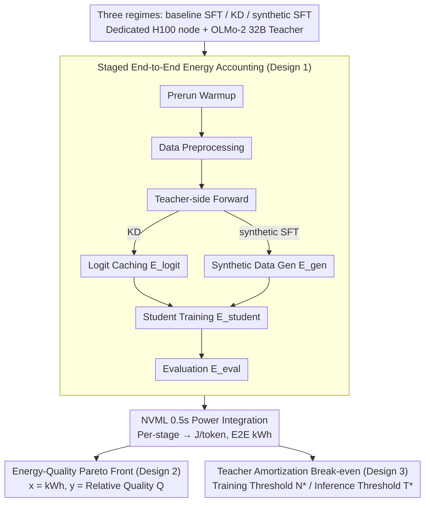

# Towards Resource-Efficient LLMs: End-to-End Energy Accounting of Distillation Pipelines

**Conference**: ICML 2026  
**arXiv**: [2605.13981](https://arxiv.org/abs/2605.13981)  
**Code**: https://github.com/StellarLuminosity/Energy (Available)  
**Area**: LLM Efficiency / Green AI / Knowledge Distillation  
**Keywords**: Distillation energy consumption, end-to-end accounting, teacher-side costs, Pareto front, teacher reuse

## TL;DR
The authors developed a staged GPU energy collection framework based on NVML, decomposing the distillation pipeline into "teacher side + student side + evaluation" for stepwise measurement. Findings indicate that for one-off runs, teacher logit caching and synthetic data generation represent the primary energy costs, causing KD and synthetic SFT to consume approximately $2.4\times$ more energy than direct SFT on 1B–13B OLMo-2 students. A closed-form break-even formula is provided, showing that distillation only becomes "energy-efficient" when teacher outputs are reused more than $N^*$ times.

## Background & Motivation

**Background**: The surge in LLM deployment has increased GPU and electricity demands. The "Green AI" movement advocates for evaluating energy consumption alongside accuracy. In this context, knowledge distillation (KD) is widely regarded as a "cheaper and greener" production line for small models, with papers typically reporting student-side FLOPs, training duration, or inference energy as evidence of greenness.

**Limitations of Prior Work**: Existing reports almost exclusively calculate student-side costs, treating teacher-side costs (logit generation, synthetic data, hyperparameter sweeps) as "sunk." Once the cost of a 32B teacher generating billions of tokens for a 1B student is included, the claim that "distillation is more energy-efficient" becomes questionable. However, the community lacks a unified, reproducible, and stage-decomposed energy protocol to verify or debunk this.

**Key Challenge**: Teacher-side costs are nearly fixed high expenses that can only be diluted when shared across multiple students or hyperparameter sweeps, whereas student-side costs are variable expenses that scale linearly. The relative magnitude of these two determines where the entire pipeline falls on the energy-quality plane, a factor rarely quantified in previous work.

**Goal**: (a) Determine when KD/synthetic SFT achieves a better energy-quality tradeoff than a strong SFT baseline under a fixed budget; (b) Quantify teacher-side costs relative to student training; (c) Identify the conditions (student scale, sequence length, teacher reuse, quality targets) under which distillation is truly "energy-saving."

**Key Insight**: Distillation is not inherently "green"; energy efficiency is a **workflow** issue. By measuring the pipeline in stages, one can derive a closed-form break-even reuse formula and establish actionable design guidelines for when to employ distillation.

**Core Idea**: Energy efficiency depends on the amortization of teacher costs. The pipeline is formalized into five non-overlapping stages: prerun, data preprocessing, teacher forward, student training, and evaluation. GPU power time series from NVML (sampled at 0.5s) are integrated, while CPU energy is estimated via CodeCarbon, normalized to Joule/token for Pareto analysis.

## Method

### Overall Architecture
This work does not propose a new algorithm but evaluates whether distillation saves energy by decomposing the pipeline. Three regimes (baseline SFT, logit-based KD, synthetic SFT) are run on a dedicated H100 80 GB node, using the OLMo-2 tokenizer, Adafactor, bf16, sequence length 1024, effective batch size 4, and cosine LR with 100-step warmup. The teacher is a 32B OLMo-2-SFT, with students ranging from 1B to 13B. Datasets include TULU-3, OpenR1-Math, and Open-R1 Codeforces. Each stage is timestamped to integrate power $E_{\text{GPU}} \approx \int_{t_s}^{t_e} P_{\text{GPU}}(t)\,dt$, summed for end-to-end kWh and converted to CO₂e.

### Key Designs

**1. Staged End-to-End Energy Accounting Protocol: Explicitly Accounting for Teacher Sunk Costs**

Previous Green AI reports often ignored the teacher's role. This work explicitly splits total energy into $E_{\text{prerun}} + E_{\text{teacher}} + E_{\text{student}} + E_{\text{eval}}$, where the teacher stage is further divided into logit caching $E_{\text{logit}}$ or synthetic generation $E_{\text{gen}}$. NVML is used for GPU ground truth, and CodeCarbon for CPU estimation. To ensure comparability across scales, energy is reported in $\text{J/token}=E^{(\text{stage})}_{\text{total}}/N_{\text{tokens}}$. This decomposition identifies whether the teacher or student is the bottleneck.

**2. Energy-Quality Pareto Front and Unified Quality Score**

To identify dominated configurations, five benchmarks are compressed into a unified relative retention score $Q_i = \frac{1}{B}\sum_{b=1}^{B}\frac{s_{i,b}}{s_{\text{teacher},b}}$ (against the 32B teacher). Pareto scatter plots map full pipeline kWh ($x$) against $Q$ ($y$). This visualization clearly distinguishes "energy-wasteful" configurations from optimal tradeoffs.

**3. Teacher Amortization and Closed-form Break-even Thresholds**

The "greenness" of distillation is determined by the reuse frequency of teacher outputs. Average energy per student is $E_{\text{teacher}}/N + E_{\text{student}}^{\text{distill}}$. The critical reuse count to break even with the baseline is $N^* = \dfrac{E_{\text{teacher}}}{E_{\text{student}}^{\text{baseline}}-E_{\text{student}}^{\text{distill}}}$. For inference, the threshold is $T^* = \dfrac{E_{\text{extra-train,kWh}}\cdot 3{,}600{,}000}{j_{\text{ref}}-j_{\text{student}}}$, indicating how many inference tokens must be served to recover the additional training energy.

### Loss & Training
KD uses the standard Hinton-style objective: $\mathcal{L}_{\text{KD}}(\theta_s) = \alpha\,\mathrm{CE}(y_{\mathrm{hard}}, p_s) + (1-\alpha)\,T^2\,\mathrm{KL}(p_t^{(T)} \,\|\, p_s^{(T)})$, with $\alpha=0.5, T=1$ by default. Synthetic SFT uses $\mathcal{L}_{\text{SFT}}(\theta_s; x, y) = -\sum_{t=1}^s \log p_{\theta_s}(y_t \mid x, y_{<t})$ with nucleus sampling. All regimes share the same batch size, scheduler, and early stopping rules to ensure energy differences are attributable solely to the pipeline structure.

## Key Experimental Results

### Main Results
Comparison between teacher 32B and students 1B/7B/13B (averaged across datasets).

| Pipeline | Scale | $E$ (kWh) | J/token | $Q$ | Notes |
|---|---|---|---|---|---|
| Baseline SFT | 1B | 7.00 | 0.84 | 0.69 | Lowest energy |
| Baseline SFT | 7B | 19.50 | 2.34 | 0.90 | Pareto dominant at 7B/13B |
| Baseline SFT | 13B | 34.60 | 4.15 | 0.99 | Highest quality |
| KD | 1B | 16.90 | 2.03 | 0.70 | $\sim 2.4\times$ energy of 1B SFT |
| KD | 13B | 42.50 | 5.10 | 0.82 | Dominated by baseline 13B |
| Synthetic SFT | 13B | 40.70 | 4.88 | 0.85 | Teacher generation dominates |

### Ablation Study
Energy distribution decomposed by stage (kWh):

| Pipeline | Scale | Preprocessing | Teacher Side | Student Training | Evaluation |
|---|---|---|---|---|---|
| Baseline SFT | 1B / 13B | 0.37 / 0.37 | – | 6.30 / 33.15 | 0.33 / 1.08 |
| KD | 1B / 13B | 0.37 / 0.37 | 11.00 (Logit cache) | 5.20 / 30.05 | 0.33 / 1.08 |
| Synthetic SFT | 1B / 13B | 0.37 / 0.37 | 10.60 (Synthetic) | 5.35 / 28.65 | 0.33 / 1.08 |

Reuse thresholds: $N^*$ for KD is $\sim 10 / 5–6 / 4$ for 1B/7B/13B; for synthetic SFT, it is $\sim 11 / 6 / 2–3$.

### Key Findings
- Teacher-side costs shift the distillation curve significantly to the right; in one-off runs, KD/synthetic SFT are strictly Pareto-dominated by baseline SFT at 7B/13B scales.
- Smaller students find it harder to amortize teacher costs. $N^*$ is higher for 1B than for 13B models; "reuse-before-regenerate" is most critical for small scales.
- Distillation student training energy (kWh) is lower than baseline SFT due to faster convergence (soft labels provide better supervision leads to earlier stopping), not because GPUs run more efficiently during distillation.
- In KD, temperature $T$ is a second-order factor, while $\alpha$ dominates the energy-quality tradeoff.
- In synthetic SFT, `max_new_tokens` is the largest driver of non-linear energy growth.

## Highlights & Insights
- Converts the marketing claim "distillation is green" into actionable engineering math via the break-even formula $N^*$.
- True green AI comes from treating teacher outputs as shared, versioned infrastructure rather than just training one-off small models.
- The combination of NVML integration and CodeCarbon provides an open-source harness for "energy auditing" other processes like quantization or pruning.

## Limitations & Future Work
- Experiments were restricted to H100 and the OLMo-2 family; results may shift on A100 or TPUs.
- Teacher scale was fixed at 32B; smaller teachers might reduce the break-even threshold.
- Task coverage excluded safety alignment and long-context scenarios.
- The $T^*$ formula for inference amortization currently assumes model parity; more complex decision frameworks are needed for cross-scale replacement.

## Related Work & Insights
- **vs. Schwartz et al. (Green AI)**: While Schwartz called for energy as a metric, this work applies the concept to distillation with a reproducible protocol.
- **vs. Rafat et al. (2023) / Yuan et al. (2024)**: Previous studies focused on inference or student costs of distilled models. This work demonstrates that for small models, distillation is more energy-intensive than baseline training when teacher costs are included.

## Rating
- **Novelty**: ⭐⭐⭐⭐ Not a new algorithm, but the first to provide a quantifiable, reproducible break-even framework for teacher-side costs.
- **Experimental Thoroughness**: ⭐⭐⭐⭐ 2000 GPU-hours across 3 pipelines, 3 scales, and multiple datasets.
- **Writing Quality**: ⭐⭐⭐⭐ Clear structure with well-supported Pareto analysis and practical recommendations.
- **Value**: ⭐⭐⭐⭐⭐ Debunks common narratives while providing an open-source harness for auditing training energy.

<!-- RELATED:START -->

## Related Papers

- [\[ICML 2026\] End-to-End Compression for Tabular Foundation Models](end-to-end_compression_for_tabular_foundation_models.md)
- [\[ICML 2026\] LEAP: Learnable End-to-End Adaptive Pruning of Large Language Models](leap_learnable_end-to-end_adaptive_pruning_of_large_language_models.md)
- [\[ICML 2026\] Multi-Adapter Representation Interventions via Energy Calibration](multi-adapter_representation_interventions_via_energy_calibration.md)
- [\[ICML 2026\] Memory-Efficient Partitioned DNN Inference on Resource-Constrained Android Crowds](memory-efficient_partitioned_dnn_inference_on_resource-constrained_android_crowd.md)
- [\[ICML 2026\] Energy-Structured Low-Rank Adaptation for Continual Learning](energy-structured_low-rank_adaptation_for_continual_learning.md)

<!-- RELATED:END -->
