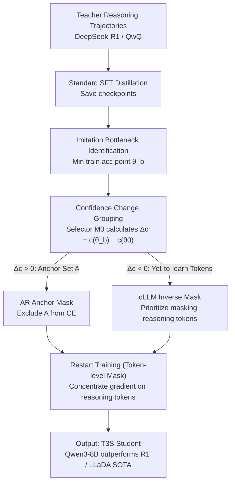

# T3S: Training Trajectory-Aware Token Selection, Breaking the "Imitation Shock" in Reasoning Distillation

**Conference**: ICML 2026  
**arXiv**: [2601.10348](https://arxiv.org/abs/2601.10348)  
**Code**: Not listed  
**Area**: LLM Distillation / Inference Compression / Training Dynamics  
**Keywords**: Reasoning Distillation, Imitation Shock, anchor token, training trajectory, AR + dLLM

## TL;DR
This paper discovers a universal "Imitation Shock" when a strong student (e.g., Qwen3-8B) is distilled from DeepSeek-R1—where loss decreases monotonically, but accuracy first plunges before recovering. The root cause is that "Imitation-Anchor Tokens" dominate optimization in early stages, suppressing the tokens truly responsible for reasoning. T3S identifies anchor tokens via training trajectories and masks them, allowing yet-to-learn reasoning tokens to be learned earlier. This achieves performance gains in both AR and dLLM settings (Qwen3-8B surpasses DeepSeek-R1, Qwen3-32B approaches Qwen3-235B, and LLaDA-2.0-Mini achieves a 16B no-think SOTA by surpassing AR baselines).

## Background & Motivation

**Background**: When student LLMs already possess strong reasoning capabilities (e.g., Qwen3-8B), the community seeks to further enhance them by distilling from stronger teachers (DeepSeek-R1, QwQ). Existing efficient distillation works (s1, LIMR, BOBA) have proven that a few hundred high-quality trajectories are more effective than massive data, but they focus on "how to select data" without analyzing whether the "training dynamics are healthy."

**Limitations of Prior Work**: Direct distillation of Qwen3-8B from DeepSeek-R1 shows a continuous decrease in loss, yet metrics like AIME24/AIME25/MMLU-Pro first crash to a certain point before slowly recovering. The authors term this "Imitation Shock" and identify the lowest accuracy checkpoint as the "Imitation Bottleneck." More curiously, discarding all parameter updates before this bottleneck and keeping only subsequent updates (termed Recovering Residual Transfer) yields better results than standard SFT. This implies that "knowledge learned during the pre-bottleneck stage is unnecessary or even harmful."

**Key Challenge**: Teacher outputs contain "easy-to-imitate tokens without reasoning gain" (e.g., format tokens, conjunctions, common expressions) and "actual reasoning tokens" (e.g., key equations, intermediate derivations). Under the next-token CE loss of SFT, the former generate larger gradients and converge faster, "anchoring" the model to the teacher's style while suppressing the learning of the latter. Consequently, the student appears to "imitate the teacher," but its actual reasoning capability declines first—a typical case of "penny wise, pound foolish."

**Goal**: Systematically locate these "anchor tokens" using training trajectory signals and exclude them from the loss to allow reasoning tokens to be learned earlier, thereby avoiding the compute wasted at the Imitation Bottleneck.

**Key Insight**: The key to token-level intervention is "how to find anchor tokens." The authors found a unified signal: anchor tokens show a monotonic increase in confidence from the base to the bottleneck checkpoint ($\Delta c_t > 0$), whereas reasoning tokens show a monotonic decrease. Thus, T3S consists of finding the bottleneck, sorting by confidence difference, and masking the increasing group.

**Core Idea**: Use confidence changes along the training trajectory $\Delta c_t = c_t(\theta_b) - c_t(\theta_0)$ to distinguish between the two types of tokens. For AR, anchor set $\mathcal{A}$ is masked from the loss. For dLLM, anchors are preferentially placed into the visible context, forcing the mask to focus on yet-to-learn tokens, bypassing Imitation Shock at the level of training dynamics.

## Method

### Overall Architecture

T3S aims to solve the phenomenon where accuracy crashes and then recovers during strong-to-strong distillation. The approach involves identifying the crash point and then removing tokens that dominate optimization prior to that point from the loss. The process follows three steps: first, run a standard SFT and save checkpoints to locate the Imitation Bottleneck $\theta_b$ at the minimum training accuracy; second, utilize a selector model $M_0$ to calculate log-probs at base $\theta_0$ and $\theta_b$ to group tokens by the difference $\Delta c_t$; third, restart training with a token-level mask based on $\Delta c_t$. AR masks anchor tokens ($\Delta c_t > 0$) from the CE loss, while dLLM does the opposite—prioritizing the masking of reasoning tokens to force the model to reconstruct them given anchor tokens. This monitoring can be performed online: track training accuracy and switch to mask mode upon detecting a bottleneck.

### Key Designs

**1. Imitation Bottleneck Identification + Recovering Residual Transfer: Identifying the masking start point and proving early updates are redundant.**

The first step of T3S is identifying when the model is actually worsening. The authors define the bottleneck as the checkpoint with the lowest training accuracy: $\theta_b = \arg\min_\theta \mathrm{Acc}_{\mathrm{train}}(\theta)$. To prove that parameter updates before the bottleneck are redundant or harmful, they conducted Recovering Residual Transfer (RRT) experiments: discarding all pre-bottleneck updates and constructing $\theta_{\mathrm{RRT}} = \theta_0 + (\theta_f - \theta_b)$. Counter-intuitively, while standard SFT let Qwen3-8B distilled from DeepSeek-R1 drop from 71.46 to 63.13 ($\downarrow 8.33$) on BOBA-200, RRT improved it to 72.61 ($\uparrow 1.15$). This refutes the notion that "decreasing training loss equals model improvement"; loss reduction can stem entirely from overfitting anchor tokens.

**2. Confidence Change Grouping + AR Anchor Mask: Identifying and cutting off dominant optimization tokens.**

After determining *when* to mask, the next step is *what* to mask. Anchor tokens show a monotonic rise in confidence during early distillation. The selector $M_0$ calculates log-probs $c_t(\theta; x, y) = \log p_\theta(y_t | y_{<t}, x)$ to determine the difference $\Delta c_t = c_t(\theta_b) - c_t(\theta_0)$. Tokens with $\Delta c_t > 0$ are classified as Imitation-Anchor Tokens:

$$\mathcal{A}(x,y) = \{t : \Delta c_t > 0\}$$

The AR T3S loss excludes these from CE, focusing the gradient on remaining reasoning tokens:

$$\mathcal{L}_{\mathrm{AR\text{-}T3S}} = \mathbb{E}\Big[\sum_{t \setminus \mathcal{A}} -\log p_\theta(y_t | y_{<t}, x)\Big]$$

Word cloud analysis (Figure 3) confirms that anchor tokens are mostly conjunctions and punctuation, while yet-to-learn tokens are critical formulas and derivations.

**3. Gradient Interaction Evidence: Theoretical support for masking.**

Figure 5 shows that at checkpoints where anchors are not yet learned (large $\mathcal{L}_{\mathrm{anchor}}$), optimizing only for anchors causes a surge in the loss of other tokens (large positive $\Delta \mathcal{L}_{\mathrm{other}}$)—learning anchors indeed suppresses other tokens. Figure 6 quantifies this: anchor gradients can be $17 \times$ larger than other tokens initially, dropping only to $2 \times$ at the bottleneck, with a cosine similarity reaching $-0.4 \sim -0.5$ during the crash phase, indicating strong directional conflict. 

**4. dLLM Inverse Operation: Trajectory-aware masking.**

For Diffusion LLMs (LLaDA-2.0-Mini), the framework is applied in reverse. Since dLLM targets random masked reconstruction, T3S reconstructs yet-to-learn reasoning tokens more frequently by masking them more often while keeping anchor tokens visible.

## Key Experimental Results

### Main Results: AR Setting, Qwen3-8B Distillation

| Method | BOBA-200 AIME24 | BOBA-200 AIME25 | BOBA-200 AVG | S1K-200 AVG |
|------|------|------|------|------|
| BASE | 75.83 | 67.08 | 71.46 | 71.46 |
| SFT (R1) | 71.25 | 55.00 | 63.13 ↓8.33 | 64.17 |
| RRT (R1) | 76.67 | 68.54 | 72.61 ↑1.15 | 73.65 |
| -T3S (R1) (Inverse Mask) | 30.63 | 25.63 | 28.13 | 26.67 |
| **T3S (R1)** | **80.63** | **73.96** | **77.30** | **80.00+** |

T3S improves average performance by +14 points over standard SFT (BOBA-200). The sharp decline of -T3S (inverse mask) validates that the selected token set is highly discriminative.

### Main Results: dLLM Setting + Cross-Scale Validation

- LLaDA-2.0-Mini (16B no-think dLLM) + T3S outperformed the AR baseline of the same architecture, reaching SOTA for 16B-scale no-think models.
- Qwen3-32B + T3S approached Qwen3-235B performance on AIME.

### Key Findings

- **Loss Decrease $\neq$ Model Improvement**: Standard SFT loss decreased while AIME24 performance dropped from 75.83 to 71.25.
- **Anchor Tokens are Format/Conjunctions**: Yet-to-learn tokens are reasoning-heavy.
- **Gradient Dominance**: Anchor token gradients reach $17\times$ the magnitude of others early on with a negative cosine similarity of $-0.4$.
- **Universal Phenomenon**: Imitation Shock occurs across different teachers, datasets, and student scales.

## Highlights & Insights

- **Diagnosing Distillation Failure via Training Dynamics**: First work to link distillation failure to token-level gradient interaction.
- **Simple Intervention, Large Gains**: No change to loss form or architecture; a simple token-level mask yields +14 points.
- **Unified Framework**: Effective for both AR and dLLM.
- **Predictive Signal**: The Imitation Bottleneck can be integrated into standard pipelines for more intelligent training control.

## Limitations & Future Work

- **Dependence on Verifiers/Gold Answers**: Bottleneck detection requires automated correctness signals, making it less direct for open-ended tasks (though RLVR-style datasets satisfy this).
- **Selector Model $M_0$ Sensitivity**: Investigating the impact of cross-architecture selectors is needed.
- **Static Anchor Sets**: Anchor sets are determined at the epoch level; curriculum-style dynamic masking is a potential future direction.
- **Cross-Domain Generalization**: While verified in math and code, other modalities (e.g., visual CoT) require further validation.

## Related Work & Insights

- **vs s1 / LIMR / BOBA**: These focus on data selection; T3S focuses on training intervention. They are orthogonal and can be combined.
- **vs Early Stopping**: While standard early stopping exits at the validation minimum, T3S uses the bottleneck to transition into selective masking.

## Rating

- **Novelty**: ⭐⭐⭐⭐⭐ (Imitation Shock and RRT are novel concepts).
- **Experimental Thoroughness**: ⭐⭐⭐⭐⭐ (Validated across 5 dimensions: teacher, dataset, student, scale, domain).
- **Writing Quality**: ⭐⭐⭐⭐⭐ (Clear logic supported by 4 Takeaways and extensive visualization).
- **Value**: ⭐⭐⭐⭐⭐ (Directly applicable to LLM distillation practitioners).

<!-- RELATED:START -->

## Related Papers

- [\[ICML 2026\] Token Sparse Attention: Efficient Long-Context Inference with Interleaved Token Selection](token_sparse_attention_efficient_long-context_inference_with_interleaved_token_s.md)
- [\[ICML 2026\] ToaSt: Token Channel Selection and Structured Pruning for Efficient ViT](toast_token_channel_selection_and_structured_pruning_for_efficient_vit.md)
- [\[ICLR 2026\] Towards Quantization-Aware Training for Ultra-Low-Bit Reasoning LLMs](../../ICLR2026/model_compression/towards_quantization-aware_training_for_ultra-low-bit_reasoning_llms.md)
- [\[ICML 2026\] Critique-Guided Distillation for Robust Reasoning via Refinement](critique-guided_distillation_for_robust_reasoning_via_refinement.md)
- [\[ICML 2026\] ReQAT: Achieving Full-Precision Reasoning Accuracy with 4-bit Floating-Point Quantization-Aware Training](reqat_achieving_full-precision_reasoning_accuracy_with_4-bit_floating-point_quan.md)

<!-- RELATED:END -->
