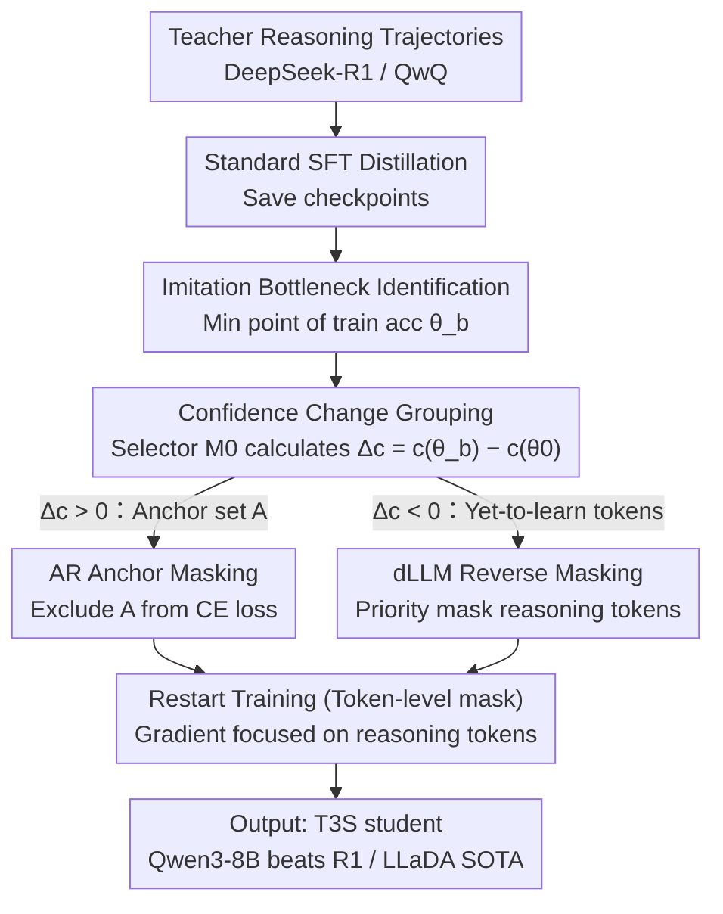

# T3S: Training Trajectory-Aware Token Selection for Decoding 「Imitation Shock」 in Reasoning Distillation

**Conference**: ICML 2026  
**arXiv**: [2601.10348](https://arxiv.org/abs/2601.10348)  
**Code**: Not listed
**Area**: LLM Distillation / Inference Compression / Training Dynamics  
**Keywords**: Reasoning Distillation, Imitation Shock, anchor token, Training Trajectory, AR + dLLM

## TL;DR
The paper identifies a universal "Imitation Shock" when strong student models (e.g., Qwen3-8B) continue distilling from DeepSeek-R1—where loss monotonically decreases but accuracy first plunges before recovering. The root cause is the gradient of early "Imitation-Anchor Tokens" dominating optimization and suppressing tokens responsible for actual reasoning. T3S uses training trajectories to identify and mask these anchor tokens, allowing yet-to-learn reasoning tokens to be learned earlier. This improves performance in both AR and dLLM settings (Qwen3-8B surpasses DeepSeek-R1, Qwen3-32B approaches Qwen3-235B, and LLaDA-2.0-Mini achieves 16B no-think SOTA by surpassing the AR baseline).

## Background & Motivation

**Background**: When student LLMs already possess strong reasoning capabilities (e.g., Qwen3-8B), the community seeks to further enhance them through distillation from stronger teachers (e.g., DeepSeek-R1, QwQ). Existing efficient distillation works (s1, LIMR, BOBA) have proven that a few hundred high-quality trajectories are more effective than massive datasets, but they primarily focus on "how to select data" rather than analyzing "whether the training dynamics are healthy."

**Limitations of Prior Work**: Directly distilling Qwen3-8B from DeepSeek-R1 shows continuously decreasing loss, yet metrics like AIME24/AIME25/MMLU-Pro first crash to a certain point before slowly recovering—a phenomenon the authors term "Imitation Shock," with the lowest checkpoint called the "Imitation Bottleneck." More curiously, discarding all parameter updates before this bottleneck and keeping only subsequent updates (termed Recovering Residual Transfer) yields better results than standard SFT. This implies that "knowledge learned in the pre-bottleneck stage is not necessary and may even be harmful."

**Key Challenge**: Teacher outputs contain "tokens that are easy to imitate but lack reasoning gain" (e.g., format tokens, conjunctions, common expressions) and "tokens that truly carry reasoning" (e.g., key equations, intermediate derivations). Under the next-token CE loss of SFT, the former possess larger gradients and faster convergence, "anchoring" the model to the teacher's style while suppressing the learning of the latter. Consequently, the student appears to "imitate the teacher" while its actual reasoning capability initially declines—a classic case of "focusing on trifles at the expense of essentials."

**Goal**: Systematically locate these "anchor tokens" using training trajectory signals and exclude them from the loss, allowing reasoning tokens to be learned earlier and avoiding computational waste at the Imitation Bottleneck.

**Key Insight**: The key to direct token-level intervention is "how to find anchor tokens." The authors discovered a unified signal for anchor tokens: a monotonic increase in confidence from the base to the bottleneck checkpoint ($\Delta c_t > 0$), whereas reasoning tokens show a monotonic decrease. Thus, "finding the bottleneck → sorting by confidence difference → masking the increasing group" constitutes the entirety of T3S.

**Core Idea**: Use confidence changes along the training trajectory $\Delta c_t = c_t(\theta_b) - c_t(\theta_0)$ to distinguish between the two types of tokens. For AR, anchor set $\mathcal{A}$ is masked from the loss; for dLLM, anchors are preferentially placed in the visible context, forcing the model to repeatedly practice on yet-to-learn reasoning tokens. This bypasses Imitation Shock from the perspective of training dynamics.

## Method

### Overall Architecture

T3S aims to solve the anomaly where accuracy crashes then recovers during the distillation of strong students from strong teachers. The approach involves identifying the crash point and then removing the tokens that dominated optimization before that point from the loss. The process consists of three steps: first, run a standard SFT and save each checkpoint, locating the Imitation Bottleneck $\theta_b$ at the minimum point of training accuracy. Second, use a selector model $M_0$ to calculate the log-prob of each token at base $\theta_0$ and bottleneck $\theta_b$, using the difference $\Delta c_t$ to group tokens. Finally, restart training and construct token-level masks based on $\Delta c_t$: AR masks anchor tokens ($\Delta c_t > 0$) from the CE loss, while dLLM does the opposite by making trajectory-identified reasoning tokens more likely to be masked, forcing the model to reconstruct them given the anchors. This monitoring can be executed online: by tracking training accuracy, one can switch to mask mode upon detecting a bottleneck without running a full distillation cycle beforehand.

### Key Designs

**1. Imitation Bottleneck Identification + Recovering Residual Transfer: Locating the mask timing and proving prior updates are redundant**

The first component of T3S is uncovering when the model is actually degrading. The authors define the bottleneck as the checkpoint with the lowest training accuracy: $\theta_b = \arg\min_\theta \mathrm{Acc}_{\mathrm{train}}(\theta)$. Truly learning reasoning only occurs after this point. To prove pre-bottleneck updates are redundant or harmful, they conducted the Recovering Residual Transfer (RRT) experiment: discarding all pre-bottleneck updates to construct $\theta_{\mathrm{RRT}} = \theta_0 + (\theta_f - \theta_b)$. The results were counter-intuitive—Standard SFT distilling Qwen3-8B from DeepSeek-R1 on BOBA-200 dropped from 71.46 to 63.13 ($\downarrow 8.33$), whereas RRT discarding the first half of updates rose to 72.61 ($\uparrow 1.15$). This explicitly disproves the notion that "decreasing training loss equals model improvement"; loss reduction may stem entirely from over-fitting anchor tokens irrelevant to downstream tasks. RRT establishes an experimental baseline for the necessity of token-level intervention.

**2. Confidence Change Grouping + AR Anchor Masking: Excising dominant optimization tokens from the loss**

Having established the need to mask, the next step is identifying *what* to mask. Anchor tokens show a unified signal of monotonically increasing confidence in early distillation. Using selector $M_0$, the log-prob for each token $c_t(\theta; x, y) = \log p_\theta(y_t | y_{<t}, x)$ is calculated. The difference $\Delta c_t = c_t(\theta_b) - c_t(\theta_0)$ is used to define Imitation-Anchor Tokens:

$$\mathcal{A}(x,y) = \{t : \Delta c_t > 0\}$$

These are tokens learned effortlessly by the model early on. The AR-T3S loss excludes them from the CE calculation, focusing gradients solely on remaining reasoning tokens:

$$\mathcal{L}_{\mathrm{AR\text{-}T3S}} = \mathbb{E}\Big[\sum_{t \setminus \mathcal{A}} -\log p_\theta(y_t | y_{<t}, x)\Big]$$

Word cloud analysis (Figure 3) provides intuitive support: anchor tokens are mostly conjunctions, punctuation, and transition phrases, while yet-to-learn tokens comprise key equations and intermediate steps. Rather than tuning hyperparameters, T3S surgically removes these "easy to imitate but non-gain" tokens at the loss level. A "Reverse-T3S" diagnostic (training only on anchors) caused performance to crash from 71.46 to 26.67, confirming the high discriminative power of the T3S selection.

**3. Gradient Interaction Evidence: Incompatibility between anchors and yet-to-learn tokens**

T3S tracks the necessity of masking to the gradient level. Intervention experiments in Figure 5 show that at checkpoints where anchors aren't yet fully learned (large $\mathcal{L}_{\mathrm{anchor}}$), an update step optimizing only anchors causes a surge in other tokens' loss (large positive $\Delta \mathcal{L}_{\mathrm{other}}$)—anchor learning indeed suppresses other tokens. Figure 6 quantifies this dominance: anchor token gradients can be $17 \times$ the magnitude of other tokens early on, only dropping to $2 \times$ at the bottleneck, while the cosine similarity between the two groups reaches $-0.4 \sim -0.5$ during the crash phase, indicating strong directional conflict.

**4. dLLM Reverse Operation: Replacing random masks with trajectory-aware masks**

The trajectory-aware selection framework is reversed for Diffusion LLMs (LLaDA-2.0-Mini). Since dLLM's objective is random masked reconstruction, T3S does not exclude anchors but rather masks trajectory-identified yet-to-learn reasoning tokens **more frequently**. This forces the model to reconstruct reasoning tokens given the anchor tokens, concentrating training compute on the truly difficult tokens.

## Key Experimental Results

### Main Results: AR setting, Qwen3-8B Distillation

| Method | BOBA-200 AIME24 | BOBA-200 AIME25 | BOBA-200 AVG | S1K-200 AVG |
|------|------|------|------|------|
| BASE | 75.83 | 67.08 | 71.46 | 71.46 |
| SFT (R1) | 71.25 | 55.00 | 63.13 ↓8.33 | 64.17 |
| RRT (R1) | 76.67 | 68.54 | 72.61 ↑1.15 | 73.65 |
| -T3S (R1) (Reverse mask) | 30.63 | 25.63 | 28.13 (Crash) | 26.67 |
| **T3S (R1)** | **80.63** | **73.96** | **77.30** | **80.00**+ |

T3S improves by an average of +14 points over standard SFT (BOBA-200) and exceeds RRT by +5 points, indicating that token-level masking is more refined than parameter-level surgery.

### Main Results: dLLM setting + Cross-scale Validation

- LLaDA-2.0-Mini (16B no-think dLLM) + T3S surpasses its AR baseline, achieving SOTA for 16B-scale no-think models.
- Qwen3-32B + T3S approaches the AIME performance of Qwen3-235B, demonstrating effectiveness across student scales.

### Key Findings

- **Loss decrease $\neq$ model improvement**: On BOBA-200, SFT loss decreases monotonically while AIME24 accuracy drops from 75.83 to 71.25.
- **Anchor tokens are placeholders/conjunctions; yet-to-learn are reasoning tokens**: The word cloud (Figure 3) shows anchor alignment with conjunctions and connectors.
- **Prolonged training does not solve the issue**: Even after 15 epochs on BOBA-200, 68.51% of tokens still have lower confidence than the base model (Table 2).
- **Gradient ratio of 17x + cosine -0.4**: Anchor gradients dominate in magnitude and conflict in direction.

## Highlights & Insights

- **Diagnosing distillation failure via training dynamics**: Unlike previous works modifying data or loss functions, this paper traces continual distillation failure to token-level gradient interactions.
- **Simple intervention with significant gains**: T3S requires no change to loss forms or architectures and no extra data—just a token-level mask on CE loss yields a 14-point gain.
- **Universal AR and dLLM compatibility**: The unified selection framework succeeds on both paradigms, leading to a rare reasoning-task victory for dLLM with LLaDA-2.0-Mini.
- **Disruptive nature of RRT experiments**: The finding that "discarding pre-bottleneck updates is better" challenges the "more training is better" assumption.

## Limitations & Future Work

- **Dependence on verifier/gold answers**: Bottleneck detection relies on training accuracy, requiring automatically verifiable correctness signals (e.g., RLVR-style data).
- **Sensitivity to selector model $M_0$**: The choice of model affects $\Delta c_t$ estimation; while the paper uses the base student, the impact of cross-architecture selectors requires further study.
- **Static anchor sets**: Anchor sets are determined once at the bottleneck; dynamic curricula for masking represent a future direction.

## Related Work & Insights

- **vs s1 / LIMR / BOBA**: These focus on "data selection," while T3S focuses on "training intervention."
- **vs BERT-era Distillation**: Previous methods focused on logit/attention mimicry; T3S focuses on multi-step training dynamics.
- **vs Early Stopping**: While early stopping exits at the validation minimum, T3S performs selective masking during training to preserve the benefits of subsequent updates.

## Rating

- Novelty: ⭐⭐⭐⭐⭐ 
- Experimental Thoroughness: ⭐⭐⭐⭐⭐ 
- Writing Quality: ⭐⭐⭐⭐⭐ 
- Value: ⭐⭐⭐⭐⭐ 

<!-- RELATED:START -->

## Related Papers

- [\[ICLR 2026\] π-Flow: Policy-Based Few-Step Generation via Imitation Distillation](../../ICLR2026/model_compression/pi-flow_policy-based_few-step_generation_via_imitation_distillation.md)
- [\[ICML 2026\] Token Sparse Attention: Efficient Long-Context Inference with Interleaved Token Selection](token_sparse_attention_efficient_long-context_inference_with_interleaved_token_s.md)
- [\[ICLR 2026\] Parallel Token Prediction for Language Models](../../ICLR2026/model_compression/parallel_token_prediction_for_language_models.md)
- [\[CVPR 2026\] Hybrid Token Compression for Vision-Language Models](../../CVPR2026/model_compression/hybrid_token_compression_for_vision-language_models.md)
- [\[CVPR 2026\] Saliency-Driven Token Merging for Vision Transformers](../../CVPR2026/model_compression/saliency-driven_token_merging_for_vision_transformers.md)

<!-- RELATED:END -->
