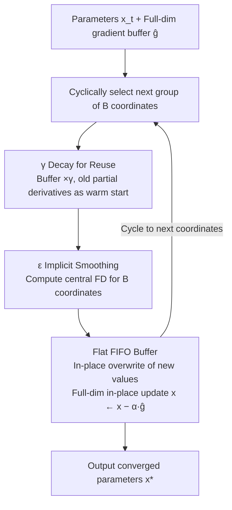

# Turning Stale Gradients into Stable Gradients: Coherent Coordinate Descent with Implicit Landscape Smoothing for Lightweight Zeroth-Order Optimization

**Conference**: ICML 2026  
**arXiv**: [2605.14373](https://arxiv.org/abs/2605.14373)  
**Code**: https://github.com/chen-dylan-liang/CoCD (Available)  
**Area**: Model Compression / Zeroth-Order Optimization / Edge Training  
**Keywords**: Zeroth-order optimization, Coordinate descent, Stale gradients, Implicit smoothing, On-device learning  

## TL;DR
This paper stores "stale" block-cyclic coordinate descent gradient estimates in a FIFO buffer, reuses them with momentum decay, and proves this is equivalent to BCCD with a warm-start. Simultaneously, it provides the counter-intuitive conclusion that a larger finite-difference step size $\epsilon$ implicitly smooths the loss landscape and reduces the effective Lipschitz constant, allowing stale gradients to achieve stable descent.

## Background & Motivation

**Background**: Current Zeroth-Order (ZO) optimization follows two main schools: classic coordinate-wise Finite Difference (FD), which has extremely low variance but lacks scalability due to $O(d)$ function evaluations per step; and modern stochastic methods (Evolution Strategies / SPSA / random subspaces like DeepZero), which require only $O(1)$ evaluations per step but suffer from high gradient variance, necessitated by very small learning rates or large batches to suppress noise.

**Limitations of Prior Work**: Both schools have critical weaknesses. The FD school is "accurate but slow," making it inapplicable to large models. The stochastic school is "fast but unstable," prone to divergence on non-convex landscapes and even failing on certain regression tasks (e.g., SARCOS). Furthermore, two implicit consensuses exist: "stale gradients are lag/noise and should be discarded" and "smaller $\epsilon$ in finite difference is always better as it nears the true gradient." This paper directly challenges both.

**Key Challenge**: There is a hard trade-off between the variance of a single ZO estimate and the sample efficiency of multiple estimates; meanwhile, the noise introduced by randomization often masks the geometric structural information of the landscape itself.

**Goal**: (1) Design a deterministic, $O(1)$-budget, low-variance ZO optimizer; (2) prove that stale gradients can be "reused rather than discarded"; (3) prove that a large $\epsilon$ is a feature, not a bug.

**Key Insight**: The authors observe "temporal coherence" in the optimization trajectory—gradients of adjacent steps can only change slightly, constrained by Lipschitz smoothness. Consequently, the partial derivative calculated in the previous step remains largely valid for the next; discarding it is wasteful. Additionally, a large $\epsilon$ is equivalent to averaging within a coordinate neighborhood, performing implicit Gaussian smoothing on the objective function.

**Core Idea**: Maintain a dense gradient buffer. In each step, refresh FD for only $B$ coordinates and reuse decayed old values for the rest to form a "hybrid gradient" for descent—essentially Block Cyclic Coordinate Descent with a momentum-style warm start.

## Method

### Overall Architecture
CoCD (Coherent Coordinate Descent) aims for a deterministic, low-variance ZO optimizer with $O(1)$ function evaluations per step. It treats "previously calculated partial derivatives" as assets to be reused. It maintains a dense gradient buffer $\hat{\mathbf{g}} \in \mathbb{R}^n$ of the same size as the parameters. Global parameters $\mathbf{x}_t$ select the next set of coordinates in cyclic order. Each step first decays the entire buffer $\hat{\mathbf{g}}_{t-1}^{\text{decay}} = \gamma \cdot \hat{\mathbf{g}}_{t-1}$, then calculates new values for the $B$ selected coordinates using central finite difference $\tilde{\nabla}_i f(\mathbf{x}_t) = \frac{f(\mathbf{x}_t+\epsilon\mathbf{e}_i)-f(\mathbf{x}_t-\epsilon\mathbf{e}_i)}{\epsilon}$ to overwrite the corresponding buffer positions. Finally, a full-dimensional update is performed: $\mathbf{x}_{t+1} = \mathbf{x}_t - \alpha \hat{\mathbf{g}}_t$. Thus, only $B$ coordinates ($B \ll n$) require actual FD computation per step, yet the descent direction remains full-dimensional, with most components coming from decayed stale values.

### Key Designs

**1. Connecting "Discarding Stale" and "Perfect Memory" via a Decay Factor $\gamma$**

The dilemma of ZO optimization is the high variance of single estimates versus the high cost of multiple estimates. While distributed SGD suggests stale gradients are delayed noise, CoCD proves otherwise: since gradient changes between consecutive steps are constrained by Lipschitz smoothness, the previous partial derivative is a nearly free "warm start," much more stable than step-wise random estimates. A scalar $\gamma \in [0,1]$ connects the spectrum: when $\gamma=0$, the buffer clears every step, reverting to classic BCCD (only $B$ coordinates are active); when $\gamma=1$, stale gradients are kept until refreshed, equivalent to full-gradient descent with time-lagged gradients; $0 < \gamma < 1$ creates a "fading memory" where old gradients are exponentially diminished, providing robustness for highly non-convex landscapes.

**2. Turning Finite Difference Step Size $\epsilon$ from an Error Source into a Landscape Smoother**

Traditional FD literature treats $\epsilon \to 0$ as a gold standard, but on non-convex landscapes, this injects high-frequency noise into gradient estimates. The authors view central difference as averaging the true gradient in a neighborhood: $\tilde{\nabla}_i^\epsilon f(\mathbf{x}) = \frac{1}{2\epsilon}\int_{-\epsilon}^{\epsilon}\nabla_i f(\mathbf{x}+u\mathbf{e}_i)\,du$. Thus, $\epsilon$ is an implicit Gaussian smoothing radius. Defining the effective Lipschitz constant $L_\epsilon$ after smoothing, one can prove $L_\epsilon \le L$, and it decreases monotonically as $\epsilon$ increases. This directly enters the CoCD approximation error bound:

$$\|\hat{\mathbf{g}}_t - \tilde{\nabla}^\epsilon f(\mathbf{x}_t)\| \le \frac{L_\epsilon \delta}{2}\big(BK(K-1)+2rK\big),\quad K=\lfloor n/B\rfloor.$$

A smaller $L_\epsilon$ allows for a larger step size $\delta$ for the same degree of staleness—meaning a larger $\epsilon$ makes reusing stale gradients safer.

**3. Minimizing Memory to "One Set of Parameters" using Flat FIFO Buffer + Virtual Indexing**

For edge devices, memory is a hard constraint. Mapping neural network parameters (tensors of various shapes) to a flat buffer usually involves high-cost reshape/concat operations. CoCD's engineering trick is pre-allocating a contiguous 1D memory for the FIFO buffer and using integer pointers to maintain mappings from flat indices to tensor views. The descent phase performs in-place subtraction $\mathbf{x} \leftarrow \mathbf{x} - \alpha \hat{\mathbf{g}}$ directly on temporary tensor views. This ensures the optimizer memory strictly equals one copy of the parameters—more efficient than Adam (2 moments) or even SPSA (projection matrices).

### Loss & Training
No new loss functions are introduced; only the optimizer is replaced. Theoretically, CoCD is proven to have linear convergence under L-smooth + PŁ conditions: $f(\mathbf{x}_t)-f(\mathbf{x}^*) \le (1-\frac{2\mu C_1}{C_2})^t (f(\mathbf{x}_0)-f(\mathbf{x}^*))$, where the staleness factor $\tau = n/B - 1$ requires a learning rate $\alpha < \frac{2}{L(1+n\tau)}$.

## Key Experimental Results

### Main Results
Model sizes range from 13k to 270k parameters (MLP/CNN/ResNet-20) on datasets SARCOS (regression), MNIST, and CIFAR-10.

| Dataset | Method | Final Metric | Time (s/epoch) |
|--------|------|----------|---------------|
| SARCOS | SGD (Oracle, 1st-order) | Loss 5.38 | – |
| SARCOS | BCCD ($\gamma=0$) | 188.73 | 6.23 |
| SARCOS | **CoCD (Ours)** | **31.18** | 6.12 |
| MNIST | BCCD | 27.03% | ~44.4 |
| MNIST | **CoCD** | **95.48%** | ~44.6 |
| CIFAR-10 | BCCD | 10.13% (Random) | ~77.0 |
| CIFAR-10 | **CoCD** | **45.08%** | ~77.0 |

### Ablation Study

| Configuration | Key Finding |
|------|---------|
| $\gamma$ Sweep | $\gamma=0$ is slowest; faster convergence as $\gamma \to 1$. |
| $\epsilon$ Sweep (SARCOS) | Larger $\epsilon$ leads to lower loss (implicit smoothing effect). |
| $\epsilon$ Sweep (MNIST) | Large $\epsilon$ yields smoother training curves and better stability. |
| Memory $M=0.25n$ | Still converges, validating the robustness of the partial buffer. |
| CoCD vs SPSA | CoCD converges stably while SPSA diverges on SARCOS. |

### Key Findings
- **Momentum $\gamma$ is the most critical hyperparameter**: It defines the performance gap between CoCD and BCCD.
- **Counter-intuitive benefits of large $\epsilon$** are most significant in non-convex regression; in classification, it primarily improves training smoothness.
- **Wall-clock efficiency is superior to stochastic ZO**: Deterministic updates avoid the overhead of Gaussian sampling and large batch processing.

## Highlights & Insights
- **Inversion of "Stale = Noise"**: While distributed SGD literature views stale gradients as uncontrollable lag, this paper proves that under cyclic structures and temporal coherence, staleness is a "warm start"—nearly free geometric information.
- **Theoretical-Empirical Alignment**: The error bound directly predicts that smaller $L_\epsilon$ (from larger $\epsilon$) tolerates larger step sizes, which is empirically validated.
- **Transferable Trick**: The $\gamma/\epsilon$ adjustment dual-tuning can be applied to any scenario using stale approximations, such as Federated Learning or low-precision training.

## Limitations & Future Work
- **Scalability Ceiling**: For parameters exceeding 270k, $B$ must increase significantly for accurate FD estimates, which may become impractical for massive LLMs.
- **Hyperparameter Sensitivity**: $\gamma, \epsilon, B, m$ have complex interactions and currently required manual tuning.
- **Theoretical Assumptions**: Linear convergence relies on PŁ conditions, which deep networks often do not satisfy.
- **Comparison with MeZO**: Comparison with LLM-specific ZO methods like MeZO is left for future work.

## Related Work & Insights
- **vs. DeepZero**: DeepZero uses pruning at initialization to select random subspaces; CoCD performs true full-space cyclic optimization, avoiding structural bias at the cost of being limited to medium-sized models.
- **vs. SPSA/ES**: Those methods rely on random perturbations (high variance); CoCD is deterministic and replaces explicit Gaussian smoothing with implicit smoothing via large $\epsilon$.

## Rating
- Novelty: ⭐⭐⭐⭐ (Turning stale into warm-start + implicit smoothing)
- Experimental Thoroughness: ⭐⭐⭐ (Small model scales, but extensive ablations)
- Writing Quality: ⭐⭐⭐⭐⭐
- Value: ⭐⭐⭐⭐ (Provides transferable insights for edge and black-box optimization)

<!-- RELATED:START -->

## Related Papers

- [\[ICLR 2026\] Fine-tuning Quantized Neural Networks with Zeroth-order Optimization](../../ICLR2026/model_compression/fine-tuning_quantized_neural_networks_with_zeroth-order_optimization.md)
- [\[ICML 2026\] GradPower: Powering Gradients for Faster Language Model Pre-Training](gradpower_powering_gradients_for_faster_language_model_pre-training.md)
- [\[CVPR 2026\] FOZO: Forward-Only Zeroth-Order Prompt Optimization for Test-Time Adaptation](../../CVPR2026/model_compression/fozo_forward-only_zeroth-order_prompt_optimization_for_test-time_adaptation.md)
- [\[ACL 2025\] Wanda++: Pruning Large Language Models via Regional Gradients](../../ACL2025/model_compression/wanda_pruning_large_language_models_via_regional_gradients.md)
- [\[ICML 2026\] Bounded Hyperbolic Tangent: A Stable and Efficient Alternative to Pre-Layer Normalization in Large Language Models](bounded_hyperbolic_tangent_a_stable_and_efficient_alternative_to_pre-layer_norma.md)

<!-- RELATED:END -->
