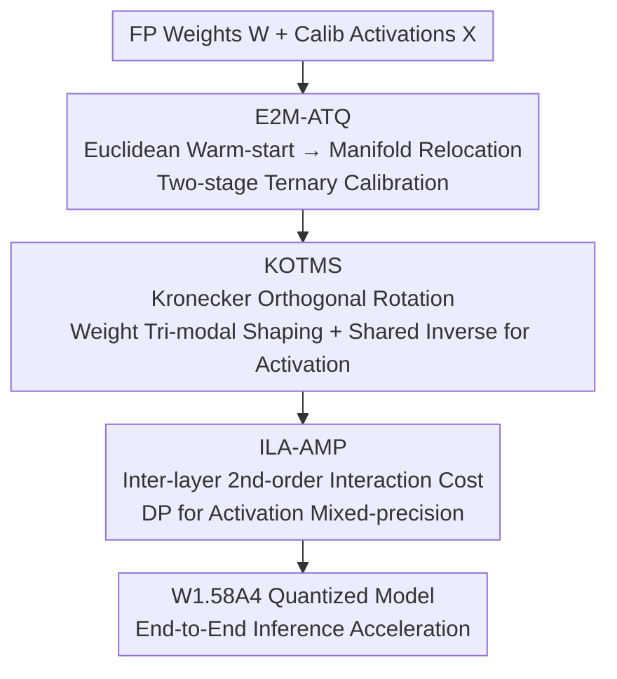

# TWLA: Achieving Ternary Weights and Low-Bit Activations for LLMs via Post-Training Quantization

**Conference**: ICML 2026  
**arXiv**: [2606.13054](https://arxiv.org/abs/2606.13054)  
**Code**: https://github.com/ (Paper denotes TWLA, ⚠️ verify the specific repository address with the original text)  
**Area**: Model Compression / Post-Training Quantization / Large Language Models  
**Keywords**: Ternary Quantization, Post-Training Quantization, Activation Quantization, Orthogonal Rotation, Mixed Precision

## TL;DR
TWLA is the first **post-training quantization** (PTQ) framework capable of simultaneously compressing weights to 1.58-bit (ternary) and activations to 4-bit. By employing a "two-stage ternary calibration from Euclidean to manifold + Kronecker orthogonal rotation for tri-modal weight shaping and outlier suppression + inter-layer aware activation mixed-precision allocation" trio, it maintains high accuracy under W1.58A4 and achieves true end-to-end inference acceleration.

## Background & Motivation
**Background**: LLMs rely on massive parameter scales to achieve high capability, but models with tens or hundreds of billions of parameters create memory and compute bottlenecks for deployment (e.g., DeepSeek-R1-671B requires $\ge1$TB for FP16 weights alone). Quantization is a core compression method, where **ternarization** constrains weights to $\{-1, 0, +1\}$. This offers high compression ratios and replaces most floating-point multiplications with additions and branching, representing an extreme compression paradigm.

**Limitations of Prior Work**: Existing ternary methods (such as TernaryLLM and PT2-LLM) almost exclusively focus on **weight-only quantization**. They lack systematic modeling for activation quantization, leading to accuracy collapse when activations are compressed at low bit-widths. Consequently, they keep activations in full precision and dequantize ternary weights during inference, which **fundamentally blocks end-to-end acceleration** as the overhead for activations and dequantization remains. A few solutions (like BitNet v2) support ternary weights with 4-bit activations but depend on expensive Quantization-Aware Training (QAT), reporting training costs exceeding $10^4$ GPU hours, making them non-transferable to arbitrary pre-trained models.

**Key Challenge**: The authors re-examine the statistical properties of weights and activations, identifying two mismatches. First, the per-channel weights of pre-trained LLMs often approximate a **unimodal Gaussian** distribution, whereas the ternary codebook $\{-1, 0, +1\}$ naturally corresponds to a **tri-modal** structure—projecting unimodal distributions into ternary space incurs massive quantization error. Second, activations exhibit **heavy tails with extreme outliers**, which dominate distortion at low bit-widths.

**Goal**: Within a PTQ (no retraining) framework, simultaneously ❶ **reshape the weight distribution into a tri-modal form compatible with ternary values** and ❷ **suppress activation outliers to mitigate heavy tails**, enabling ternary weights and low-bit activations to work synergistically.

**Key Insight**: Use a set of shared Kronecker orthogonal rotations to rotate the weight coordinate system toward a tri-modal-friendly direction, while using the inverse of the same rotation to "smear" activations and statistically reduce outliers. This is complemented by two-stage ternary calibration and inter-layer aware mixed-precision allocation.

## Method

### Overall Architecture
TWLA (Ternarized Weights and Low-bit Activations) is a retraining-free PTQ framework consisting of three tightly coupled modules. Given a full-precision weight matrix $\mathbf{W}\in\mathbb{R}^{n\times m}$, **E2M-ATQ** first performs two-stage ternary calibration to obtain stable ternary patterns and continuous shift/scale parameters. Then, **KOTMS** learns a Kronecker-structured orthogonal rotation $\mathbf{R}$ to reshape weights into a symmetric tri-modal distribution while using the inverse rotation to suppress activation outliers. Finally, **ILA-AMP** allocates activation bits across layers under a global bit budget, accounting for "inter-layer second-order interaction costs" to prevent cascading accuracy collapse. The result is a W1.58A4 model for end-to-end inference.

### Key Designs

**1. E2M-ATQ: Two-stage ternary calibration from Euclidean to Manifold, aligning ternary parameters with "layer output"**

Pre-trained weights often have non-zero row means, violating the symmetry assumptions of low-bit quantization. Thus, an **asymmetric ternary parameterization** is adopted: $\bar{\mathbf{W}}=\bm\mu\mathbf{1}^\top+\mathrm{diag}(\bm\alpha)\mathbf{T}$, where $\bm\mu,\bm\alpha$ are per-row shift/scale parameters and $\mathbf{T}\in\{-1,0,1\}^{n\times m}$. The challenge is that optimizing $\mathbf{T}$ directly for "layer output alignment" turns element-wise thresholding into a difficult combinatorial optimization due to cross-column correlations introduced by calibration. The solution is two stages. **Stage 1 (Euclidean Warm-start)** minimizes the Frobenius reconstruction error $L_1=\lVert\mathbf{W}-\bm\mu\mathbf{1}^\top-\mathrm{diag}(\bm\alpha)\mathbf{T}\rVert_F^2$ in the weight domain, alternately updating $\bm\mu$ (residual mean correction $\bm\mu\leftarrow\bm\mu+\frac1m\mathbf{E}\mathbf{1}$), $\bm\alpha$, and $\mathbf{T}$ until convergence to obtain a stable ternary pattern $\mathbf{T}^{(0)}$. **Stage 2 (Manifold Relocation)** freezes $\mathbf{T}=\mathbf{T}^{(0)}$ and minimizes the **layer output error** $L_2=\mathrm{Tr}(\mathbf{E}\mathbf{S}\mathbf{E}^\top)$ (where $\mathbf{S}=\sum_b\mathbf{X}_b^\top\mathbf{X}_b$ is the second moment of activations) on the metric manifold. Since $\mathbf{T}$ is fixed, the objective decouples by row, allowing $(\mu_i,\alpha_i)$ to be solved via a $2\times2$ linear system for a **closed-form solution**. This avoids combinatorial search for $\mathbf{T}$ while upgrading the objective from weight similarity to output fidelity.

**2. KOTMS: Kronecker Orthogonal Rotation for weight tri-modal shaping and activation outlier suppression**

E2M-ATQ only tunes continuous parameters without addressing the geometric mismatch. KOTMS introduces a learnable orthogonal transformation $\mathbf{z}_i=\mathbf{w}_i\mathbf{R}$ and uses a **Tri-modal Gaussian Mixture Model (TriGMM)** as a differentiable proxy for ternary codebook alignment:

$$\mathcal{L}_{\mathrm{TriGMM}}=-\frac{1}{nm}\sum_{i,j}\log\big[\pi_+\phi(z_{ij};+c_i,\sigma_i^2)+\pi_0\phi(z_{ij};0,\sigma_i^2)+\pi_-\phi(z_{ij};-c_i,\sigma_i^2)\big],$$

The three anchors $\{-c_i, 0, +c_i\}$ correspond to negative/zero/positive ternary regions. Minimizing this pushes transformed weights toward ternary anchors (with a $\mathcal{L}_{\text{zero}}$ regularizer to prevent collapse to zero). To avoid memory/compute explosions from a dense $\mathbf{R}\in\mathbb{R}^{m\times m}$, the authors restrict it to a **Kronecker structure** $\mathbf{R}=\mathbf{R}_1\otimes\mathbf{R}_2$ ($n_1n_2=m$). This ensures strict invertibility ($\mathbf{R}^{-1}=\mathbf{R}^\top=\mathbf{R}_1^\top\otimes\mathbf{R}_2^\top$) and requires storing only two small factors, with computation reduced to compact matrix multiplications. The **key insight** is orthogonal equivalence: the inverse of the same rotation can be applied to activations. Shared rotation scatters concentrated activation directions and statistically reduces heavy-tailed outliers, stabilizing low-bit activation quantization. Optimization uses **Cayley parameterization** $\mathbf{R}_k=(\mathbf{I}+\mathbf{A}_k)^{-1}(\mathbf{I}-\mathbf{A}_k)$ (where $\mathbf{A}_k=\mathbf{S}_k-\mathbf{S}_k^\top$ is skew-symmetric) to ensure strict orthogonality throughout.

**3. ILA-AMP: Building "inter-layer second-order interaction" into bit allocation to prevent cascading collapse**

The benefits of KOTMS for activations are an indirect byproduct of shared rotation, resulting in **high inter-layer variance**. A few poorly-benefited layers become bottlenecks. Most Mixed-Precision Quantization (MPQ) methods assume **independent layer sensitivity** (additive errors), but in LLMs, quantizing layer $\ell$ alters its output distribution, perturbing the input statistics of layer $\ell+1$. These errors amplify across layers, particularly at 2–4 bits. ILA-AMP explicitly models **adjacent layer second-order interaction costs**. Using full 8-bit as a baseline, it defines first-order layer cost $C_\ell(b)$ and adjacent interaction cost $K_{\ell-1,\ell}(b',b)$ (the NLL change when both layers are reduced minus their individual first-order costs). Activation bit allocation is formulated as a chained second-order optimization under a budget:

$$\min_{\{b_\ell\}}\sum_{\ell=1}^{L}C_\ell(b_\ell)+\sum_{\ell=2}^{L}K_{\ell-1,\ell}(b_{\ell-1},b_\ell),\quad \text{s.t. }\sum_\ell b_\ell\le B.$$

Since interactions occur only between adjacent layers, the objective has a chain structure solvable via **Dynamic Programming** to find the globally optimal allocation $\{b_\ell^*\}$ from candidate bits $\{2,4,6,8\}$.

### Loss & Training
The entire process is retraining-free: E2M-ATQ iterates 15 times to ensure parameter convergence; 128 calibration samples (sequence length 2048) are selected from WikiText2; KOTMS orthogonal factors are optimized for 100 steps with a learning rate of 0.01; the same samples are used for ILA-AMP calibration. Experiments were conducted on NVIDIA A6000.

## Key Experimental Results

### Main Results
On LLaMA-2/3 and Qwen3 series, TWLA was compared against 2-bit and sub-2-bit PTQ baselines (GPTQ, QuaRot, SliM-LLM, PB-LLM, ResQ, PT2-LLM). Representative results for LLaMA2-13B across 7 zero-shot tasks (average 0-shot7, ↑) and WikiText2 perplexity (Wiki, ↓):

| Method | #Bits(W) | #Bits(A) | 0-shot7↑ | Wiki↓ |
|------|------|------|------|------|
| FP16 | 16 | 16 | 72.19 | 4.88 |
| PB-LLM | 1.7 | 16 | 26.29 | 335.22 |
| PT2-LLM | 1.58 | 16 | 56.54 | 9.19 |
| **Ours** | **1.58** | **16** | **67.70** | **5.79** |
| PT2-LLM | 1.58 | 4 | 29.07 | ~2e3 |
| SliM-LLM | 2MP | 4 | 26.44 | ~1e3 |
| **Ours** | **1.58** | **4MP** | **64.30** | **6.68** |

Key Observation: Under W1.58A4 (4-bit activation), all other methods collapse (0-shot near random, perplexity in the thousands), while **TWLA maintains a mean accuracy of 64.30 and perplexity of 6.68**, pushing LLMs into the W1.58A4 PTQ regime for the first time. Performance on high-difficulty reasoning benchmarks for Qwen3-32B-Instruct remains stable: MMLU 70.21 / HumanEval 37.58 / GSM8K 48.67 at W1.58A4, whereas competitors yield near-zero scores.

### Ablation Study

| Configuration | Function | Description |
|------|------|------|
| E2M-ATQ | Ternary Calibration | Two-stage alignment of calibration objective with layer output |
| + KOTMS | Shaping + Outlier Suppression | Fixes unimodal weight mismatch and suppresses activation heavy tails |
| + ILA-AMP | Activation Mixed-Precision | Prevents cascading collapse via inter-layer second-order costs |

(Table 3 in the paper validates these components on LLaMA2-13B / Qwen3-14B, showing all three are indispensable.)

### Key Findings
- **Activation is the true bottleneck for end-to-end acceleration**: Weight-only ternary methods keeping full-precision activations save no inference cost; TWLA’s value lies in compressing activations to 4-bit without collapse.
- **Side effects of shared rotation require specific treatment**: The benefit of KOTMS for activations is non-uniform across layers. ILA-AMP’s inter-layer aware allocation is necessary to prevent weak layers from dragging down the whole model—a necessary consequence of breaking the "independent layer sensitivity" assumption.
- **PTQ can achieve QAT-level compression**: Compared to BitNet v2’s $>10^4$ GPU hour QAT, TWLA is retraining-free and transferable with orders of magnitude lower engineering cost.

## Highlights & Insights
- **One rotation, two functions**: Using orthogonal equivalence to share $\mathbf{R}$ between "shaping weights to tri-modal" and "smearing activation outliers" is an elegant design—activation suppression is almost a "free" byproduct of weight shaping.
- **Engineering Kronecker + Cayley**: The Kronecker structure scales the $m\times m$ rotation to two small factors, while Cayley parameterization ensures strict orthogonality, making learned rotations feasible at LLM scales. This can be reused in other rotation-based quantization methods.
- **Modeling inter-layer second-order interactions**: Moving beyond the old assumption of "independent layer sensitivity" to use adjacent layer interaction costs with chained DP is a transferable approach for any scenario where errors propagate across layers.
- **Upgraded perspective on two-stage calibration**: Shifting from "weight reconstruction error" to "layer output error" and rewriting the objective as a closed-form quadratic form using the activation second moment $\mathbf{S}$.

## Limitations & Future Work
- **Dependency on calibration data**: All modules rely on 128 WikiText2 samples; the representativeness of calibration may be insufficient for downstream tasks with large distribution shifts.
- **Real speedup depends on kernel implementation**: While the paper emphasizes end-to-end acceleration, actual throughput for ternary weights with mixed-precision activations is highly dependent on low-level kernel support.
- **Remaining accuracy gap**: There is still a visible gap compared to FP16 at W1.58A4 (e.g., LLaMA2-13B 0-shot 72.19→64.30); the trade-off between extreme compression and accuracy is not fully closed.
- **Future directions**: Exploring learnable or task-adaptive calibration sets, extending inter-layer interaction modeling to non-adjacent layers, and incorporating weight bit-widths into joint mixed-precision allocation.

## Related Work & Insights
- **vs PT2-LLM (PTQ ternary, same weight bits)**: PT2-LLM only quantizes weights and collapses under 4-bit activations; TWLA remains stable due to tri-modal shaping, activation suppression, and mixed-precision.
- **vs BitNet v2 (QAT ternary + 4-bit activation)**: BitNet v2 requires massive QAT ($>10^4$ GPU hours); TWLA is retraining-free and transferable with significantly lower costs.
- **vs ResQ (Rotation + Activation mixed-precision)**: ResQ allocates high precision to high-variance activation subspaces and uses rotation, but still assumes independent layer sensitivity; TWLA explicitly models inter-layer interactions and couples rotation with weight shaping.
- **vs SliM-LLM / PB-LLM (2-bit/sub-2-bit weights)**: These primarily focus on weight-side mixed-precision or partial binarization without systematically solving activation quantization.

## Rating
- Novelty: ⭐⭐⭐⭐⭐ First W1.58A4 PTQ framework; shared orthogonal rotation for weight shaping and activation suppression is ingenious.
- Experimental Thoroughness: ⭐⭐⭐⭐ Broad coverage across LLaMA/Qwen scales and diverse benchmarks; actual speedup depends on kernel implementation.
- Writing Quality: ⭐⭐⭐⭐ Clear explanation of motivations, formulas, and complementary relationships; excellent "before and after" distribution narrative in Fig 2.
- Value: ⭐⭐⭐⭐⭐ Significant for edge deployment by making ternary weights + low-bit activations viable in a PTQ setting.

<!-- RELATED:START -->

## Related Papers

- [\[ICML 2026\] NeUQI: Near-Optimal Uniform Quantization Parameter Initialization for Low-Bit LLMs](neuqi_near-optimal_uniform_quantization_parameter_initialization_for_low-bit_llm.md)
- [\[ICML 2026\] LFQ: Logit-aware Final-block Quantization for Boosting the Generation Quality of Low-Bit Quantized LLMs](lfq_logit-aware_final-block_quantization_for_boosting_the_generation_quality_of_.md)
- [\[AAAI 2026\] QuantVSR: Low-Bit Post-Training Quantization for Real-World Video Super-Resolution](../../AAAI2026/model_compression/quantvsr_low-bit_post-training_quantization_for_real-world_video_super-resolutio.md)
- [\[ICLR 2026\] SliderQuant: Accurate Post-Training Quantization for LLMs](../../ICLR2026/model_compression/sliderquant_accurate_post-training_quantization_for_llms.md)
- [\[ICLR 2026\] Quant-dLLM: Post-Training Extreme Low-Bit Quantization for Diffusion Large Language Models](../../ICLR2026/model_compression/quant-dllm_post-training_extreme_low-bit_quantization_for_diffusion_large_langua.md)

<!-- RELATED:END -->
