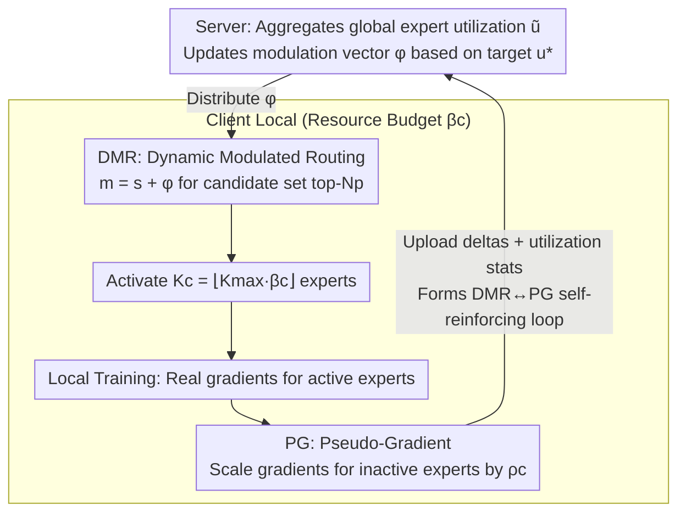

# UB-SMoE: Universally Balanced Sparse Mixture-of-Experts for Resource-Adaptive Federated Fine-tuning of Foundation Models

**Conference**: ICML 2026  
**arXiv**: [2605.16690](https://arxiv.org/abs/2605.16690)  
**Code**: None  
**Area**: Federated Learning / Model Compression / Sparse MoE / LoRA Fine-tuning  
**Keywords**: Federated Fine-tuning, Sparse MoE, Heterogeneous Clients, Dynamic Routing, Pseudo-Gradient  

## TL;DR
The authors identify that directly applying Sparse MoE to heterogeneous federated LoRA fine-tuning leads to "expert utilization imbalance" and "Top-K non-differentiability." They propose Dynamic Modulated Routing (DMR) to rebalance expert activation and Universal Pseudo-Gradient (PG) to provide learning signals for inactive experts, forming a self-reinforcing loop that reduces computation by 45% while achieving an 8.7× performance gain for low-resource clients.

## Background & Motivation
**Background**: The mainstream approach for federated fine-tuning (FFT) of foundation models (FMs) is LoRA—freezing pre-trained weights and injecting low-rank matrices $B\in\mathbb{R}^{d\times r}, A\in\mathbb{R}^{r\times l}$, updating $\Delta W=\frac{\alpha}{r}BA$. To handle system heterogeneity in real-world devices, methods like HetLoRA, FlexLoRA, FLoRA, and FLoRIST assign different ranks $r_c$ to clients, allowing lower-end devices to use smaller adapters.

**Limitations of Prior Work**: The heterogeneous LoRA-rank approach **saves very little**. The computation of the LoRA part $\mathcal{O}(r_c(d+l))$ is naturally much smaller than the FFN part $\mathcal{O}(d\cdot l)$, which remains constant regardless of the rank. Consequently, low-resource clients only save about 5% computation. Furthermore, after merging $W_0+\Delta W$ during inference, the matrix remains dense, resulting in uniform latency across all clients.

**Key Challenge**: To make low-resource clients significantly lighter and faster, the FFN itself must be modified, yet the LoRA-rank approach leaves the FFN untouched. Sparse MoE provides a resource-adaptive mechanism by activating only $K$ experts via conditional computation. However, applying it to heterogeneous federated scenarios triggers two new issues:
1.  **Expert Utilization Imbalance**: High-resource clients activate more experts, leading to "over-specialization" through frequent updates. Low-resource clients activate fewer experts, leaving many experts untrained for long periods, creating a rich-get-richer effect.
2.  **Top-K Routing Non-differentiability**: The gating $\gamma_i(x)=0$ for inactive experts results in zero backpropagated gradients. Small $K_c$ for low-resource clients means most experts receive no learning signals during local training.

**Goal**: (i) Provide a convergence analysis proving that these two discordances introduce an "irreducible error floor" inversely proportional to client resource budgets; (ii) Design a mechanism to address both issues simultaneously; (iii) Demonstrate effectiveness on common-sense reasoning and telecommunication benchmarks, particularly for low-resource clients.

**Key Insight**: The authors observe that expert utilization statistics can be aggregated globally at the server, while gradients for inactive experts can be "approximately reconstructed" based on active experts and router softmax probabilities. Pairing these techniques creates a self-reinforcing cycle: PG maintains the usability of inactive experts $\rightarrow$ DMR routes them back to produce real gradients $\rightarrow$ Real gradients improve the accuracy of PG.

**Core Idea**: Routing logits are dynamically modulated using global utilization statistics (DMR), and inactive experts receive learning signals via pseudo-gradients (PG), with both mechanisms complementing each other.

## Method

### Overall Architecture
UB-SMoE addresses the expert imbalance and gradient deadlock encountered when Sparse MoE is used in heterogeneous federated LoRA fine-tuning with small $K_c$. It injects uniform-rank LoRA adapters into each SMoE layer. The system operates in a closed loop: "Server aggregates global expert utilization $\tilde u_i^{(l)}$ $\rightarrow$ Clients use utilization to modulate routing logits $m^{(l)}_i=s^{(l)}_i+\phi^{(l)}_i$ $\rightarrow$ Experts activated based on resource budget $\beta_c$ as $K_c=\lfloor K_{\max}\beta_c\rfloor$ $\rightarrow$ Inactive experts receive pseudo-gradients scaled by sparsity $\rho_c$ during local training $\rightarrow$ Parameter deltas and utilization stats are uploaded to the server." The DMR and PG mechanisms resolve their respective issues and feed data into each other to form a self-reinforcing cycle.

### Key Designs

**1. Dynamic Modulated Routing (DMR): Reshaping routing with global utilization without destroying specialization**

The goal is to fix the rich-get-richer expert imbalance. Instead of using a standard load balancing loss that might "flatten" specialized experts, DMR decomposes the signal into "semantic suitability" and "systematic under-utilization." It first selects a top-$N_p$ ($K_{\max}\le N_p\ll M$, $N_p=2$ in the paper) candidate set $\mathcal{T}^{(l)}$ using the original affinity $s^{(l)}=W^{(r)}x$. Learnable modulation vectors $\phi^{(l)}_i$ are applied **only within this candidate set**, while logits outside remain unchanged. Then, $p^{(l)}=\text{softmax}(m^{(l)})$ is computed to select the Top-$K_c$ experts. The modulation is driven by global statistics: $\tilde u^{(l)}_i=\sum_c p_c\frac{a^{(l)}_{c,i}}{n^{(l)}_c}$. Compared against the target uniform utilization $u^*=\bar K/M$, it updates via $\tilde\phi^{(l)}_i=\tanh\left(\frac{u^*}{\tilde u^{(l)}_i+\epsilon}-1\right)$ with momentum $\zeta$. Overused experts have their logits suppressed, while underused ones are boosted, but only among semantically relevant candidates.

**2. Universal Pseudo-Gradient (PG): Breaking the Top-K deadlock for inactive experts**

To solve the non-differentiability of Top-K routing, PG provides an "approximate" gradient for inactive experts $i\notin\mathcal{A}_c(x)$ in every batch. This is constructed using the router's softmax probability and the real gradients of active experts, then scaled by the client's sparsity $\rho_c$ (inversely proportional to $K_c/M$). Smaller $K_c$ results in higher pseudo-gradient weight to compensate for the lack of real signals. Mathematically, this relaxes the expected gradient $\nabla_{\Theta^{(e)}_i}F_c$ from "conditional on $i\in\mathcal{A}_c(x)$" to "unconditional," reducing the bias term $B_{c,i}(\Theta)$ defined in the paper. Theorem 4.1 proves that sparse Top-K routing causes SGD to converge to a bias error floor $B_{\text{SMoE}}=2\|B(\Theta^*)\|^2/\mu'$, which Corollary 1 shows is $\propto (M-K_c)$. PG directly attacks this source of bias.

**3. DMR ↔ PG Self-reinforcing Loop and $\phi$ Range Regularization**

Neither mechanism works well in isolation: without DMR, experts with zero gradients cannot contribute even with PG; without PG, experts converge to similar parameters, losing the advantage of MoE. Their loop ensures stability: PG keeps experts learning, making utilization statistics meaningful for DMR, which then schedules more experts to be truly activated, improving the accuracy of PG's estimates. To prevent modulation from exploding, a range regularization $\mathcal{L}_{reg}=\lambda(\|\text{ReLU}(\phi_{\min}-\phi)\|^2_2+\|\text{ReLU}(\phi-\phi_{\max})\|^2_2)$ is added to constrain $\phi^{(l)}$ within $[\phi_{\min},\phi_{\max}]$.

### Loss & Training
Local Loss = LM Loss + DMR Range Regularization $\mathcal{L}_{reg}$. Inactive experts accumulate gradients directly via PG. Clients determine $K_c=\lfloor K_{\max}\beta_c\rfloor$ based on budget $\beta_c\in[0,1]$ with a uniform LoRA rank $r$. The server aggregates LoRA deltas, utilization statistics, and modulation parameters.

## Key Experimental Results

### Main Results
Evaluated on OLMoE-1B-7B using Commonsense-15K and a telecommunication domain dataset. Comparison against 4 LoRA-rank heterogeneous methods (HetLoRA, FlexLoRA, FLoRA, FLoRIST) and 2 heterogeneous sparse methods (SMoE-LLB, A3SMoE).

| Method | Category | Low-Res. ($\beta_1$) ↑ | High-Res. ($\beta_4$) ↑ | Average ↑ |
|------|------|----------------------|----------------------|--------|
| HetLoRA | Hetero-rank | 0.0079 | 0.4580 | 0.1874 |
| FlexLoRA | Hetero-rank | 0.0456 | 0.4563 | 0.3303 |
| FLoRA | Hetero-rank | 0.0094 | 0.2996 | 0.1517 |
| FLoRIST | Hetero-rank | 0.0112 | 0.2724 | 0.1480 |
| A3SMoE | Hetero-sparse | 0.3629 | 0.3410 | 0.3861 |
| **UB-SMoE** | Hetero-sparse | **0.3936** | **0.5240** | **0.4267** |

Low-resource client performance improved from 0.0079 (HetLoRA) to 0.3936 (approx. 8.7× gain), while high-resource performance also surpassed all baselines.

### Ablation Study
| Configuration | Low-Res. Performance | Description |
|------|-----------|------|
| Full UB-SMoE (DMR + PG) | 0.3936 | Complete model |
| w/o PG | Significant drop | Inactive gradients go to zero, bias floor returns |
| w/o DMR | Significant drop | Rich-get-richer returns, few experts dominate |
| candidate set $N_p=2$ | Optimal | Too high ruins semantics; too low lacks flexibility |
| w/o $\mathcal{L}_{reg}$ | $\phi$ Diverges | Modulation explosion disrupts routing |

### Key Findings
- **Genuine Computation Savings**: While LoRA-rank methods save ~5% for low-resource clients, UB-SMoE achieves 45% savings by sparsifying the FFN.
- **Theory-Experiment Alignment**: The bias error floor $B_{\text{SMoE}}\propto(M-K_c)$ from Theorem 4.1 explains why baselines fail at low resource levels. The 8.7× gain at $\beta_1$ confirms that smaller $K_c$ yields higher PG benefits.
- **Mutual Benefit**: Unlike many heterogeneous FL methods that sacrifice high-resource performance to save low-resource clients, UB-SMoE maintains expert diversity, leading to the highest $\beta_4$ performance (0.5240).
- **Manageable Communication**: Only $L(M+1)$ additional dimensions for utilization stats ($M$ experts, $L$ layers) are sent, which is negligible compared to parameter deltas.

## Highlights & Insights
- **Theory-Driven Diagnosis**: Setting up the bias floor as a closed-form $\propto(M-K_c)$ term provides a precise target for method design—a rigorous paradigm rare in systems-oriented papers.
- **Decoupling Structural Affinity and Modulation**: DMR avoids the pitfalls of standard load balancing losses by separating "semantic relevance" from "system utilization," preventing the "flattening" of experts.
- **Physical Meaning of PG**: It essentially approximates the sparse expected gradient as an unconditional expectation, similar to dropout or soft routing, but specifically tailored to client sparsity $\rho_c$ in a federated context.
- **Extensibility**: The framework is applicable to (a) sparse LLMs on edge devices with varying $K_c$, (b) multi-task MoE with heterogeneous activation, and (c) any combination of conditional computation and non-differentiable routing.

## Limitations & Future Work
- Convergence analysis relies on strong assumptions (PL condition, $L$-smoothness, etc.). While reasonable for small LoRA spaces, it remains a simplification.
- PG accuracy depends on router softmax quality; if the router is poorly trained, PG might introduce noise—a factor not quantitatively evaluated.
- Validation is limited to OLMoE-1B-7B and specific domains; scalability for 70B+ models or multimodal MoEs is not yet verified.
- Higher number of hyperparameters (momentum $\zeta$, scaling $\rho_c$, range $[\phi_{\min},\phi_{\max}]$, set size $N_p$) without an automated tuning strategy.

## Related Work & Insights
- **vs. HetLoRA / FlexLoRA / FLoRA / FLoRIST**: These use the "heterogeneous LoRA-rank" route. UB-SMoE uses "heterogeneous sparsity," directly reducing FFN computation and saving 45% rather than 5%.
- **vs. A3SMoE (Tran et al., 2025)**: A3SMoE first introduced SMoE to hetero-FFT but failed to solve the imbalance and non-differentiability. UB-SMoE outperforms it across all budget levels via DMR+PG.
- **vs. Centralized MoE Training**: While load balancing losses are sufficient for centralized training, the "different $K_c$ per client" problem in FL requires global aggregation and resource-aware pseudo-gradients.
- **vs. Standard FedAvg**: UB-SMoE requires aggregating utilization and modulation parameters, but the overhead is minimal ($L(M+1)$ floats), making it engineering-feasible.

## Rating
- Novelty: ⭐⭐⭐⭐ Significant advancement in combining SMoE with hetero-FFT via the DMR+PG loop.
- Experimental Thoroughness: ⭐⭐⭐ Strong domain benchmarks, though lacks massive scale or multimodal validation.
- Writing Quality: ⭐⭐⭐⭐ Clear convergence derivation with a tight link between theory and method.
- Value: ⭐⭐⭐⭐ High practical value for edge federated scenarios, enabling genuine participation of low-resource devices.

<!-- RELATED:START -->

## Related Papers

- [\[ICML 2026\] DAG-MoE: From Simple Mixture to Structural Aggregation in Mixture-of-Experts](dag-moe_from_simple_mixture_to_structural_aggregation_in_mixture-of-experts.md)
- [\[ICLR 2026\] ABBA-Adapters: Efficient and Expressive Fine-Tuning of Foundation Models](../../ICLR2026/model_compression/abba-adapters_efficient_and_expressive_fine-tuning_of_foundation_models.md)
- [\[CVPR 2026\] Teacher-Guided Routing for Sparse Vision Mixture-of-Experts](../../CVPR2026/model_compression/teacher-guided_routing_for_sparse_vision_mixture-of-experts.md)
- [\[CVPR 2026\] Mining Attribute Subspaces for Efficient Fine-tuning of 3D Foundation Models](../../CVPR2026/model_compression/mining_attribute_subspaces_for_efficient_fine-tuning_of_3d_foundation_models.md)
- [\[ICLR 2026\] Unveiling Super Experts in Mixture-of-Experts Large Language Models](../../ICLR2026/model_compression/unveiling_super_experts_in_mixture-of-experts_large_language_models.md)

<!-- RELATED:END -->
