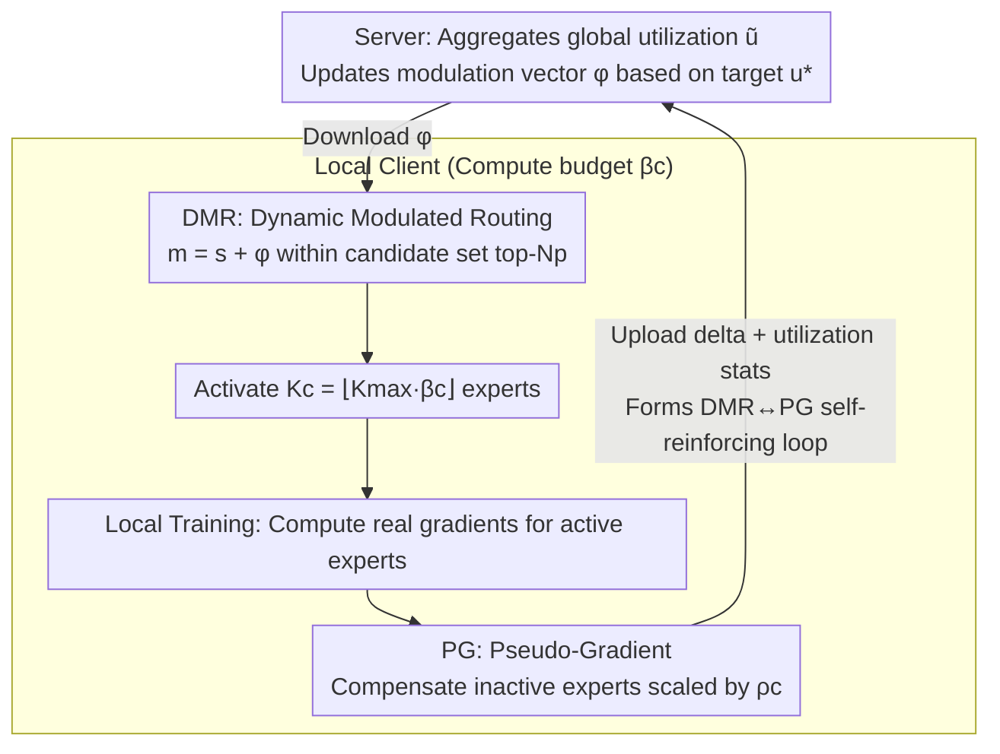

# UB-SMoE: Universally Balanced Sparse Mixture-of-Experts for Resource-Adaptive Federated Fine-tuning of Foundation Models

**Conference**: ICML 2026  
**arXiv**: [2605.16690](https://arxiv.org/abs/2605.16690)  
**Code**: None  
**Area**: Federated Learning / Model Compression / Sparse MoE / LoRA Fine-tuning  
**Keywords**: Federated Fine-tuning, Sparse MoE, Heterogeneous Clients, Dynamic Routing, Pseudo-Gradient

## TL;DR
The authors observe that directly applying Sparse MoE to heterogeneous federated LoRA fine-tuning leads to two critical issues: "expert utilization imbalance" and "non-differentiability of Top-K". They propose Dynamic Modulated Routing (DMR) to rebalance expert activation and Universal Pseudo-Gradient (PG) to provide signals for inactive experts, forming a self-reinforcing cycle. This allows low-compute clients to achieve an 8.7× performance improvement while saving 45% of computation.

## Background & Motivation
**Background**: The mainstream solution for federated fine-tuning (FT) of foundation models (FM) is LoRA, which freezes pre-trained weights and injects low-rank matrices $B\in\mathbb{R}^{d\times r}, A\in\mathbb{R}^{r\times l}$, updating $\Delta W=\frac{\alpha}{r}BA$. To handle system heterogeneity in real devices, methods like HetLoRA, FlexLoRA, FLoRA, and FLoRIST assign different ranks $r_c$ to each client, allowing low-end devices to use smaller adapters.

**Limitations of Prior Work**: The heterogeneous LoRA-rank approach yields **minimal savings**. The computational cost of the LoRA part $\mathcal{O}(r_c(d+l))$ is significantly smaller than the FFN's $\mathcal{O}(d\cdot l)$, and since FFN computation is rank-independent, low-compute clients only save about 5%. Furthermore, during inference, $W_0+\Delta W$ remains a dense matrix, meaning all clients face the same latency.

**Key Challenge**: To make low-compute clients truly lightweight and fast, the FFN itself must be modified, yet the LoRA-rank approach leaves FFN untouched. Sparse MoE naturally provides a resource-adaptive mechanism by activating only $K$ experts via conditional computation. However, deploying it in heterogeneous federated scenarios triggers two new problems:

1.  **Expert Utilization Imbalance**: High-compute clients activate more experts, leading to "over-specialization" of those experts through frequent updates; low-compute clients activate few experts, leaving others untrained, creating a "rich-get-richer" effect.
2.  **Top-K Routing Non-differentiability**: The gating for inactive experts $\gamma_i(x)=0$, resulting in zero gradients. For low-compute clients with small $K_c$, most experts receive no learning signal during local training.

**Goal**: (i) Provide convergence analysis proving that these two discordances introduce an "irreducible error floor" inversely proportional to client compute capacity; (ii) Design a mechanism to address both issues; (iii) Demonstrate effectiveness for low-compute clients on commonsense reasoning and telecommunication benchmarks.

**Key Insight**: The authors observe that expert utilization statistics are global information that can be aggregated at the server, while gradients for inactive experts can be "approximately reconstructed" based on active experts and router softmax probabilities. Pairing these techniques creates a self-reinforcing cycle: PG maintains the availability of inactive experts $\to$ DMR routes them back to generate real gradients $\to$ real gradients improve the accuracy of PG.

**Core Idea**: Routing logits are dynamically modulated (DMR) using global utilization statistics, and inactive experts are supplemented with learning signals via pseudo-gradients (PG), creating a cyclical complementarity.

## Method

### Overall Architecture
UB-SMoE addresses the "expert imbalance and gradient deadlock" caused by small $K_c$ when Sparse MoE is integrated into heterogeneous federated LoRA fine-tuning. It injects LoRA adapters with a unified rank into each SMoE layer. The system operates on a closed loop: "Server aggregates global expert utilization $\tilde u_i^{(l)}$ $\to$ Server updates modulation vectors $\phi^{(l)}_i$ for clients $\to$ Clients modulate routing logits $m^{(l)}_i=s^{(l)}_i+\phi^{(l)}_i$ $\to$ Clients activate $K_c=\lfloor K_{\max}\beta_c\rfloor$ experts based on compute budget $\beta_c$ $\to$ Inactive experts receive pseudo-gradients scaled by sparsity $\rho_c$ during local training $\to$ Parameter deltas and utilization stats are sent back to the server." The DMR and PG mechanisms solve their respective problems while feeding data to each other.

### Key Designs

**1. Dynamic Modulated Routing (DMR): Reshaping routing with global utilization without destroying specialization**

The target is the "rich-get-richer" imbalance. A direct load-balancing loss would force uniformity and sacrifice learned specialization. DMR orthogonally separates "semantic fit" from "systematic neglect": it first identifies a top-$N_p$ candidate set $\mathcal{T}^{(l)}$ (where $K_{\max}\le N_p\ll M$, $N_p=2$ in the paper) using raw affinity $s^{(l)}=W^{(r)}x$. Learnable modulation vectors $\phi^{(l)}_i$ are applied **only to experts within this candidate set**. The modulation is driven by global server statistics: aggregated utilization $\tilde u^{(l)}_i=\sum_c p_c\frac{a^{(l)}_{c,i}}{n^{(l)}_c}$ is compared against target uniform utilization $u^*=\bar K/M$, updating $\tilde\phi^{(l)}_i=\tanh\left(\frac{u^*}{\tilde u^{(l)}_i+\epsilon}-1\right)$ with momentum $\zeta$. This lowers logits for over-used experts and raises them for neglected ones without introducing noise to irrelevant experts.

**2. Universal Pseudo-Gradient (PG): Creating gradients to break the Top-K deadlock**

The second pain point is that inactive experts in low-compute clients receive zero gradients due to Top-K gating. PG provides an "approximate" gradient for every batch and client where $i\notin\mathcal{A}_c(x)$. It constructs these using router softmax probabilities and real gradients from active experts, scaled by client sparsity $\rho_c$ (inversely proportional to $K_c/M$). This mathematically relaxes the expected gradient $\nabla_{\Theta^{(e)}_i}F_c$ from being conditioned on $i\in\mathcal{A}_c(x)$, directly reducing the bias term $B_{c,i}(\Theta)$. Theorem 4.1 proves that sparse Top-K routing causes SGD to converge to a bias error floor $B_{\text{SMoE}}=2\|B(\Theta^*)\|^2/\mu'$, which Corollary 1 shows is $\propto (M-K_c)$. PG attacks this bias.

**3. DMR ↔ PG Self-Reinforcing Loop and $\phi$ Range Regularization**

Using either mechanism in isolation is problematic: without PG, dead experts cannot contribute despite DMR; without DMR, experts converge to similar parameters, losing the benefit of MoE. The loop ensures PG keeps experts alive so DMR statistics remain meaningful, which in turn leads to more experts being truly activated. To prevent modulation divergence, a range regularization $\mathcal{L}_{reg}=\lambda(\|\text{ReLU}(\phi_{\min}-\phi)\|^2_2+\|\text{ReLU}(\phi-\phi_{\max})\|^2_2)$ constrains $\phi^{(l)}$ within $[\phi_{\min},\phi_{\max}]$.

### Loss & Training
The local loss consists of the LM loss plus the DMR range regularization $\mathcal{L}_{reg}$, with inactive experts accumulating gradients via PG. Clients determine $K_c=\lfloor K_{\max}\beta_c\rfloor$ based on budget $\beta_c\in[0,1]$ using a unified LoRA rank $r$. The server aggregates LoRA deltas, utilization statistics, and modulation parameters.

## Key Experimental Results

### Main Results
Evaluated using OLMoE-1B-7B on Commonsense-15K (8 datasets) and a telecommunication benchmark, comparing against 4 LoRA-rank methods (HetLoRA, FlexLoRA, FLoRA, FLoRIST) and 2 heterogeneous sparse methods (SMoE-LLB, A3SMoE).

| Method | Category | Low Compute ($\beta_1$) ↑ | High Compute ($\beta_4$) ↑ | Average ↑ |
|------|------|----------------------|----------------------|--------|
| HetLoRA | Heterogeneous rank | 0.0079 | 0.4580 | 0.1874 |
| FlexLoRA | Heterogeneous rank | 0.0456 | 0.4563 | 0.3303 |
| FLoRA | Heterogeneous rank | 0.0094 | 0.2996 | 0.1517 |
| FLoRIST | Heterogeneous rank | 0.0112 | 0.2724 | 0.1480 |
| A3SMoE | Heterogeneous sparse | 0.3629 | 0.3410 | 0.3861 |
| **UB-SMoE** | Heterogeneous sparse | **0.3936** | **0.5240** | **0.4267** |

Low-compute performance jumped from 0.0079 (HetLoRA) to 0.3936 (approx. 8.7×), while high-compute performance also surpassed all baselines.

### Ablation Study

| Configuration | Low Compute Perf | Description |
|------|-----------|------|
| Full UB-SMoE (DMR + PG) | 0.3936 | Complete model |
| w/o PG | Significant drop | Inactive gradients go to 0, bias floor returns |
| w/o DMR | Significant drop | Rich-get-richer recurs, few experts dominate |
| candidate set $N_p=2$ | Optimal | Too large obscures semantics; too small is rigid |
| w/o $\mathcal{L}_{reg}$ | $\phi$ Diverges | Modulation explosion disturbs routing |

### Key Findings
- **Genuine Compute Savings**: While LoRA-rank saves ~5% for low-compute clients, UB-SMoE reduces FFN computation directly, achieving 45% savings.
- **Theory-Experiment Alignment**: The theoretical bias floor $B_{\text{SMoE}}\propto(M-K_c)$ explains the baseline failure on low-compute ends; UB-SMoE's 8.7× gain on $\beta_1$ aligns with the prediction that smaller $K_c$ yields higher PG benefits.
- **Mutual Benefit**: Unlike many heterogeneous methods that sacrifice high-compute performance to help low-compute clients, UB-SMoE maintains expert diversity, achieving the highest $\beta_4$ performance (0.5240).
- **Manageable Communication**: Only adds an $L(M+1)$-dimensional utilization vector, which is negligible compared to parameter deltas.

## Highlights & Insights
- **Theory-Driven Diagnosis**: Deriving the bias error floor as $\propto(M-K_c)$ allows the method to precisely target the source of the problem, a rare paradigm in systems-oriented papers.
- **Decoupling Structure and Modulation**: DMR's innovation lies in separating "semantic suitability" from "systematic neglect," avoiding the expert-flattening side effects common in MoE load-balancing losses.
- **Physical Meaning of PG**: It essentially approximates the conditional expectation of a sparse gradient with an unconditional one, similar to dropout or soft routing, but specifically tailored to client compute capacity via $\rho_c$.
- **Portability**: The logic can be extended to edge-deployed sparse LLMs, multi-task MoE, or any "conditional computation + non-differentiable routing" combination.

## Limitations & Future Work
- Convergence analysis relies on strong assumptions (PL condition, $L$-smoothness, bounded variance/divergence), which are simplified models.
- PG accuracy depends on router softmax quality; poor initial routing may introduce noise.
- Scalability to larger FMs (70B+) or multi-modal MoEs is not yet verified.
- The method involves several hyperparameters ($\zeta$, $\rho_c$, modulation range, $N_p$) without an automated tuning scheme.

## Related Work & Insights
- **vs LoRA-rank methods**: UB-SMoE modifies the FFN through sparsity rather than just the adapter rank, saving significantly more compute (45% vs 5%).
- **vs A3SMoE**: While A3SMoE introduced SMoE to federated FT, it failed to address expert imbalance and Top-K non-differentiability, which UB-SMoE resolves.
- **vs Centralized MoE**: Load balancing losses are sufficient in centralized settings, but the "heterogeneous $K_c$" in FL necessitates global utilization aggregation and client-aware pseudo-gradients.
- **vs FedAvg**: Communication overhead is comparable, adding only $L(M+1)$ floating-point numbers beyond standard parameter updates.

## Rating
- Novelty: ⭐⭐⭐⭐ Effectively combines SMoE with heterogeneous federated FT via the DMR+PG loop.
- Experimental Thoroughness: ⭐⭐⭐ Strong results on two benchmarks, though testing on larger FMs is missing.
- Writing Quality: ⭐⭐⭐⭐ Clear derivation of convergence and well-aligned methodology.
- Value: ⭐⭐⭐⭐ Significant practical value for enabling FM fine-tuning on compute-constrained edge devices.

<!-- RELATED:START -->

## Related Papers

- [\[CVPR 2026\] Teacher-Guided Routing for Sparse Vision Mixture-of-Experts](../../CVPR2026/model_compression/teacher-guided_routing_for_sparse_vision_mixture-of-experts.md)
- [\[ICML 2026\] DAG-MoE: From Simple Mixture to Structural Aggregation in Mixture-of-Experts](dag-moe_from_simple_mixture_to_structural_aggregation_in_mixture-of-experts.md)
- [\[ICLR 2026\] ABBA-Adapters: Efficient and Expressive Fine-Tuning of Foundation Models](../../ICLR2026/model_compression/abba-adapters_efficient_and_expressive_fine-tuning_of_foundation_models.md)
- [\[CVPR 2026\] Mining Attribute Subspaces for Efficient Fine-tuning of 3D Foundation Models](../../CVPR2026/model_compression/mining_attribute_subspaces_for_efficient_fine-tuning_of_3d_foundation_models.md)
- [\[ICLR 2026\] Unveiling Super Experts in Mixture-of-Experts Large Language Models](../../ICLR2026/model_compression/unveiling_super_experts_in_mixture-of-experts_large_language_models.md)

<!-- RELATED:END -->
