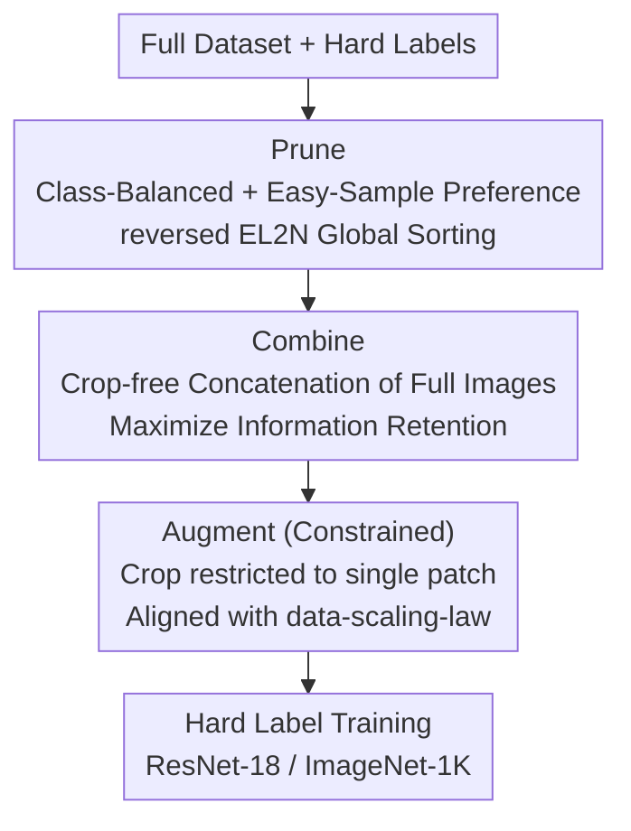

# Unifying Dataset Pruning and Distillation for Efficient Large-scale Compression

**Conference**: ICML 2026  
**arXiv**: [2502.06434](https://arxiv.org/abs/2502.06434)  
**Code**: Available (Open-sourced on GitHub according to the paper)  
**Area**: Model Compression / Dataset Compression  
**Keywords**: Dataset Distillation, Dataset Pruning, Soft Labels, Hard Labels, ImageNet Compression

## TL;DR
This paper first exposes the illusion that "Dataset Distillation (DD) outperforms Pruning" using a unified dataset compression benchmark—revealing that DD's gains primarily stem from soft labels rather than synthetic images. It then proposes the **hard-label-only** PCA (Prune-Combine-Augment) framework, which significantly outperforms existing DD and DP methods under extreme compression ratios on ImageNet-1K while eliminating soft labels that occupy 40x the storage of images.

## Background & Motivation

**Background**: Compressing large datasets follows two main paths. Dataset Pruning (DP) selects a representative subset from original images, typically removing <50% of samples. Dataset Distillation (DD) synthesizes new images, compressing each class to 10–100 images per class (IPC), with compression ratios exceeding 90%. Both have historically been treated as distinct tasks and evaluated under different compression regimes.

**Limitations of Prior Work**: Recent DD methods increasingly rely on real images—early methods optimized synthetic images from noise, DWA used real images for initialization, and RDED directly stitched real image patches. While DD and DP are converging on "using original images," the community has lacked a fair comparison under a unified standard for two reasons: (1) DD generally relies on **soft labels** (soft probabilities from a teacher network), whereas DP uses only hard labels. Soft label storage can reach 40x that of images (ImageNet-10 IPC10 soft labels 5.8GB vs. images 157MB). (2) Inconsistent batch sizes, losses, augmentations, and iteration counts across DD/DP make direct performance comparisons impossible.

**Key Challenge**: Does the "impressive performance" of current DD come from distilled images or from the teacher knowledge hidden within soft labels? This remains unverified.

**Key Insight**: The authors built a unified Dataset Compression (DC) benchmark to evaluate all methods under a consistent protocol (following the CDA setup). The only variable is the input dataset, and they include a crucial baseline ignored by all DD works—the **random subset**.

**Core Idea**: The benchmark reveals a stable ranking of `DD < Random < Pruning`, suggesting DD's advantage is an illusion created by soft labels. Consequently, the authors advocate for a return to **hard labels + high-quality images**, proposing the PCA framework to shift the focus from "labels" back to "images."

## Method

### Overall Architecture
This paper proceeds in two steps: diagnosing the problem via the DC benchmark, then providing the PCA solution.

**Diagnosis (DC Benchmark)**: Under a unified protocol, the authors observe: (1) With soft labels, most DD methods fail to beat a random subset, especially as IPC increases. (2) With soft labels, pruned subsets consistently outperform random subsets, explaining why recent DD prefers original images. (3) When switched to hard labels, the `DD < Random < Pruning` trend is not only maintained but amplified. Conclusion: DD gains come mostly from soft labels; large-scale compression should prioritize image quality.

**Mechanism (PCA)**: In a hard-label-only setting, PCA breaks "compression" into three serial stages: **Class-Balanced Easy-Sample Pruning** (P) on the full set, **Crop-free Combination** (C) of these images, and **Constrained Augmentation** (A) to unlock the potential of the small dataset during training. The entire pipeline generates no synthetic images and requires no teacher network calls.

### Key Designs

**1. Class-Balanced + Easy-Sample Pruning: Avoiding Class Loss and Hard Samples**

The first step of PCA addresses two issues of pruning under extreme compression ratios. First, traditional pruning by importance can disproportionately remove images from certain classes, causing class disappearance; PCA adopts the DD approach of **keeping an identical number of samples (IPC) per class** to maintain perfect balance. Second, smaller datasets benefit more from "easy images"—the authors use entropy analysis with a pre-trained EfficientNet-B0 (entropy of prediction distribution $H(p_\theta(\cdot|x)) = -\sum_{y} p_\theta(y|x)\log p_\theta(y|x)$) and find pruned subsets have the lowest average entropy, meaning they are "easier." This provides an intuitive explanation for why pruning beats distillation. Thus, PCA uses **reversed EL2N** (prioritizing samples with small error/easy to learn) for selection. Finally, pruning must be performed on the **full dataset** rather than a random subset to ensure only the most informative samples are utilized.

**2. Crop-free Image combination: Retaining Information That Hard Labels Cannot Recover**

Methods like RDED rely on cropping/stitching patches for further compression, but in a hard-label-only setting, the content lost during cropping **cannot be recovered** via hard label supervision. The authors provide theoretical grounding: Proposition 4.1 proves that "cropping reduces evaluation loss (NLL) but does not guarantee lower entropy" ($\mathrm{NLL}(\mathcal{D}') < \mathrm{NLL}(\mathcal{D}) \nRightarrow H(\mathcal{D}') < H(\mathcal{D})$), whereas downstream performance is driven by entropy. Theorem 4.2 further proves that even if selective cropping initially reduces entropy, there exists a crop ratio $r^*$ where **random augmentation during training neutralizes or reverses this entropy advantage** ($H(\mathcal{D}') < H(\mathcal{D})$ but $H(\mathcal{A}_{r^*}(\mathcal{D}')) \ge H(\mathcal{A}_{r^*}(\mathcal{D}))$). Since cropping is unreliable and vulnerable to augmentation, PCA concatenates **full, pruned images** to maximize information retention.

**3. Constrained Augmentation Aligned with Data-Scaling-Law: Preventing Easy Images from Becoming Difficult**

Small datasets require augmentation to fulfill their potential, but augmentation must obey what the authors call the data-scaling-law. The problem with RDED is that applying Random Resized Crop directly to stitched images turns carefully selected easy images into complex ones, violating the "small data should be easy" principle. PCA proposes **constrained augmentation**: restricting random crop areas to **within a single image patch** and using only one augmented image per epoch (unlike RDED's four). Consequently, PCA incurs **no additional training overhead** compared to RDED while keeping augmented results aligned with weight-scaling laws.

### Loss & Training
Standard cross-entropy supervision with hard labels is used throughout, without introducing any soft labels from teacher networks. Evaluation strictly follows the CDA protocol (ResNet-18 / ImageNet-1K), and training settings remain unified across all methods to ensure comparability.

## Key Experimental Results

### Main Results
On ImageNet-1K with ResNet-18 under a hard-label setting, PCA's improvement over the random baseline across various IPCs far exceeds all DD/DP competitors (values are Top-1 accuracy, parentheses indicate gains relative to the random baseline):

| IPC (Comp. Ratio) | Random | SRe2L (DD) | RDED (DD†) | EL2N (DP) | PCA (Ours) |
|------|------|------|------|------|------|
| 10 | 4.6 | 1.5 (↓3.1) | 11.5 (↑6.9) | 12.2 (↑7.6) | **22.8 (↑18.2)** |
| 50 | 20.6 | 3.8 (↓16.8) | 30.8 (↑10.2) | 31.1 (↑10.5) | **39.1 (↑18.5)** |
| 100 | 31.7 | 4.9 (↓26.8) | 39.2 (↑7.5) | 38.7 (↑7.0) | **45.5 (↑13.8)** |

It is evident that classic DD (SRe2L/CDA) collapses under hard labels (dropping 26.8 points at IPC100), while PCA boosts the random baseline from 4.6 to 22.8 at IPC10.

### Key Findings
- **Soft labels are the source of illusion**: Even pure noise paired with soft labels from a pre-trained teacher can produce learning results, indicating that soft labels smuggle "knowledge outside the compressed dataset" into evaluation, overestimating DD's benefits.
- **Easy = Good**: Entropy analysis shows pruned subsets have the lowest average entropy; using reversed EL2N to select easy samples is the key to PCA's success.
- **Cropping is harmful and irreversible**: Theory (Prop 4.1 / Theorem 4.2) and experiments both support that "stitching full images beats cropping patches," particularly under hard labels.

## Highlights & Insights
- **Benchmark before method**: The work first proves "the emperor has no clothes" (DD losing to random baselines), then naturally derives a hard-label solution. This "critique followed by construction" logic is rigorous and rare.
- **Exposing a neglected baseline**: By bringing the **random subset** to the forefront, the paper rewrites the understanding of DD vs. DP. Such baseline contributions are often more impactful than the methods themselves.
- **Transferable insight on constrained augmentation**: The idea that "augmentation should not make easy samples complex and must fit the data-scaling-law" is instructive for any few-shot or data-efficient training scenario.
- **Zero teacher, zero soft labels**: PCA is particularly suited for deployment scenarios with limited memory/storage or where large teacher models are unavailable.

## Limitations & Future Work
- The benchmark and method were primarily validated on ImageNet-1K classification with ResNet-18; generalization across architectures and tasks (detection/segmentation/multimodal) remains to be explored.
- While reversed EL2N favors easy samples, whether it remains optimal for datasets with high intra-class diversity, long tails, or fine-grained categories is questionable—"easy" does not always mean "representative."
- Completely abandoning soft labels improves storage and deployment but discards potentially useful "dark knowledge." Whether the upper bound for hard labels is truly higher may vary by dataset.
- Constrained augmentation limits cropping to single patches; the paper provides limited discussion on the sensitivity of results to patch size and constraint intensity.

## Related Work & Insights
- **vs. SRe2L / CDA (Noise-initialized DD)**: These rely on a "squeeze-recover-relabel" optimization for synthetic images and depend heavily on soft labels. This paper proves their gains come from soft labels; they collapse under hard labels, where PCA outperforms them using real images.
- **vs. RDED (Optimization-free DD)**: RDED crops patches from random subsets and stitches them, followed by Random Resized Crop during training. PCA prunes from the full set, stitches full images, and uses constrained augmentation. Theory and experiments both show "no cropping" is more robust, improving IPC10 from 11.5 to 22.8.
- **vs. Traditional Pruning (EL2N / Forgetting / CCS)**: Traditional pruning by importance breaks class balance and often uses difficult samples. PCA enforces class balance, selects easy samples via reversed EL2N, and prunes from the full set, proving significantly stronger under hard-label extreme compression.

## Rating
- Novelty: ⭐⭐⭐⭐⭐ Exposing the soft-label illusion via a unified benchmark and providing a hard-label solution is fresh and impactful.
- Experimental Thoroughness: ⭐⭐⭐⭐ Extensive coverage of ImageNet scales, multiple IPCs, and soft/hard label settings, though tasks and architectures are somewhat limited.
- Writing Quality: ⭐⭐⭐⭐⭐ Clear progression from diagnosis to solution with solid theoretical support.
- Value: ⭐⭐⭐⭐⭐ Redefines the comparison framework for DD/DP, significantly impacting the data-efficient training community.

<!-- RELATED:START -->

## Related Papers

- [\[ICLR 2026\] S2R-HDR: A Large-Scale Rendered Dataset for HDR Fusion](../../ICLR2026/model_compression/s2r-hdr_a_large-scale_rendered_dataset_for_hdr_fusion.md)
- [\[AAAI 2026\] EEG-DLite: Dataset Distillation for Efficient Large EEG Model Training](../../AAAI2026/model_compression/eeg-dlite_dataset_distillation_for_efficient_large_eeg_model_training.md)
- [\[ACL 2025\] UniICL: An Efficient ICL Framework Unifying Compression, Selection, and Generation](../../ACL2025/model_compression/uniicl_icl_framework.md)
- [\[AAAI 2026\] InfoCom: Kilobyte-Scale Communication-Efficient Collaborative Perception with Information-Aware Feature Compression](../../AAAI2026/model_compression/infocom_kilobyte-scale_communication-efficient_collaborative_perception_with_inf.md)
- [\[ACL 2025\] UniQuanF: Unifying Uniform and Binary-coding Quantization for Accurate Compression of Large Language Models](../../ACL2025/model_compression/uniquanf_unified_quantization.md)

<!-- RELATED:END -->
