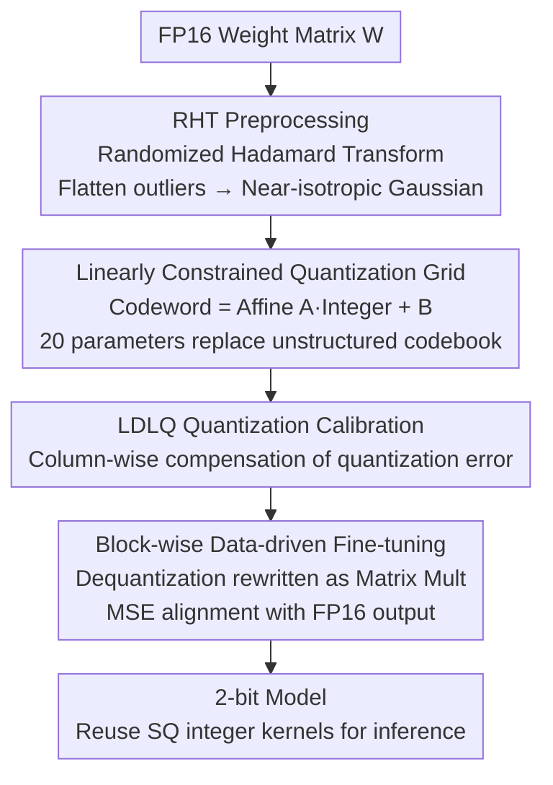

# UniSVQ: 2-bit Unified Scalar-Vector Quantization

**Conference**: ICML 2026  
**arXiv**: [2606.10520](https://arxiv.org/abs/2606.10520)  
**Code**: TBD  
**Area**: Model Compression / LLM Quantization  
**Keywords**: 2-bit Quantization, Scalar Quantization, Vector Quantization, Affine Lattice, Post-Training Quantization

## TL;DR
UniSVQ unifies Scalar Quantization (SQ) and Vector Quantization (VQ) through an "affine transformation of integer lattices." This yields a 2-bit Post-Training Quantization (PTQ) scheme that achieves VQ-level accuracy with only 20 extra parameters per weight matrix, while maintaining the integer operator structure and inference throughput of SQ.

## Background & Motivation

**Background**: Large language model inference is expensive, making Post-Training Quantization (PTQ) a mainstream compression method. While 4-bit quantization and above are largely lossless, the research frontier has shifted to 2-bit and below. There are two primary schools: Scalar Quantization (SQ, mapping weights individually to discrete values) and Vector Quantization (VQ, mapping groups of continuous weights to codewords in a codebook).

**Limitations of Prior Work**: Both approaches have significant drawbacks. SQ’s dequantization is simple and can reuse highly optimized integer tensor kernels, but because each dimension is processed independently, its min-max projections are extremely sensitive to outliers. At 2-bit, SOTA SQ models suffer performance drops exceeding 30% on zero-shot tasks and >50% on difficult problems. VQ achieves significantly higher accuracy at 2-bit, but the codebook requires extra storage. Once the codebook size exceeds the GPU L1 cache, frequent transfers between VRAM and cache severely bottleneck inference; compressing the codebook often sacrifices accuracy or introduces complex decoding logic.

**Key Challenge**: There exists a structural trade-off between accuracy (requiring flexible lattices that fit the weight distribution like VQ) and efficiency (requiring regular, integer-kernel-compatible structures without codebook transfer overhead like SQ).

**Key Insight**: The authors point out that the overhead of VQ originates from its **unstructured codebook**. If the quantization grid (the set of all possible quantized weight values) satisfies a linear constraint—where all discrete values can be derived from a set of integer coordinate vectors via an **affine transformation**—a structure intermediate between SQ and VQ can be constructed.

**Core Idea**: Use "affine transformation + integer lattice" to parameterize codewords. Quantization then becomes equivalent to "VQ with a linearly constrained codebook" (achieving VQ-level accuracy), while during inference, the affine transformation can be swapped with the linear layer's matrix multiplication, degenerating into SQ-style computation (reusing integer kernels with negligible storage overhead).

## Method

### Overall Architecture
UniSVQ grounds its "unified representation" in a core formula: a group of $d$ continuous weights is quantized as:

$$\Phi([w_1, w_2, \ldots, w_d]^T) = A[\bar{w}_1, \bar{w}_2, \ldots, \bar{w}_d]^T + B,\quad \bar{w}_i \in \mathbb{Z}$$

where $A$ is an affine matrix, $B$ is a bias, and $\bar{w}_i$ are integer coordinates. This can be interpreted as either "high-degree-of-freedom SQ" or "linearly constrained VQ." For example, with $d=4$ and 2-bit quantization, a VQ codebook requires $2^{4\times2}\times4\times2 = 2048$ bytes, whereas UniSVQ requires only $(4\times4+4)\times2 = 40$ bytes (only 20 parameters: a $4\times4$ matrix and a 4D bias), reducing overhead by approximately $1/64$.

The pipeline consists of three sequential stages: Randomized Hadamard Transform (RHT) to flatten outliers, initialization of the linearly constrained lattice with LDLQ calibration, and block-wise data-driven fine-tuning of affine parameters to further minimize reconstruction error.

### Key Designs

**1. Linearly Constrained Quantization Grid: Replacing unstructured codebooks with affine transformations to merge SQ and VQ**

This is the engine of the paper, addressing the core contradiction between VQ's flexibility and SQ's regularity. Instead of storing an arbitrary codebook, the authors mandate that all codewords be generated by the same affine transformation $C_i = A\bar{W}_i + B$ from integer vectors. Compared to SQ, it treats multiple weights as a whole and uses affine transforms instead of simple scaling, allowing the grid to fit high-density regions of the weight distribution. Compared to VQ, the grid is highly regular, requiring only $A$ and $B$ instead of a full codebook. Crucially, the affine transformation is **commutative** with matrix multiplication—by pre-applying the affine transformation to the activations during inference, the core computation reverts to SQ-style integer matrix multiplication, avoiding VQ's codebook transfer bottleneck.

**2. RHT Preprocessing + LDLQ Quantization: Flattening outliers and compensating errors column-wise**

For the linearly constrained lattice to be accurate, the weight distribution must be regular. The authors use a Randomized Hadamard Transform (RHT) $R(W) = US_U W S_V V$ where $S_U, S_V$ are $\{1,-1\}$ random diagonal matrices and $U,V$ are Hadamard matrices. Intuitively, outliers are vectors with large projections on specific axes; RHT acts as a random rotation, spreading these projections across all axes to flatten outliers. Since Hadamard matrices are orthogonal, the RHT is reversible during inference, and its Walsh–Hadamard implementation costs only $O(n\log_2 n)$. After RHT, weights approximate a standard multivariate Gaussian, which a regular linear structure approximates well. Calibration is then performed via LDLQ—performing LDL decomposition on the Hessian $H=LDL^T$ and compensating subsequent columns with the error of the current column.

**3. Block-wise Data-driven Fine-tuning: Rewriting dequantization as matrix multiplication for MSE alignment**

Randomly initialized orthogonal lattices are not necessarily optimal due to varying weight importance and activation distributions. The authors rewrite dequantization as a differentiable matrix multiplication: for an integer matrix $W_{\text{int}}$, the dequantized weights in each block are $A W_{\text{int},i}^T + B\mathbf{1}^T$. Thus, the linear operation $Y=X\hat{W}^T$ splits into $\sum_i (X_i A)W_{\text{int},i}^T + \sum_i (X_i B)\mathbf{1}^T$, where $(X_i A)$ are floating-point activations and $W_{\text{int},i}$ remains integer. With small $d$ (4 or 8), the extra complexity is minimal. This allows for **block-wise** fine-tuning of $A$ and $B$: after quantizing all matrices in a Transformer block, the affine parameters are optimized to minimize the MSE between the quantized block output and the original FP16 output.

### Loss & Training
The fine-tuning objective is the block-wise Mean Squared Error (MSE) reconstruction loss: minimize the distance between the quantized output and FP16 output for the same input. Only the floating-point affine parameters $A$ and $B$ are tuned while integer weights $W_{\text{int}}$ remain fixed, ensuring low optimization cost.

## Key Experimental Results

### Main Results
Comparison of SQ and VQ baselines across Qwen-3 models (Wiki/C4: lower PPL is better; Avg: average accuracy across 6 Zero-shot QA tasks; Per.: Percentage of FP16 performance):

| Model | Type | Method | Wiki↓ | Avg.↑ | Per.↑ |
|------|------|------|------|------|------|
| Qwen-3-32B | — | FP16 | 7.61 | 78.01 | 1.00 |
| | SQ | OSTQuant | 14.79 | 68.29 | 0.88 |
| | VQ | Quip# | 9.04 | 76.30 | 0.98 |
| | VQ | AQLM | 10.56 | 75.37 | 0.97 |
| | **Ours** | **UniSVQ** | 9.26 | **76.15** | **0.98** |
| Qwen-3-8B | — | FP16 | 9.72 | 74.12 | 1.00 |
| | SQ | OSTQuant | 26.08 | 57.47 | 0.78 |
| | VQ | Quip# | 12.37 | 67.55 | 0.91 |
| | **Ours** | **UniSVQ** | 14.82 | **67.95** | **0.92** |

UniSVQ consistently outperforms the strongest SQ baselines (e.g., ~8 points higher Avg. than OSTQuant on 32B) and matches or exceeds SOTA VQ methods (e.g., 67.95 > Quip# 67.55 on 8B).

### Storage / Efficiency Comparison

| Scheme | Extra Storage ($d{=}4$, 2-bit) | Integer Kernel Reuse | Codebook Transfer Bottleneck |
|------|------|------|------|
| Scalar Quantization (SQ) | ~0 | Yes | None |
| Vector Quantization (VQ) | 2048 bytes/group | No | Yes |
| **UniSVQ** | **40 bytes/group (20 params)** | **Yes** | **None** |

UniSVQ requires only ~$1/64$ of the extra storage compared to VQ. Since affine transforms can be pre-applied to activations, it reuses SQ's Matmul kernels, leading to higher inference throughput than VQ.

### Key Findings
- **Unstructured codebooks are the true burden of VQ**: Replacing codebooks with affine transformations drastically reduces storage and decoding complexity with negligible accuracy loss.
- **RHT is a prerequisite for accuracy**: RHT forces weights into a near-Gaussian distribution, allowing regular linearly constrained lattices to approximate optimal codebooks.
- **Block-wise fine-tuning directly minimizes reconstruction error**: Making dequantization differentiable via matrix-multiplication form is crucial for UniSVQ to approach VQ accuracy.

## Highlights & Insights
- **Unified Framework**: The formula $\Phi = A\bar{W} + B$ elegantly reconciles "high-freedom SQ" and "constrained VQ," merging two historically opposing quantization paths.
- **Commutativity as the Key to Deployment**: The commutativity of affine transforms and matrix multiplication allows inference to degenerate into SQ, reusing optimized integer kernels.
- **20 Parameters for VQ Accuracy**: Adding only 20 floating-point parameters per group is a negligible engineering burden and extremely storage-friendly.
- **Transferable Insight**: Approximating high-freedom look-up tables with low-dimensional structures and affine/linear constraints may be applicable to KV cache or activation quantization.

## Limitations & Future Work
- Experiments primarily focus on the Qwen-3 family; broader validation across other model families (LLaMA/Mistral) is needed.
- Accuracy still lags slightly behind FP16 (e.g., 92% retention for 8B), which might be non-negligible for sensitivity-critical tasks.
- Linearly constrained lattices are low-dimensional approximations; if weights deviate from Gaussian (heavy tails or strong correlation) after RHT, approximation errors may increase.
- While theoretical throughput is higher, detailed end-to-end latency/throughput benchmarks on real hardware against VQ implementations are limited.

## Related Work & Insights
- **vs. SQ (GPTQ / OmniQuant / OSTQuant)**: SQ is dimension-independent and sensitive to outliers, leading to high 2-bit degradation. UniSVQ groups weights for affine transforms, fitting distributions better while maintaining integer kernel compatibility.
- **vs. Clustering-based VQ (AQLM / GPTVQ)**: These use K-means for unstructured codebooks and multi-level codebooks for storage; UniSVQ uses affine transforms to reduce storage by $1/64$ and removes multi-level decoding.
- **vs. Lattice-based VQ (QuIP# / Qtip / NestQuant)**: These use symmetric codebooks or convolutional codes requiring decompression steps; UniSVQ's linear constraints remove decompression overhead for better throughput.

## Rating
- Novelty: ⭐⭐⭐⭐⭐ Elegant unification of SQ and VQ through affine lattices.
- Experimental Thoroughness: ⭐⭐⭐⭐ Solid across scales and baselines, though real-world hardware latency data could be more comprehensive.
- Writing Quality: ⭐⭐⭐⭐⭐ Clear progression from contradiction to insight to implementation.
- Value: ⭐⭐⭐⭐⭐ Highly practical for 2-bit LLM deployment, balancing accuracy and efficiency.

<!-- RELATED:START -->

## Related Papers

- [\[ICML 2026\] LC-QAT: Data-Efficient 2-Bit QAT for LLMs via Linear-Constrained Vector Quantization](lc-qat_data-efficient_2-bit_qat_for_llms_via_linear-constrained_vector_quantizat.md)
- [\[ICML 2026\] NanoQuant: Efficient Sub-1-Bit Quantization of Large Language Models](nanoquant_efficient_sub-1-bit_quantization_of_large_language_models.md)
- [\[ICML 2026\] NeUQI: Near-Optimal Uniform Quantization Parameter Initialization for Low-Bit LLMs](neuqi_near-optimal_uniform_quantization_parameter_initialization_for_low-bit_llm.md)
- [\[ICML 2026\] TWLA: Achieving Ternary Weights and Low-Bit Activations for LLMs via Post-Training Quantization](twla_achieving_ternary_weights_and_low-bit_activations_for_llms_via_post-trainin.md)
- [\[ICML 2026\] ArcVQ-VAE: A Spherical Vector Quantization Framework with ArcCosine Additive Margin](arcvq-vae_a_spherical_vector_quantization_framework_with_arccosine_additive_marg.md)

<!-- RELATED:END -->
