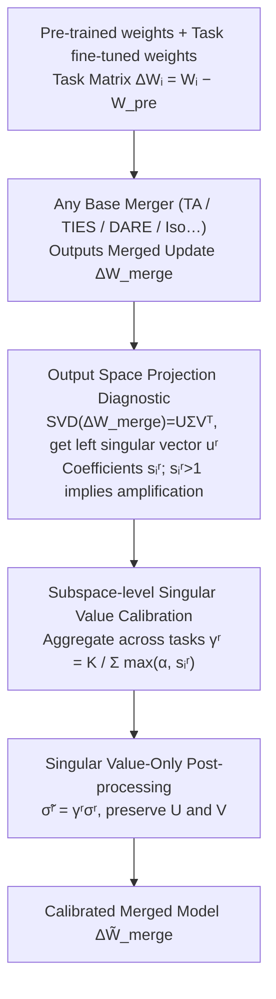

# When Shared Knowledge Hurts: Spectral Over-Accumulation in Model Merging

**Conference**: ICML2026  
**arXiv**: [2602.05536](https://arxiv.org/abs/2602.05536)  
**Code**: https://github.com/lyymuwu/SVC  
**Area**: Optimization  
**Keywords**: Model Merging, Spectral Calibration, Singular Values, Task Vectors, Data-free Post-processing

## TL;DR
This paper identifies that model merging suffers not only from task conflicts but also from the redundant accumulation of shared spectral directions into excessively large singular values. It proposes Singular Value Calibration (SVC), a training-free and data-free method that recalibrates singular values without altering singular vectors, consistently improving merging performance across vision and language tasks.

## Background & Motivation
**Background**: Model merging aims to integrate the capabilities of multiple models fine-tuned from the same base into a single model. Common practices involve representing the weight differences of each task as task vectors or task matrices and combining them into a merged update using rules like simple averaging, Task Arithmetic, TIES, or DARE. The main appeal is avoiding multi-task retraining and the need to maintain multiple expert models during inference.

**Limitations of Prior Work**: Existing methods primarily attribute merging failures to "conflicts between tasks," often employing pruning, masking, or removing sign-inconsistent updates at the parameter level. However, this paper observes a more subtle failure mode: if multiple tasks carry similar shared knowledge within the same spectral subspace, simple linear merging counts these common components repeatedly. This amplifies a few top singular directions, causing the merged model to over-rely on shared directions while suppressing task-specific information.

**Key Challenge**: Shared knowledge is intended to facilitate transfer, but when shared directions are summed multiple times, they transform from "common useful signals" into "spectral over-accumulation." That is, the issue with merged models is not just tasks canceling each other out, but also identical directions being pushed too strongly together.

**Goal**: The authors aim to diagnose whether shared knowledge is over-accumulated in each spectral subspace and pull the amplified singular values back to a reasonable scale, all without accessing training data, additional fine-tuning, or modifying existing merging rules.

**Key Insight**: The paper performs SVD on the merged task matrix, using its output space basis as a common coordinate system. It then projects each individual task matrix onto these output directions. Consequently, the responses of different tasks in the same subspace can be directly compared, and over-accumulation can be quantified as projection coefficients exceeding 1.

**Core Idea**: Use output space projection coefficients to estimate "how much a shared direction was over-counted" in each spectral subspace, then scale only the corresponding singular values. This serves as a training-free, data-free spectral post-processor applicable to any merging method.

## Method
The core of the paper is not a new merging formula, but a spectral-level "check-up" and calibration for existing merging results. Given pre-trained weights $W_{pre}$ and multiple fine-tuned weights $W_i$, each task matrix is defined as $\Delta W_i = W_i - W_{pre}$. An arbitrary base merging method first outputs $\Delta W_{merge}$, which SVC then post-processes to obtain the calibrated $\Delta \tilde{W}_{merge}$.

### Overall Architecture
The workflow consists of three steps. First, perform SVD on the merged matrix $\Delta W_{merge}$ to get $U\Sigma V^\top$, where the left singular vector $u^r$ is treated as the $r$-th output space direction. Second, for each task matrix, calculate its response in that output direction $a_i^r=(u^r)^\top\Delta W_i$, along with the merged response $a_{merge}^r=(u^r)^\top\Delta W_{merge}$. Third, project $a_{merge}^r$ onto each $a_i^r$ to obtain the projection coefficient $s_i^r=\langle a_{merge}^r,a_i^r\rangle / \|a_i^r\|_2^2$, aggregate these across tasks into a subspace calibration factor $\gamma^r$, and reconstruct the merged update using $\tilde{\sigma}^r=\gamma^r\sigma^r$.

The key design point is that SVC does not re-estimate directions; it only adjusts the intensity of each direction. If a direction indeed corresponds to an output pattern shared by multiple tasks, SVC keeps it; if this direction becomes so strong it suppresses others due to redundant summation, SVC lowers the corresponding singular value to rebalance the spectral distribution.

### Key Designs

**1. Output Space Projection Diagnostic: Converting "Over-counted Shared Directions" into Computable Spectral Metrics.** It is difficult to detect structural issues like "redundant shared knowledge accumulation" through parameter-wise comparison. Instead, the paper quantifies this in the output space. After performing SVD on the merged matrix, the $r$-th left singular vector $u^r$ represents an output response direction. The response of each task in this direction is $a_i^r=(u^r)^\top\Delta W_i$, while the merged response is the sum of task responses $a_{merge}^r=\sum_i a_i^r$. Projecting the merged response back onto task responses yields $s_i^r=\langle a_{merge}^r,a_i^r\rangle/\|a_i^r\|_2^2$. A value of $s_i^r>1$ indicates that other tasks contributed a positive inner product in this direction, amplifying task $i$'s direction—a computable signal of "over-accumulation." Left singular vectors (output space) are used instead of right singular vectors (input space) because output directions directly correspond to the response behavior of the merged matrix, whereas input directions mix multi-task patterns and are less representative of individual experts.

**2. Subspace-level Singular Value Calibration: Aggregating across tasks to act only when shared directions are universally amplified.** Individual task projection coefficients are influenced by noise and task preferences. Scaling directly based on one task could lead to over-correction. Thus, the paper aggregates coefficients for all tasks within the same subspace into a scaling factor $\gamma^r=K/\sum_i \max(\alpha,s_i^r)$ (equivalent to a harmonic mean of clipped task scalings $1/\max(\alpha,s_i^r)$). When many tasks exhibit $s_i^r>1$ in a direction, the denominator increases, resulting in $\gamma^r<1$ and a lowered singular value. Without systematic over-accumulation, $\gamma^r\approx 1$. The hyperparameter $\alpha$ controls the intensity: $\alpha=1$ ensures $\gamma^r\le 1$ (purely suppressive calibration), while $\alpha<1$ allows $\gamma^r>1$ to reinforce under-accumulated subspaces.

**3. Singular Value-Only Post-processing: Plug-and-play for any merger.** SVC preserves $U$ and $V$ from the SVD and only replaces original singular values with $\tilde{\sigma}^r=\gamma^r\sigma^r$ before reconstructing $\Delta\tilde W_{merge}=\sum_r \tilde{\sigma}^r u^r(v^r)^\top$. It does not search for new directions or introduce training targets, making it a post-processing plugin for TA, TIES, DARE, TSV-M, or Iso-C. The overhead is just one offline SVD. For IA3 or other 1D PEFT updates, the paper provides a vector version of the calibration $\gamma=K/\sum_i s_i$ and $\tilde\tau_{merge}=\gamma\tau_{merge}$.

### Loss & Training
SVC has no training loss. The calibration factor is derived from a projection optimization problem: finding a non-negative scale $\gamma^r$ such that $\gamma^r a_{merge}^r$ is as close as possible to the task response $a_i^r$. When $s_i^r>0$, the single-task optimal scale is $1/s_i^r$. If positive inner products across tasks lead to $s_i^r>1$, a scale less than 1 naturally follows. Experiments use a data-free setting with $\alpha=1/K$ by default.

## Key Experimental Results

### Main Results
SVC was tested on various vision and language merging tasks. Vision tasks include 8-task and 14-task multi-task classification using ViT-B/32, ViT-B/16, and ViT-L/14. Language tasks involve Llama2-7B generation and BERT/T5/T0 classification/PEFT.

| Scenario | Base Merger | Original Result | With SVC | Gain |
|------|------------|----------|-----------|------|
| CV 8 tasks, ViT-B/32 | Task Arithmetic | 68.9 | 81.9 | +13.0 |
| CV 14 tasks, ViT-L/14 | Task Arithmetic | 57.7 | 76.7 | +19.0 |
| CV 8 tasks, ViT-B/16 | DARE | 71.5 | 84.8 | +13.3 |
| NLP, Llama2 AlpacaEval | Iso-C | 50.0 | 58.9 | +8.9 |
| NLP, Llama2 GSM8K | Iso-C | 42.0 | 51.4 | +9.4 |
| NLP, BERT Avg Classification | Task Arithmetic | 56.9 | 69.0 | +12.1 |

### Ablation Study
The key ablation compares output space calibration with input space calibration. When left singular vectors are replaced by right singular vectors, gains for most base mergers vanish or results fall below the original baseline.

| Config | TA | TIES | DARE | TSV-M | Iso-C | Iso-CTS |
|------|----|------|------|-------|-------|---------|
| Original Merging | 68.9 | 72.6 | 65.8 | 84.0 | 83.1 | 81.4 |
| SVC Output Space (Ours) | 81.9 | 80.0 | 80.7 | 84.8 | 84.6 | 85.6 |
| SVC Input Space Variant | 64.9 | 65.7 | 67.5 | 84.0 | 82.1 | 85.5 |

| Backbone | SVC Offline Time | Memory Usage |
|----------|--------------|----------|
| ViT-B/32 | 5.1 s | 1027.4 MiB |
| ViT-B/16 | 8.2 s | 1082.8 MiB |
| ViT-L/14 | 15.6 s | 1488.5 MiB |
| LLaMA2 7B | 517.2 s | 1898.7 MiB |
| Qwen2.5 7B | 249.3 s | 2513.1 MiB |

### Key Findings
- SVC provides the largest boost to weak mergers, suggesting spectral over-accumulation is a major failure source for linear methods like Task Arithmetic. It still yields steady improvements for stronger spectral methods like TSV-M and Iso-C.
- Output space is more critical than input space. Left singular vectors correspond to the merged matrix's response, directly measuring amplified behavior.
- Suppressive calibration ($\alpha=1$) is consistently beneficial. Allowing $\alpha<1$ to amplify low-accumulation subspaces shows mixed results, suggesting that correcting over-strong directions is safer than reinforcing weak ones.
- SVC is a one-time offline process much cheaper than training-based merging on LLMs, though it incurs the computational cost of SVD for large matrices.

## Highlights & Insights
- The paper clearly explains why shared knowledge hurts merging: not because sharing is harmful, but because linear merging over-counts shared directions, concentrating spectral energy into a few top subspaces.
- The projection coefficient $s_i^r$ is an interpretable diagnostic metric. It links cross-task inner products, behavior amplification, and singular value inflation.
- The practical form of SVC is highly useful: it requires no calibration data, no task labels, no routing changes, and no knowledge of the input distribution. 
- "Only modifying singular values" is a restrained yet effective choice. It avoids the complexity of searching for new directions and minimizes the risk of disrupting existing merger structures.

## Limitations & Future Work
- The method depends on layer-wise SVD of task matrices. While offline, this can be a bottleneck for very large models or full merging of many layers.
- The theory primarily explains linear weight merging and local linear layer behavior; explanations for non-linear function composition are still limited.
- SVC defaults to balancing tasks in a data-free manner. Users prioritizing specific tasks may need to incorporate extra preference information.
- Future work could test spectral over-accumulation in instruction tuning, multimodal adapter merging, and safety-aligned model merging.

## Related Work & Insights
- **vs Task Arithmetic**: TA sums task vectors directly, which is simple but prone to over-accumulating shared directions. SVC as a post-processor improves 8-task ViT-B/32 from 68.9 to 81.9.
- **vs TIES / DARE**: These methods handle sign conflicts or sparsification at the parameter level. SVC focuses on the global spectral structure, addressing "non-conflicting but overly strong" shared directions.
- **vs TSV-M / Iso-C / Iso-CTS**: These methods already use spectral perspectives to construct updates. SVC differs by diagnosing output subspace overlap as a post-processing step without rewriting the base merging rules.
- **Insight**: Merging quality depends not just on task correlation, but also on whether shared directions are redundantly amplified in the spectrum.

## Rating
- Novelty: ⭐⭐⭐⭐☆ Spectral space merging is established, but formalizing over-accumulation as output space projection and singular value inflation is distinctive.
- Experimental Thoroughness: ⭐⭐⭐⭐☆ Covers vision, NLP, multiple mergers, and ablations.
- Writing Quality: ⭐⭐⭐⭐☆ Motivation, theory, and algorithm are well-connected.
- Value: ⭐⭐⭐⭐⭐ High practicality as a training-free and data-free post-processor.

<!-- RELATED:START -->

- [Task Arithmetic in the Wild: A Spectral Analysis](https://arxiv.org/abs/2403.04782)
- [TIES-Merging: Resolving Interference When Merging Models](https://arxiv.org/abs/2306.01708)
- [Language Models are Super Mario: Absorbing Abilities from Homologous Models as a Free Lunch](https://arxiv.org/abs/2311.03099)

<!-- RELATED:END -->

## Related Papers

- [\[ICML 2026\] Saliency-Aware Model Merging](saliency-aware_model_merging.md)
- [\[ICLR 2026\] AdaRank: Adaptive Rank Pruning for Enhanced Model Merging](../../ICLR2026/model_compression/adarank_adaptive_rank_pruning_for_enhanced_model_merging.md)
- [\[ICML 2026\] Model Merging Scaling Laws in Large Language Models](model_merging_scaling_laws_in_large_language_models.md)
- [\[ICML 2026\] Decouple Searching from Training: Scaling Data Mixing via Model Merging for Large Language Model Pre-training](decouple_searching_from_training_scaling_data_mixing_via_model_merging_for_large.md)
- [\[ICCV 2025\] FREE-Merging: Fourier Transform for Efficient Model Merging](../../ICCV2025/model_compression/free-merging_fourier_transform_for_efficient_model_merging.md)

<!-- RELATED:END -->
