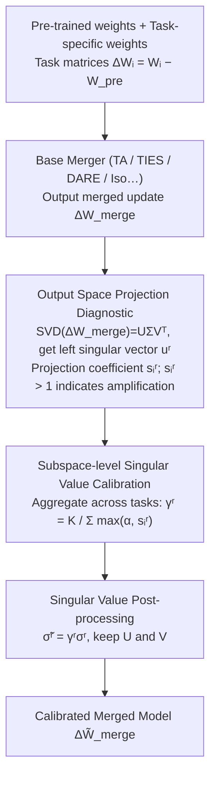

# When Shared Knowledge Hurts: Spectral Over-Accumulation in Model Merging

**Conference**: ICML2026  
**arXiv**: [2602.05536](https://arxiv.org/abs/2602.05536)  
**Code**: https://github.com/lyymuwu/SVC  
**Area**: Optimization  
**Keywords**: Model Merging, Spectral Calibration, Singular Values, Task Vectors, Data-free Post-processing

## TL;DR
This paper identifies that model merging suffers not only from task conflicts but also from the repetitive accumulation of shared spectral directions into excessively large singular values. It proposes Singular Value Calibration (SVC), a training-free and data-free method that recalibrates singular values without altering singular vectors, consistently improving merging performance across vision and language tasks.

## Background & Motivation
**Background**: Model merging aims to integrate the capabilities of multiple fine-tuned models from the same base into a single model. Common practices involve representing the weight difference of each task as a task vector or task matrix and combining them into a merged update using rules like Averaging, Task Arithmetic, TIES, or DARE. The appeal of this direction is the ability to create a multi-task model without re-training or maintaining multiple expert models during inference.

**Limitations of Prior Work**: Existing methods primarily attribute merging failures to "conflicts between tasks," often employing pruning, masking, or removing sign-inconsistent updates at the parameter level. However, this paper observes a more subtle failure mode: if multiple tasks carry similar shared knowledge in the same spectral subspace, simple linear merging repeatedly counts these common components. This amplifies a few top singular directions, causing the merged model to over-rely on shared directions while suppressing task-specific information.

**Key Challenge**: Shared knowledge should ideally facilitate transfer, but when shared directions are summed multiple times, they transform from "useful public signals" into "spectral over-accumulation." That is, the issue with merged models is not just tasks canceling each other out, but also identical directions being pushed too strongly together.

**Goal**: The authors aim to diagnose whether shared knowledge is over-accumulated in each spectral subspace and pull amplified singular values back to reasonable scales—all without accessing training data, additional fine-tuning, or altering existing merging rules.

**Key Insight**: The paper performs SVD on the merged task matrix, using the output space basis of the merged matrix as a common coordinate system. By projecting each individual task matrix onto these output directions, responses across tasks can be directly compared, and over-accumulation can be quantified as projection coefficients exceeding 1.

**Core Idea**: Use output space projection coefficients to estimate the degree of "over-counting of shared directions" for each spectral subspace. Then, scale only the corresponding singular values. This yields a training-free, data-free spectral post-processor applicable to any merging method.

## Method
The core of the paper is not a new merging formula, but a spectral "check-up" and calibration for existing merging results. Given pre-trained weights $W_{pre}$ and multiple fine-tuned weights $W_i$, each task matrix is defined as $\Delta W_i = W_i - W_{pre}$. Any base merging method first outputs $\Delta W_{merge}$, which SVC then post-processes to obtain the calibrated $\Delta \tilde{W}_{merge}$.

### Overall Architecture
The workflow consists of three steps. First, SVD is performed on $\Delta W_{merge}$ as $U\Sigma V^\top$, where the left singular vector $u^r$ is treated as the $r$-th output space direction. Second, for each task matrix, the response in that output direction is calculated as $a_i^r=(u^r)^\top\Delta W_i$, along with the merged response $a_{merge}^r=(u^r)^\top\Delta W_{merge}$. Third, $a_{merge}^r$ is projected onto each $a_i^r$ to obtain projection coefficients $s_i^r=\langle a_{merge}^r,a_i^r\rangle / \|a_i^r\|_2^2$. These coefficients are aggregated into a subspace calibration factor $\gamma^r$, and the merged update is reconstructed using $\tilde{\sigma}^r=\gamma^r\sigma^r$.

The critical design point is that SVC does not re-estimate directions; it only adjusts the magnitude of each direction. If a direction indeed corresponds to a shared output pattern across multiple tasks, SVC keeps it; if this direction becomes so strong through repetitive accumulation that it suppresses others, SVC reduces the singular value to re-balance the spectral distribution.

### Key Designs

**1. Output Space Projection Diagnostic: Quantifying over-accumulation as a spectral metric.** It is difficult to detect structural issues like "repeated accumulation of shared knowledge" via element-wise parameter comparisons. The paper instead quantifies this in the output space. After SVD of the merged matrix, the $r$-th left singular vector $u^r$ represents an output response direction. The response of each task in this direction is $a_i^r=(u^r)^\top\Delta W_i$, and the merged response is the sum $a_{merge}^r=\sum_i a_i^r$. Projecting the merged response back onto task responses gives $s_i^r=\langle a_{merge}^r,a_i^r\rangle/\|a_i^r\|_2^2$: $s_i^r>1$ indicates that other tasks contributed positive inner products, amplifying task $i$ in this direction—a clear signal of "over-accumulation." Left singular vectors (output space) are preferred over right singular vectors (input space) because output directions directly correspond to the response behavior of the merged matrix, whereas input directions are often unrepresentative of individual experts.

**2. Subspace-level Singular Value Calibration: Aggregating across tasks.** Individual projection coefficients can be noisy. The paper aggregates coefficients from all tasks in the same subspace into a scaling factor $\gamma^r=K/\sum_i \max(\alpha,s_i^r)$ (equivalent to the harmonic mean of clipped scaling factors $1/\max(\alpha,s_i^r)$). When many tasks show $s_i^r>1$ in a direction, the denominator increases, $\gamma^r<1$, and the singular value is down-scaled. Without systematic over-accumulation, $\gamma^r\approx 1$. The hyperparameter $\alpha$ controls the intensity: $\alpha=1$ ensures $\gamma^r\le 1$ for purely suppressive calibration, while $\alpha<1$ allows $\gamma^r>1$ to reinforce under-accumulated subspaces.

**3. Post-processing without altering singular vectors: Plug-and-play compatibility.** SVC preserves the $U$ and $V$ from SVD and only replaces original singular values with $\tilde{\sigma}^r=\gamma^r\sigma^r$ before reconstructing $\Delta\tilde W_{merge}=\sum_r \tilde{\sigma}^r u^r(v^r)^\top$. It involves no new training objectives or calibration sets and can be appended to any merger like TA, TIES, DARE, TSV-M, or Iso-C. The overhead is just a one-time offline SVD, making it ideal for scenarios where data is unavailable or light modification of existing models is desired. For 1D updates like IA3, a vector version $\gamma=K/\sum_i s_i$ and $\tilde\tau_{merge}=\gamma\tau_{merge}$ is used.

### Loss & Training
SVC has no training loss. The calibration factor is derived from a projection optimization problem: finding a non-negative scale $\gamma^r$ such that $\gamma^r a_{merge}^r$ projected onto task directions $a_i^r$ is as close to $a_i^r$ as possible. When $s_i^r>0$, the optimal single-task scale is $1/s_i^r$; positive inner products across tasks ($s_i^r>1$) naturally lead to scales less than 1. Experiments default to a data-free setting $\alpha=1/K$, or $\alpha=1$ for TSV-M to only suppress over-accumulation.

## Key Experimental Results

### Main Results
SVC was tested on computer vision (8-task and 14-task classification using ViT-B/32, ViT-B/16, ViT-L/14) and language models (Llama2-7B evaluations, BERT/T5 classification).

| Scenario | Base Merger | Original Result | With SVC | Gain |
|------|------------|----------|-----------|------|
| CV 8 tasks, ViT-B/32 | Task Arithmetic | 68.9 | 81.9 | +13.0 |
| CV 14 tasks, ViT-L/14 | Task Arithmetic | 57.7 | 76.7 | +19.0 |
| CV 8 tasks, ViT-B/16 | DARE | 71.5 | 84.8 | +13.3 |
| NLP, Llama2 AlpacaEval | Iso-C | 50.0 | 58.9 | +8.9 |
| NLP, Llama2 GSM8K | Iso-C | 42.0 | 51.4 | +9.4 |
| NLP, BERT Avg Acc | Task Arithmetic | 56.9 | 69.0 | +12.1 |

### Ablation Study
A critical ablation compares output space calibration with input space calibration. Using right singular vectors (input space) results in significantly lower gains or even performance degradation.

| Configuration | TA | TIES | DARE | TSV-M | Iso-C | Iso-CTS |
|------|----|------|------|-------|-------|---------|
| Original Merging | 68.9 | 72.6 | 65.8 | 84.0 | 83.1 | 81.4 |
| SVC Output Space (Ours) | 81.9 | 80.0 | 80.7 | 84.8 | 84.6 | 85.6 |
| SVC Input Space Variant | 64.9 | 65.7 | 67.5 | 84.0 | 82.1 | 85.5 |

| Backbone | SVC Offline Time | Memory Usage |
|----------|--------------|----------|
| ViT-B/32 | 5.1 s | 1027.4 MiB |
| ViT-B/16 | 8.2 s | 1082.8 MiB |
| ViT-L/14 | 15.6 s | 1488.5 MiB |
| LLaMA2 7B | 517.2 s | 1898.7 MiB |
| Qwen2.5 7B | 249.3 s | 2513.1 MiB |

### Key Findings
- SVC provides the largest gains for weak mergers (e.g., Task Arithmetic), identifying spectral over-accumulation as a primary failure source for linear methods. It still yields consistent improvements for stronger spectral methods like TSV-M.
- Output space is more critical than input space. Left singular vectors allow direct measurement of task behavior amplification.
- Suppressive calibration ($\alpha=1$) is robust. Allowing $\alpha<1$ to amplify low-accumulation subspaces yields mixed results, suggesting that correcting over-strong directions is more stable than reinforcing weak ones.
- SVC is a one-time offline process significantly cheaper than training-based merging on LLMs, though it incurs SVD costs for large matrices.

## Highlights & Insights
- The paper clearly explains why shared knowledge hurts merging: the issue isn't the knowledge itself, but the repetition of shared directions that concentrates spectral energy into a few top subspaces.
- The projection coefficient $s_i^r$ is an interpretable diagnostic. It links cross-task inner products, behavior amplification, and singular value inflation.
- The practical engineering form of SVC is highly valuable: no calibration data, no task labels, and no change to inference routing required.
- The choice to "only change singular values" is conservative but effective, avoiding the complexity of finding new directions and preserving the established structure of base mergers.

## Limitations & Future Work
- The method relies on layer-wise SVD of task matrices; while offline, this could be a bottleneck for extremely large models or full merging of many layers.
- Theoretical explanations are primarily for linear weight merging and local linear behavior; research on non-linear combinations and token distribution remains limited.
- SVC defaults to balancing all tasks in a data-free manner. Users prioritizing specific tasks may need additional preference information.
- Future work could test spectral over-accumulation in instruction tuning, multimodal adapters, and safety alignment.

## Related Work & Insights
- **vs. Task Arithmetic**: TA sums task vectors directly, causing over-accumulation of shared directions. SVC as a post-processor improves 8-task ViT-B/32 from 68.9 to 81.9.
- **vs. TIES / DARE**: These focus on parameter-level sign conflicts or sparsity. SVC addresses global spectral structure and "non-conflicting but overly strong" directions.
- **vs. TSV-M / Iso-C / Iso-CTS**: While these use spectral views to construct updates, SVC functions as a diagnostic and post-processor for the final output space overlap.
- **Insight**: Merging quality depends not just on task correlation, but on whether shared directions are repetitively amplified. This diagnostic could eventually assist in selecting task combinations for merging.

## Rating
- Novelty: ⭐⭐⭐⭐☆ Spectral perspective exists, but formalizing over-accumulation via output space projection is highly distinctive.
- Experimental Thoroughness: ⭐⭐⭐⭐☆ Covers CV, NLP, multiple mergers, and thorough ablations.
- Writing Quality: ⭐⭐⭐⭐☆ Clear connection between motivation, theory, and algorithm.
- Value: ⭐⭐⭐⭐⭐ High utility as a training-free, data-free post-processor.

<!-- RELATED:START -->

## Related Papers

- [\[ICML 2026\] Saliency-Aware Model Merging](saliency-aware_model_merging.md)
- [\[ICLR 2026\] AdaRank: Adaptive Rank Pruning for Enhanced Model Merging](../../ICLR2026/model_compression/adarank_adaptive_rank_pruning_for_enhanced_model_merging.md)
- [\[ICML 2026\] Model Merging Scaling Laws in Large Language Models](model_merging_scaling_laws_in_large_language_models.md)
- [\[ICML 2026\] Decouple Searching from Training: Scaling Data Mixing via Model Merging for Large Language Model Pre-training](decouple_searching_from_training_scaling_data_mixing_via_model_merging_for_large.md)
- [\[CVPR 2026\] Model Merging on Loss Landscape: A Geometry Perspective](../../CVPR2026/model_compression/model_merging_on_loss_landscape_a_geometry_perspective.md)

<!-- RELATED:END -->
