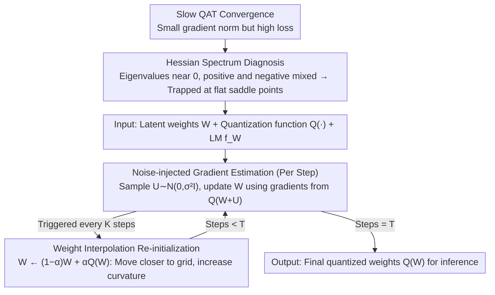

# WinQ: Accelerating Quantization-Aware Training of Language Models Around Saddle Points

**Conference**: ICML2026  
**arXiv**: [2605.17471](https://arxiv.org/abs/2605.17471)  
**Code**: https://github.com/facebookresearch/WinQ  
**Area**: Model Compression / Low-bit Quantization / LLM Efficiency  
**Keywords**: Quantization-Aware Training, Low-bit LLM, Hessian Spectrum, Saddle Point Optimization, Noise Injection  

## TL;DR
WinQ attributes the slow convergence of low-bit language model QAT to weights being trapped near low-curvature saddle points. By utilizing periodic weight-quantization interpolation for re-initialization and noise perturbation for gradients, it accelerates 1-2 bit QAT by 1.5-4x with almost no additional training overhead, improving perplexity and zero-shot accuracy across various LLaMA/Qwen quantization configurations under the same training budget.

## Background & Motivation
**Background**: The deployment of Large Language Models increasingly relies on low-bit quantization. Post-training quantization (PTQ) usually maintains performance above 4 bits but collapses significantly at ultra-low precisions like 1-2 bits or 1.58 bits. Consequently, mainstream solutions shift toward quantization-aware training (QAT), which maintains full-precision latent weights during training while performing forward passes and gradient estimation based on quantized weights.

**Limitations of Prior Work**: QAT is effective but costly. This paper notes that even 4-bit QAT training costs can approach 10% of full-precision pre-training; 1-bit QAT is even slower, often requiring training on billions of tokens to achieve usable performance. Existing methods like ParetoQ and QuEST primarily modify quantization functions, Hadamard transforms, or gradient estimation, but fail to explain why low-bit QAT enters a plateau quickly after the early training stages.

**Key Challenge**: Low-bit quantization requires latent weights to be close to a discrete quantization grid, while optimization still occurs in a continuous weight space. The authors' key observation is that the relative gradient norm decreases rapidly during training while the loss fails to drop sufficiently, suggesting the model is stuck in regions with weak local curvature rather than simply lacking a sufficient learning rate. Hessian spectrum analysis shows that a large number of eigenvalues in low-bit QAT concentrate around 0, with both positive and negative eigenvalues present, typically corresponding to stagnation near flat saddle points.

**Goal**: The paper aims to answer two questions: first, what is the optimization cause of slow convergence in low-bit QAT; second, can a training trick be designed that is independent of specific quantizers and carries minimal extra cost to pull the model out of these low-curvature stagnation zones.

**Key Insight**: Instead of designing a complex quantizer based on quantization error, the authors treat QAT as a non-convex optimization problem and measure the spectral distribution of the loss Hessian. This perspective is interesting because it transforms "lower bit quantization is harder to train" into a measurable curvature problem: the lower the bit-width, the smaller the magnitude of the largest Hessian eigenvalues and the higher the proportion of eigenvalues near 0, leading to slower convergence.

**Core Idea**: Use periodic $W \leftarrow (1-\alpha)W+\alpha Q(W)$ to pull latent weights closer to quantized weights to increase local curvature, and inject noise $Q(W+U)$ at each step to perturb gradients and assist in escaping saddle points.

## Method
The WinQ method consists of "diagnosis" and "intervention" layers. The diagnosis layer uses the Hessian spectrum to prove that slow convergence in low-bit QAT is not accidental; the intervention layer translates this into two lightweight training operations: periodic weight interpolation re-initialization and step-wise noise injection.

### Overall Architecture
The input is an existing QAT training pipeline: given full-precision latent weights $W$, a quantization function $Q(\cdot)$, a language model $f_W$, and training data. Standard QAT performs a forward pass using $Q(W)$ at each step and updates $W$ via STE or related gradient estimators. WinQ wraps two processes around this training loop.

First, at each training step, Gaussian noise $U \sim \mathcal{N}(0, \sigma^2 I)$ is sampled. Gradients are calculated using the quantization of noisy latent weights $Q(W+U)$ to update the original $W$. Second, every $K$ steps, the latent weights are reset to a linear interpolation between the current latent weights and the quantized weights: $W \leftarrow (1-\alpha)W+\alpha Q(W)$. After training, final latent weights are quantized into inference weights as in standard QAT.

The authors also provide a Hadamard transform version. If a method applies $HW$ before quantization, interpolation occurs in the Hadamard space and is mapped back to the weight space via $H^\top$, i.e., $W \leftarrow H^\top((1-\alpha)HW+\alpha Q(HW))$. This allows WinQ to be stacked onto methods like QuEST that involve rotations or transforms.

### Key Designs
**1. Hessian Spectrum Diagnosis: Converting "low-bit training difficulty" into a measurable curvature problem**

The authors address "why it is slow" before creating a new quantizer. Using stochastic Lanczos quadrature with Hessian-vector products to estimate the eigenvalue distribution of the loss Hessian, they found that in the late stages of 1-4 bit QAT training, a large number of eigenvalues cluster around 0 with both positive and negative values—a hallmark of flat saddle points. Since the gradient norm is already small, convergence speed is determined by local curvature (magnitude of the largest eigenvalues). The lower the bit-width, the higher the proportion of eigenvalues near 0 and the smaller the magnitude of the largest eigenvalues (over 40% of eigenvalues are near 0 in low-precision settings), directly explaining why lower bits converge slower. This diagnosis serves as the design basis for the two interventions: since the bottleneck is weak curvature and saddle point entrapment, the solution is "injecting perturbations to escape saddle points" and "lifting curvature"—i.e., noise injection and weight interpolation.

**2. Noise-injected Gradient Estimation: Lightweight perturbations per step to escape saddle points**

The first intervention occurs at every step of the training loop. While standard QAT calculates gradients directly on $Q(W)$, WinQ samples Gaussian noise $U \sim \mathcal{N}(0, \sigma^2 I)$ each step and calculates gradients on the noisy quantized weights $Q(W+U)$ to update $W$. This draws on conclusions from non-convex optimization that "noisy SGD is more likely to escape saddle points" (Jin et al., 2017). Hessian analysis shows that appropriate noise increases the magnitude of negative curvature and slightly increases the gradient norm, pushing the model away from low-curvature stagnation. In 2-bit QAT with $\sigma=0.001$ and $\alpha=0.6$, the maximum eigenvalue magnitude reaches 3.96, significantly higher than the 2.65 without noise. The advantage is near-zero cost—no extra forward/backward passes, just sampling one noise vector.

**3. Weight Interpolation Re-initialization: Periodically pulling weights back to the grid and lifting curvature**

The second intervention is triggered every $K$ steps, resetting latent weights to a linear interpolation between $W$ and $Q(W)$: $W \leftarrow (1-\alpha)W+\alpha Q(W)$. This directly shortens the distance between latent weights and the quantization grid (which is naturally larger in low-bit settings) while lifting the local curvature for subsequent optimization. The paper provides an elegant explanation: assuming the quantization grid is locally invariant, this step is equivalent to a proximal update on an $\ell_2$ regularized objective $\Phi(W)=L_Q(W)+\frac{\gamma}{2}\|W-q\|^2$ ($q=Q(W)$), where $\alpha=\eta\gamma/(1+\eta\gamma)$. This changes the Hessian to $\nabla^2 L_Q(W)+\gamma I$. The regularization term shifts all eigenvalues up by $\gamma$, naturally increasing curvature. Experimentally, $\alpha=0.4$ in 2-bit QAT increases the maximum eigenvalue magnitude by ~84% and reduces the proportion of near-zero eigenvalues by ~21%. Since $Q(W)$ remains largely unchanged, this step barely affects the current loss but drastically improves the subsequent optimization trajectory. It does not modify AdamW optimizer states and supports Hadamard versions, making it compatible with existing QAT methods like ParetoQ or QuEST.

### Loss & Training
WinQ does not modify the original LLM training objective, continuing autoregressive language modeling on corpora like FineWebEdu while utilizing the underlying QAT method's quantization function. Experiments primarily involve training up to 20B tokens (~240K steps). Hyperparameters include re-initialization interval $K \in \{40K, 60K, 80K\}$, interpolation coefficient $\alpha$ roughly between 0.1-0.6, and noise standard deviation $\sigma$ between 0.0002-0.002. AdamW is used with learning rates from $1\times10^{-5}$ to $4\times10^{-5}$. The authors emphasize that the additional wall-clock overhead of both components is less than 1% of the base QAT.

## Key Experimental Results

### Main Results
The paper evaluates 1, 1.58, 2, 3, and 4-bit weight quantization on LLaMA-3-1B/3B and Qwen-3-0.6B/1.7B, combined with 16/8/4-bit activations. Metrics include WikiText2 perplexity and average zero-shot accuracy across 8 QA datasets.

| Model & Quant. Setting | Baseline | PPL ↓ | Avg. QA Acc ↑ | WinQ PPL ↓ | WinQ Acc ↑ | Major Change |
| :--- | :--- | :--- | :--- | :--- | :--- | :--- |
| LLaMA-1B W1A16 | ParetoQ | 16.9 | 51.9 | 15.3 | 52.6 | PPL drops significantly at 1-bit; Acc +0.7 |
| LLaMA-1B W1.58A16 | ParetoQ | 14.0 | 54.7 | 12.9 | 55.6 | PPL -1.1, Acc +0.9 in ternary setting |
| LLaMA-1B W2A16 | ParetoQ | 12.5 | 56.7 | 11.9 | 56.6 | Lower PPL, Acc largely stable |
| LLaMA-1B W1A8 | ParetoQ | 23.3 | 48.2 | 21.9 | 49.0 | Gains persist with 8-bit activation |
| LLaMA-3B W1.58A8 | ParetoQ | 13.1 | 55.9 | 12.2 | 58.6 | Acc +2.7 for larger low-bit model |

Compared to PTQ methods, RTN/GPTQ/AWQ/SpinQuant often exhibit extreme PPL at 1-2 bits (e.g., $10^8$ for RTN/GPTQ on LLaMA-1B W1A16). QAT itself is necessary, and WinQ further improves its convergence efficiency. The paper reports a 1.5-4x convergence acceleration relative to SOTA QAT under 4 bits, with up to an 8.8% performance improvement for sub-4-bit settings given the same computational budget.

### Ablation Study

| Configuration | Key Metric | Description |
| :--- | :--- | :--- |
| $\alpha=0.0$, No interpolation | W1A16 LLaMA-1B PPL 16.5 | Standard training stalls at worse PPL |
| $\alpha=0.2$, $K=60K$ | PPL 15.5 | Moderate interpolation yields clear improvement |
| $\alpha=0.4$, $K=60K$ | PPL 15.3 | Peak performance near main setting |
| $\alpha=0.8$, $K=60K$ | PPL 16.0 | Excessive interpolation disrupts training |
| $\sigma=0$ | PPL 16.0 | Weak improvement without noise injection |
| $\sigma=0.001$ | PPL 15.3 | Optimal noise helps escape saddle points |
| $\sigma=0.004$ | PPL 18.5 | Excessive noise destabilizes optimization |

### Key Findings
- The most significant finding is that slow QAT convergence can be explained by the Hessian spectrum: lower bits lead to more eigenvalues near 0 and smaller maximum eigenvalue magnitudes, causing the training to stall near flat saddle points.
- Both weight interpolation and noise injection are indispensable. Interpolation changes the position and curvature relative to the grid, while noise injection enhances local perturbation; both can degrade training if set too high.
- WinQ demonstrates good generalization: it can be stacked with ParetoQ or extended to Hadamard Transform methods, showing consistent gains across LLaMA/Qwen, various parameter scales, and different weight/activation precisions.

## Highlights & Insights
- This paper's primary value lies in transforming the "engineering difficulty" of QAT into a measurable optimization geometry problem. The Hessian spectrum serves as a direct derivation for the interpolation and noise injection operations.
- The weight interpolation design is restrained: it requires no changes to the quantization function, optimizer state, or model architecture. This makes it a plug-and-play QAT optimizer trick rather than a one-off method tied to a specific quantizer.
- The proximal-like update interpretation is insightful. The distance between latent and quantized weights is a central difficulty in low-bit training; explicitly incorporating this distance into a geometric explanation clarifies why interpolation lifts curvature more effectively than simple error penalties.
- A general takeaway: when training plateaus due to constraints such as discretization or pruning, it may be more effective to check if the constrained loss landscape contains low-curvature saddles rather than just modifying surrogate gradients.

## Limitations & Future Work
- The paper primarily validates on 0.6B-3B scale models. While covering LLaMA and Qwen, there remains a scale gap from the most frequently deployed 7B, 13B, and 70B models. Whether the Hessian spectrum phenomenon is equally measurable and hyperparameters remain stable at extreme scales requires further validation.
- The method requires tuning three hyperparameters: $K, \alpha, \sigma$. Ablations show performance drops significantly with excessive interpolation or noise, making automated or curvature-based adaptive strategies more practical.
- Hessian analysis itself is computationally expensive. While WinQ is cheap during training, the diagnosis pipeline might not be suitable for routine engineering monitoring. Future work could explore using gradient norms, quantization error, or loss plateaus as cheaper signals for re-initialization timing.
- The focus is on LLM QAT. Transferring these ideas to vision models, MoE, KV cache quantization, or activation quantization during training remains an open question.

## Related Work & Insights
- **vs. ParetoQ**: ParetoQ focuses on stretched elastic quantization and learnable step sizes to reduce error. WinQ addresses the slow convergence problem and can be stacked on top for extra gains.
- **vs. QuEST**: QuEST uses Hadamard Transforms and trust gradient estimators for ultra-low bits. WinQ's interpolation is compatible with Hadamard space, suggesting they address different bottlenecks.
- **vs. PTQ (GPTQ/AWQ/SpinQuant)**: PTQ fails catastrophically at 1-2 bits, proving training adaptation is mandatory. WinQ's contribution is reducing that training cost once QAT is deemed necessary.
- **vs. ProxQuant/LOTION/CAGE**: These methods formulate quantization training as regularized or smoothed objectives. WinQ differs by specifically targeting saddle-point stagnation identified via Hessian analysis and interpreting interpolation as a proximal-like update for better optimization clarity.

## Rating
- Novelty: ⭐⭐⭐⭐☆ Clear perspective explaining QAT slow convergence via Hessian saddles to derive a lightweight algorithm.
- Experimental Thoroughness: ⭐⭐⭐⭐☆ Covers multiple models, bit-widths, and precisions with credible results; larger models and real-world throughput could be further explored.
- Writing Quality: ⭐⭐⭐⭐☆ Solid loop between motivation, analysis, and experiments, though Hessian details may be dense for engineering-focused readers.
- Value: ⭐⭐⭐⭐⭐ Highly practical for low-bit LLM QAT, especially as a low-cost acceleration plugin for existing methods.

<!-- RELATED:START -->

- **ParetoQ**: Stretching the limits of low-bit quantization, 2024
- **QuEST**: Quantization-aware LLM training with rotations, 2025
- **Jin et al.**: How to Escape Saddle Points Efficiently, 2017
- **Gholami et al.**: Hessian-based analysis of large-scale models, 2019

<!-- RELATED:END -->

## Related Papers

- [\[ICLR 2026\] Compute-Optimal Quantization-Aware Training](../../ICLR2026/model_compression/compute-optimal_quantization-aware_training.md)
- [\[ACL 2025\] EfficientQAT: Efficient Quantization-Aware Training for Large Language Models](../../ACL2025/model_compression/efficientqat.md)
- [\[ICML 2026\] Entropy-Aware On-Policy Distillation of Language Models](entropy-aware_on-policy_distillation_of_language_models.md)
- [\[ICML 2026\] FAIR-Calib: Frontier-Aware Instability-Reweighted Calibration for Post-Training Quantization of Diffusion Large Language Models](fair-calib_frontier-aware_instability-reweighted_calibration_for_post-training_q.md)
- [\[ICCV 2025\] Scheduling Weight Transitions for Quantization-Aware Training](../../ICCV2025/model_compression/scheduling_weight_transitions_for_quantization-aware_training.md)

<!-- RELATED:END -->
