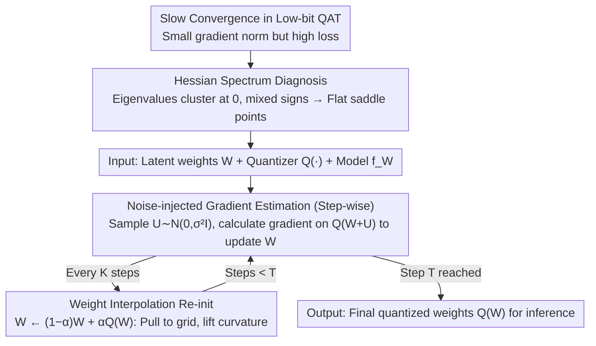

# WinQ: Accelerating Quantization-Aware Training of Language Models Around Saddle Points

**Conference**: ICML2026  
**arXiv**: [2605.17471](https://arxiv.org/abs/2605.17471)  
**Code**: https://github.com/facebookresearch/WinQ  
**Area**: Model Compression / Low-bit Quantization / LLM Efficiency  
**Keywords**: Quantization-Aware Training, Low-bit LLM, Hessian Spectrum, Saddle Point Optimization, Noise Injection  

## TL;DR
WinQ attributes the slow convergence of low-bit Large Language Model (LLM) Quantization-Aware Training (QAT) to weights being trapped near low-curvature saddle points. It accelerates 1-2 bit QAT by 1.5-4.0x with minimal training overhead by using periodic weight-quantization interpolation re-initialization and noise-perturbed gradients, improving perplexity and zero-shot accuracy across multiple LLaMA/Qwen configurations under identical training budgets.

## Background & Motivation
**Background**: Deploying LLMs increasingly relies on low-bit quantization. While Post-Training Quantization (PTQ) maintains performance above 4 bits, it fails significantly at extreme precisions like 1-2 bits or 1.58 bits. Consequently, Quantization-Aware Training (QAT) is the mainstream solution, where full-precision latent weights are maintained, but forward passes and gradient estimations are performed using quantized weights.

**Limitations of Prior Work**: QAT is effective but costly. The paper notes that even 4-bit QAT costs nearly 10% of full-precision pre-training, and 1-bit QAT is even slower, often requiring billions of tokens to achieve usable performance. Existing methods like ParetoQ and QuEST focus on modifying quantization functions, Hadamard transforms, or gradient estimators but fail to explain why low-bit QAT plateaus early.

**Key Challenge**: Low-bit quantization requires latent weights to be close to discrete grids, while optimization occurs in continuous space. The authors observe that relative gradient norms decrease quickly while the loss remains high, suggesting the model is stuck in regions with extremely weak local curvature rather than lacking a sufficient learning rate. Hessian spectrum analysis reveals that many eigenvalues in low-bit QAT cluster near zero, with both positive and negative signs present—a characteristic of stagnation near flat saddle points.

**Goal**: The paper aims to answer two questions: first, the underlying optimization cause of slow convergence in low-bit QAT; and second, whether a quantization-independent, low-cost training trick can extract the model from these low-curvature stagnation zones.

**Key Insight**: Instead of designing complex quantizers, the authors treat QAT as a non-convex optimization problem and measure the spectral distribution of the loss Hessian. This perspective translates the difficulty of low-bit training into a measurable curvature problem: lower bit-widths lead to smaller maximum Hessian eigenvalue magnitudes and a higher proportion of near-zero eigenvalues, resulting in slower convergence.

**Core Idea**: Use periodic $W \leftarrow (1-\alpha)W+\alpha Q(W)$ to pull latent weights closer to quantized weights and lift local curvature, combined with noise perturbation $Q(W+U)$ at each step to help gradients escape saddle points.

## Method
The WinQ methodology consists of "Diagnosis" and "Intervention" layers. The diagnosis uses the Hessian spectrum to prove slow convergence is structural; the intervention converts this into two lightweight operations: periodic re-initialization and step-wise noise injection.

### Overall Architecture
The input is an existing QAT pipeline with latent weights $W$, a quantization function $Q(\cdot)$, and a language model $f_W$. WinQ supplements the standard QAT loop with two mechanisms.

First, at each training step, Gaussian noise $U \sim \mathcal{N}(0, \sigma^2 I)$ is sampled. Gradients are calculated using $Q(W+U)$, which then update the original $W$. Second, every $K$ steps, latent weights are reset via linear interpolation: $W \leftarrow (1-\alpha)W+\alpha Q(W)$. After training, the final latent weights are quantized for inference.

A version for Hadamard transforms is also provided. If a method uses $HW$ for quantization, interpolation occurs in the Hadamard space and is mapped back: $W \leftarrow H^\top((1-\alpha)HW+\alpha Q(HW))$, allowing WinQ to be integrated with methods like QuEST.

### Key Designs
**1. Hessian Spectrum Diagnosis: Measuring Curvature Stagnation**

Using stochastic Lanczos quadrature and Hessian-vector products, the authors estimate the eigenvalue distribution of the loss Hessian. They find that in late-stage 1-4 bit QAT, eigenvalues cluster near zero with both signs present, a hallmark of flat saddle points. Convergence speed is determined by local curvature (maximum eigenvalue magnitude). Lower bits result in over 40% of eigenvalues being near zero, directly explaining slow convergence.

**2. Noise-Injected Gradient Estimation: Escaping Saddle Points**

The first intervention modifies the standard QAT step. Instead of calculating gradients on $Q(W)$, WinQ uses $Q(W+U)$. This draws from non-convex optimization theory stating that noisy SGD escapes saddle points more effectively. Hessian analysis shows that suitable noise increases negative curvature magnitude and gradient norms, pushing the model out of stagnation. For 2-bit QAT, $\sigma=0.001$ and $\alpha=0.6$ increase maximum eigenvalue magnitude from 2.65 to 3.96. This adds negligible cost as it requires no extra forward/backward passes.

**3. Weight Interpolation Re-initialization: Lifting Curvature**

Triggered every $K$ steps, this resets latent weights closer to the quantization grid. Under the assumption that the quantized point is locally invariant, this step is equivalent to a proximal update on the $\ell_2$ regularized objective $\Phi(W)=L_Q(W)+\frac{\gamma}{2}\|W-q\|^2$ where $\alpha=\eta\gamma/(1+\eta\gamma)$. The Hessian becomes $\nabla^2 L_Q(W)+\gamma I$, effectively lifting all eigenvalues by $\gamma$. Empirically, $\alpha=0.4$ in 2-bit QAT increases max eigenvalue magnitude by ~84% and reduces near-zero eigenvalues by ~21% without significantly altering the current loss.

### Loss & Training
WinQ does not modify the original LLM objective (autoregressive language modeling on corpora like FineWebEdu). It utilizes the underlying QAT quantizers. Experiments involve training up to 20B tokens (~240K steps). Hyperparameters include $K \in \{40K, 60K, 80K\}$, $\alpha \in [0.1, 0.6]$, and $\sigma \in [0.0002, 0.002]$. AdamW is used with learning rates between $1\times10^{-5}$ and $4\times10^{-5}$. Both components add less than 1% wall-clock overhead.

## Key Experimental Results

### Main Results
Evaluation was conducted on LLaMA-3-1B/3B and Qwen-3-0.6B/1.7B across 1, 1.58, 2, 3, and 4-bit weights with 16/8/4-bit activations.

| Model & Config | Baseline | Baseline PPL ↓ | Baseline Acc ↑ | WinQ PPL ↓ | WinQ Acc ↑ | Gain/Notes |
|--------|------|------|------|------|------|------|
| LLaMA-1B W1A16 | ParetoQ | 16.9 | 51.9 | 15.3 | 52.6 | Significant PPL drop at 1 bit |
| LLaMA-1B W1.58A16 | ParetoQ | 14.0 | 54.7 | 12.9 | 55.6 | Ternary PPL -1.1, Acc +0.9 |
| LLaMA-1B W2A16 | ParetoQ | 12.5 | 56.7 | 11.9 | 56.6 | Lower PPL, stable Acc |
| LLaMA-1B W1A8 | ParetoQ | 23.3 | 48.2 | 21.9 | 49.0 | Gains persist with 8-bit activation |
| LLaMA-3B W1.58A8 | ParetoQ | 13.1 | 55.9 | 12.2 | 58.6 | Large model Acc +2.7 |

PTQ methods (RTN, GPTQ, AWQ) fail at 1-2 bits (e.g., LLaMA-1B W1A16 PPL reaches $10^8$). WinQ improves QAT efficiency, achieving 1.5-4x acceleration and up to 8.8% performance gains under equal compute budgets for sub-4-bit settings.

### Ablation Study

| Config | Metric | Observation |
|------|---------|------|
| $\alpha=0.0$ (No interpolation) | 16.5 PPL | Standard training plateaus at higher loss |
| $\alpha=0.2, K=60K$ | 15.5 PPL | Moderate interpolation improves results |
| $\alpha=0.4, K=60K$ | 15.3 PPL | Optimal balance for curvature lift |
| $\alpha=0.8, K=60K$ | 16.0 PPL | Excessive interpolation disrupts training state |
| $\sigma=0$ | 16.0 PPL | Weak performance without noise injection |
| $\sigma=0.001$ | 15.3 PPL | Optimal noise helps escape saddle points |

### Key Findings
- Slow convergence in low-bit QAT is linked to Hessian spectral properties: fewer bits lead to more near-zero eigenvalues and lower maximum curvature.
- Weight interpolation and noise injection are complementary; one resets the weight position relative to the grid, while the other provides the perturbation needed to leave saddle points.
- WinQ is highly generalizable, compatible with ParetoQ and Hadamard-based methods across various model architectures and bit-widths.

## Highlights & Insights
- The primary contribution is identifying slow QAT convergence as an optimization geometry problem rather than just "hard-to-tune" engineering.
- The design is minimal: it does not change quantizers, optimizer states, or model structures, making it a plug-and-play QAT acceleration trick.
- The proximal update interpretation clarifies why interpolation works: it explicitly handles the distance between latent and quantized weights as part of the geometry.

## Limitations & Future Work
- Verification is limited to 0.6B-3B models. Verification on 7B+ models is needed to ensure Hessian characteristics and hyperparameter stability scale.
- The method introduces three hyperparameters ($K, \alpha, \sigma$). Automatic tuning or adaptive strategies based on curvature would be more practical.
- Continuous Hessian analysis is expensive. Future work could use cheaper signals like gradient norms or loss plateaus to trigger re-initialization.

## Related Work & Insights
- **vs ParetoQ**: ParetoQ reduces quantization error via learned step sizes; WinQ focuses on convergence speed and can be layered on top.
- **vs QuEST**: QuEST uses Hadamard Transforms for better estimation; WinQ's interpolation is compatible with this transform-space optimization.
- **vs PTQ**: PTQ is insufficient for 1-2 bit LLMs; WinQ assumes QAT is necessary and lowers its barrier to entry.

## Rating
- Novelty: ⭐⭐⭐⭐☆ Clear perspective shift from engineering to optimization geometry.
- Experimental Thoroughness: ⭐⭐⭐⭐☆ Broad coverage of bit-widths and models, though could use larger 70B+ validation.
- Writing Quality: ⭐⭐⭐⭐☆ Strong logical flow from diagnosis to solution.
- Value: ⭐⭐⭐⭐⭐ Highly practical for reducing the high cost of low-bit LLM training.

<!-- RELATED:START -->

## Related Papers

- [\[ICLR 2026\] Compute-Optimal Quantization-Aware Training](../../ICLR2026/model_compression/compute-optimal_quantization-aware_training.md)
- [\[ACL 2025\] EfficientQAT: Efficient Quantization-Aware Training for Large Language Models](../../ACL2025/model_compression/efficientqat.md)
- [\[ICML 2026\] Entropy-Aware On-Policy Distillation of Language Models](entropy-aware_on-policy_distillation_of_language_models.md)
- [\[ICCV 2025\] Scheduling Weight Transitions for Quantization-Aware Training](../../ICCV2025/model_compression/scheduling_weight_transitions_for_quantization-aware_training.md)
- [\[ICML 2026\] RaBiT: Residual-Aware Binarization Training for Accurate and Efficient LLMs](rabit_residual-aware_binarization_training_for_accurate_and_efficient_llms.md)

<!-- RELATED:END -->
