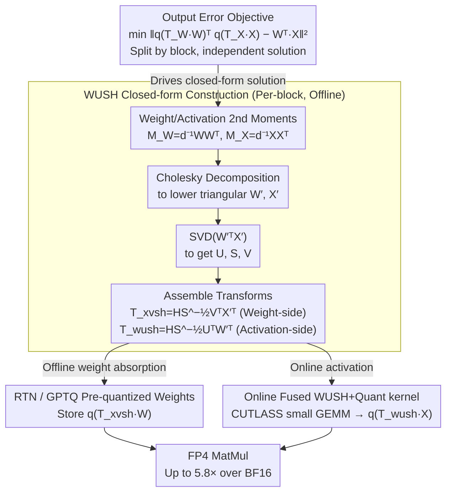

# WUSH: Near-Optimal Adaptive Transforms for LLM Quantization

**Conference**: ICML 2026  
**arXiv**: [2512.00956](https://arxiv.org/abs/2512.00956)  
**Code**: https://github.com/IST-DASLab/WUSH  
**Area**: Model Compression / LLM Quantization  
**Keywords**: W4A4 Quantization, Adaptive Transforms, Hadamard, MXFP4, GPTQ  

## TL;DR
WUSH derives closed-form, data-adaptive blockwise linear transforms for LLM weight-activation low-bit quantization. It combines the uniform diffusion capability of Hadamard with second-order statistics of weights and activations, significantly improving accuracy for W4A4 (especially MXFP4) scenarios with almost no sacrifice to FP4 kernel throughput.

## Background & Motivation
**Background**: In LLM deployment, weight and activation quantization are standard techniques to reduce memory footprint and increase throughput. For W4A4 schemes (4-bit for both weights and activations), mainstream approaches not only select quantizers like RTN or GPTQ but also apply scaling or rotations to channels before quantization to reduce the dominance of outliers on the AbsMax scale.

**Limitations of Prior Work**: Transforms like Hadamard rotation, QuaRot, and MR-GPTQ are effective in practice but are typically fixed and data-independent. While they spread outlier energy, they do not address which transform is optimal for given weight and activation statistics. Methods like SpinQuant and FlatQuant attempt to learn transforms through iterative optimization, which incurs higher calibration and engineering costs and may not be suitable for fast per-token activation quantization.

**Key Challenge**: Quantization error depends on the output error determined jointly by weights and activations, rather than merely making weights or activations more uniform in isolation. An ideal transform must adapt to the second-order statistics of each block and be efficiently integrated into activation transforms and quantization kernels during inference; otherwise, precision gains are offset by runtime overhead.

**Goal**: The authors aim to derive a closed-form, near-optimal transform for blockwise RTN AbsMax quantizers, covering both FP and INT low-bit formats and naturally integrating with GPTQ. The method needs to improve W4A4 accuracy on real LLMs while preserving the throughput advantages of FP4 MatMul.

**Key Insight**: Starting from the output error of a single quantization block, the paper treats weight and activation columns as samples from a distribution. It uses second-order moments to describe their typical shapes and seeks a linear transform that minimizes the quantization error of the transformed weights and activations. Hadamard is no longer the sole protagonist but serves as a uniform diffusion skeleton within an optimal construction.

**Core Idea**: Construct data-adaptive non-orthogonal transforms using blockwise second-order moments of weights and activations, then wrap them in a Hadamard backbone. This ensures the transform possesses both statistical optimality and energy diffusion properties friendly to AbsMax quantization.

## Method

### Overall Architecture
WUSH segments the input channels of each linear layer into blocks according to quantization groups. During offline calibration, the method collects the second-order moments of weights and activations for each block and solves for a pair of reciprocal-transpose transforms in closed form: the weight side is pre-transformed and quantized using $T_{xvsh}$, while the activation side is transformed by $T_{wush}$ before quantization during inference. Since $T_{xvsh}=T_{wush}^{-\top}$, the inner product remains consistent before quantization; the transform's objective is to minimize the post-quantization output error.

During inference, the weight-side transform is already absorbed into the pre-quantized weights. Online, only the WUSH transform and quantization need to be performed on activation blocks. The authors implement a fused WUSH + Quant kernel and store the $G \times G$ matrix for each block in a layout suitable for CUTLASS GEMM, allowing multiple small matrix transforms to be efficiently fused similar to Hadamard + quantization.

### Key Designs
1. **Defining Joint Blockwise Quantization Objectives Based on Output Error**: Previous quantization methods focused either solely on weight error or activation error. However, the true determinant of model output is the error in the product $W^\top X$. WUSH directly optimizes the output error of each input channel block $\|q(T_WW)^\top q(T_XX)-W^\top X\|_F^2$ by choosing a pair of transforms $T_W, T_X$ to minimize it. The total layer error is approximated as the sum of block errors, allowing independent closed-form solutions for each block. Modeling based on output error addresses how AbsMax group quantization error is determined by the block's maximum value, distribution shape, and the interaction between weights/activations—directly explaining when fixed Hadamard suffices and when it does not.

2. **WUSH Closed-form Construction: 2nd Moments + SVD + Hadamard Backbone**: A key contribution is solving for the "optimal for this block" transform in closed form without iterative learning. First, Cholesky decomposition is performed on weight second-order moments $d_{out}^{-1}WW^\top$ and activation second-order moments $d_{batch}^{-1}XX^\top$ to obtain $W'$ and $X'$. Then, SVD is applied to $W'^\top X'$ to get $U, S, V$. Finally, the activation-side transform $T_{wush}=HS^{1/2}U^\top W'^\top$ and weight-side $T_{xvsh}=HS^{-1/2}V^\top X'^\top$ are assembled. They are reciprocal-transposes $T_{xvsh}=T_{wush}^{-\top}$, preserving the inner product before quantization. Here, $S^{-1/2}$ and the second-order terms "whiten" and align the coordinate systems based on real statistics, while the Hadamard backbone spreads energy uniformly across the group so each channel has an equal RMS—the key to AbsMax friendliness. The paper proves this construction is optimal for FP quantization and asymptotically optimal for INT, with Hadamard being the only data-independent component.

3. **Engineering Integration with RTN/GPTQ and Fused GPU Kernels**: Since each block has an independent matrix, a naive implementation would be significantly slower than fixed Hadamard. To ensure theoretical gains are not erased by runtime overhead, it must be implemented for real W4A4 inference. For RTN, WUSH is calculated in parallel for all blocks and weights are pre-transformed. For GPTQ, it reuses the same activation second-order information as the GPTQ Hessian, interleaving block updates with transformed weights. In the online phase, only the activation-side transform remains, which is mapped to a CUTLASS-style small GEMM fused into a single quantization kernel followed by FP4 MatMul. By storing the $(G, G, C)$ block matrices in a layout suitable for CUTLASS and treating the $C$ dimension as a thread block offset, the throughput difference relative to a Hadamard fused kernel is only ~1.3%, with speeds up to 5.8× over BF16.

### Loss & Training
WUSH is a post-training quantization (PTQ) method and does not train model parameters. During the offline phase, calibration data is used to compute weight/activation second-order moments, following sequential layer-wise calibration. For the RTN version, weights are simply rounded to the nearest value after transformation. The GPTQ version follows standard GPTQ Hessian and error propagation, applying the WUSH transform to the current block first. Complexity involves additional costs for blockwise second-order moments, Cholesky, and SVD; since the block size is much smaller than the channel count, the overall calibration cost is close to standard GPTQ.

## Key Experimental Results

### Main Results
LM Evaluation Harness results for Llama-3.1-8B-Instruct W4A4 show small improvements for WUSH on NVFP4 and significant gains on the more challenging MXFP4 format, especially compared to Hadamard/MR-GPTQ.

| Format | Method | MMLU-CoT | GSM8K | HellaSwag | WinoGrande | Average | Recovery |
|----|----|----|----|----|----|----|----|
| BF16 | Original | 72.76 | 85.06 | 80.01 | 77.90 | 78.93 | 100.0 |
| NVFP4 | RTN-I | 68.26 | 78.39 | 78.15 | 74.11 | 74.73 | 94.67 |
| NVFP4 | GPTQ-H / MR-GPTQ | 69.12 | 80.80 | 78.17 | 75.24 | 75.84 | 96.08 |
| NVFP4 | GPTQ-WUSH | 69.69 | 80.11 | 78.52 | 76.09 | 76.10 | 96.40 |
| MXFP4 | RTN-I | 62.21 | 67.85 | 73.99 | 73.24 | 69.32 | 87.83 |
| MXFP4 | RTN-H | 62.38 | 72.48 | 75.29 | 71.67 | 70.45 | 89.26 |
| MXFP4 | RTN-WUSH | 66.85 | 75.16 | 77.28 | 73.56 | 73.21 | 92.75 |
| MXFP4 | GPTQ-H / MR-GPTQ | 67.19 | 75.70 | 76.91 | 74.80 | 73.65 | 93.31 |
| MXFP4 | GPTQ-WUSH | 67.79 | 77.41 | 77.44 | 74.78 | 74.35 | 94.20 |

### Ablation Study
Layerwise quantization loss validates WUSH design components. The table shows trends for Qwen3-8B block 18 using FineWeb-Edu calibration: WUSH significantly out-performs identity (I), random rotation, Hadamard (H), and WUS (without Hadamard) in MXFP4 and INT4.

| Format | Transform | Q | K | V | O | G | U | D | Conclusion |
|----|----|----|----|----|----|----|----|----|----|
| MXFP4 | I | 11.1 | 12.0 | 10.7 | 4.35 | 7.10 | 6.56 | 5.47 | Outliers increase error |
| MXFP4 | H | 7.24 | 7.20 | 8.60 | 3.79 | 5.45 | 5.61 | 3.90 | Fixed Hadamard helps |
| MXFP4 | WUS | 6.27 | 7.22 | 4.05 | 3.57 | 5.76 | 4.75 | 4.46 | Adaptive but lacks diffusion |
| MXFP4 | WUSH | 3.34 | 3.34 | 3.30 | 2.76 | 4.49 | 4.39 | 3.39 | Lowest error |
| INT4 | H | 5.57 | 5.55 | 6.80 | 2.86 | 4.09 | 4.25 | 3.03 | Hadamard stabilizes scale |
| INT4 | WUS | 213.0 | 142.0 | 10.7 | 4.54 | 50.2 | 7.42 | 13.1 | Non-orthogonal may amplify |
| INT4 | WUSH | 2.39 | 2.43 | 2.54 | 2.10 | 3.43 | 3.43 | 2.55 | Hadamard component essential |

| Systems/Robustness Analysis | Metric | Description |
|----|----|----|
| WUSH + Quant + FP4 MatMul Max Speedup | 5.8x vs BF16 | Near theoretical FP4 hardware gain |
| Avg. throughput diff vs H + Quant + FP4 | ~1.3% | Per-block matrices do not stall kernel |
| Llama-3.1-8B RTN Pre-proc cost | 19 min / 19 GB H100 | Comparable to GPTQ scale |
| Qwen3-32B RTN Pre-proc cost | 38 min / 40 GB B200 | Scalable to large models |
| WUSH Transform Storage Overhead | MXFP4 1.4%, NVFP4 0.7% | Negligible relative to checkpoint |
| Calibration Set Sensitivity (Qwen3-8B) | FineWeb 74.91 / C4 75.57 | Does not overfit a single set |

### Key Findings
- WUSH gains are concentrated in more difficult FP4 formats like MXFP4. On Llama-3.1-8B, MXFP4 RTN-WUSH is 2.76 points higher on average than RTN-H.
- WUS alone can approach WUSH on NVFP4 but causes catastrophic outlier amplification in INT4, indicating the Hadamard backbone is a critical stabilizer for the AbsMax scale.
- Fused kernel results are vital: WUSH uses different matrices for each block, yet the throughput difference with Hadamard kernels is only ~1.3%.
- Calibration stability and KL divergence results suggest the method does not just overfit benchmarks. WUSH maintains lower KL divergence than Hadamard across different calibration sets.

## Highlights & Insights
- The paper clarifies "why Hadamard is useful": it is not a heuristic rotation but a component in WUSH that distributes energy uniformly across group dimensions. This explanation is more valuable than benchmark scores alone.
- WUSH's non-orthogonal adaptive component comes from weight and activation second-order statistics, allowing it to move beyond weight-only quantization to joint W4A4 error optimization.
- The method is compatible with both RTN and GPTQ, covering both "fast direct quantization" and "second-order corrected quantization" workflows.
- The GPU kernel work completes the cycle. By using specific layouts and CUTLASS mapping, the authors demonstrate that per-block adaptive matrices can achieve speeds near fixed Hadamard.

## Limitations & Future Work
- WUSH still relies on calibration data statistics. While sensitivity experiments for FineWeb/C4 are promising, the stability of activation second-order moments in scenarios like extreme domain shift or tool-calling needs more verification.
- The paper focus is on W4A4 inference for dense linear layers; adaptation for MoE routing, KV-cache, and attention score quantization is not fully explored.
- Block-specific transform matrices increase implementation complexity compared to global transforms. Adoption into inference frameworks requires mature kernels and toolchains.
- Theoretical derivations rely on some approximations, such as block independence and random quantization surrogates, which might not hold for extreme heavy-tail or strongly correlated blocks.

## Related Work & Insights
- **vs SmoothQuant / AWQ**: These methods use channel scaling to balance dynamic ranges; WUSH uses full blockwise linear transforms to handle correlation structures between dimensions.
- **vs QuaRot / Hadamard-based methods**: QuaRot and MR-GPTQ rely on data-independent rotations; WUSH retains Hadamard's hardware friendliness while adding second-order adaptation.
- **vs SpinQuant / FlatQuant**: Learning-based transforms adapt to data but require iterative optimization; WUSH provides a closed-form solution with calibration costs similar to GPTQ.
- **vs GPTQ**: GPTQ optimizes error propagation for weight quantization; WUSH can be embedded within GPTQ to provide activation-side transforms using the same Hessian information.
- **Insight**: For low-bit LLMs, the future lies in co-designing data statistics, format characteristics, and kernel shapes; WUSH serves as a strong example of this "math-to-hardware" closed-loop.

## Rating
- Novelty: ⭐⭐⭐⭐⭐ Closed-form derivation of adaptive block transforms and explanation of Hadamard's role.
- Experimental Thoroughness: ⭐⭐⭐⭐☆ Covers multiple models, formats, RTN/GPTQ, kernels, and stability.
- Writing Quality: ⭐⭐⭐⭐☆ Clear connection between theory/algorithm/kernel/experiments, though derivation is dense.
- Value: ⭐⭐⭐⭐⭐ High value for W4A4 LLM deployment, especially for new FP4 formats like MXFP/NVFP.

<!-- RELATED:START -->

## Related Papers

- [\[ICML 2026\] NeUQI: Near-Optimal Uniform Quantization Parameter Initialization for Low-Bit LLMs](neuqi_near-optimal_uniform_quantization_parameter_initialization_for_low-bit_llm.md)
- [\[ICLR 2026\] TurboQuant: Online Vector Quantization with Near-Optimal Distortion Rate](../../ICLR2026/model_compression/turboquant_online_vector_quantization_with_near-optimal_distortion_rate.md)
- [\[ICML 2026\] OSAQ: Outlier Self-Absorption for Accurate Low-bit LLM Quantization](osaq_outlier_self-absorption_for_accurate_low-bit_llm_quantization.md)
- [\[ICML 2026\] ReSpinQuant: Efficient Layer-Wise LLM Quantization via Subspace Residual Rotation Approximation](respinquant_efficient_layer-wise_llm_quantization_via_subspace_residual_rotation.md)
- [\[ICLR 2026\] Dataset Distillation as Pushforward Optimal Quantization](../../ICLR2026/model_compression/dataset_distillation_as_pushforward_optimal_quantization.md)

<!-- RELATED:END -->
