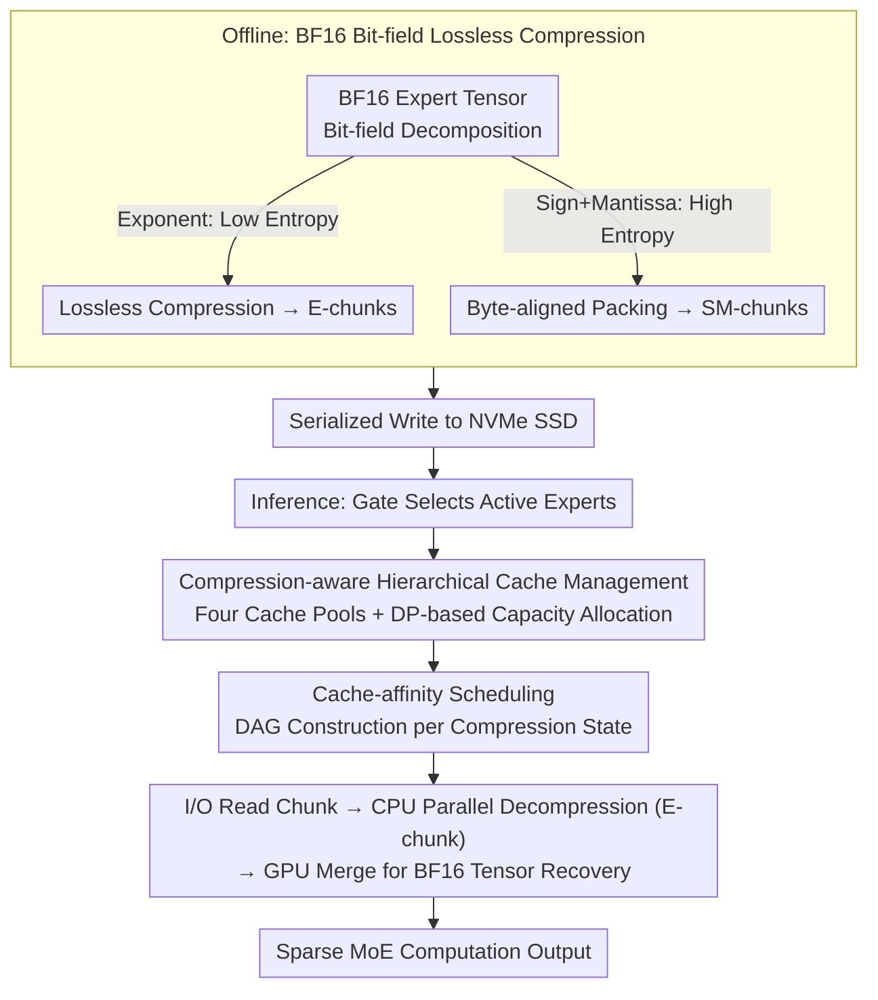

# ZipMoE: Efficient On-Device MoE Serving via Lossless Compression and Cache-Affinity Scheduling

**Conference**: ICML2026  
**arXiv**: [2601.21198](https://arxiv.org/abs/2601.21198)  
**Code**: https://github.com/npnothard/ZipMoE-ICML26  
**Area**: Model Compression / LLM Systems / Edge Inference  
**Keywords**: MoE Inference, Lossless Compression, Edge Deployment, Cache Scheduling, Unified Memory Architecture  

## TL;DR
ZipMoE targets Large MoE model inference on mobile and edge devices. It decomposes BF16 expert parameters into compressible exponent bits and high-entropy sign-mantissa bits. Through lossless compression, hierarchical caching, and cache-affinity scheduling, it transforms the expert loading process—previously bottlenecked by SSD I/O—into a parallelized decompression and reconstruction pipeline hidden by multi-core CPUs. This reduces latency and enhances throughput without altering model semantics.

## Background & Motivation
**Background**: MoE language models scale capacity through sparse computation where only a few experts are activated per token. However, deployment still requires storing vast amounts of expert parameters. Cloud or server environments typically rely on CPU memory/SSD offloading, expert caching, prefetching, and pipelining to move experts from lower storage layers to GPUs. On edge devices, the goal is to keep models local for privacy, low network dependency, and interactive responsiveness.

**Limitations of Prior Work**: Constraints on edge platforms differ significantly from servers. Devices like Jetson, mobile SoCs, and Apple Silicon often use Unified Memory Architectures (UMA) where CPU and GPU share physical memory. DRAM capacity is limited, forcing experts to be read from NVMe SSDs frequently. Interactive applications mostly use batch size 1, making it difficult to amortize I/O through large batches or long pipelines. Measurements indicate that moving from a server to an edge environment increases I/O stalls in MoE decoding layers from 38.5% to 80.1%, leaving computing resources largely idle.

**Key Challenge**: While model compression can reduce memory footprints, common quantization and pruning techniques alter model behavior. For security-sensitive or unsupervised edge deployments, proving "similarity" through perplexity or zero-shot accuracy is insufficient. Conversely, leaving parameters unchanged results in severe I/O bottlenecks during expert loading. The core challenge is addressing the system contradiction: maintaining perfect algorithmic consistency while preventing I/O from stalling edge MoE performance.

**Goal**: The authors decompose the problem into three sub-problems: identifying a lossless compressible structure within MoE parameters, hiding decompression costs behind I/O on unified memory/multi-core CPUs, and managing the caching of full tensors, compressed chunks, or specific bit-fields under limited memory budgets.

**Key Insight**: A critical observation is the bit-field distribution of BF16 parameters. While sign and mantissa bits are nearly random with limited compression gain, the distribution of exponent bits is highly skewed, with a Shannon entropy of approximately 2.55-2.65 bits. Actual compression can reduce model size to 68%-74%. This indicates statistical redundancy in MoE expert parameters that can be exploited losslessly.

**Core Idea**: By employing bit-field level lossless compression and co-designing cache scheduling, expert access is transformed from "waiting for full tensor disk reads" to "reading partial data, parallel decompression, and fast BF16 tensor reconstruction."

## Method
ZipMoE is an edge MoE serving system rather than a new MoE model. It focuses on decomposing, compressing, and serializing expert parameters offline, then constructing fine-grained task DAGs based on gate-selected experts during online inference, interleaving SSD I/O, CPU decompression, and GPU tensor recovery.

### Overall Architecture
The system operates in two phases: offline initialization and real-time inference.

During offline initialization, ZipMoE performs bit-field decomposition on each BF16 expert tensor: exponent bits are partitioned into shards and compressed into E-chunks using lossless compressors (e.g., LZ4, LZ4HC, ZSTD). Sign and mantissa bits are packed into byte-aligned SM-chunks. These chunks and metadata are written as binary files to the NVMe SSD. Since the process is lossless, the recovered BF16 tensors are identical to the original parameters.

During real-time inference, the model gate identifies the experts to be accessed for the current sparse MoE layer. ZipMoE's cache manager determines cache capacities for different compression states, and the scheduler constructs a DAG for each expert tensor. This may involve reading SM-chunks, reading compressed E-chunks, CPU decompression of E-chunks, and using GPU kernels to merge parts back into BF16 tensors. Execution utilizes an I/O thread, a set of CPU worker threads, and CUDA streams to minimize GPU wait time by hiding I/O and decompression within the sparse layer execution.

### Key Designs

**1. BF16 Bit-field Lossless Compression: Saving I/O via Representation Redundancy**

Quantization saves memory but changes model behavior, which is unacceptable for unsupervised edge security scenarios. Standard offloading is limited by SSD read speeds. ZipMoE exploits the inherent redundancy in BF16 representation. By separating the sign, exponent, and mantissa segments, it is observed that exponent bits are highly skewed with a Shannon entropy of ~2.55-2.65 bits. These are split into shards and compressed via lossless compressors like LZ4 into E-chunks. Sign and mantissa bits are high-entropy and direct packing into SM-chunks is preferred. During inference, E-chunks are decompressed and bit-merged with SM-chunks to restore identical BF16 values, reducing model size to 68%-74% with zero behavioral drift.

**2. Compression-aware Hierarchical Cache Management: Optimal Granularity under Fixed Budgets**

An expert can reside in memory at multiple granularities: full tensor, compressed tensor, SM-chunk only, or E-chunk only. The granularity level dictates the remaining I/O and decompression overhead. ZipMoE maintains four cache pools (Full Tensor, Compressed Tensor, SM-dedicated, E-dedicated). It uses historical activation frequencies to construct a rank-based activation distribution—modeling popularity by rank rather than fixed expert IDs. Poisson-binomial dynamic programming estimates joint hit probabilities, followed by a grid search to find the capacity configuration that minimizes the expected sparse-layer makespan. This approach captures the distribution skew while remaining robust to prompt-driven drifting of specific expert popularity.

**3. Compression State and Cache-affinity Scheduling: Co-utilizing I/O, CPU, and GPU**

The true bottleneck on edge devices is the lack of simultaneous utilization of I/O threads, multi-core CPUs, and the GPU. ZipMoE abstracts the "currently cached expert components" into compression states (E-expert, SM-expert, compressed-expert, full tensor, etc.) and generates customized DAGs. The scheduler categorizes tasks into Type-I (requiring SM-chunk reads) and Type-II (SM already hit), sorting them into blocks based on estimated time. It prioritizes Type-I reads to saturate the I/O thread while inserting Type-II decompression tasks to fill CPU workers, effectively hiding exponent decompression behind disk reads. The paper proves the makespan satisfies $ALG \le (3 - 1/L) \cdot OPT$ (where $L$ is the number of decompression threads). This DAG-based approach shifts expert loading from I/O-bound to compute-parallel.

### Loss/Training
No new models are trained, and no additional loss functions are introduced. The "optimization goal" exists at the system level: sparse layer makespan and end-to-end inference latency. Offline phases only involve parameter re-encoding, while online phases minimize execution time via cache planning and scheduling. Models are sourced directly from Hugging Face with no weight modifications.

## Key Experimental Results

### Main Results
Experiments covered DeepSeekV2-Lite, Qwen1.5-MoE, and SwitchTransformers-Large-128 on Jetson AGX Orin (64GB/32GB). Baselines included MoE-Infinity, DeepSpeed ZeRO-3 offloading, and Accelerate. ZipMoE consistently outperformed others under edge memory constraints requiring offloading.

| Scenario | Metric | ZipMoE vs. Baseline | Comparison | Note |
|------|------|-----------------------------|----------|------|
| Decoder-only MoE Interactive Inference | TPOT | 62.65%-97.97% Lower | MoE-Infinity / DeepSpeed / Accelerate | Significant improvement in real-time response during token output |
| Decoder-only MoE Interactive Inference | TTFT | 53.25%-87.90% Lower | Same as above | Reduced wait time for first token |
| Encoder-decoder MoE | TPOT | 4.99%-81.24% Lower | Same as above | Lower gains due to more skewed activations but still effective |
| Batch Inference | Throughput | 1.79x-42.49x (Decoder), 1.31x-5.82x (Enc-Dec) | Same as above | Parallelism improves as more experts are activated per layer |
| End-to-end Generation | Latency | 3.03x-42.49x Acceleration | Same as above | Consistent advantage across output lengths |

### Ablation Study
The study decomposed caching strategies, comparing base eviction, heterogeneous cache pools, and cache planning. Table 1 excerpts:

| Model | Config | Throughput (tokens/s) | E2E (s) | Note |
|------|------|------------------------|---------|------|
| DeepSeekV2-Lite 16B | Baseline | 1.60 | 585.96 | Offloading baseline |
| DeepSeekV2-Lite 16B | ZipMoE avg. basic | 4.43 | 204.05 | Major gains from basic strategy |
| DeepSeekV2-Lite 16B | ZipMoE +C | 5.18 | 176.68 | Improvement with heterogeneous pools |
| DeepSeekV2-Lite 16B | ZipMoE +C+P | 5.30 | 173.23 | Best Pareto point with cache planning |
| Qwen1.5-MoE 14B | Baseline | 1.99 | 515.12 | Offloading baseline |
| Qwen1.5-MoE 14B | ZipMoE avg. basic | 6.39 | 160.33 | Decompression & scheduling contribute most |
| Qwen1.5-MoE 14B | ZipMoE +C | 7.64 | 134.10 | Layered cache significantly boosts throughput |

### Key Findings
- Primary gains stem from the paradigm shift: using lossless compression to reduce disk reads and parallel CPU decompression to move from I/O-bound to compute-parallel execution. The system core contributes ~76% of throughput gains, with cache management contributing ~24%.
- OS page cache acts as an added benefit rather than the sole source of performance. Even when 32GB RAM is occupied to limit page cache, ZipMoE still reduces TTFT by 56.64% and TPOT by 53.32% compared to baselines.
- Gains for Encoder-decoder MoE are lower than Decoder-only due to more skewed expert activations and lower I/O intensity, suggesting ZipMoE is most beneficial for "many experts, insufficient memory, I/O dominant" scenarios.

## Highlights & Insights
- The ingenious approach avoids treating "compression" as quantization and instead finds lossless redundancy in the BF16 format. This reduces edge I/O while avoiding security or behavior drift issues associated with low-bit approximations.
- The "compression state" abstraction is practical: it promotes the partial caching of parameters from an implementation detail to a scheduling object, allowing the system to distinguish between full hits, partial hits, and misses.
- The paper exploits a counter-intuitive opportunity in edge SoCs: CPUs usually sit idle during I/O stalls, but their multi-core decompression capacity is sufficient to hide the cost of exponent recovery.

## Limitations & Future Work
- Evaluation is primarily on NVIDIA Jetson AGX Orin. While applicable to shared-memory platforms, performance on mobile NPUs, Apple Neural Engines, or discrete CPU/GPU architectures requires further validation.
- The methodology depends on the low-entropy exponent distribution of the BF16 format. If models shift to different formats or training alters parameter distributions, compression rates may decrease.
- ZipMoE currently focuses on expert parameter access. Prefill phases, KV cache pressure, multi-app concurrency, and power consumption metrics are not discussed in depth.
- Cache planning requires historical statistics. Adapting to highly non-stationary or rapidly switching task environments remains an open question.

## Related Work & Insights
- **vs. Quantized/Pruned MoE**: Quantization reduces models via approximation; ZipMoE maintains original BF16 semantics by changing the storage and execution path. ZipMoE offers better consistency, though its compression ceiling is lower.
- **vs. MoE-Infinity / MoELightning / Klotski**: These focus on server-grade offloading and prefetching. ZipMoE targets edge UMA + SSD scenarios, decomposing parameters into parallel-recoverable blocks to avoid forcing server assumptions onto mobile devices.
- **vs. Lossless Compression (nvCOMP, etc.)**: While these show lossless compression aids LLMs, they often do not target the conditional activation of MoE or AArch64 edge CPUs. ZipMoE integrates compressors, partial caching, and expert scheduling into a cohesive system.

## Rating
- Novelty: ⭐⭐⭐⭐☆ Integrating BF16 bit-field lossless compression with MoE cache-affinity scheduling is a comprehensive and fresh system perspective.
- Experimental Thoroughness: ⭐⭐⭐⭐☆ Covers multiple models and hardware budgets; however, mobile SoC/phone platforms and power metrics would strengthen the work.
- Writing Quality: ⭐⭐⭐⭐☆ Clear motivation and theoretical guarantees, though some tables require cross-referencing with figures for full clarity.
- Value: ⭐⭐⭐⭐⭐ High utility for edge MoE serving, particularly for security-sensitive cases where lossy quantization is undesirable.

<!-- RELATED:START -->

## Related Papers

- [\[ICML 2026\] RQ-MoE: Residual Quantization via Mixture of Experts for Efficient Input-Dependent Vector Compression](rq-moe_residual_quantization_via_mixture_of_experts_for_efficient_input-dependen.md)
- [\[ACL 2026\] The Pitfalls of KV Cache Compression](../../ACL2026/model_compression/the_pitfalls_of_kv_cache_compression.md)
- [\[ICML 2026\] Breaking the MoE LLM Trilemma: Dynamic Expert Clustering with Structured Compression](breaking_the_moe_llm_trilemma_dynamic_expert_clustering_with_structured_compress.md)
- [\[ICML 2026\] xKV: Cross-Layer KV-Cache Compression via Aligned Singular Vector Extraction](xkv_cross-layer_kv-cache_compression_via_aligned_singular_vector_extraction.md)
- [\[ICML 2026\] Semantic Integrity Matters: Benchmarking and Preserving High-Density Reasoning in KV Cache Compression](semantic_integrity_matters_benchmarking_and_preserving_high-density_reasoning_in.md)

<!-- RELATED:END -->
