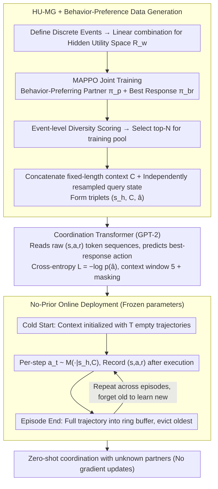

# CoOT: Learning to Coordinate In-Context with Coordination Transformers

**Conference**: ICML 2026  
**arXiv**: [2506.23549](https://arxiv.org/abs/2506.23549)  
**Code**: https://coot-project.github.io/coot/ (with demo)  
**Area**: Multi-Agent Reinforcement Learning / Coordination / In-Context Learning  
**Keywords**: Ad-hoc teamwork, In-context learning, Decision Transformer, Hidden-utility Markov Games, Zero-shot coordination  

## TL;DR
This work reframes "cooperating with unknown partners" from a task-generalization problem to a partner-generalization in-context learning problem. By training a Decision Transformer to predict best-response actions over cross-episode interaction trajectories, the model adapts to unseen partners within a few episodes during test-time without updating parameters.

## Background & Motivation

**Background**: In multi-agent reinforcement learning, cooperating with unknown agents is known as ad-hoc teamwork (AHT) or zero-shot coordination (ZSC). Mainstream approaches fall into three categories: self-play (SP) to learn fixed conventions; population-based methods (HSP, MEP) to train a recurrent policy against a diverse partner pool; and context-based meta-RL (PACE, PECAN, LIAM) which uses an encoder to compress recent trajectories into a latent representation for the policy.

**Limitations of Prior Work**: SP converges to its own conventions and fails when meeting partners with different conventions. Population-based methods are limited by the coverage of the training partner pool and drop significantly in performance against out-of-distribution partners. Fine-tuning for online adaptation requires thousands to millions of interactions, making it infeasible for few-shot scenarios. Context-based meta-RL compresses interactions into a fixed latent, losing temporal structure and often providing misleading representations for unseen partners; models like PACE/PECAN even underperform vanilla HSP.

**Key Challenge**: The essence of coordination is "inferring the hidden preferences or policies of partners online." However, existing paradigms either compress this into the training phase or into a latent bottleneck. No prior work has truly allowed models to perform inference by observing the full original trajectories at test time.

**Goal**: (1) Identify a partner-adaptation mechanism that requires no gradient updates and does not rely on latent compression; (2) Demonstrate that "a small number of interactions" is sufficient in real coordination scenarios like Overcooked and GRF.

**Key Insight**: Transfer In-Context Learning (ICL) from language/task generalization to partner generalization. Since Transformers can infer across tasks given a few examples in a prompt, they should also be able to infer the best response across partners given a few episodes in a prompt.

**Core Idea**: Use best-response behavior as a supervisory signal to train a Decision-Pretrained Transformer to directly predict the best-response action given the "complete trajectory of the past $T$ episodes + current query state." This ensures partner-adaptation occurs entirely within the forward pass.

## Method

### Overall Architecture
CoOT addresses how to cooperate with unknown partners without updating parameters. It formulates coordination as a Hidden-Utility Markov Game (HU-MG) $(\mathcal{S}, \mathcal{A}, \mathcal{T}, R_t, \mathcal{R}_w)$, where the environment reward $R_t$ is shared, but each partner $\pi^p_i$ has a private "hidden utility" $r^w_i \sim \mathcal{R}_w$. Different $r^w_i$ induce distinct behavioral preferences in the same environment. The process involves: training phase where best-response trajectories are generated for a large variety of partners to train a Decision Transformer to predict best responses from historical interactions; and a deployment phase where parameters are frozen, and partner adaptation happens through the forward pass as the interaction history grows.

### Key Designs

**1. HU-MG + Behavior-Preferring Data Generation: Diverse partners with ground-truth best-response labels**

For ICL to generalize to unknown partners, the training partners must cover a wide behavioral spectrum, and each must have a clean supervisory signal. Discrete environment events are defined to create a reward space $\mathcal{R}_w$ via linear combinations. For each sampled hidden utility $r^w_i$, MAPPO is used to jointly train a behavior-preferring partner $\pi^p_i$ and its best response $\pi^{br}_i$. This makes the best response a partner-specific oracle, providing a cleaner signal than sparse RL rewards. Diversity is ensured by calculating an event-level diversity score $d_i$ for all $\pi^{br}_i$ and selecting the top-N pairs for the training pool $\Pi_{train}$. Crucially, after concatenating $T$ trajectories into context $C$, the query state $s_h$ is **independently** resampled to form the triplet $(s_h, C, \hat{a})$, preventing the model from collapsing into simple trajectory completion.

**2. Coordination Transformer: GPT-2 reading raw $(s,a,r)$ token sequences**

A common failure in context-based meta-RL is compressing interactions into a fixed latent, destroying the temporal structure critical for coordination. CoOT instead flattens the context into a token sequence $[\tau_1, \tau_2, \ldots, \tau_T, s_{query}]$ where each $\tau$ is a sequence of $(s,a,r)$ for an entire episode. It predicts the action distribution $\hat{p}_h(\cdot)=M_\theta(\cdot\mid s_h, C)$ at the final position. The training objective is cross-entropy loss against the best-response action: $\mathcal{L} = -\log \hat{p}_h(\hat{a})$, where $\hat{a}=\pi^{br}_i(s_h)$. The context window is set to 5 episodes, with context masking used during training to encourage reliance on proximal trajectories. By attending to raw tokens, the Transformer preserves details that reconstruction losses in PEARL/PACE might smooth over.

**3. No-Prior Online Deployment: Cold start + ring buffer**

Deployment is the ultimate test of coordination. Any retrieval or pre-filled context would artificially inflate performance. CoOT initializes context $C$ with $T$ empty trajectories (strict cold start). Each step samples $a_t \sim \hat{p}_t$ where $\hat{p}_t=M_\theta(\cdot\mid s_h, C)$. After an episode ends, the full trajectory $\tau=(s_t, a_t, r_t)_{t=1}^Z$ is appended to the context buffer, **evicting the oldest one**. Using a ring buffer instead of an infinite log allows the model to "forget the old and learn the new," which is vital if a partner changes their style mid-task.

### Loss & Training
CoOT uses a GPT-2 backbone. Trajectories from 36 best-response policies (each corresponding to a behavior-preferring HSP partner) are used for supervised training. Only best-response trajectories are used for supervision (partner trajectories are not directly supervised). Evaluation follows the protocol from Wang et al. 2024: 10 evaluation partners per layout (15 for Coord. Ring Multi-recipe), selected using a Best-Response Diversity (BR-div) metric. Each partner is tested for 50 episodes, with CoOT continuously updating its context.

## Key Experimental Results

### Main Results

Return and Best-Response Proximity (BR-prox = Agent Return / Best-Response Return) across five Overcooked layouts:

| Method | Coord. Ring | Coord. Ring Multi-recipe | Counter Circ. | Asymm. Adv. | Bothway Coord. | Overall Return | Overall BR-prox |
|------|-------------|--------------------------|----------------|-------------|----------------|----------------|------------------|
| BC | 26.24 / 0.31 | 8.97 / 0.10 | 10.79 / 0.11 | 108.83 / 0.53 | 98.99 / 0.94 | 50.76 | 0.40 |
| BC-RNN | 28.07 / 0.33 | 21.98 / 0.25 | 15.15 / 0.14 | 105.52 / 0.51 | 93.59 / 0.91 | 52.86 | 0.42 |
| MEP | 40.30 / 0.47 | 16.64 / 0.19 | 1.89 / 0.02 | 127.44 / 0.61 | 22.76 / 0.20 | 41.81 | 0.30 |
| HSP | 41.10 / 0.49 | 29.35 / 0.33 | 21.37 / 0.23 | 134.01 / 0.63 | 54.99 / 0.53 | 56.16 | 0.44 |
| HSP-ft | 41.30 / 0.49 | 29.24 / 0.33 | 21.71 / 0.22 | 133.59 / 0.63 | 55.81 / 0.54 | 56.33 | 0.44 |
| HSP-meta | 29.84 / 0.35 | 30.21 / 0.34 | 3.28 / 0.03 | 113.16 / 0.54 | 20.44 / 0.20 | 40.19 | 0.29 |
| PACE | 33.94 / 0.40 | 4.43 / 0.05 | 2.41 / 0.02 | 124.06 / 0.59 | 14.90 / 0.15 | 35.95 | 0.24 |
| **Ours (CoOT)** | 38.30 / 0.47 | **45.96 / 0.50** | **28.28 / 0.30** | 129.48 / 0.62 | **101.93 / 0.96** | **68.79** | **0.57** |

CoOT significantly improves Overall BR-prox from 0.44 (strongest baseline) to 0.57 (+30%), with a notable leap in the coordination-intensive Multi-recipe layout.

### Controlled Experiments: GRF 3v1 and Human Study

| Experiment | Metric | BC | MEP | HSP | HSP-ft | **Ours** |
|------|------|----|-----|-----|--------|-----------|
| GRF 3v1 (goal rate / 200 steps) | Goal Rate ↑ | 1.97 | 1.11 | 1.46 | 1.52 | **2.50** |
| Human Eval (36 participants) — Return | ↑ | 51.0 | 53.0 | 40.5 | — | **63.5** |
| Human Eval — Collaboration | ↑ | 2.0 | 3.4 | 2.7 | — | **4.0** |
| Human Eval — Adaptivity | ↑ | 1.8 | 2.9 | 2.2 | — | **3.1** |
| Human Eval — Best Agent Vote (/36) | ↑ | 5 | 8 | 5 | — | **18** |

### Key Findings
- **Few-shot Adaptation Speed**: Results show CoOT's BR-prox significantly rises and stabilizes within the first 15 episodes, whereas PACE shows no improvement, HSP-meta plateaus at lower values, and HSP-ft does not move at all. This proves feeding raw trajectories to a Transformer is more effective than latent/gradient updates in few-shot settings.
- **Non-stationary Adaptation**: When partners switch styles mid-session, CoOT recovers to the target performance within an average of 3.67 episodes (max 6). The ring buffer design effectively enables the model to update its partner model.
- **Context Length Efficiency**: A context length of 5 episodes is the sweet spot. While more information helps, trajectories older than 5 episodes can become misleading (as CoOT’s behavior already changes the partner's reactions).
- **Latency Bottlenecks**: Methods like HSP-meta and PACE perform worse than vanilla HSP. This is attributed to PEARL-style reconstruction losses that give equal weight to all features, allowing coordination-irrelevant noise to dominate the latent.
- **Data Diversity vs. Quantity**: When the number of partners is reduced from 36 to 12, CoOT's performance drops by 24.0%, while BC drops by 41.5%. CoOT is more robust to data scale due to the sample efficiency of ICL.

## Highlights & Insights
- **Coordination = Partner-Generalization, not Task-Generalization**: This reframing is a major takeaway. Simply switching DPT from "cross-task" to "cross-partner" achieved SOTA without architecture changes, indicating that the focus for ICL in RL may have been misplaced.
- **"Raw Trajectories" beat "Latents"**: The failure of the PACE/PECAN/LIAM route empirically shows that fixed-size latent bottlenecks destroy critical temporal signals for coordination.
- **HU-MG + Best-Response Supervision**: Using MAPPO-derived best responses as ground-truth labels provides a much cleaner supervisory signal than sparse RL rewards, allowing for stable Supervised Learning instead of unstable RL.
- **Human Evaluation Success**: 18 out of 36 participants voted CoOT as the best partner. Providing IRB-approved human interaction data with thematic coding (via Gemini) provides strong qualitative evidence of adaptivity.

## Limitations & Future Work
- Only action history is used; there is no explicit communication channel. Coordination relies entirely on behavioral inference.
- Experiments focused on coordination benchmarks; richer perception and control in embodied scenarios remain to be tested.
- The cold-start no-prior protocol is strict; allowing context reuse from similar partners could reduce initial coordination costs.
- Currently limited to cooperative shared-reward settings; the definition of "best response" becomes ambiguous in competitive or mixed-motive scenarios.
- The training partner pool diversity still depends on the population-based generation stage.

## Related Work & Insights
- **vs. HSP / MEP (population-based)**: While sharing the same HSP partner pool, CoOT shifts from recurrent policies with shared rewards to Transformers with best-response supervision, achieving a +12 gain in average return.
- **vs. PACE / Meta-RL**: PACE often underperforms vanilla HSP due to latent bottlenecks; CoOT circumvents this by attending to raw tokens directly.
- **vs. Decision-Pretrained Transformer (DPT)**: Shares the GPT-2 architecture but shifts the objective from "cross-task best response" to "cross-partner best response."
- **vs. Algorithm Distillation (AD)**: While AD distills the "learning algorithm," CoOT distills the "ability to react to partner behaviors," which is more direct for ad-hoc teamwork.

## Rating
- Novelty: ⭐⭐⭐⭐ Reframing ICL for partner-generalization is a simple but powerful shift.
- Experimental Thoroughness: ⭐⭐⭐⭐⭐ Comprehensive evaluation across 5 layouts, multiple baselines, GRF, and human studies.
- Writing Quality: ⭐⭐⭐⭐ Clear methodology and clean HU-MG formalization.
- Value: ⭐⭐⭐⭐ Offers a plug-and-play solution for human-AI collaboration without requiring fine-tuning.

<!-- RELATED:START -->

## Related Papers

- [\[ICML 2026\] Sheaf-ADMM: Learning Multi-Agent Coordination via Sheaf-ADMM](learning_multi-agent_coordination_via_sheaf-admm.md)
- [\[NeurIPS 2025\] The PokeAgent Challenge: Competitive and Long-Context Learning at Scale](../../NeurIPS2025/multi_agent/the_pokeagent_challenge_competitive_and_long-context_learning_at_scale.md)
- [\[ICML 2026\] E-mem: Multi-Agent Based Episodic Context Reconstruction for LLM Agent Memory](e-mem_multi-agent_based_episodic_context_reconstruction_for_llm_agent_memory.md)
- [\[AAAI 2026\] Conversational Learning Diagnosis via Reasoning Multi-Turn Interactive Learning](../../AAAI2026/multi_agent/conversational_learning_diagnosis_via_reasoning_multi-turn_interactive_learning.md)
- [\[ICML 2026\] EngiAgent: Fully Connected Coordination of LLM Agents for Solving Open-ended Engineering Problems with Feasible Solutions](engiagent_fully_connected_coordination_of_llm_agents_for_solving_open-ended_engi.md)

<!-- RELATED:END -->
