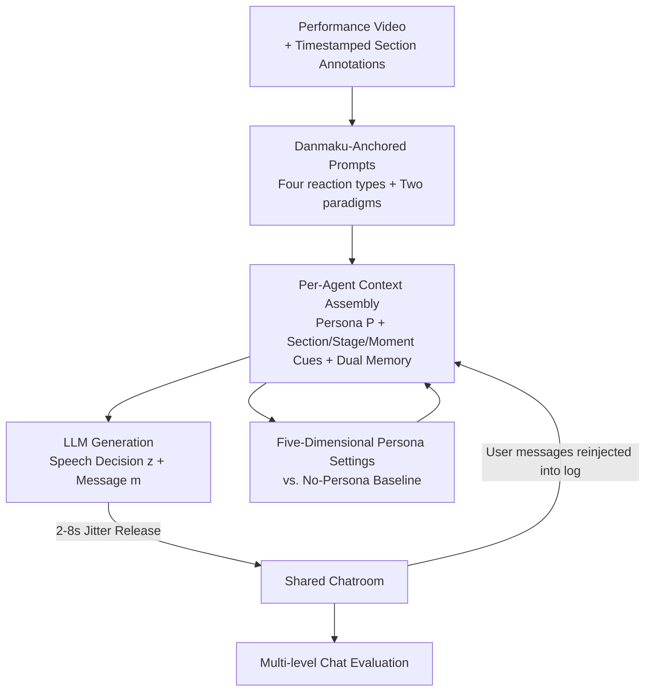

# Does Persona Make LLMs K-pop Fans? A Pilot Study of LLM-Based Online Concert Audience Agents

**Conference**: ICML2026  
**arXiv**: [2606.07837](https://arxiv.org/abs/2606.07837)  
**Code**: TBD  
**Area**: Multi-agent / Human-Computer Interaction / Cultural AI Evaluation  
**Keywords**: LLM Agents, Online Concerts, Audience Simulation, Persona Conditioning, Collective Experience

## TL;DR
The authors constructed a "virtual audience" system consisting of ten LLM agents posting real-time danmaku. By pairing pre-recorded K-pop performances with human-like fan chats, an N=11 within-subject pilot study revealed that assigning individual personas to each agent significantly enhances diversity and "naturalness" at the model output level. However, this **does not** translate into a stronger sense of social connection, engagement, or emotional resonance—as K-pop danmaku is essentially a "collective monologue" rather than interpersonal dialogue.

## Background & Motivation

**Background**: The core of a concert is not just the audio-visual quality, but the "sense of presence" constituted by synchronous audience reactions (cheering, chanting, screen flooding). Online concerts expand accessibility, but watching a pre-recorded video is often a lonely experience, stripped of this collective presence. Existing research to restore "collectivity" to asynchronous videos primarily involves **replaying historical audience data**: danmaku (bullet chat) overlays past comments on a timeline, or transforms historical chat data into avatar behaviors in VR scenes.

**Limitations of Prior Work**: These "replay" solutions are inherently limited—they require accumulating sufficient real audience reactions first, which fails for niche videos or obscure artists. Scarcely any attempts have been made to **dynamically generate** new audience reactions using AI.

**Key Challenge**: Can LLMs generate credible K-pop fan danmaku in real-time to overcome dependency on historical data? Since K-pop fan culture is highly "individualized"—fans have their own favorite members (biases), participation levels, and chat styles—the authors hypothesize that injecting **independent personas** into each agent should produce more diverse and credible AI audiences.

**Goal**: To build a multi-agent LLM audience system and rigorously examine whether the "persona conditioning" design assumption is effective—considering both model output quality and subjective user experience.

**Key Insight**: Instead of stopping at "the output looks more human," the authors used within-subject experiments to measure **model-level differences** and **user-level experiences** separately, revealing the gap between the two.

**Core Idea**: Persona conditioning makes AI audiences "appear" more natural, but a culturally meaningful collective experience requires deeper alignment between personas, group behaviors, fan identity, and user expectations, rather than just making individual agents more human-like.

## Method

### Overall Architecture

The system is a multi-agent framework deployed as a real-time web application: users watch a K-pop performance video while sharing a chat room with ten LLM-driven audience agents, allowing free interaction. The target video is LOONA’s "Butterfly" stage (approx. 4 mins), manually annotated with musical structures, current vocalists, and key choreography events.

The pipeline triggers generation every 8 seconds. The system first extracts the current **section annotation** $S_t=\{\text{section}, \text{vocals}, \text{description}\}$, paired with **stage guidance** $G_t\in\{\text{preshow}, \text{performance}, \text{postshow}\}$ and **moment cues** $M_{i,t}$ (highlighting choruses, key choreography, or endings). Each agent then incorporates two types of dialogue memory and its persona profile into a specific context, which is fed to the LLM to output "whether to speak + what to say." Finally, messages are released into the shared chat with random jitter.

### Key Designs

**1. Prompt Design Based on Real Danmaku: Anchoring AI Speech in Real Fan Culture**

If LLMs are simply asked to "act like a K-pop fan," the output tends to be vague and lacks jargon. The authors crawled danmaku logs from a real YouTube K-pop live stream and followed a music audience comment coding system to summarize four main behaviors: ① Interaction (communicating with artists or other viewers), ② Collective reaction (applause, cheers), ③ Personal thoughts (preferences, nostalgia), and ④ Affect (emojis or emotional outbursts). Additionally, two high-frequency paradigms were designated as key design points: chanting favorite members' names and first-person questions. These observations were integrated into the **shared global prompt** as few-shot anchoring materials to ensure all agents followed danmaku conventions regardless of persona.

**2. Per-Agent Contextual Generation: Sync Reactions Driven by Dual Memory Buffers**

The system models audience behavior as a "per-agent, context-conditioned" generation process. For each agent $i$ at time $t$, a specific context is assembled:

$$X_{i,t}=\{P_i, S_t, G_t, M_{i,t}, \mathcal{H}_{i,t}, \mathcal{C}_t\}$$

where $P_i$ is the persona description, $\mathcal{H}_{i,t}$ is a **personal history buffer** of its own last 6 messages (to suppress self-repetition), and $\mathcal{C}_t$ is a **shared chat log** containing the last 10 messages from all agents and human participants (enabling agents to respond to one another or the user). The LLM maps this to a structured output $f_\theta(X_{i,t})=\{z_{i,t}, m_{i,t}\}$, where $z_{i,t}\in\{0,1\}$ is a binary decision to speak, and $m_{i,t}$ is the candidate message. Thus, **the decision to participate is determined by the model itself** rather than forcing every agent to speak in every round. Ten agents are processed in a single call, with messages released after a 2–8s uniform random jitter. Generation starts 8 seconds ahead of the session clock to mask inference latency and simulate real typing rhythms.

**3. Five-Dimensional Persona Settings vs. No-Persona Baseline: Creating Behavioral Diversity through Identity**

Ten audience agents are defined across five dimensions: age, gender, region, bias (favorite member), and chat style, covering patterns from "hardcore member-stans" to "first-time viewers." Persona texts are appended to the shared global prompt. To isolate the contribution of personas, a **no-persona baseline** was established where persona texts were emptied and nicknames removed, while retaining the global prompt and few-shot examples. A crucial detail: for the no-persona baseline, the sampling temperature was raised from 0.7 to 1.2 to prevent **output collapse** into identical sentences.

**4. Multi-level Chat Evaluation Metrics: Decoupling Model Output and User Experience**

At the **output level**, danmaku logs were treated as a corpus: Distinct-2 and Self-BLEU-2 measured lexical diversity, while verbatim repetition rates and message lengths measured production quality. For **per-agent profile spread**, the range (max − min) of metrics (repetition rate, length, emojis per message, all-caps rate, message count) was calculated across ten agents; a larger range indicates successful differentiation by persona. On the **subjective side**, participants completed IOS (social connectedness), UES-SF (engagement), SAM (valence/arousal/dominance), and a 1–7 Likert scale for "naturalness." Due to the N=11 sample size, the authors emphasized within-subject Cohen's $d_z$ effect sizes and Mann–Whitney tests.

## Key Experimental Results

### Main Results: Dramatic Differences at the Model Level

Persona conditioning brought about a dramatic differentiation in **model output**: diversity soared, verbatim repetition plummeted, and behavior between the ten agents widened significantly. The most extreme change was in speaking frequency range—under no-persona conditions, agents spoke nearly every round (~32 messages/session), whereas personas resulted in "design-aligned signatures," ranging from 9.2 to 31.8 messages.

| Metric (Model Level) | Effect Size $d_z$ | Meaning |
|------|------|------|
| Distinct-2 (Lexical Diversity) | +5.63 | Substantial increase in diversity with personas |
| Self-BLEU-2 (Lower is more diverse) | −3.48 | Significantly less repetitive output |
| Verbatim Repetition Rate | −1.41 | Eliminated "ten agents posting the same line" collapse |
| Avg. Message Length | +2.65 | Longer messages |
| Range of Message Frequency | +13.64 | 23-message gap between loudest/quietest agents (vs. 1 for baseline) |
| Emoji Range / All-caps Range | +3.92 / +3.66 | Various behavioral dimensions diverged simultaneously |

### Key Findings: Subjective Experience Does Not Follow

| Subjective Metric | Result | Distinguished Conditions? |
|------|------|------|
| Perceived Naturalness | $M_{\text{persona}}=5.45$ vs. $M_{\text{no-persona}}=4.00$, $p=.045$, $r=.43$ | ✅ Only significant metric |
| IOS (Social Connectedness) | $\lvert r\rvert<0.15$, not sig. | ❌ |
| UES-SF (Engagement) | $\lvert r\rvert<0.15$, not sig. | ❌ |
| SAM (Affective dimensions) | $\lvert r\rvert<0.15$, not sig. | ❌ |

Participants **perceived** persona-conditioned agents as more natural, yet this did not translate into better experience scores. Interviews suggested: ① Most participants (N=8) could not distinguish individual agents; they focused on the "overall atmosphere," where realism comes from **collective dynamics** (repetitive flooding, synchronized reactions) rather than individual personas. ② Cultural context determined willingness to engage; participants struggled to connect because they were unfamiliar with the specific artist (LOONA) or the fandom.

## Highlights & Insights
- **Decoupling output quality and user experience** is the study's primary methodological contribution. It used an massive $d_z=+13.64$ model effect to contrast with the null subjective results, debunking the assumption that "more natural output equals better experience."
- **"Collective Monologue vs. Interpersonal Dialogue"**: In danmaku and live-streaming, users consume the group atmosphere. Investing in individual agent realism might be misallocated resources; optimization should target group-level interaction patterns.
- **Identity Anchoring vs. Behavioral Instructions**: To make an LLM agent "speak less," providing an identity that naturally leads to silence ("lurker who only reacts to their bias") is far more effective than a direct command like "don't type much."

## Limitations & Future Work
- **Small Sample and Non-target Fandom**: N=11, and none were "Orbits" (LOONA fans). Unfamiliarity with the artist likely suppressed experience scores.
- **Limited Scope**: Targeted a single 4-minute video; generalizability to other music cultures is unknown.
- **Language/Culture Mismatch**: The system used English for Korean-pop fans, and the lack of specific fandom slang restricted engagement.
- **Future Directions**: Researching how "disclosing AI mediation" affects participation and aggregating individual fan traits into group-level interaction patterns.

## Related Work & Insights
- **vs. Danmaku / VR Avatar Replay (Chen et al., 2017)**: These rely on historical data; this work uses LLMs to remove that dependency, though cultural fit remains a challenge.
- **vs. Persona-based Population Simulation (Argyle et al., 2023)**: While those works use personas for representative feedback, this work found rich personas don't necessarily improve collective human experience.
- **vs. Generative Agents (Park et al., 2023)**: While Park et al. focus on long-term social trajectories, this work views danmaku as an emergent group-level reaction in real-time settings.

## Rating
- **Novelty**: ⭐⭐⭐⭐ First system to dynamically generate K-pop concert danmaku via multi-agent LLMs with clever metric decoupling.
- **Experimental Thoroughness**: ⭐⭐⭐ Robust model metrics, but the user study is a pilot with a small, non-target sample.
- **Writing Quality**: ⭐⭐⭐⭐ Clear structure and persuasive narrative regarding anti-intuitive conclusions.
- **Value**: ⭐⭐⭐⭐ Insights on "collective monologue" have significant implications for cultural AI agents.

<!-- RELATED:START -->

## Related Papers

- [\[ACL 2026\] HACHIMI: Scalable and Controllable Student Persona Generation via Orchestrated Agents](../../ACL2026/multi_agent/hachimi_scalable_and_controllable_student_persona_generation_via_orchestrated_ag.md)
- [\[AAAI 2026\] Scalable and Accurate Graph Reasoning with LLM-Based Multi-Agents](../../AAAI2026/multi_agent/scalable_and_accurate_graph_reasoning_with_llm-based_multi-agents.md)
- [\[ICML 2026\] EngiAgent: Fully Connected Coordination of LLM Agents for Solving Open-ended Engineering Problems with Feasible Solutions](engiagent_fully_connected_coordination_of_llm_agents_for_solving_open-ended_engi.md)
- [\[ICML 2026\] When Cloud Agents Meet Device Agents: Lessons from Hybrid Multi-Agent Systems](when_cloud_agents_meet_device_agents_lessons_from_hybrid_multi-agent_systems.md)
- [\[ICML 2026\] Toward Culturally Aligned LLMs through Ontology-Guided Multi-Agent Reasoning](toward_culturally_aligned_llms_through_ontology-guided_multi-agent_reasoning.md)

<!-- RELATED:END -->
