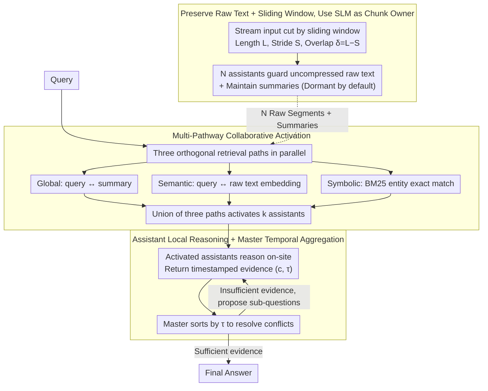

# E-mem: Multi-Agent Based Episodic Context Reconstruction for LLM Agent Memory

**Conference**: ICML 2026  
**arXiv**: [2601.21714](https://arxiv.org/abs/2601.21714)  
**Code**: https://github.com/dog-last/E-mem  
**Area**: LLM Agent / Long-Context Memory / Multi-Agent Systems  
**Keywords**: Episodic memory, context reconstruction, Master-Assistant architecture, SLM assistant, LoCoMo

## TL;DR
E-mem replaces the traditional memory paradigm of "preprocessing compression into embeddings/graphs" with an episodic reconstruction paradigm of "preserving original context + on-site reasoning by small model assistants": the master agent only handles global planning, while multiple SLM assistants each guard a segment of uncompressed raw text, performing local reasoning to return evidence after activation via multi-pathway retrieval. This approach outperforms the SOTA F1 on LoCoMo by 7.75 points while cutting token consumption by 70%.

## Background & Motivation

**Background**: Long-term LLM agents typically "preprocess" historical sessions before storage—common practices include cutting chunks for embedding calculations (RAG), extracting entities to build graphs (GraphRAG / GAM), or using OS-style paging (MemGPT), then retrieving top-k segments to concatenate into the prompt during querying.

**Limitations of Prior Work**: The authors characterize these approaches as "destructive de-contextualization"—compressing a series of tightly coupled events into geometric points or graph nodes severs sequential dependencies. Specifically, on multi-session long-dialogue benchmarks like LoCoMo, multi-hop and temporal questions are difficult to answer because the causal chains between chunks are lost. Methods from 2024-25 such as A-Mem, Mem0, and MemoryOS struggle to exceed an F1 score of 36-45 on LoCoMo.

**Key Challenge**: (1) Deep System 2 reasoning requires preserving long-range causal chains; (2) directly feeding the entire history into the context window triggers "Lost-in-the-Middle" effects and leads to explosive token costs; (3) while preprocessing is inexpensive, it inherently destroys the contextual integrity required by (1). There is a fundamental trade-off among these three factors.

**Goal**: To enable agents to truly "re-experience" past segments rather than just retrieving fragments, without sacrificing cost scalability.

**Key Insight**: The authors draw an analogy to biological engrams—human recall is not merely searching an index, but activating an entire episodic context and then performing reasoning. If a small model is dedicated to guarding a segment of original text and performs local reasoning on-site when activated, sequential dependencies can be preserved while controlling costs.

**Core Idea**: Replace the "unified compressed storage + retrieval" paradigm with a hierarchical architecture consisting of "master agent planning + multiple SLM assistants guarding original text + multi-pathway on-demand activation + assistant on-site reasoning."

## Method

### Overall Architecture
E-mem aims to let agents "re-experience" past segments for deep reasoning without preprocessing-based history compression and without exhausting token limits. It formalizes the memory system as a triplet $\mathcal{F}=\langle\mathcal{A}_{\text{master}},\{\mathcal{A}_{\text{asst}}^{(i)}\}_{i=1}^{N},\mathcal{R}\rangle$: a master agent (GPT-4o-mini / Qwen2.5-14B) performs global planning and does not access raw history directly; a set of assistants (Qwen3-4B SLM) each holds an uncompressed original segment $\mathcal{E}_i$ and maintains a concise summary $s_i$ for routing; a multi-pathway router $\mathcal{R}$ outputs an activation distribution $\mathcal{P}_{act}=\pi(q|\mathbf{S},\mathcal{R})\in[0,1]^N$ to determine which assistants to wake upon a query. The workflow: streaming input is segmented via a sliding window and assigned to assistants → the router runs three parallel retrieval paths to activate assistants → activated assistants perform local reasoning on their raw text and return timestamped evidence → the master aggregates evidence, resolves conflicts via temporal anchoring, and provides the answer.

### Key Designs

**1. Preserving original text + sliding window segmentation, using SLM as chunk owner: Replacing "compressed storage" with "original text hosting"**

Traditional methods embed chunks into vectors primarily because they cannot perform reasoning across all chunks simultaneously, necessitating compression followed by top-k retrieval—a process that severs sequential dependencies. E-mem bypasses this bottleneck: it segments an unbounded stream $\mathcal{X}=(x_1,x_2,\dots)$ according to window length $L$ and stride $S<L$ into $\mathcal{E}_i=\{x_t\mid(i-1)S<t\leq(i-1)S+L\}$. Each segment consists of **original uncompressed tokens** held by an independent SLM assistant. Assistants remain dormant and only "go online" to reason when activated. Adjacent segments maintain an overlap $\delta=L-S$ as a continuity buffer—new tokens are appended to $\mathcal{E}_{\text{active}}$, and once full, it solidifies into a memory unit; the next assistant starts with the overlap region from the previous segment ($\mathcal{E}_{N+1}^{init}=\text{Extract}(\mathcal{E}_N,\text{overlap}=\delta)$) to ensure semantic continuity. This ensures storage remains complete while reasoning is distributed across small models in an $O(1)$ streaming update, preserving long-range causal chains without stuffing the full history into a single context window.

**2. Multi-pathway collaborative activation: Union of three orthogonal retrieval paths to trade recall for accuracy**

A single routing method inevitably fails on benchmarks like LoCoMo that mix multi-hop, temporal, and exact entity recall—vector search misses entities, and graph search misses macro-intent. E-mem runs three orthogonal paths in parallel and takes the union $\mathcal{A}^*=\{\mathcal{A}_{\text{asst}}^{(i)}\mid\mathcal{A}_{\text{asst}}^{(i)}\in\mathcal{P}_{\text{global}}\vee\mathcal{P}_{\text{vec}}\vee\mathcal{P}_{\text{kw}}\}$: Global Alignment $\mathcal{P}_{\text{global}}$ uses dense vector and sparse lexical alignment between the query and summaries $s_i$ to capture macro-narrative; Semantic Association $\mathcal{P}_{\text{vec}}$ uses high-dimensional vector similarity between the query and raw text chunks to catch details missed by summaries; Symbolic Trigger $\mathcal{P}_{\text{kw}}$ uses BM25 for exact entity/ID matching to ensure critical identifiers are not lost. This approach values recall over precision during activation, as missing a segment at this stage would invalidate the subsequent reasoning.

**3. Assistant local reasoning + Master temporal-anchored aggregation: Evidence with timestamps for cross-segment conflict resolution**

Activated assistants do not merely return raw text fragments; they perform complete chain-of-thought local reasoning on their $\mathcal{E}_i$, converting raw text into **timestamped evidence tuples** $e_i=\langle c_i,\tau_i\rangle=\Phi_{\text{asst}}(q\mid\mathcal{E}_i)$, where $c_i$ is the semantic evidence and $\tau_i$ is the absolute timestamp. Upon receiving all $\{e_i\}$, the master aggregates them via $R=\Psi_{\text{master}}(q,\mathbf{E})$, specifically **sorting by $\tau$ to resolve state conflicts**—for instance, if an item's location changes over time, the most recent timestamp is prioritized. For complex queries, an iterative mode is supported where the master maintains a reasoning trace $S^{(t)}$ and proposes new sub-questions $q^{(t)}=\pi_{\text{plan}}(q_{\text{init}},S^{(t-1)})$ if evidence is insufficient. Reasoning on "small segments + full raw text" using SLMs is more controllable and token-efficient than large model reasoning on "full concatenated text," while the inclusion of $\tau$ enables the master to resolve temporal conflicts—the primary reason for gains in multi-hop and temporal tasks.

### Loss & Training
The paper proposes a **pure inference-time framework** that does not require model training. The master utilizes GPT-4o-mini or Qwen2.5-14B, while assistants utilize Qwen3 (0.6B to 14B). All models are frozen and used via prompting. The design space focuses on routing hyperparameters (top-k, weights) and window configurations ($L$ and $\delta$).

## Key Experimental Results

### Main Results

LoCoMo 5 sub-tasks (GPT-4o-mini as master, Qwen3-4B as assistant):

| Method | Overall F1 | Multi-Hop | Temporal | Single-Hop |
|------|-----------|-----------|----------|------------|
| RAG (top-20) | 44.73 | 27.50 | 46.07 | 52.45 |
| A-Mem | 39.65 | 27.02 | 45.85 | 44.65 |
| Mem0 | 45.10 | 38.72 | 48.93 | 47.65 |
| MemoryOS | 42.84 | 35.27 | 41.15 | 48.62 |
| GAM (Prev. SOTA) | 45.31 | 34.84 | 53.91 | 47.74 |
| **Ours** | **54.17** | **42.64** | **59.82** | **59.23** |
| Gain vs GAM | **+8.86** | **+7.80** | **+5.91** | **+11.49** |

HotpotQA streaming extension (400/800/1600 docs, over 200K tokens):

| Method | 400 F1 | 800 F1 | 1600 F1 |
|------|--------|--------|---------|
| Long-Context | 56.56 | 49.71 | 53.92 |
| GAM | 54.75 | 52.86 | 53.71 |
| **Ours** | **61.46** | **55.46** | **55.76** |

### Ablation Study

Assistant model scale ablation (LoCoMo adversarial subset):

| Assistant Model | F1 | BLEU-1 |
|---------------|-----|--------|
| Qwen3-0.6B | 85.11 | 80.14 |
| Qwen3-1.7B | 87.31 | 83.17 |
| Qwen3-4B (Default)| 89.94 | 85.51 |
| Qwen3-8B | 95.74 | 88.09 |
| Qwen3-14B | 95.03 | 88.06 |

Master Model Replacement (assistant fixed to Qwen3-4B): Gemini2.5-flash 93.62, GPT-4o 89.37, GPT-4o-mini 89.94, DeepSeek-V3 75.87, Grok4-fast 77.80.

### Key Findings
- **Multi-hop and Temporal tasks yield the highest gains**: Improvements of +7.80 and +5.91 F1 respectively validate the core argument—preserving raw context and temporal anchoring is essential for connecting causal chains across segments.
- **Open Domain performance is slightly lower than Mem0** (24.89 vs 28.64): Open-ended generation relies more on summary-based global synthesis, where E-mem's "raw text + local reasoning" approach is less dominant.
- **Assistant scale shows diminishing returns**: F1 increases by 4.83 points from 0.6B to 4B and by 5.80 from 4B to 8B, but slightly decreases at 14B, identifying 4B as the cost-performance "sweet spot."
- **70%+ Token cost savings**: By activating only $k$ relevant assistants instead of stuffing the full history into the master, the total token count per query is significantly lower than RAG or GraphRAG.

## Highlights & Insights
- **"Small models guard raw text + Large model plans" is an elegant division of labor**: Traditional memory systems either overburden the large model or the compression module. E-mem distributes the reasoning load across many SLMs, making long-context reasoning a horizontally scalable multi-agent problem.
- **Timestamped evidence tuples are a critical hidden design**: While many papers promote "multi-pathway retrieval," the key to solving LoCoMo Temporal tasks is the pair $e_i=\langle c_i,\tau_i\rangle$—without $\tau$, the master cannot resolve conflicts.
- **Union over weighted fusion in retrieval**: The authors prefer to activate more assistants rather than miss a critical chunk due to low weights, reflecting a "recall > precision" philosophy essential for multi-hop QA systems.
- **Transferability of the architecture**: The three-pathway retrieval can be applied to any scenario where "raw text cannot be discarded," such as legal, medical, or code repository agents.

## Limitations & Future Work
- **Performance lag in Open Domain tasks**: These require global summarization rather than local evidence, a scenario where E-mem is not yet optimal.
- **VRAM costs of multiple concurrent SLMs**: When $N$ is very large (e.g., thousands of chunks), maintaining many assistants involves significant memory overhead, which was not fully explored.
- **Manual tuning of routing hyperparameters**: Optimal top-k values and pathway thresholds vary by task, suggesting a need for adaptive mechanisms.
- **Dependency on Master's temporal reasoning**: Performance drops significantly with certain master models (DeepSeek-V3/Grok4-fast), indicating that conflict resolution relies heavily on the master's inherent capability.
- **Future Directions**: (i) Adding learnable sparse gating to the router; (ii) "Sleep-mode compression" for assistants (e.g., compressing KV caches when dormant); (iii) Training the iterative cycle via reinforcement learning.

## Related Work & Insights
- **vs MemGPT / RAG**: MemGPT uses OS-style paging; E-mem gives each chunk its own "reasoning brain," outputting structured evidence and eliminating the need for raw text re-concatenation.
- **vs A-Mem / Mem0**: These methods follow the "compress-store-retrieve" paradigm; E-mem removes the compression step entirely, trading assistant quantity for context integrity.
- **vs GAM (Prev. SOTA)**: GAM uses graph-based semantic structuring on the storage side; E-mem postpones semantic structuring until query time via on-site reasoning, avoiding mismatches between pre-stored graphs and future queries.
- **vs Agentic RAG**: Agentic RAG adds planning loops to retrieval, but storage remains vector-based; E-mem transforms the storage layer itself into a multi-agent system.

## Rating
- Novelty: ⭐⭐⭐⭐⭐ Using SLMs as "chunk owners" is a clean and profound framework shift that decouples storage and reasoning.
- Experimental Thoroughness: ⭐⭐⭐⭐ Covered LoCoMo and HotpotQA with 5 SOTA baselines and extensive ablations, though detailed VRAM and latency data are missing.
- Writing Quality: ⭐⭐⭐⭐ Clear reasoning and strong biological analogies for the motivation.
- Value: ⭐⭐⭐⭐⭐ Provides a truly scalable new paradigm for long-horizon agents with open-source code.

<!-- RELATED:START -->

## Related Papers

- [\[ACL 2026\] Memory-Augmented LLM-based Multi-Agent System for Automated Feature Generation on Tabular Data](../../ACL2026/multi_agent/memory-augmented_llm-based_multi-agent_system_for_automated_feature_generation_o.md)
- [\[ICML 2026\] CoOT: Learning to Coordinate In-Context with Coordination Transformers](coot_learning_to_coordinate_in-context_with_coordination_transformers.md)
- [\[AAAI 2026\] KDR-Agent: A Multi-Agent LLM Framework for Multi-Domain Low-Resource In-Context NER via Knowledge Retrieval](../../AAAI2026/multi_agent/a_multi-agent_llm_framework_for_multi-domain_low-resource_in-context_ner_via_kno.md)
- [\[ICML 2026\] MASPO: Joint Prompt Optimization for LLM-based Multi-Agent Systems](maspo_joint_prompt_optimization_for_llm-based_multi-agent_systems.md)
- [\[ACL 2026\] Scaling External Knowledge Input Beyond Context Windows of LLMs via Multi-Agent Collaboration](../../ACL2026/multi_agent/scaling_external_knowledge_input_beyond_context_windows_of_llms_via_multi-agent_.md)

<!-- RELATED:END -->
