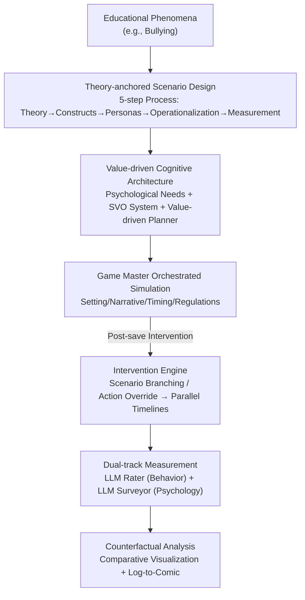

# EduMirror: Modeling Educational Social Dynamics with Value-driven Multi-agent Simulation

**Conference**: ICML2026  
**arXiv**: [2606.07948](https://arxiv.org/abs/2606.07948)  
**Code**: Project Page https://edumirror.net  
**Area**: Multi-agent Simulation / Computational Social Science / LLM Agent  
**Keywords**: Educational Social Dynamics, Value-driven Agents, Multi-agent Simulation, Psychological Needs, Counterfactual Intervention

## TL;DR
EduMirror simulates educational social phenomena like "campus bullying" and "peer cooperation" in an LLM-driven multi-agent sandbox. It employs "value-driven agents" based on Maslow's hierarchy of needs and Social Value Orientation (SVO) to play students and teachers, coupled with a "dual-track measurement" protocol that quantifies both observable behaviors and latent psychological states. This allows for ethically safe "what-if" counterfactual experiments in a digital environment.

## Background & Motivation

**Background**: Educational social dynamics—the continuous interactions among students, teachers, and families—determine a child's developmental trajectory and are central concerns of educational policy. Traditional research methods include two categories: survey/observational studies and Randomized Controlled Trials (RCTs).

**Limitations of Prior Work**: Surveys and observations only capture static correlations, and self-reports on sensitive topics (bullying, self-esteem) suffer from significant distortion (social desirability bias, limited self-awareness). Meanwhile, RCTs capable of causal inference are often unethical or infeasible in educational settings—one cannot ethically manipulate isolation or deprivation of help to conduct an experiment. Consequently, **no systematic framework exists to operationalize and simulate the "generative mechanisms" of educational social dynamics**, making counterfactual intervention testing impossible.

**Key Challenge**: Traditional rule-based agent modeling (ABM, e.g., BDI models) is interpretable but relies on handcrafted rules, failing to capture the nuance and irrationality of human psychology (the trade-off between fidelity and customizability). Conversely, using LLMs directly as social agents feels "human-like" but hits a **measurement hurdle**—latent psychological states driving behavior (self-esteem, peer pressure) are invisible in actions. How can these be quantified?

**Goal**: To build a cognitive computational framework for educational research that is grounded in psychological theory and capable of producing realistic, interpretable, and measurable behaviors using LLM generative capabilities.

**Key Insight**: Educational agents should not use a general agent architecture; instead, they must constrain behavior within an **education-oriented cognitive architecture**—explicitly anchoring behavior to "social value orientation + basic psychological needs."

**Core Idea**: Replace rule-based agents with "value-driven agents (psychological needs + SVO)" for higher fidelity, and solve the measurement problem using a "dual-track measurement protocol (LLM Rater + LLM Surveyor)" to extract latent psychological states. Together, these components support counterfactual intervention analysis.

## Method

### Overall Architecture
EduMirror is built on Concordia (a multi-agent simulation backend using natural language as a medium), driving agents with natural language instead of predefined action sets to achieve flexibility in open-ended responses and scalability in roles/environments. The platform consists of four modules: **Agent Library**, **Theory-anchored Scenario Design**, **Simulation Engine orchestrated by a Game Master**, and a **User Toolkit**. A complete research workflow involves: translating an abstract educational phenomenon (e.g., "Social Comparison Theory") into a computable scenario → instantiating value-driven agents to interact autonomously in a shared environment → checkpointing at key nodes and applying interventions to generate parallel branches → transforming interaction logs into analyzable data via dual-track measurement.

### Key Designs

**1. Five-step Theory-anchored Scenario Construction: Translating "Phenomena" into "Computable Experiments"**

Educational phenomena are vague; letting LLMs act without structure leads to drift and inability to ground findings in theory. EduMirror uses a fixed five-step process to transform abstract phenomena into reproducible scenarios: (1) Select a foundational theory (e.g., Social Comparison Theory) as a scientific anchor; (2) Deconstruct the theory into fundamental constructs; (3) Configure agent personas accordingly—initializing traits, goals, and formative memories; (4) Operationalize constructs using validated psychological scales; (5) Establish a dual-track measurement protocol consisting of an LLM Rater and LLM Surveyor. This ensures experimental outputs consistently link back to specific theoretical constructs. The current library includes 20 preset scenarios across four themes: peer/group dynamics, individual social cognition, classroom culture, and home-school dynamics, situated in 8 virtual environments like classrooms and playgrounds.

**2. Value-driven Cognitive Architecture: Using "Psychological Needs + SVO" for Intrinsic Motivation**

This is the source of fidelity. Each agent contains two core modules: a **Value System** and a **Value-driven Planner**. The value system is bifurcated. The individual system (Psychological Needs) anchors intrinsic motivation to Maslow's hierarchy and the positive psychology PERMA model, formalized into 5 categories (Safety, Mental Health, Self-esteem, Social Belonging, Meaning & Growth) with 13 sub-dimensions, each represented on a 0–10 Likert scale. For each dimension $d$, the unmet gap is defined as $\Delta_t(d)=\mathrm{clip}(v^*(d)-v_t(d),0,S_{\max})$, where $v^*(d)$ is the desired value and $v_t(d)$ is the current value. This non-negative gap measures "how far reality is from the ideal" and serves as the primary target for action evaluation. The social system (Personality Orientation) introduces SVO theory: agents have stable orientations (altruistic/pro-social/individualistic/competitive), but the effective orientation at each step is dynamically determined by current motivation and inferred impact on others. It aggregates two non-negative signals $S_{\text{self}}(t)$ (self-gap) and $S_{\text{other}}(t)$ (inferred impact on others' needs) to represent social preference as a continuous orientation signal:

$$\theta_t=\arctan\!\left(\frac{S_{\text{other}}(t)+\varepsilon}{S_{\text{self}}(t)+\varepsilon}\right),\quad \varepsilon=10^{-6}$$

Since both signals are non-negative, $\theta_t\in[0,\pi/2]$. Smaller values indicate self-interest, while larger values indicate altruism. $\theta_t$ is passed to the planner as a prompt-level condition, constraining how it weighs candidate actions.

**3. Value-driven Planner: Merging Need Dynamics and Social Reasoning into Action Selection**

The planner is the decision module connecting individual needs and SVO reasoning. Given the interaction history $\mathcal{H}_{<t}$, persona $P$, environment $e$, customized info $I$, need gap $\Delta_t$, and SVO condition $\theta_t$, it first generates a set of candidate actions $\mathcal{A}_t=\mathrm{Gen}_\phi(\mathcal{H}_{<t},P,e,I,\Delta_t,\theta_t)$. It then assigns a comparison score $q_a=E_\phi(a\mid\Delta_t,\theta_t)$ to each candidate (integrating gap reduction, impact on others, and SVO consistency) and selects the highest score $a_t=\arg\max_{a\in\mathcal{A}_t}q_a$. Here, $E_\phi$ is a structured LLM judgment rather than a handcrafted utility function, allowing for semantic evaluation that evolves with the context.

**4. Dual-track Measurement Protocol: Converting Invisible States into Statistical Data**

This solves the measurement hurdle. Two LLM evaluators collaborate: the **LLM Rater** analyzes completed interaction trajectories and scores observable behaviors; the **LLM Surveyor** probes the agent's internal psychological states. Internal states are recorded during simulation, and post-hoc psychological surveys (e.g., Rosenberg Self-Esteem Scale RSES) are applied to these states. The surveyor is post-hoc and does not interrupt the interaction, ensuring that the simulation dynamics are not "contaminated" while allowing for quantitative access to psychological constructs. The intervention engine supports scenario branching (altering context) and action control (overriding specific agent actions) to generate parallel timelines for comparative analysis.

## Key Experimental Results

The experiments include system-level authenticity validation and two case studies (bullying, peer interaction), compared against five baselines: iterative reasoning (ReAct, BabyAGI), context-conditioned (LLMob, JAG-Concordia), and the most similar desire-driven agent, D2A.

### Main Results: Scalability (Kindergarten Scenario)
In a kindergarten scenario (1 teacher, multiple children) across classrooms, playgrounds, and dorms, agent counts were scaled from 5 to 30. Evaluation used naturalness, coherence, rationality, and developmental typicality. EduMirror scored the highest across all scales.

| Agent Count | EduMirror | LLMob | BabyAGI | D2A | ReAct |
|---------|-----------|-------|---------|-----|-------|
| 5 | **4.80** | 4.25 | 4.10 | 3.35 | 2.35 |
| 15 | **4.18** | 3.60 | 3.57 | 3.53 | 2.93 |
| 30 | **4.03** | 3.83 | 3.86 | 3.12 | 2.41 |

System-wide, pairwise win-rate heatmaps across 17 scenarios show EduMirror possesses a robust average win rate, indicating stability across diverse settings.

### Case Studies & Intervention Analysis

| Experiment | Setup | Key Findings |
|------|------|---------|
| Bullying Authenticity | 10 real vs. 10 simulated cases, 152 blind tests | Participants could not distinguish them; 6 groups had identification rates <30%. |
| Psychological Dynamics | 15 bullying scenarios, simulated victims | EduMirror outperformed all baselines; agents with high initial self-esteem were more resilient, consistent with RSES trends. |
| Teacher Intervention | No intervention / Authority / Individual Support / Cooperative Support | Effectiveness increased monotonically; **Cooperative Support** showed the greatest improvement in all need dimensions. |
| SVO Ablation | Removing SVO mechanism | Distinction between personality profiles weakened; cooperation/competition patterns converged. |
| Election Intervention | Team competition / Teacher reminders / Pre-education | Team-based and fairness-oriented education produced the most stable results (lowest variance). |

### Key Findings
- **SVO is the key to personality differentiation**: Removing SVO causes altruistic and competitive profiles to converge, proving social orientation is the core mechanism for "performing" distinct personalities.
- **Intervention effectiveness aligns with pedagogy**: Moving from neglect to authority to individual support and finally to cooperative support shows a monotonic increase in efficacy, providing a testable template for real-world interventions.
- **Blind test results** suggest the authenticity of value-driven narratives approaches real-world cases, serving as evidence for using the framework as a "computational lab."

## Highlights & Insights
- **"Compiling" psychological theory into agents**: The use of the 13-dimensional need gap and SVO orientation angle $\theta_t$ is a reusable paradigm for integrating abstract psychological needs into LLM decision-making using continuous scalars.
- **Dual-track measurement solves a core simulation problem**: Separating behavior rating (Rater) from psychological probing (Surveyor, post-hoc) allows for quantifiable data without contaminating the simulation dynamics.
- **Counterfactual branching + Log-to-Comic**: Saving states at critical nodes to generate parallel timelines allows "what if the teacher did this instead" to become a controlled experiment, while Log-to-Comic assists in qualitative review.

## Limitations & Future Work
- The platform is intended to "augment human experts" rather than replace longitudinal empirical research; gaps remain between simulated behavior and complex human reality.
- Authenticity assessment relies heavily on LLM evaluators (GPT-4o), which may introduce systematic biases into the win-rate conclusions.
- The mapping from personality traits to psychological need initial values is an assumption that requires more extensive validation.
- The external validity of counterfactual conclusions is uncertain: while findings like "cooperative support is effective" align with current literature, this may partly reflect the consensus within the LLM's training data.

## Related Work & Insights
- **vs. Traditional ABM (BDI)**: Rule-based logic is interpretable but lacks psychological fidelity and irrationality; EduMirror gains realism through LLM generation, though it compensates for lost control with measurement protocols.
- **vs. General LLM Social Agents (Generative Agents, D2A)**: General architectures lack educational psychological modeling (developmental needs, emotional vulnerability); EduMirror anchors LLM generation within an education-specific cognitive architecture.
- **vs. Desire-driven D2A**: EduMirror adapts SVO concepts from D2A but refines them for educational social dynamics and adds the critical "research toolchain" of dual-track measurement and intervention engines.

## Rating
- Novelty: ⭐⭐⭐⭐ Innovative combination of psychology-formalized agents and dual-track measurement, customized for education.
- Experimental Thoroughness: ⭐⭐⭐⭐ Wide coverage including system validation, case studies, and blind tests, though it relies on LLM-as-a-judge.
- Writing Quality: ⭐⭐⭐⭐ Clear logical chain from motivation to methodology.
- Value: ⭐⭐⭐⭐ Provides a practical "computational lab" for ethically restricted educational research, offering significant momentum for computational social science.

<!-- RELATED:START -->

## Related Papers

- [\[ACL 2026\] Social Dynamics as Critical Vulnerabilities that Undermine Objective Decision-Making in LLM Collectives](../../ACL2026/multi_agent/social_dynamics_as_critical_vulnerabilities_that_undermine_objective_decision-ma.md)
- [\[NeurIPS 2025\] MetaMind: Modeling Human Social Thoughts with Metacognitive Multi-Agent Systems](../../NeurIPS2025/multi_agent/metamind_modeling_human_social_thoughts_with_metacognitive_multi-agent_systems.md)
- [\[ACL 2026\] Preference Estimation via Opponent Modeling in Multi-Agent Negotiation](../../ACL2026/multi_agent/preference_estimation_via_opponent_modeling_in_multi-agent_negotiation.md)
- [\[AAAI 2026\] MedLA: A Logic-Driven Multi-Agent Framework for Complex Medical Reasoning with Large Language Models](../../AAAI2026/multi_agent/medla_a_logic-driven_multi-agent_framework_for_complex_medic.md)
- [\[ACL 2025\] CoMet: Metaphor-Driven Covert Communication for Multi-Agent Language Games](../../ACL2025/multi_agent/comet_metaphor-driven_covert_communication_for_multi-agent_language_games.md)

<!-- RELATED:END -->
