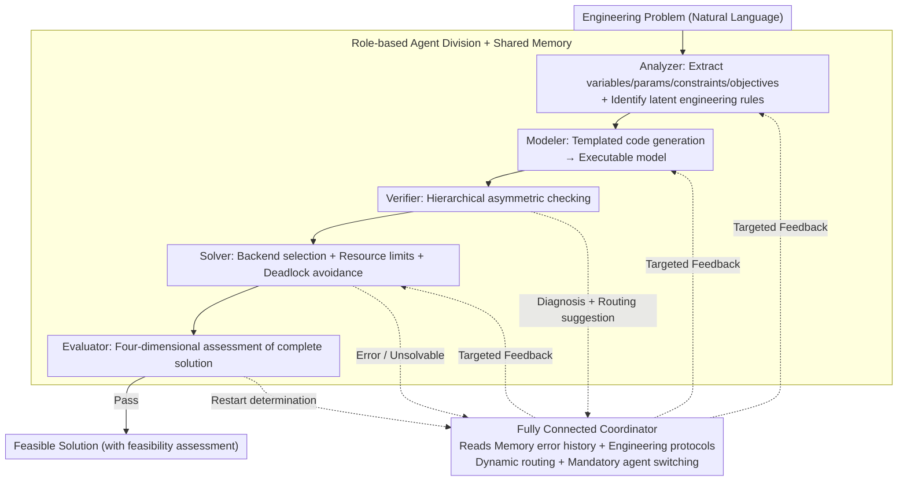

# EngiAgent: Fully Connected Coordination of LLM Agents for Solving Open-ended Engineering Problems with Feasible Solutions

**Conference**: ICML 2026  
**arXiv**: [2605.02289](https://arxiv.org/abs/2605.02289)  
**Code**: https://github.com/AI4Engi/EngiAgent (Available)  
**Area**: LLM Agent / Engineering Problem Solving / Multi-Agent Systems  
**Keywords**: Fully Connected Coordinator, Feasibility, Engineering Modeling, Multi-Agent, Feedback Routing

## TL;DR
EngiAgent decomposes engineering problem solving into five specialist agents: Analyzer, Modeler, Verifier, Solver, and Evaluator. It utilizes a **fully connected coordinator** for dynamic feedback routing (replacing rigid pipelines). This approach improves the feasible solution rate on GPT-4o for engineering tasks from 5.66% (zero-shot) and 7.55% (MM-Agent) to 64.15%, representing an approximate 7x increase over previous SOTAs.

## Background & Motivation

**Background**: Performance of LLMs in mathematical reasoning (e.g., GSM8K) and code generation (e.g., HumanEval) is reaching saturation. Consequently, the community aims to extend these capabilities to engineering problem solving, such as traffic scheduling, power dispatch, and mechanical system coordination. Existing approaches generally follow three routes: (1) ResearchAgent-style open exploration; (2) MM-Agent-style mathematical modeling; and (3) DS-Agent-style data-driven code generation.

**Limitations of Prior Work**: The authors empirically highlight three critical issues: (a) Autonomous research directions yield $< 10\%$ feasible solutions because the objective is "novelty" rather than "executability"; (b) MM-Agent styles achieve 70% on math benchmarks but only approximately 13% provide numerical solutions in engineering contexts; (c) DS-Agent styles can generate numerical outputs 62.26% of the time, but only 5.66% are feasible under physical and safety constraints. Engineering failures typically stem from four types: vague modeling, data alteration, physical law violations, and over-constraining.

**Key Challenge**: Existing agent systems commonly adopt **fixed pipelines** (linear Directed Acyclic Graphs, e.g., Analyzer → Modeler → Solver). If a failure occurs mid-stage, feedback can only backtrack to the immediate previous step. These systems lack the ability to perform cross-stage targeted repairs (e.g., if a Verifier detects data inconsistency, it should jump back to the Analyzer rather than the Modeler). This rigid structure structurally mismatches the multi-source failure modes of engineering problems.

**Goal**: (1) Elevate "feasibility" to a metric equivalent to correctness; (2) Design a coordination mechanism capable of arbitrary feedback routing, fault tolerance, and proactive switching among five roles; (3) Construct a feasibility benchmark covering domains like power, traffic, manufacturing, and structural engineering.

**Key Insight**: The topology of multi-agent collaboration is transformed from a "chain" to a "fully connected graph + state-aware coordinator." The coordinator (itself an LLM) dynamically determines the next recipient of control based on the error history stored in shared memory.

**Core Idea**: Use a hybrid strategy of "LLM autonomous decision-making + structured engineering protocols as context," combined with a mandatory agent switching mechanism (forcing a change if the same agent fails repeatedly) to prevent infinite debugging loops.

## Method

### Overall Architecture
EngiAgent addresses the phenomenon where LLMs produce numerical results but fail to yield feasible solutions. It maps an engineering team structure into a multi-agent system: five functional agents (Analyzer/Modeler/Verifier/Solver/Evaluator) handle specific segments of the workflow. A shared memory allows agents to view each other's outputs and failure histories, while a fully connected coordinator determines control flow. While the baseline follows a linear sequence (Analyzer → Modeler → Verifier → Solver → Evaluator), the coordinator allows jumps across the sequence—for instance, if the Verifier detects "data inconsistency," it can jump directly back to the Analyzer for re-extraction.

### Key Designs

**1. Fully Connected Coordinator: Mapping Feedback Paths to Root Causes**

Fixed pipelines suffer because feedback can only return to the previous step, failing to address root causes across stages (e.g., physical violations or data errors). EngiAgent changes the topology to a "fully connected graph," where a coordinator acts as a central hub. It activates agents based on real-time feedback rather than a fixed sequence. To prevent terminal oscillations, the coordinator utilizes **engineering protocols** as context (e.g., "data consistency takes priority over formal correctness") and reads the last $k$ outputs and failures from memory to constrain LLM decisions within engineering boundaries. The **mandatory agent switching mechanism** is a practical addition: if an agent fails repeatedly on the same error mode, control is forcibly handed to another agent. This addresses infinite loops where, for example, a Modeler repeatedly modifies formulas when the root cause is an extraction error by the Analyzer.

**2. Hierarchical Asymmetric Verifier: Avoiding Stagnation and Laxity**

If a Verifier uses pure correctness checks, the system might loop on trivial formatting differences (e.g., $a+b$ vs $b+a$). Conversely, pure tolerance might allow the deletion of hard constraints. EngiAgent employs a two-tier asymmetric system. The first tier consists of non-negotiable semantic checks (objective direction, core physical laws, data consistency). Any violation leads to immediate rejection and a diagnosis for the coordinator. The second tier tolerates **functionally equivalent variances** (e.g., $\leq$ transformed to $\geq$ via negation), preventing meaningless re-runs. Crucially, it explicitly forbids "cheating" by deleting hard constraints just to reach a solution.

**3. Role-based Agent Division + Shared Memory: Defining Boundaries and Global Views**

The responsibilities of an engineering team are mapped to five LLM agents to avoid prompt inflation and role confusion. The Analyzer converts natural language into structured representations and identifies **latent** engineering rules. The Modeler generates executable models via templates. The Verifier performs semantic, constraint, and data consistency checks. The Solver manages backend selection and resource constraints. The Evaluator assesses the solution across four dimensions: feasibility, model-problem alignment, engineering validity, and overall quality. Shared memory serves as both a collaboration medium and the basis for the coordinator's routing decisions.

### Loss & Training
This work is an inference-time agent framework and does not involve training. All effects result from the design of prompts, the coordinator, and the memory. Evaluations were conducted across three LLM backends (GPT-4o, Gemini-2.5 Flash, DeepSeek-V3-671B). A self-constructed dataset of 53 high-quality problems across four engineering domains was used, prioritizing feasibility over mere numerical output.

## Key Experimental Results

### Main Results

| Backend / Method | Numerical Rate (Num.) ↑ | **Feasible Rate (Feas.) ↑** | IE | DR | MO | UH | Avg. |
|------|------|------|------|------|------|------|------|
| GPT-4o Zero-shot | 22.64% | 5.66% | 5.66 | 5.42 | 4.47 | 3.33 | 4.72 |
| GPT-4o MM-Agent | 13.21% | 7.55% | 6.89 | 7.21 | 6.48 | 7.98 | 7.14 |
| GPT-4o EngiAgent (Fixed) | 47.17% | 47.17% | 8.30 | 7.22 | 6.67 | 7.14 | 7.33 |
| **GPT-4o EngiAgent (Coord.)** | **66.04%** | **64.15%** | **8.67** | **7.74** | **7.05** | **7.41** | **7.72** |
| Gemini-2.5 Flash EngiAgent (Coord.) | 52.83% | 50.94% | 8.30 | 6.89 | 6.30 | 6.06 | 6.89 |
| DeepSeek-V3-671B EngiAgent (Coord.) | — | 75.47% | — | — | — | — | — |

### Ablation Study

| Configuration | Feasibility Rate | Note |
|------|--------|------|
| Full EngiAgent (Coord.) | 64.15% (GPT-4o) | Complete system |
| EngiAgent (Fixed pipeline) | 47.17% | No coordinator, fixed DAG; drops ~17 pp |
| w/o Verifier | Significant drop | Lack of strict verification leads to violations |
| w/o Mandatory Switching | Increased debugging failure | Agents oscillate outside the root cause |

### Key Findings
- **Coordinator is the Key Differentiator**: Across three backends, "Coord. vs Fixed" improved feasibility by over 10 pp on average; on GPT-4o, this single component contributed +16.98 pp.
- **Numerical Output $\neq$ Feasible**: DS-Agent on DeepSeek can produce numerical solutions 77.36% of the time, but only 28.30% are feasible. EngiAgent's numerical and feasible rates almost overlap, proving feasibility must be enforced during generation pathways.
- **Backend Robustness**: EngiAgent ranked first in feasibility across all three LLM backends, suggesting the gains come from the "collaboration structure" rather than a specific model.
- **High Quality of Feasible Subset**: The average score within feasible solutions was 8.12, indicating that EngiAgent does not inflate feasibility by lowering verification standards.

## Highlights & Insights
- **"Topological Revolution"**: Attributes the failure of multi-agent systems to rigid "fixed pipelines" rather than LLM capacity, providing a low-cost alternative (fully connected + state-aware coordination).
- **Mandatory Switching to Prevent Loops**: A highly practical design that solves the "LLM stubbornness" problem where agents fixate on the wrong stage.
- **Feasibility as a First-Class Citizen**: Explicitly separates feasible rates from numerical output rates and categorizes failures (vague modeling, data alteration, physical violation, over-constraining).

## Limitations & Future Work
- The evaluation was conducted on only 53 problems across 4 domains; larger, cross-domain engineering benchmarks are needed.
- The coordinator's decision quality is bounded by the backend model; effectiveness on small models ($<7$B) remains unverified.
- Agent roles and protocols are manually designed, lacking automated generation or adaptive adjustment mechanisms.
- Inference costs are significantly higher than single-agent approaches due to multiple LLM and Solver calls; token and time costs were not quantified.
- Some metrics rely on LLM-based scoring, which carries a risk of self-evaluation bias.

## Related Work & Insights
- **vs ResearchAgent / AI Scientist**: These prioritize open exploration and novelty (feasibility $<10\%$); EngiAgent focuses on "feasibility + utility."
- **vs MM-Agent**: MM-Agent focuses on mathematical modeling quality; EngiAgent integrates modeling, solving, and feasibility checking.
- **vs DS-Agent**: DS-Agent represents high numerical output but low feasibility, highlighting the necessity of Verifiers and Evaluators.
- **vs Generic Agent Frameworks (HuggingGPT/AutoGen)**: General frameworks have more rigid routing; EngiAgent uses engineering protocols to explicitly constrain flexible routing.

## Rating
- Novelty: ⭐⭐⭐⭐ While multi-agent frameworks exist, the "fully connected coordination + mandatory switching + engineering protocol" combination is pioneering in the engineering domain.
- Experimental Thoroughness: ⭐⭐⭐⭐ Comprehensive comparison across backends, domains, and baselines; though the sample size (53) is somewhat small.
- Writing Quality: ⭐⭐⭐⭐ Clear illustrations of the four failure modes and architectural solutions.
- Value: ⭐⭐⭐⭐ Provides a high-quality reference implementation for achieving "closed-loop engineering" with LLMs.

<!-- RELATED:START -->

## Related Papers

- [\[ACL 2026\] RoadMapper: A Multi-Agent System for Roadmap Generation of Solving Complex Research Problems](../../ACL2026/multi_agent/roadmapper_a_multi-agent_system_for_roadmap_generation_of_solving_complex_resear.md)
- [\[ACL 2026\] Diversity Collapse in Multi-Agent LLM Systems: Structural Coupling and Collective Failure in Open-Ended Idea Generation](../../ACL2026/multi_agent/diversity_collapse_in_multi-agent_llm_systems_structural_coupling_and_collective.md)
- [\[ACL 2026\] ATLAS: Adaptive Trading with LLM AgentS Through Dynamic Prompt Optimization and Multi-Agent Coordination](../../ACL2026/multi_agent/atlas_adaptive_trading_with_llm_agents_through_dynamic_prompt_optimization_and_m.md)
- [\[ICML 2026\] CoOT: Learning to Coordinate In-Context with Coordination Transformers](coot_learning_to_coordinate_in-context_with_coordination_transformers.md)
- [\[ICML 2026\] Sheaf-ADMM: Learning Multi-Agent Coordination via Sheaf-ADMM](learning_multi-agent_coordination_via_sheaf-admm.md)

<!-- RELATED:END -->
