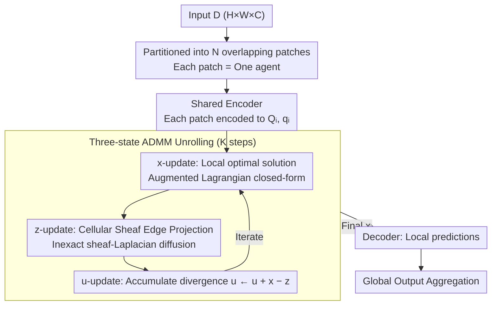

# Sheaf-ADMM: Learning Multi-Agent Coordination via Sheaf-ADMM

**Conference**: ICML 2026  
**arXiv**: [2605.31005](https://arxiv.org/abs/2605.31005)  
**Code**: TBD  
**Area**: Multi-Agent / Differentiable Optimization / Geometric Deep Learning  
**Keywords**: ADMM Unrolling, cellular sheaf, multi-agent consensus, sheaf Laplacian, local view fusion

## TL;DR
Sheaf-ADMM formulates multi-agent coordination as an end-to-end differentiable ADMM unrolling: each agent observes a local patch, independently solves an ADMM subproblem ($\bm x$-update), negotiates consensus via "edge space projections" defined by a cellular sheaf ($\bm z$-update), and accumulates divergence using dual variables $\bm u$. Agents successfully solve global tasks in maze pathfinding, MNIST, and Sudoku, where their inference paths exhibit analyzable primal/consensus/dual states—offering higher intervenability than standard MPNNs.

## Background & Motivation

**Background**: Standard neural architectures are often monolithic, whereas natural intelligence is frequently collective, consisting of agents with local views solving global tasks (e.g., ant colonies, neuronal clusters). Existing architectures include sheaf neural networks (Bodnar 2022), neural cellular automata (Mordvintsev 2020), and recurrent MPNNs (Gilmer 2017).

**Limitations of Prior Work**: (1) MPNN-style architectures use a single hidden state, conflating local decisions with external negotiation; (2) message passing consists of arbitrary learned non-linear functions with uninterpretable behavior; (3) consensus is usually required across the entire state vector, which is too rigid (e.g., adjacent maze regions only require boundary consistency); (4) prior sheaf-constrained ADMM (Hanks 2025b) used fixed manual sheaves for linear control without differentiable learning.

**Key Challenge**: Enabling "partially informed" agents to solve global tasks requires: (a) explicit separation of local decision-making and global negotiation; (b) flexible "local consensus" semantics; and (c) end-to-end learnability. Current architectures fail to provide all three.

**Goal**: (1) Develop an end-to-end differentiable multi-agent coordination framework; (2) use cellular sheaves to define flexible semantics for "what needs to be consistent"; (3) maintain primal/consensus/dual states for each agent to ensure interpretability; (4) validate on standard DL tasks.

**Key Insight**: Leverage the natural decomposition of ADMM. Consensus-form ADMM decomposes a global problem into $N$ local subproblems plus a consensus projection. By replacing "full-state consensus" with restriction maps onto edge stalks via cellular sheaves, agents only need to agree after projection—a mathematically rigorous and geometrically intuitive semantic for "flexible consistency."

**Core Idea**: Unrolled ADMM + learnable cellular sheaf—each agent performs $\bm x$-update (convex subproblem parameterized by a neural encoder) $\to$ $\bm z$-update (projection onto $\ker(\bm F)$ via sheaf-Laplacian diffusion) $\to$ $\bm u$-update (accumulation of divergence). The entire pipeline is differentiable and trained via end-to-end backpropagation.

## Method

### Overall Architecture

Sheaf-ADMM implements "local-view multi-agent coordination" as a differentiable consensus-form ADMM unrolling layer. The input $\bm D \in \mathbb{R}^{H \times W \times C_{in}}$ is partitioned into $N$ overlapping patches, each treated as an agent with a restricted field of view. A shared encoder maps each patch $\bm d_i$ to parameters $\bm Q_i, \bm q_i$ of a convex quadratic subproblem. Then, $K$ steps of ADMM are unrolled: in each step, agents solve local subproblems ($\bm x$-update), negotiate via edge space projections defined by a cellular sheaf ($\bm z$-update), and accumulate divergence in dual variables ($\bm u$-update). After $K$ iterations, each agent's final $\bm x_i$ and local patch are passed through a decoder for local predictions, which are then aggregated into a global output. The pipeline is end-to-end differentiable.

### Key Designs

**1. Three-state Separation: Decoupling "Local Proposal / Global Consensus / Historical Conflict" into $\bm x, \bm z, \bm u$**

In MPNN architectures, each agent has a single hidden state, conflating local decisions, negotiation targets, and historical conflicts. ADMM naturally separates these: $\bm x_i$ is the agent's local optimal solution, pulled toward $\bm z_i - \bm u_i$ by the augmented Lagrangian term $\tfrac{\rho}{2}\|\bm x_i - \bm z_i + \bm u_i\|^2$; $\bm z_i$ represents the current consensus target (satisfying sheaf constraints); and $\bm u_i$ accumulates the history of misalignment. The $\bm x$-update has a closed-form solution $\bm x_i = (\bm Q_i + \rho \bm I)^{-1}(\rho(\bm z_i - \bm u_i) - \bm q_i)$, and the $\bm u$-update is $\bm u^{k+1} = \bm u^k + \bm x^{k+1} - \bm z^{k+1}$. This separation makes inference dynamics analyzable: one can visualize $\bm z$ to monitor consensus convergence or inspect $\bm u$ to locate high-conflict regions.

**2. Cellular Sheaf: Consensus on Task-Relevant Low-Dimensional Subspaces**

Requiring adjacent agents to agree on the entire state vector is often too restrictive. Cellular sheaves formalize the intuition that only certain aspects (e.g., boundaries) need to match. Each edge $e=(i,j)$ is assigned a low-dimensional edge stalk $\mathbb{R}^{d_e}$ ($d_e < d_v$), with restriction maps $\bm F_{i\to e}, \bm F_{j\to e} \in \mathbb{R}^{d_e \times d_v}$ projecting agent states into a shared edge space. Consistency is defined as $\bm F_{i\to e}\bm x_i = \bm F_{j\to e}\bm x_j$. The sheaf Laplacian $\bm L_\mathcal{F} = \bm F^\top \bm F$ measures total divergence:

$$\bm x^\top \bm L_\mathcal{F} \bm x = \sum_{e=(i,j)} \|\bm F_{i\to e}\bm x_i - \bm F_{j\to e}\bm x_j\|^2 .$$

The $\bm z$-update projects the state onto $\ker(\bm F)$. Since restriction maps are learned, the model autonomously determines which dimensions require consensus—making it more flexible than standard graph Laplacians and naturally suited for structured constraints like Sudoku.

**3. Unrolled ADMM + Inexact $\bm z$-update: Differentiable Recursive Layers via Optimization**

By fixing $K$ ADMM steps and backpropagating through them, the iterative solver becomes a recursive network. To reduce computation, the $\bm z$-update is performed using a few steps of sheaf-Laplacian diffusion $\bm z^{t+1} = \bm z^t - \eta \bm L_\mathcal{F}\bm z^t$ (inexact) rather than solving a giant linear system. Low-step diffusion acts as a smoother: it rapidly eliminates high-frequency local disagreements between neighbors while leaving low-frequency global structures to be aligned across subsequent ADMM iterations.

### Example: 16×16 Maze Pathfinding

In a 16×16 maze, each agent initially proposes a local path within its view during the $\bm x$-update—these proposals are often disjoint at boundaries. The $\bm z$-update uses restriction maps to enforce consistency only at boundary stalks between adjacent patches. Over several ADMM iterations, these local segments are stitched into a globally coherent path. Meanwhile, $\bm u$ identifies cells with persistent disagreement—typically dead ends or sharp turns where local views are most prone to error. The final $\bm x$ yields the full path, and visualizing $\bm x, \bm z, \bm u$ reveals the "Proposal $\to$ Negotiation $\to$ Conflict Localization" process.

## Key Experimental Results

### Sudoku (Reasoning Task)

| Method | Success Rate | Parameters |
|------|------|-------|
| MPNN (Param matched) | 32% | ~500K |
| Recurrent Transformer | 41% | ~500K |
| **Sheaf-ADMM (Ours)** | **78%** | ~500K |

Sheaf-ADMM significantly outperforms MPNN on global logical constraint tasks because sheaf-based local consistency naturally aligns with Sudoku's row/column/block structures.

### Maze Pathfinding

| Difficulty | MPNN | **Sheaf-ADMM (Ours)** |
|------|------|--------------|
| 8×8 | 89% | **96%** |
| 16×16 | 67% | **88%** |
| 32×32 | 23% | **64%** |

As maze size increases, MPNN performance decays rapidly, whereas Sheaf-ADMM generalizes better due to the global convergence properties of ADMM.

### MNIST Robustness

| Test Distribution | CNN baseline | **Sheaf-ADMM (Ours)** |
|---------|-----------|--------------|
| Standard MNIST | 99.1 | 98.8 |
| Rotated MNIST | 73.2 | **89.4** |
| Translated MNIST | 81.7 | **93.1** |
| Noisy MNIST | 85.5 | **91.8** |

While slightly weaker on clean data (−0.3), Sheaf-ADMM is significantly more robust under distribution shifts (+15+ on rotation). Local-view decomposition + sheaf consensus provides a stronger inductive bias against global coordinate reliance.

### Key Findings
- **High Coordination Benefit**: The advantage of Sheaf-ADMM is most pronounced in tasks requiring strong global coordination (Sudoku +46%, Maze 32x32 +41%).
- **Inherent Robustness**: Local-view decomposition allows the model to generalize to rotations and translations without explicit global position priors.
- **Inexact ADMM Sufficiency**: Low-step diffusion is sufficient to eliminate high-frequency divergence, saving significant computation without sacrificing global convergence.
- **Interpretable Restriction Maps**: Visualization shows that agents learn specific dimensions for negotiation relevant to the task structure.

## Highlights & Insights
- **New Inductive Bias**: Unlike MPNNs that mix all information, Sheaf-ADMM explicitly separates local decisions, consensus targets, and conflict history. The use of sheaves for restricted consistency is a structurally superior prior for coordination tasks.
- **Optimization-Derived Updates**: Updates are derived from optimization principles rather than arbitrary learned functions, providing mathematical clarity and enabling deeper analysis of model behavior.
- **Interpretability and Intervenability**: The separation of $\bm x, \bm z, \bm u$ allows for individual visualization and perturbation, which is critical for safety-critical multi-agent applications.
- **Sheaf as a Universal Framework**: Cellular sheaves are far more flexible than graph Laplacians, capable of expressing heterogeneous consistency semantics across different agent types or modalities.

## Limitations & Future Work
- **Fixed Iterations**: Using a fixed $K$ steps for all samples regardless of difficulty; adaptive iteration or early termination could be explored.
- **Scaling on Sparse Systems**: The condition number of $\bm L_\mathcal{F}$ remains a challenge in very large sparse systems; preconditioning might be necessary.
- **Parameter Sharing**: Restriction maps are currently shared globally, which may be insufficient for highly heterogeneous agents (e.g., mixed modalities).
- **Training Cost**: Backpropagating through $K$ unrolled steps increases memory consumption; implicit differentiation could be a potential alternative.

## Related Work & Insights
- **vs. MPNN / GNN**: MPNNs use arbitrary learned messages; Sheaf-ADMM uses optimization-derived updates with tripartite state separation.
- **vs. Sheaf Neural Networks (Bodnar 2022)**: Previous work used sheaf Laplacians for diffusion-based passing; this work uses them to constrain ADMM consensus with a primal-dual structure.
- **vs. Hanks 2025b**: That work used manual sheaves for linear control; this work learns sheaves and convex subproblems end-to-end.
- **Insight**: Transforming distributed optimization algorithms into differentiable neural layers via unrolling (e.g., ADMM, PGD) is a fertile direction for structured AI.

## Rating
- Novelty: ⭐⭐⭐⭐⭐ End-to-end learning of sheaf-constrained ADMM is a genuinely new multi-agent architecture.
- Experimental Thoroughness: ⭐⭐⭐⭐ Strong coverage of reasoning and classification, though primarily on grid-structured agents.
- Writing Quality: ⭐⭐⭐⭐⭐ Rigorous mathematical derivation and clear visualization of the three-state separation.
- Value: ⭐⭐⭐⭐ High theoretical and practical significance for MARL, collective robotics, and distributed inference.

<!-- RELATED:START -->

## Related Papers

- [\[ICML 2026\] CoOT: Learning to Coordinate In-Context with Coordination Transformers](coot_learning_to_coordinate_in-context_with_coordination_transformers.md)
- [\[AAAI 2026\] Conversational Learning Diagnosis via Reasoning Multi-Turn Interactive Learning](../../AAAI2026/multi_agent/conversational_learning_diagnosis_via_reasoning_multi-turn_interactive_learning.md)
- [\[ICML 2026\] EngiAgent: Fully Connected Coordination of LLM Agents for Solving Open-ended Engineering Problems with Feasible Solutions](engiagent_fully_connected_coordination_of_llm_agents_for_solving_open-ended_engi.md)
- [\[ICLR 2026\] Multi-agent Coordination via Flow Matching](../../ICLR2026/multi_agent/multi-agent_coordination_via_flow_matching.md)
- [\[ACL 2026\] Explicit Trait Inference for Multi-Agent Coordination](../../ACL2026/multi_agent/explicit_trait_inference_for_multi-agent_coordination.md)

<!-- RELATED:END -->
