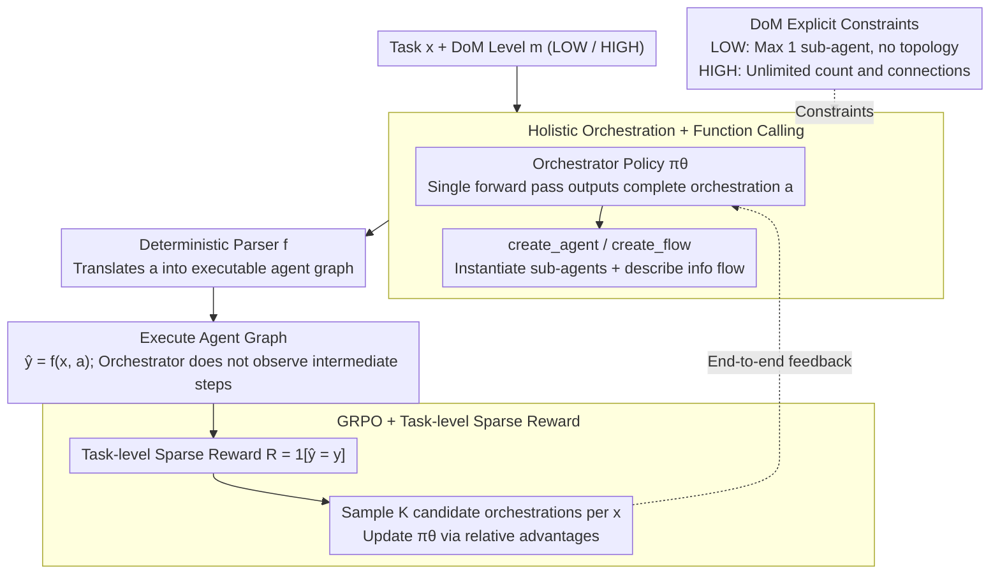

# MAS-Orchestra: Understanding and Improving Multi-Agent Reasoning Through Holistic Orchestration and Controlled Benchmarks

**Conference**: ICML 2026  
**arXiv**: [2601.14652](https://arxiv.org/abs/2601.14652)  
**Code**: https://github.com/SalesforceAIResearch/MAS-Orchestra (Available)  
**Area**: LLM Agent / Multi-Agent Systems / Reinforcement Learning  
**Keywords**: Multi-Agent Systems, Holistic Orchestration, Function Calling, GRPO, MASBench  

## TL;DR
This paper reformulates "automated multi-agent system design" as a reinforcement learning (RL) problem involving the one-shot output of function calls for an entire MAS. It introduces MASBench to quantify when MAS actually outperforms single-agent systems across five axes: Depth, Horizon, Breadth, Parallelism, and Robustness.

## Background & Motivation

**Background**: Automated multi-agent system (MAS) design has evolved from manual wiring (like fixed topologies such as debate or CoT-SC) toward training-time orchestration—where an orchestrator LLM automatically generates roles, connections, and execution orders for sub-agents based on the task.

**Limitations of Prior Work**: The authors categorize existing approaches into three specific issues. First, at the formalization level, most works (e.g., MAS-Zero, AFlow, W4S) use "executable code" to describe orchestration. This forces the orchestrator to read or even reproduce internal sub-agent code, causing orchestration costs to skyrocket when sub-agents are complex (e.g., multi-turn search agents), and sub-agents are often forced into oversimplified forms like CoT. Second, at the training level, systems either rely on inference-time heuristic searches that lack stability or use multi-step RL for incremental component stitching, which suffers from poor long-range credit assignment and error accumulation across steps. Third, the decision of "when to use MAS" relies on empirical intuition rather than a quantitative framework, leading to performance issues being misattributed to models rather than system misapplication.

**Key Challenge**: Path-based sequential orchestration forces the orchestrator to seek local optima at each step, which inherently conflicts with global coordination—the primary benefit of MAS. Furthermore, defining sub-agents at the level of "single-line prompt changes" or "backbone swaps" fails to capture the dimensions of tools and workflows that truly distinguish sub-agent capabilities.

**Goal**: (1) Propose an orchestration formalization that allows the orchestrator to perform global reasoning while accommodating complex sub-agents; (2) Provide a controllable benchmark to decompose the impact of task structure, verification protocols, and orchestrator/sub-agent capabilities on MAS gains.

**Key Insight**: The authors observe that the essential capability required for an orchestrator is "high-level system design" rather than "reproducing internal sub-agent behavior." By abstracting sub-agents as black-box callable functions (exposing only signatures), the orchestrator can output a complete system structure in one shot, bypassing the long-range credit assignment problems of sequential RL.

**Core Idea**: MAS is defined as a "one-shot function calling program" using two primitives: `create_agent` and `create_flow`. The orchestrator is trained via GRPO on end-to-end task rewards to generate the entire system holistically. Explicitly, a user-controllable complexity knob called the Degree of MAS (DoM) is introduced.

## Method

### Overall Architecture
This paper addresses the issues of automated MAS design being hindered by sequential multi-step RL. Historically, orchestrators assembled systems incrementally, leading to poor credit assignment and cumulative errors. MAS-Orchestra collapses this into a single-step decision: given a dataset $\mathcal{D}=\{(x_i,y_i)\}$ and a user-specified DoM level $m\in\{\text{LOW},\text{HIGH}\}$, the orchestrator policy observes the task $x$ at step 0 and samples a complete orchestration $a\sim\pi_\theta(\cdot\mid x,m)$ in a single forward pass. A deterministic rule parser $f$ then translates $a$ into an executable sub-agent call graph to produce prediction $\hat{y}=f(x,a)$. The orchestrator does not observe intermediate states or make further decisions; performance is backpropagated based only on final accuracy via GRPO.

### Key Designs

**1. Holistic Orchestration + Function-Calling Formalization: Generating whole systems at once**

This addresses the tight coupling in code-based orchestration (MAS-Zero, AFlow, W4S) where orchestrators must understand sub-agent internal logic. In MAS-Orchestra, the orchestration space is reduced to two primitives: `create_agent(role, goal, tools, workflow)` to instantiate a goal-oriented sub-agent, and `create_flow(from, to, payload)` to describe information flow. Sub-agents are treated as black-box functions. The RL signal aligns with "system-level final returns" rather than step-wise local optima, offering more stable training and allowing arbitrary internal complexity in sub-agents (e.g., multi-turn search or DeepResearch) that remains transparent to the orchestrator.

**2. DoM (Degree of MAS) Explicit Constraints: User-adjustable complexity**

Empirically, not all tasks benefit from MAS—strong sequential problems like AIME show little gain and incur unnecessary coordination overhead. The authors introduce a DoM level $m$ to constrain the orchestration space: "LOW" limits the system to a maximum of one sub-agent with no inter-agent topology, while "HIGH" allows unrestricted agents and connections. LOW does not equate to a traditional single-agent system (SAS); the orchestrator must still decide whether to solve the task directly or delegate it to a specific sub-agent configuration. This allows a single model to switch between regimes based on user/task priors.

**3. GRPO + Task-level Sparse Rewards: End-to-end training via final answers**

Holistic orchestration receives feedback only at the final output, resulting in extremely sparse rewards. Unlike PPO, which relies on value baselines that may exhibit high variance here, the authors use final answer correctness $R(x,y,\hat{y})=\mathbb{1}[\hat{y}=y]$. For each $x$, a group of $K$ candidate orchestrations $\{a_i\}_{i=1}^K\sim\pi_\theta(\cdot\mid x,m)$ is sampled. Relative advantages within the group are used to construct a clipped policy gradient (GRPO, Shao et al. 2024). This avoids the need for a critic model and fits the sampling structure of "generating $K$ complete MAS candidates from one prompt."

### Loss & Training
The training phase includes two types of data: controlled synthetic data from MASBench (generated by iGSM for specific Depth/Horizon/Breadth/Parallel complexities and Robustness axes featuring NIAH-style adversarial notes) and training sets from public benchmarks (DeepScaleR for AIME/GPQA, HotpotQA, and 80% of BrowseComp+). The sub-agent pool is fixed to five types: CoT, CoT-SC, Debate, Self-refine, and DeepResearch. All share the same LLM backend, differing only in tools and workflows to ensure changes in performance are attributed to orchestration architecture rather than the underlying model.

## Key Experimental Results

### Main Results

Evaluated on 5 public benchmarks using Qwen2.5-7B-Instruct as the orchestrator and GPT-OSS-120B (low) as the sub-agent backend, compared against independent agents, inference-time SOTA (AFlow / MaAS), and training-time SOTA (ToolOrchestra):

| Benchmark | Task Type | Best Independent Agent | SOTA Orch. Baseline | MAS-Orchestra | Notes |
|-----------|-----------|------------------------|---------------------|---------------|-------|
| AIME24 | Math (IID) | DebateAgent 62.08 | AFlow 62.50 | **66.25** | Low DoM |
| AIME25 | Math (IID) | DebateAgent 57.50 | AFlow 53.33 | **61.25** | Low DoM |
| HotpotQA | Multi-hop QA (IID) | DeepResearch 46.44 | ToolOrchestra 37.44 | **49.00** | High DoM |
| BrowseComp+ | Search QA (IID) | DeepResearch 8.56 | ToolOrchestra 1.38 | **11.00** | High DoM |
| GPQA | Reasoning (OOD) | DebateAgent 64.14 | AFlow 65.43 | **65.21** | Low DoM, DeepScaleR training |

In terms of efficiency, MAS-Orchestra lies on the Pareto frontier, achieving over 10× reduction in inference cost compared to strong baselines.

### Ablation Study: MASBench Five-Axis Analysis

| Configuration | Conclusion | Explanation |
|---------------|------------|-------------|
| Sub-agent = Qwen-7B (Weak) | MAS beats SAS in Breadth/Parallel/Robustness; MAS loses in Depth | Sequential CoT avoids coordination overhead in strong dependency chains |
| Sub-agent = GPT-120B low (Strong) | Gains disappear in Depth/Horizon/Breadth/Parallel; Robustness remains lead | Strong agents internalize structure; coordination cost outweighs benefit |
| Orchestrator = RLM (e.g., GPT-OSS-20B-low) | Inferior to Instruction-tuned LLM | RLM tends to "solve directly + delegate one agent," converging to single-agent after training |
| Robustness Axis (Adversarial notes) | SAS accuracy near 0; MAS leads significantly | MAS actively adds final answer / moderator agents for cross-verification |
| Increased reasoning effort (512 → 120k tokens) | MAS-vs-SAS advantage stable across effort levels | Advantage is not a byproduct of context truncation |

### Key Findings
- **"Marginal Capability" Hypothesis**: MAS gains are maximized when sub-agents are competent but not strong enough to internalize the entire task structure independently.
- **Holistic vs. Sequential**: MAS-Orchestra outperforms ToolOrchestra (sequential RL) across all benchmarks, particularly in BrowseComp+ (11.00 vs 1.38), highlighting that sequential RL struggles as agent complexity increases.
- **Counter-intuitive Orchestrator Choice**: Zero-shot GPT-5 / Claude-Sonnet-4.5 as orchestrators were outperformed by trained 7B Qwen orchestrators, suggesting orchestration capability must be explicitly shaped via RL and does not emerge solely from general reasoning.
- **DoM Strategy**: Using LOW DoM for sequential tasks (Math/GPQA) and HIGH DoM for parallel search tasks (HotpotQA/BrowseComp+) is superior to a one-size-fits-all HIGH DoM approach.

## Highlights & Insights
- **Function as the correct abstraction level** for MAS. By abstracting to function signatures, the orchestrator is no longer constrained by sub-agent internal complexity, allowing complex agents like DeepResearch to be naturally integrated.
- **Decomposition via MASBench**: The five-axis breakdown (Depth/Horizon/Breadth/Parallel/Robustness) turns the MAS-vs-SAS debate into a falsifiable experimental question.
- **RLM Pitfalls**: The finding that RLM models prefer direct solving over system design serves as a caution against using models like o1 or DeepSeek-R1 as orchestrators without specialized adaptation.
- **Sparse Rewards + Holistic Generation**: GRPO's group-based relative advantage is a natural fit for holistic orchestration's "K candidates per prompt" structure.

## Limitations & Future Work
- Sub-agents were restricted to five fixed workflows; the ability to "create entirely new agent types" was not tested.
- Capability binding: Orchestrators were trained on low-reasoning-effort sub-agents; managing high-effort sub-agents may require additional training to handle context length.
- Baseline fairness: GPT-5/Claude comparisons involved zero-shot models; a "trained GPT-5 orchestrator" comparison would be more rigorous.
- Benchmark scope: BrowseComp+ is narrow; a lack of typical MAS use cases like code generation or complex document analysis.

## Related Work & Insights
- **vs. AFlow / MAS-Zero (Inference-time)**: These rely on heuristic search without training. MAS-Orchestra uses GRPO for explicit training, providing better performance and 10× efficiency.
- **vs. ToolOrchestra (Sequential RL)**: ToolOrchestra's sequential decision-making struggles with long-range credit assignment, which MAS-Orchestra solves via holistic generation.
- **vs. Fixed MAS (Debate/SC)**: These are treated as components within the MAS-Orchestra pool; the orchestrator proves that "automated selection + combination" is superior to any single fixed pattern.

## Rating
- Novelty: ⭐⭐⭐⭐
- Experimental Thoroughness: ⭐⭐⭐⭐⭐
- Writing Quality: ⭐⭐⭐⭐
- Value: ⭐⭐⭐⭐⭐

<!-- RELATED:START -->

<!-- RELATED:END -->

## Related Papers

- [\[ICML 2026\] OMAC: A Holistic Optimization Framework for LLM-Based Multi-Agent Collaboration](omac_a_holistic_optimization_framework_for_llm-based_multi-agent_collaboration.md)
- [\[ACL 2026\] Towards Self-Improving Error Diagnosis in Multi-Agent Systems](../../ACL2026/multi_agent/towards_self-improving_error_diagnosis_in_multi-agent_systems.md)
- [\[ACL 2025\] GETReason: Enhancing Image Context Extraction through Hierarchical Multi-Agent Reasoning](../../ACL2025/multi_agent/getreason_enhancing_image_context_extraction_through_hierarchical_multi-agent_re.md)
- [\[NeurIPS 2025\] Multi-Agent Collaboration via Evolving Orchestration](../../NeurIPS2025/multi_agent/multi-agent_collaboration_via_evolving_orchestration.md)
- [\[CVPR 2026\] Visual Document Understanding and Reasoning: A Multi-Agent Collaboration Framework with Agent-Wise Adaptive Test-Time Scaling](../../CVPR2026/multi_agent/visual_document_understanding_and_reasoning_a_multi-agent_collaboration_framewor.md)

<!-- RELATED:END -->
