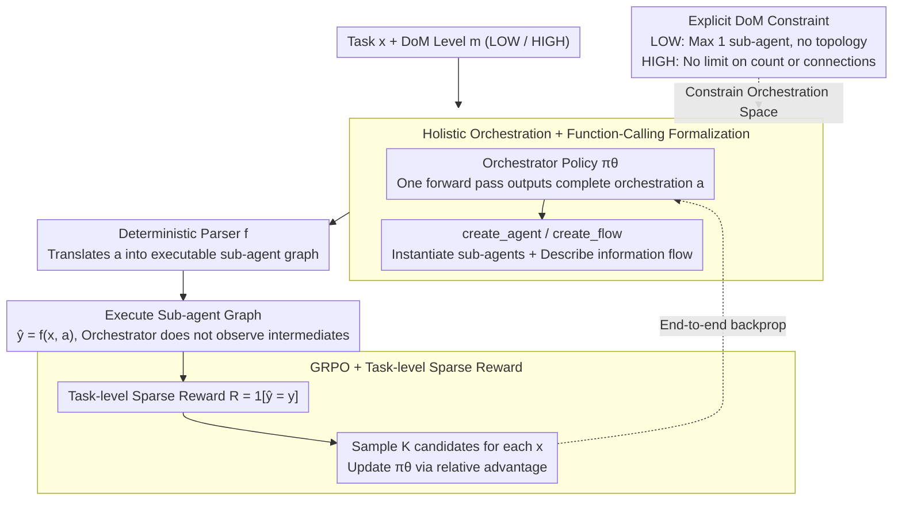

# MAS-Orchestra: Understanding and Improving Multi-Agent Reasoning Through Holistic Orchestration and Controlled Benchmarks

**Conference**: ICML 2026  
**arXiv**: [2601.14652](https://arxiv.org/abs/2601.14652)  
**Code**: https://github.com/SalesforceAIResearch/MAS-Orchestra (Available)  
**Area**: LLM Agent / Multi-Agent Systems / Reinforcement Learning  
**Keywords**: Multi-Agent Systems, Holistic Orchestration, Function Calling, GRPO, MASBench  

## TL;DR
The paper reformulates "automated multi-agent system design" as a reinforcement learning (RL) problem involving function calls that output an entire MAS structure in a single step. It introduces MASBench to clarify "when multi-agent systems are truly superior to single-agent systems" across five dimensions: Depth, Horizon, Breadth, Parallelism, and Robustness.

## Background & Motivation

**Background**: Automated Multi-Agent System (MAS) design has shifted from manual wiring (static topologies like debate or CoT-SC) to training-time orchestration. This involves an orchestrator LLM that automatically generates sub-agent roles, connection topologies, and execution sequences based on the given task.

**Limitations of Prior Work**: The authors categorize existing approaches into three specific issues. First, in terms of formalization, almost all works use "executable code" to describe orchestration (e.g., MAS-Zero, AFlow, W4S). The orchestrator must read or even replicate the internal code of sub-agents. When sub-agents are complex (e.g., multi-round search agents), orchestration costs escalate, forcing sub-agents to regress to simple forms like CoT/CoT-SC. Second, regarding training, methods either rely entirely on inference-time heuristic searches—leading to instability—or use multi-step RL to incrementally assemble components, resulting in poor long-term credit assignment and error accumulation across steps. Third, determining "when to use MAS" currently relies on empirical intuition rather than a quantitative framework, often leading users to apply MAS inappropriately and misinterpret the resulting failures as model issues.

**Key Challenge**: Sequential multi-step orchestration forces the orchestrator to perform local optimization at each step, which inherently conflicts with the global coordination benefits of MAS. Furthermore, defining sub-agents at the level of "changing a line in the prompt" or "switching a backbone" erases the dimensions of tools and workflows that truly differentiate sub-agent capabilities.

**Goal**: (1) Propose an orchestration formalization that allows the orchestrator to perform global reasoning while accommodating complex sub-agents. (2) Provide a controlled benchmark to disentangle the impacts of task structure, verification protocols, and orchestrator/sub-agent capabilities on MAS gains.

**Key Insight**: The authors observe that the orchestrator's essential capability is "high-level system design" rather than "replicating the internal behavior of sub-agents." By abstracting sub-agents as black-box callable functions (exposing only their signatures), the orchestrator can output a complete system structure in one pass, circumventing the long-term credit assignment problems of sequential RL.

**Core Idea**: Use two primitives, `create_agent` and `create_flow`, to represent the MAS as a "one-off function-calling program." Train the orchestrator using GRPO on end-to-end task rewards to generate the entire system holistically, while explicitly introducing the Degree of MAS (DoM) as a user-controllable complexity knob.

## Method

### Overall Architecture
This paper addresses the long-standing issue where automated MAS design is hampered by sequential multi-step RL. In previous methods, orchestrators assembled systems incrementally, leading to poor credit assignment and cumulative errors. MAS-Orchestra compresses the entire process into a single decision. Given a dataset $\mathcal{D}=\{(x_i,y_i)\}$ and a user-specified DoM level $m\in\{\text{LOW},\text{HIGH}\}$, the orchestrator policy only observes task $x$ at step 0. It samples a complete orchestration $a\sim\pi_\theta(\cdot\mid x,m)$ in one forward pass. A deterministic rule parser $f$ then translates $a$ into an executable sub-agent call graph to produce a prediction $\hat{y}=f(x,a)$. The orchestrator does not observe intermediate states or make incremental decisions; the quality of the orchestration is backpropagated only through the correctness of the final answer. The training is completed using GRPO based on end-to-end task rewards.

### Key Designs

**1. Holistic Orchestration + Function-Calling Formalization: Generating the entire system at once instead of step-by-step assembly**

This targets the tight coupling found in code-based orchestration (MAS-Zero, AFlow, W4S), where the orchestrator must understand or replicate sub-agent internal code. As sub-agents become complex (e.g., multi-round search agents), orchestration costs explode, forcing developers to simplify sub-agents to basic CoT/CoT-SC forms. MAS-Orchestra constrains the orchestration space to two function primitives: `create_agent(role, goal, tools, workflow)` to instantiate a goal-oriented sub-agent, and `create_flow(from, to, payload)` to describe the information flow between them. Crucially, sub-agents are treated as black-box functions; the orchestrator views only the signature, not the implementation. Consequently, it can write a complete MAS program—including multiple sub-agents and their connectivity—in a single forward pass. RL signals align directly with the "system-level final return" rather than local optima at each step, making training more stable and allowing sub-agents to be arbitrarily complex (e.g., multi-round search, DeepResearch) since their internal complexity is transparent to the orchestrator.

**2. DoM (Degree of MAS) Explicit Constraints: Turning "Whether to use MAS" into a user-adjustable knob**

Empirically, not all tasks benefit from MAS. Highly sequential mathematical problems like AIME show almost no gain from MAS, where forced coordination adds unnecessary overhead. The authors introduce a DoM level $m$ to enforce constraints on the orchestration space: at the LOW level, at most one sub-agent can be instantiated and no explicit inter-agent topology is allowed; at the HIGH level, there are no limits on sub-agent counts or connections. Even at the LOW level, the orchestrator still decides whether to solve the task itself, delegate the whole task, delegate a sub-task, which sub-agent to select, and how to configure it—it simply avoids multi-agent topologies. A single model trained with a unified objective can switch between these two regimes via $m$, leaving the prior decision of "whether to use MAS" to the user or task characteristics rather than embedding it permanently in the model weights, thus saving significant orchestration waste.

**3. GRPO + Task-level Sparse Rewards: End-to-end training using only final answer correctness**

Holistic orchestration only receives feedback at the final output, resulting in extremely sparse rewards. Methods like PPO, which depend on a value baseline, exhibit high variance under such signals. The authors use the correctness of the final answer $R(x,y,\hat{y})=\mathbb{1}[\hat{y}=y]$ as the sole signal. For each $x$, they sample a group of $K$ candidate orchestrations $\{a_i\}_{i=1}^K\sim\pi_\theta(\cdot\mid x,m)$, calculate their respective rewards $\{R_i\}$, and construct a clipped policy gradient using intra-group relative advantage (GRPO, Shao et al. 2024). For tasks requiring robustness, sub-task correctness can be added as an auxiliary reward. GRPO replaces the value model with relative comparison within a group, perfectly matching the sampling structure of holistic orchestration where one prompt generates multiple candidate systems simultaneously.

### Training & Evaluation Strategy
The training phase utilizes two types of data: first, controllable synthetic data from MASBench (generated by the iGSM math problem generator across specified Depth/Horizon/Breadth/Parallelism complexities, with Robustness constructed via NIAH-style adversarial notes); second, training sets from public benchmarks (DeepScaleR for AIME/GPQA, HotpotQA, and an 80% split of BrowseComp+). The sub-agent pool is fixed to five categories: CoT, CoT-SC, Debate, Self-refine, and DeepResearch. All share the same LLM backend and differ only in tools and workflows, ensuring that any variation in performance is due to orchestration structure rather than the underlying model.

## Key Experimental Results

### Main Results

Using Qwen2.5-7B-Instruct as the orchestrator and GPT-OSS-120B (low) as the sub-agent backend, Ours was compared against standard independent agents, SoTA inference-time orchestrations (AFlow / MaAS / MAS-Zero), SoTA training-time orchestrations (MAS-GPT / ToolOrchestra), and high-end models like GPT-5 / Claude-Sonnet-4.5 acting as orchestrators:

| Benchmark | Task Type | Best Independent Agent | SoTA Orchestration Baseline | MAS-Orchestra (Ours) | Notes |
| :--- | :--- | :--- | :--- | :--- | :--- |
| AIME24 | Math (IID) | DebateAgent 62.08 | AFlow 62.50 | **66.25** | Low DoM |
| AIME25 | Math (IID) | DebateAgent 57.50 | AFlow 53.33 | **61.25** | Low DoM |
| HotpotQA | Multi-hop QA (IID) | DeepResearch 46.44 | ToolOrchestra 37.44 | **49.00** | High DoM |
| BrowseComp+ | Search QA (IID) | DeepResearch 8.56 | ToolOrchestra 1.38 | **11.00** | High DoM |
| GPQA | Reasoning (OOD) | DebateAgent 64.14 | AFlow 65.43 | **65.21** | Low DoM, DeepScaleR Training |

In terms of efficiency, MAS-Orchestra lies on the Pareto frontier, achieving over 10× reduction in inference costs compared to strong baselines (Figure 1 in the paper).

### Ablation Study: MASBench Five-Axis Analysis

| Configuration | Conclusion | Explanation |
| :--- | :--- | :--- |
| Sub-agent = Qwen-7B (Weak) | MAS significantly beats SAS on Breadth/Parallel/Robustness; MAS loses to SAS on Depth. | Sequential CoT saves coordination overhead in strong dependency chains. |
| Sub-agent = GPT-120B low (Strong) | MAS gains nearly zero on Depth/Horizon/Breadth/Parallel; still leads on Robustness. | Strong sub-agents internalize structure; coordination costs outweigh benefits. |
| Orchestrator = RLM (e.g., GPT-OSS-20B-low) | Inferior to Instruction-tuned LLM. | RLMs tend to "solve directly + delegate to one agent"; they converge to single-agent solutions after training. |
| Robustness Axis (Adversarial notes) | SAS accuracy near 0, MAS leads significantly. | Ours actively adds final answer/moderator sub-agents for cross-verification. |
| Increased Reasoning Effort (512 → 120k tokens) | MAS-vs-SAS advantage on Robustness remains stable. | The gain is not a pseudo-correlation caused by context truncation. |

### Key Findings
- **"Marginal Capability" Hypothesis**: The Gain from MAS is most significant when sub-agents are "adequate but not powerful enough to internalize the entire structure." If sub-agents are too weak, they cannot perform even decomposed sub-tasks; if they are too strong, coordination costs and error propagation negate the benefits.
- **Holistic vs. Sequential**: MAS-Orchestra (Ours) outperformed ToolOrchestra (sequential RL) across all five public benchmarks. In BrowseComp+, the score improved from 1.38 to 11.00, proving that sequential RL is particularly disadvantageous when sub-agents are complex.
- **Counter-intuitive Orchestrator Performance**: Using GPT-5 / Claude-Sonnet-4.5 as orchestrators (without training) resulted in they being defeated by a trained 7B Qwen orchestrator across all benchmarks. This suggests that orchestration capability does not transfer directly from general reasoning and must be explicitly shaped through RL.
- **DoM Configuration Strategy**: Applying the LOW setting for strong sequential tasks (Math/GPQA) and HIGH for tasks involving parallel search (HotpotQA/BrowseComp+) is superior to a universal HIGH setting.

## Highlights & Insights
- **"Functions are the correct abstraction layer for MAS"**: By abstracting to the function signature level, the orchestrator is no longer burdened by sub-agent complexity. This allows complex agents like DeepResearchAgent to be naturally integrated into the candidate pool. This abstraction choice is arguably more significant than the GRPO training itself.
- **MASBench's five-axis decomposition is reusable**: Future MAS research should report gains relative to SAS on specific axes (Depth, Horizon, Breadth, Parallelism, Robustness) rather than aggregate numbers.
- **RLMs are unsuitable as orchestrators**: The authors use agent statistics to show that RLMs prefer "solving the task directly" over "designing a system." This aligns with the end-to-end training objectives of RLMs—a warning for those attempting to use models like o1 or DeepSeek-R1 as orchestrators.
- **Sparse task rewards + One-off orchestration is a natural fit for GRPO**: Sampling $K$ candidate MAS systems from a single prompt and updating via relative advantage simplifies the process by removing the need for a critic model.

## Limitations & Future Work
- Sub-agents remain restricted to five fixed workflow types (CoT/SC/Debate/Self-refine/DeepResearch); the ability to "create truly novel sub-agent types" was not verified.
- The orchestrator was only exposed to low reasoning effort sub-agents (512 token limit) during training. Management of context length under high reasoning effort requires additional training, implying an implicit capability binding between the orchestrator and sub-agents.
- Comparisons with GPT-5 / Claude-Sonnet-4.5 as orchestrators are not entirely fair since they were not specifically trained for this task.
- MASBench is heavily based on iGSM synthetic data, and BrowseComp+ remains narrow in scope. There is a lack of typical MAS use cases such as code generation or long-document analysis.

## Related Work & Insights
- **vs. MAS-Zero / AFlow (Inference-time Orchestration)**: They do not train the orchestrator and rely on heuristic search during inference. MAS-Orchestra (Ours) uses explicit GRPO training, offering better performance and 10× higher efficiency, while parameterizing the "need for MAS" via DoM.
- **vs. ToolOrchestra (Sequential Training-time Orchestration)**: Both use RL, but sequential decision-making struggles with credit assignment, as seen in the BrowseComp+ scores (1.38 for ToolOrchestra vs. 11.00 for Ours).
- **vs. MAS-GPT (SFT-based Orchestration)**: SFT tends to overfit the training distribution. RL with task rewards better captures system-level coordination patterns and demonstrates more stable OOD generalization (e.g., GPQA).
- **vs. Fixed-pattern MAS (Debate, Self-Consistency, etc.)**: These are simply sub-agents within the candidate pool of Ours. This work demonstrates that "automatic selection + combination + configuration" outperforms any single fixed pattern.

## Rating
- **Novelty**: ⭐⭐⭐⭐ Reformulating MAS orchestration as holistic function-calling RL with a 5-axis controlled benchmark is a solid contribution.
- **Experimental Thoroughness**: ⭐⭐⭐⭐⭐ Comprehensive scanning across public benchmarks, controlled benchmarks, orchestrator/sub-agent capabilities, and reasoning effort.
- **Writing Quality**: ⭐⭐⭐⭐ Logical derivation from desiderata to methodology; clear systematic comparison in Table 1; precise algorithmic descriptions.
- **Value**: ⭐⭐⭐⭐⭐ MASBench and the "marginal capability" insight are poised to become standard references for MAS research; the 10× efficiency gain is highly attractive for industrial applications.

## Rating
- **Novelty**: TBD
- **Experimental Thoroughness**: TBD
- **Writing Quality**: TBD
- **Value**: TBD

<!-- RELATED:START -->

## Related Papers

- [\[ICML 2026\] OMAC: A Holistic Optimization Framework for LLM-Based Multi-Agent Collaboration](omac_a_holistic_optimization_framework_for_llm-based_multi-agent_collaboration.md)
- [\[ICML 2026\] Toward Culturally Aligned LLMs through Ontology-Guided Multi-Agent Reasoning](toward_culturally_aligned_llms_through_ontology-guided_multi-agent_reasoning.md)
- [\[ICLR 2026\] Stronger-MAS: Multi-Agent Reinforcement Learning for Collaborative LLMs](../../ICLR2026/multi_agent/stronger-mas_multi-agent_reinforcement_learning_for_collaborative_llms.md)
- [\[ACL 2026\] Towards Self-Improving Error Diagnosis in Multi-Agent Systems](../../ACL2026/multi_agent/towards_self-improving_error_diagnosis_in_multi-agent_systems.md)
- [\[CVPR 2026\] Visual Document Understanding and Reasoning: A Multi-Agent Collaboration Framework with Agent-Wise Adaptive Test-Time Scaling](../../CVPR2026/multi_agent/visual_document_understanding_and_reasoning_a_multi-agent_collaboration_framewor.md)

<!-- RELATED:END -->
