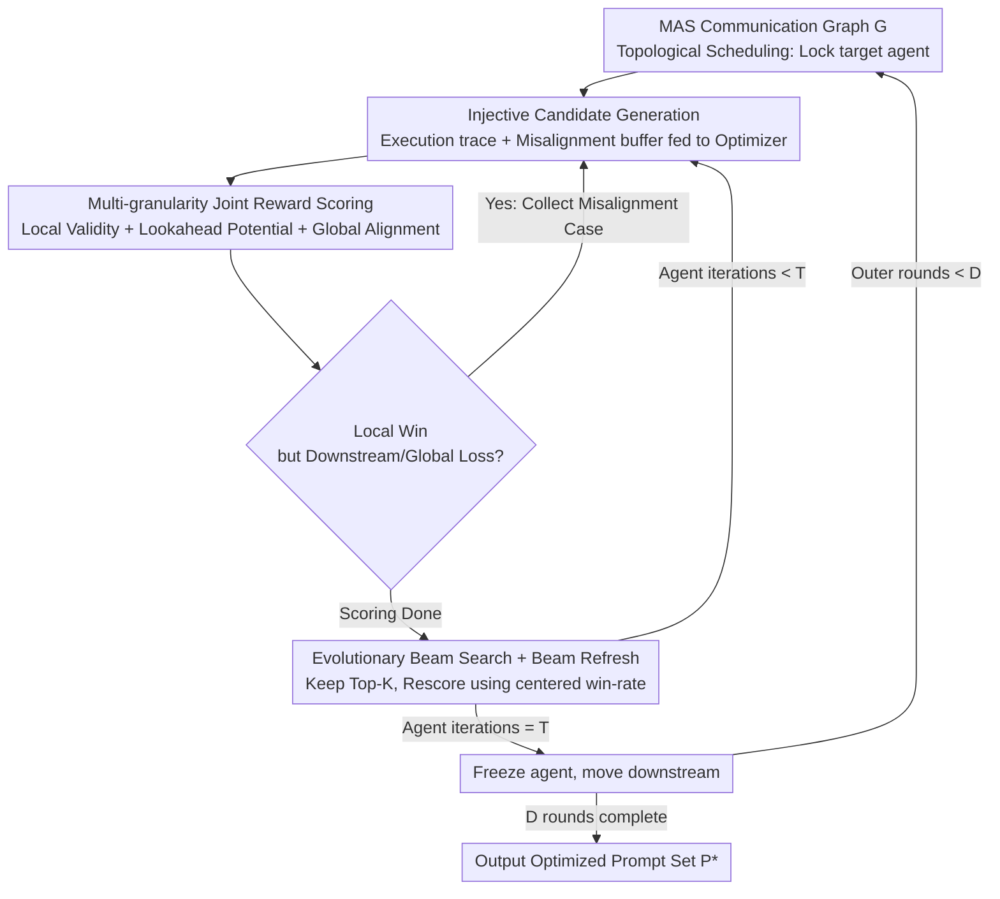

# MASPO: Joint Prompt Optimization for LLM-based Multi-Agent Systems

**Conference**: ICML 2026  
**arXiv**: [2605.06623](https://arxiv.org/abs/2605.06623)  
**Code**: https://github.com/wangzx1219/MASPO  
**Area**: LLM / Agent / Prompt Engineering  
**Keywords**: Multi-Agent Systems, Joint Prompt Optimization, Credit Assignment, Evolutionary Beam Search, Misalignment Sampling

## TL;DR
MASPO jointly optimizes persona prompts for entire multi-agent chains end-to-end without relying on labels, using multi-granularity joint evaluation (Local Validity + Lookahead Potential + Global Alignment) and misalignment-driven evolutionary beam search, achieving an average improvement of approximately 2.9 points across 6 tasks.

## Background & Motivation

**Background**: LLM-based Multi-Agent Systems (MAS) are currently primarily orchestrated through manually written "persona prompts." By decomposing tasks into several heterogeneous agents collaborating in specific topological sequences, MAS significantly outperforms single agents. Automatic prompt optimization has matured for single agents with methods like APE, OPRO, DSPy / MIPRO, TPE, and SPO.

**Limitations of Prior Work**: Directly applying these methods to MAS encounters major issues. First, traditional optimizers rely on "Final Answer vs. Ground Truth" scoring, but intermediate agents output reasoning, reflections, or drafts for which no labels exist—a classic **Credit Assignment Problem**. Second, Bayesian search methods like TPE / MIPRO / MASS use fixed discrete candidate sets and cannot perform open-ended generation. Third, self-supervised schemes (e.g., SPO) only compare whether "this output is better than the last," remaining at the level of isolated single-agent comparisons without reflecting how prompt changes propagate through the causal chain to downstream agents.

**Key Challenge**: Prompts in a MAS are subject to **functional coupling**. Modifying an upstream prompt $p_j$ changes the input distribution $\mathcal{C}_i$ for a downstream agent $v_i$ (covariate shift), making the optimization landscape naturally non-stationary. Furthermore, locally optimal prompts can lead to **Local-Global Misalignment**, where outputs are syntactically correct but mislead the downstream process.

**Goal**: To jointly optimize the set of $N$ agent prompts $\mathcal{P}=\{p_i\}_{i=1}^N$ for the entire MAS without ground truth, while (1) resolving credit assignment; (2) explicitly identifying and fixing local-global misalignments; and (3) handling non-stationary collaborative optimization.

**Key Insight**: The authors observe that by comparing "New Prompt vs. Reference Prompt" across local, lookahead, and global granularities, one can construct causal-chain-sensitive reward signals without labels. Furthermore, explicitly treating samples that "win locally but lose downstream/globally" as hard negatives for the prompt generator allows the search to directionally fix coordination breakpoints.

**Core Idea**: Combining "topological scheduling + multi-granularity joint reward + misalignment case sampling + evolutionary beam search with Beam Refresh" into a coordinate ascent framework. This ensures each agent's prompt evolves based on its contribution to the entire causal chain rather than isolated outputs.

## Method

### Overall Architecture
MASPO formalizes a multi-agent system as a directed communication graph $\mathcal{G}=(\mathcal{V},\mathcal{E})$. Each agent $v_i$ is determined by an LLM inference function $f_i$ and a persona prompt $p_i$, producing output $o_i=f_i(p_i,q,\mathcal{C}_i)$, where context $\mathcal{C}_i$ consists of predecessor outputs concatenated in topological order. The objective is to find a prompt set $\mathcal{P}^*$ that maximizes the system-level reward $R(\Phi(\mathcal{G},\mathcal{P},q),o_{glob}^*)$. The process follows a coordinate ascent cycle: agents are targeted sequentially according to the topological order. Trace-driven candidate generation is performed, candidates are scored using an unlabeled multi-granularity reward while capturing coordination breakpoints, and a Top-$K$ set is maintained via beam search with refresh. After $T$ iterations, the agent is frozen and the process moves downstream, with the entire outer loop repeating for $D$ rounds.

### Key Designs

**1. Multi-granularity Joint Reward: Assessing prompt quality without labels**
Intermediate agents produce reasoning drafts rather than answers comparable to ground truth. Thus, MASPO uses an LLM Evaluator $\mathcal{M}_{eval}$ to compare outputs from the candidate vs. reference prompt across three granularities, producing a weighted average reward: $R=\frac{1}{|\mathcal{B}|}\sum_k[\alpha\cdot\mathbb{I}(o_i'\succ o_i)+\theta\cdot\mathbb{I}(o_{glob}'\succ o_{glob})+\beta\cdot\frac{1}{|\mathcal{N}_{out}(v_i)|}\sum_{v_j}\mathbb{I}(o_j'\succ o_j)]$. These terms represent Local Validity, Global Alignment, and topology-aware Lookahead Potential—the latter quantifies the "downstream ripple" by feeding new contexts to successors. This prevents being misled by "locally perfect but downstream disruptive" outputs while ensuring signal density.

**2. Misalignment Case Mining + Injective Generation: Turning "local win, global loss" bugs into training signals**
Manual prompt tuning struggles to catch hidden failures where outputs seem valid but derail the next step. MASPO formalizes this: samples where $\mathbb{I}(o_i'\succ o_i)=1$ but $\mathbb{I}(\text{Lookahead})=0$ or $\mathbb{I}(o_{glob}'\succ o_{glob})=0$ are collected in a misalignment buffer $\mathcal{B}_{mis}$. When generating new prompts, the Optimizer LLM $\mathcal{M}_{opt}$ is provided with $(q,\mathcal{C},o)$ traces and injected with $K_{mis}$ misalignment samples. This forces the generator to specifically address scenarios where previous prompts failed the system despite appearing locally correct.

**3. Evolutionary Beam Search with Beam Refresh + Topological Scheduling: Stable search in non-stationary landscapes**
Candidates evolve in a Top-$K$ beam based on cumulative rewards $J(p')=R(p',p_{parent};\mathcal{B}_{iter})+J(p_{parent})$. To prevent overfitting to stale behaviors of other agents, **Beam Refresh** is utilized. When revisiting an agent, old cumulative scores (based on outdated upstream contexts) are discarded. Prompts are rescored against the current global best $p_{best}$ using a "centered win-rate": $J_{new}(p)=R(p,p_{best};\mathcal{B}_{iter})-0.5$. Subtracting $0.5$ centers the metric around zero, making improvements positive and regressions negative, ensuring search proceeds on the most current performance manifold.

### Loss & Training
There is no gradient descent; the process is a "Generate → Evaluate → Evolve" prompt search. The backbone used is Qwen3-8B (standard mode). Both the Optimizer and Evaluator use Gemini-2.5-pro. The mini-batch size $|\mathcal{B}|=10$ is used per iteration, and the unlabeled sample pool consists of only a few dozen entries.

## Key Experimental Results

### Main Results
Six tasks (Math: MATH-500 / AGIEval-MATH / AQuA; Reasoning: GPQA-Diamond; Code: MBPP / HumanEval-ET) were tested across two MAS architectures (Sequential, Hierarchical) against TPE and SPO baselines.

| MAS Architecture | Optimization Method | MATH-500 | GPQA | HumanEval-ET | Avg |
|---|---|---|---|---|---|
| Sequential | None | 75.10 | 47.73 | 68.90 | 65.31 |
| Sequential | + TPE | 75.80 | 48.04 | 70.12 | 66.49 |
| Sequential | + SPO | 77.20 | 49.52 | 67.94 | 66.56 |
| Sequential | **+ MASPO** | **77.80** | **58.08** | **73.78** | **70.39** |
| Hierarchical | None | 77.60 | 50.63 | 71.34 | 68.32 |
| Hierarchical | + SPO | 77.80 | 51.01 | 73.39 | 69.01 |
| Hierarchical | **+ MASPO** | **78.40** | **54.04** | **76.83** | **71.05** |

The most significant improvement occurs in GPQA: MASPO outperforms SPO by 8.56 points in the Sequential architecture, indicating that joint optimization yields the highest returns on tasks requiring complex multi-agent collaborative reasoning.

### Ablation Study

| Configuration | Avg | Description |
|---|---|---|
| MASPO (Full) | 70.39 | Full Framework |
| Serial Search (w/o proposed beam) | 68.10 | Search strategy contribution ~2.3 |
| Single Cycle (no topological interleaving) | 68.19 | Significant contribution from scheduling |
| Single Agent + SPO | 66.86 | Degrades to single-agent baseline |
| + Our Beam Search | 68.87 | Just replacing search adds +2 |
| w/o Beam Refresh | (Drop reported) | Beam Refresh is a key stabilizer |

### Key Findings
- Joint optimization provides much higher gains for complex tasks requiring relay reasoning (GPQA, MBPP) compared to "single-step" solvable tasks (AQuA), proving the Lookahead Potential term's effectiveness.
- MASPO remains superior even when using a weaker backbone (Qwen3-8B) or suboptimal initialization, demonstrating framework robustness.
- There is a "sweet spot" for $K_{mis}$ in misalignment sampling: too small resembles standard trace-guidance, while too large introduces noise.

## Highlights & Insights
- Formalizing "locally winning but globally losing" hidden failures into detectable, mineable events is a primary innovation—it transforms MAS coordination bugs that typically require manual debugging into optimization signals.
- Lookahead Potential is a highly transferable concept: any system with causal dependencies (multi-step agents, RAG pipelines, tool-use chains) can benefit from an evaluation perspective that asks, "Does your output help the downstream do better?"
- Beam Refresh using a centered win-rate ($-0.5$) is far more efficient than global re-evaluation for handling covariate shift; it minimizes computation by only refreshing when an agent is revisited.

## Limitations & Future Work
- The process relies on an Evaluator LLM for win/loss judgments, which may amplify Evaluator bias; while robust against weak components, the risk of systematic misjudgment on certain tasks remains.
- The outer loop iterations ($D$ rounds $\times$ $N$ agents $\times$ $T$ steps) incur significant LLM call costs; the authors tested on small-scale tasks and did not provide total token overhead.
- The communication graph must be a DAG to define topological order; interactive MAS with cycles or dynamic topologies (e.g., debates, negotiations) require further design.

## Related Work & Insights
- **vs. MIPRO / MASS (TPE)**: While those methods select from a fixed discrete prompt pool, MASPO utilizes open-ended generation and evolution, offering much higher degrees of freedom.
- **vs. SPO**: SPO uses output comparisons for single-agent self-supervised optimization; MASPO extends this to the chain level and adds downstream propagation evaluation.
- **vs. DSPy / TextGrad**: These frameworks focus more on local prompt tuning via "textual backpropagation," whereas MASPO addresses the systemic non-stationarity caused by prompt coupling.

## Rating
- **Novelty**: ⭐⭐⭐⭐ Multi-granularity rewards combined with misalignment sampling and Beam Refresh represent the first comprehensive solution for credit assignment and non-stationarity in MAS prompt optimization.
- **Experimental Thoroughness**: ⭐⭐⭐⭐ Covers 6 tasks and 2 architectures with multiple ablations. However, scalability experiments move longer reasoning chains (5+ agents) are absent.
- **Writing Quality**: ⭐⭐⭐⭐ Formulas and figures (Fig 1) are clear, with well-explained motivations and complete prompt templates in the appendix.
- **Value**: ⭐⭐⭐⭐ Provides a practical tool applicable to any DAG-based MAS, highly useful for practitioners building agent systems.

<!-- RELATED:START -->

## Related Papers

- [\[ACL 2026\] Conjunctive Prompt Attacks in Multi-Agent LLM Systems](../../ACL2026/multi_agent/conjunctive_prompt_attacks_in_multi-agent_llm_systems.md)
- [\[ACL 2026\] ATLAS: Adaptive Trading with LLM AgentS Through Dynamic Prompt Optimization and Multi-Agent Coordination](../../ACL2026/multi_agent/atlas_adaptive_trading_with_llm_agents_through_dynamic_prompt_optimization_and_m.md)
- [\[ICML 2026\] OMAC: A Holistic Optimization Framework for LLM-Based Multi-Agent Collaboration](omac_a_holistic_optimization_framework_for_llm-based_multi-agent_collaboration.md)
- [\[NeurIPS 2025\] R&D-Agent-Quant: A Multi-Agent Framework for Data-Centric Factors and Model Joint Optimization](../../NeurIPS2025/multi_agent/rd-agent-quant_a_multi-agent_framework_for_data-centric_factors_and_model_joint_.md)
- [\[ACL 2026\] Seeing the Whole Elephant: A Benchmark for Failure Attribution in LLM-based Multi-Agent Systems](../../ACL2026/multi_agent/seeing_the_whole_elephant_a_benchmark_for_failure_attribution_in_llm-based_multi.md)

<!-- RELATED:END -->
