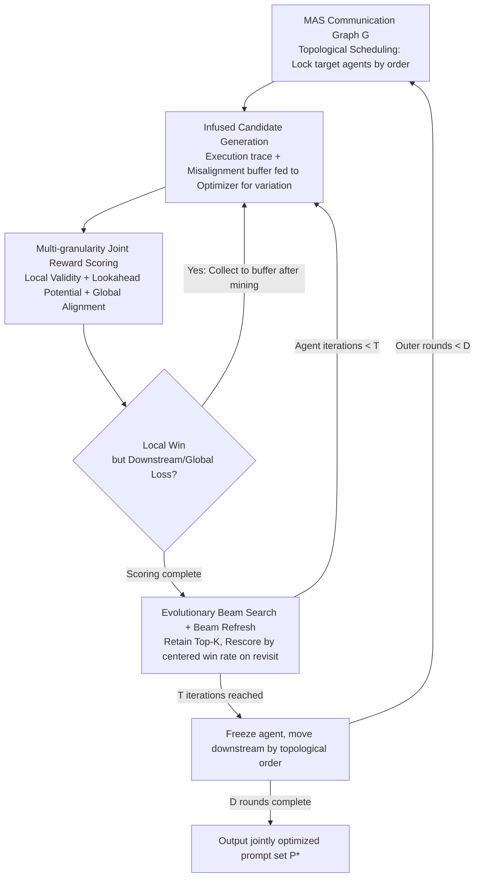

# MASPO: Joint Prompt Optimization for LLM-based Multi-Agent Systems

**Conference**: ICML 2026  
**arXiv**: [2605.06623](https://arxiv.org/abs/2605.06623)  
**Code**: https://github.com/wangzx1219/MASPO  
**Area**: LLM / Agent / Prompt Engineering  
**Keywords**: Multi-Agent Systems, Joint Prompt Optimization, Credit Assignment, Evolutionary Beam Search, Misalignment Sampling

## TL;DR
MASPO end-to-end jointly optimizes role prompts for multi-agent chains without relying on labels through multi-granularity joint evaluation (Local Validity + Lookahead Potential + Global Alignment) and misalignment-driven evolutionary beam search, achieving an average improvement of approximately 2.9 points across 6 tasks.

## Background & Motivation

**Background**: LLM-based Multi-Agent Systems (MAS) are currently orchestrated via manually written "role prompts": tasks are decomposed into heterogeneous agents that collaborate according to a specific communication topology, significantly outperforming single-agent systems. Automatic prompt optimization has matured for single agents with methods like APE, OPRO, DSPy / MIPRO, TPE, and SPO.

**Limitations of Prior Work**: Directly applying these methods to MAS leads to significant issues. First, traditional optimizers rely on "final answer vs. ground truth" scoring, but intermediate agents output reasoning, reflections, or drafts where no labels exist for direct comparison—a classic **credit assignment problem**. Second, Bayesian search methods like TPE / MIPRO / MASS use fixed discrete candidate sets, preventing open-ended generation. Third, self-supervised schemes like SPO only compare if the current output is better than the previous one locally, remaining at the level of isolated single-agent comparisons and failing to reflect the fact that prompt changes propagate down the causal chain to downstream agents.

**Key Challenge**: Prompts in MAS exhibit **functional coupling**. Modifying an upstream $p_j$ changes the input distribution $\mathcal{C}_i$ for a downstream $v_i$ (covariate shift), making the optimization landscape inherently non-stationary. Furthermore, locally optimal prompts may lead to **Local-Global Misalignment**, where outputs are syntactically correct but mislead downstream agents at the system level.

**Goal**: Jointly optimize the set of prompt collections $\mathcal{P}=\{p_i\}_{i=1}^N$ for the entire MAS without ground truth, while (1) resolving credit assignment; (2) explicitly identifying and fixing local-global misalignments; and (3) handling non-stationary collaborative optimization.

**Key Insight**: By comparing "new prompt vs. reference prompt" victories across local, lookahead, and global granularities, one can construct causal-chain-sensitive reward signals without labels. Furthermore, explicitly treating samples that "win locally but lose lookahead/globally" as hard negatives for the prompt generator allows the search to directionally fix coordination breakpoints.

**Core Idea**: Integrate "topological scheduling + multi-granularity joint rewards + misalignment case sampling + evolutionary beam search with Beam Refresh" into a coordinate ascent framework. This ensures each agent's prompt evolves based on its contribution to the entire causal chain rather than isolated outputs.

## Method

### Overall Architecture
MASPO formalizes the multi-agent system as a directed communication graph $\mathcal{G}=(\mathcal{V},\mathcal{E})$. Each agent $v_i$ is defined by an LLM inference function $f_i$ and a role prompt $p_i$, producing output $o_i=f_i(p_i,q,\mathcal{C}_i)$, where the context $\mathcal{C}_i$ is the concatenated output of predecessors in topological order. The goal is to find a prompt set $\mathcal{P}^*$ that maximizes the system-level reward $R(\Phi(\mathcal{G},\mathcal{P},q),o_{glob}^*)$. It follows a coordinate ascent cycle: locking target agents sequentially by topological order, generating candidate prompts using execution traces, scoring candidates with an unlabeled multi-granularity reward while mining coordination breakpoints, and retaining Top-$K$ candidates via beam search with refreshes. Each agent undergoes $T$ iterations before freezing and moving downstream, with the entire outer loop repeating for $D$ rounds.

### Key Designs

**1. Multi-granularity Joint Reward: Determining prompt quality without labels**

Intermediate agents produce reasoning drafts instead of verifiable answers. Thus, MASPO uses an LLM Evaluator $\mathcal{M}_{eval}$ to compare candidate prompt outputs against reference prompt outputs across three granularities, producing a weighted average reward: $R=\frac{1}{|\mathcal{B}|}\sum_k[\alpha\cdot\mathbb{I}(o_i'\succ o_i)+\theta\cdot\mathbb{I}(o_{glob}'\succ o_{glob})+\beta\cdot\frac{1}{|\mathcal{N}_{out}(v_i)|}\sum_{v_j}\mathbb{I}(o_j'\succ o_j)]$. These terms correspond to Local Validity (role compliance), Global Alignment (impact on final system output), and topological Lookahead Potential—feeding new contexts to immediate successors to see if downstream outputs improve. This quantifies "downstream ripples" into the reward. Combining these layers ensures credit assignment propagates along the causal chain while remaining entirely unsupervised.

**2. Misaligned Case Mining + Infused Generation: Converting implicit bugs into directional signals**

The most difficult errors to catch during manual prompt tuning are implicit failures where outputs seem correct but mislead the next step. MASPO formalizes this: samples where $\mathbb{I}(o_i'\succ o_i)=1$ but $\mathbb{I}(\text{Lookahead})=0$ or $\mathbb{I}(o_{glob}'\succ o_{glob})=0$ are collected in a misalignment buffer $\mathcal{B}_{mis}$. Instead of blind mutation, the Optimizer LLM $\mathcal{M}_{opt}$ uses trace-guided generation, prioritizing the injection of $K_{mis}$ misaligned samples. This explicitly instructs the generator to fix scenarios where the prompt "appeared correct but failed the system," forcing the new prompts to bridge the local-global gap.

**3. Evolutionary Beam Search with Beam Refresh + Topological Scheduling: Stable search in non-stationary landscapes**

Candidates evolve in a Top-$K$ beam based on cumulative reward $J(p')=R(p',p_{parent};\mathcal{B}_{iter})+J(p_{parent})$. To prevent upstream agents from overfitting to obsolete downstream behaviors, staggered topological scheduling is used. Since peer agents change, old cumulative scores in the beam reflect outdated upstream contexts. **Beam Refresh** addresses this by discarding old scores upon revisiting an agent and recalculating $J_{new}(p)=R(p,p_{best};\mathcal{B}_{iter})-0.5$ relative to the current global best $p_{best}$ (centering the win rate around zero). This minimizes redundant computation while ensuring the search proceeds on the most recent performance manifold.

### Loss & Training
The framework does not use gradient descent; it is a "generate $\rightarrow$ evaluate $\rightarrow$ evolve" prompt search. The backbone is Qwen3-8B (standard inference mode, internal reasoning disabled), with Gemini-2.5-pro as both Optimizer and Evaluator. The mini-batch size is $|\mathcal{B}|=10$ per iteration, utilizing an unlabeled sample pool of several dozen entries.

## Key Experimental Results

### Main Results
Evaluation across 6 tasks (MATH-500, AGIEval-MATH, AQuA, GPQA-Diamond, MBPP, HumanEval-ET) using two MAS architectures (Sequential, Hierarchical).

| MAS Architecture | Method | MATH-500 | GPQA | HumanEval-ET | Avg |
|---|---|---|---|---|---|
| Sequential | None | 75.10 | 47.73 | 68.90 | 65.31 |
| Sequential | + TPE | 75.80 | 48.04 | 70.12 | 66.49 |
| Sequential | + SPO | 77.20 | 49.52 | 67.94 | 66.56 |
| Sequential | **+ MASPO** | **77.80** | **58.08** | **73.78** | **70.39** |
| Hierarchical | None | 77.60 | 50.63 | 71.34 | 68.32 |
| Hierarchical | + SPO | 77.80 | 51.01 | 73.39 | 69.01 |
| Hierarchical | **+ MASPO** | **78.40** | **54.04** | **76.83** | **71.05** |

The most significant gain occurs in GPQA: MASPO outperforms SPO by 8.56 points on the Sequential architecture, indicating that joint optimization yields the highest returns on tasks requiring complex multi-agent collaborative reasoning.

### Ablation Study

| Configuration | Avg | Description |
|---|---|---|
| MASPO (Full) | 70.39 | Complete framework |
| Serial Search (w/o proposed beam) | 68.10 | Search strategy contribution ~2.3 |
| Single Cycle (no interleaving) | 68.19 | Significant contribution from topological scheduling |
| Single Agent + SPO | 66.86 | Baseline for single-agent optimization |
| + Our Beam Search | 68.87 | +2 gain from search strategy alone |
| w/o Beam Refresh | (Drop reported) | Beam Refresh is a key stabilizer |

### Key Findings
- Joint optimization provides much higher gains for complex tasks requiring relay-style reasoning (GPQA, MBPP) compared to single-step solvable tasks (AQuA), proving the efficacy of the Lookahead Potential term.
- MASPO remains superior even when using Qwen3-8B (a weaker optimizer/evaluator) or sub-optimal prompt initialization, demonstrating framework robustness.
- There is a "sweet spot" for $K_{mis}$ in misalignment sampling: too small resembles standard trace-guided optimization, while too large introduces excessive noise.

## Highlights & Insights
- Formalizing implicit failures ("local win, global loss") as detectable, mineable events is a brilliant contribution—it converts MAS coordination bugs, previously only discoverable via manual debugging, into automated optimization signals.
- Lookahead Potential is a highly transferable design philosophy: any system with causal dependencies (multi-step agents, RAG pipelines, tool-use chains) can benefit from an evaluation perspective that asks, "Does your output help the downstream agent perform better?"
- Beam Refresh's use of a centered win rate of $-0.5$ to handle covariate shift is more efficient than full re-evaluation, minimizing invalid computation by only refreshing upon agent revisits.

## Limitations & Future Work
- The process relies heavily on the Evaluator LLM for win/loss judgments, potentially amplifying evaluator bias. While robustness tests were conducted with Qwen3-8B, the risk of systematic misjudgment on specific task types remains.
- The outer loop ($D$ rounds $\times$ $N$ agents $\times$ $T$ iterations) results in significant LLM call costs. Tests were limited to 6 small-scale tasks, and total prompt token overhead was not detailed.
- The communication graph must be a DAG to define a topological order; truly interactive multi-agent systems with cycles (e.g., debates, negotiations) require further design.

## Related Work & Insights
- **vs. MIPRO / MASS (TPE)**: While these methods perform Bayesian selection from fixed discrete prompt pools, MASPO utilizes open-ended generation and evolution, offering higher degrees of freedom.
- **vs. SPO**: SPO uses output comparison for single-agent self-supervised optimization; MASPO extends this to the chain level with downstream propagation assessment.
- **vs. DSPy / TextGrad**: These frameworks focus more on local prompt tuning via "textual backpropagation," whereas MASPO addresses the systemic issue of non-stationarity caused by prompt coupling.

## Rating
- **Novelty**: ⭐⭐⭐⭐ The combination of multi-granularity rewards, misalignment sampling, and Beam Refresh is the first to comprehensively resolve credit assignment and non-stationarity in MAS prompt optimization.
- **Experimental Thoroughness**: ⭐⭐⭐⭐ Covers 6 tasks and 2 architectures with multiple ablations, though it lacks scalability experiments for very long reasoning chains (5+ agents).
- **Writing Quality**: ⭐⭐⭐⭐ Clear alignment between formulas and Figure 1, well-motivated components, and complete prompt templates in the appendix.
- **Value**: ⭐⭐⭐⭐ Provides a practical prompt optimization tool applicable to any DAG-based MAS, highly useful for practitioners building agent systems.

<!-- RELATED:START -->

## Related Papers

- [\[ICML 2026\] MASPOB: Multi-Agent Prompt Optimization via GNN Surrogate + LinUCB + Coordinate Ascent](maspob_bandit-based_prompt_optimization_for_multi-agent_systems_with_graph_neura.md)
- [\[ACL 2026\] Conjunctive Prompt Attacks in Multi-Agent LLM Systems](../../ACL2026/multi_agent/conjunctive_prompt_attacks_in_multi-agent_llm_systems.md)
- [\[ACL 2026\] ATLAS: Adaptive Trading with LLM AgentS Through Dynamic Prompt Optimization and Multi-Agent Coordination](../../ACL2026/multi_agent/atlas_adaptive_trading_with_llm_agents_through_dynamic_prompt_optimization_and_m.md)
- [\[ICML 2026\] OMAC: A Holistic Optimization Framework for LLM-Based Multi-Agent Collaboration](omac_a_holistic_optimization_framework_for_llm-based_multi-agent_collaboration.md)
- [\[NeurIPS 2025\] R&D-Agent-Quant: A Multi-Agent Framework for Data-Centric Factors and Model Joint Optimization](../../NeurIPS2025/multi_agent/rd-agent-quant_a_multi-agent_framework_for_data-centric_factors_and_model_joint_.md)

<!-- RELATED:END -->
