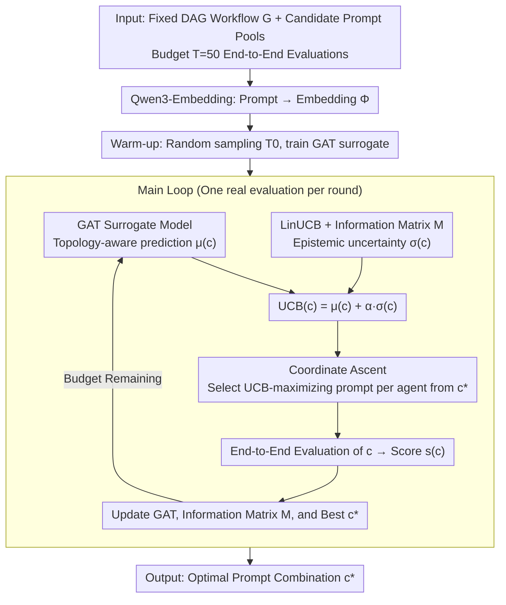

# MASPOB: Multi-Agent Prompt Optimization via GNN Surrogate + LinUCB + Coordinate Ascent

**Conference**: ICML 2026 Spotlight  
**arXiv**: [2603.02630](https://arxiv.org/abs/2603.02630)  
**Code**: https://github.com/HZ1008/MASPOB  
**Area**: Multi-Agent Systems / Prompt Optimization / Bayesian Optimization  
**Keywords**: MAS, prompt optimization, GAT, LinUCB, coordinate ascent, black-box optimization

## TL;DR
MASPOB reformulates multi-agent system prompt optimization as budget-constrained black-box optimization. It utilizes a GAT surrogate model to capture prompt coupling under workflow topologies, LinUCB in the embedding space to compute epistemic uncertainty, and coordinate ascent to decompose joint search into sequential individual problems. This reduces search complexity from $\mathcal{O}(\prod |\mathcal{P}_i|)$ to $\mathcal{O}(\sum |\mathcal{P}_i|)$. Across 6 benchmarks (QA/Code/Math), it achieves an average score of 80.58, surpassing MIPRO (78.87), AFlow (78.52), and IO (68.56).

## Background & Motivation

**Background**: LLM Multi-Agent Systems (MAS) enable multiple specialized agents to collaborate on complex tasks. MAS performance depends not only on the LLM itself but also on the workflow topology and agent prompts. While frameworks like AFlow and GPTSwarm explore automated topology optimization, many workflows are fixed due to expert validation and safety audits, making prompt optimization the primary lever for performance improvement.

**Limitations of Prior Work**: Prompt optimization in MAS presents a combined black-box challenge: (1) Expensive evaluation: A single evaluation requires running the complete end-to-end MAS including multiple LLM calls; (2) Topology-induced coupling: Changes in an upstream agent's prompt alter the input distribution for downstream agents, making the objective non-decomposable; (3) Combinatorial explosion: The joint prompt space for $N$ agents is a Cartesian product.

**Key Challenge**: Existing prompt optimizers are either single-agent-based (OPRO, PromptBreeder, Instinct) which ignore topology, or multi-stage but topology-agnostic (e.g., MIPRO using TPE for implicit dependency). Given a typical budget of 50 evaluations and an exponentially growing prompt space, these methods are sample-inefficient and often miss high-quality coordinated prompt combinations.

**Goal**: Simultaneously address three challenges: sample-efficient exploration, topology-aware modeling, and scalable combinatorial search.

**Key Insight**: Reframe prompt optimization as a contextual bandit problem. Use UCB to balance exploration and exploitation, GNN as a surrogate to capture inter-agent dependencies, and coordinate ascent to decompose combinatorial optimization into sequential single-agent updates, reducing complexity from $\mathcal{O}(\prod |\mathcal{P}_i|)$ to $\mathcal{O}(\sum |\mathcal{P}_i|)$.

**Core Idea**: A three-part framework: GAT message passing for topology-aware mean prediction $\mu(c)$; an information matrix $\mathbf{M}$ for epistemic uncertainty $\sigma(c) = \sqrt{\Phi(c)^\top \mathbf{M}^{-1} \Phi(c)}$; and a UCB function $= \mu(c) + \alpha \sigma(c)$ to guide search via coordinate ascent.

## Method

### Overall Architecture

MASPOB optimizes prompts for a fixed multi-agent workflow DAG $\mathcal{G} = (\mathcal{V}, \mathcal{E})$ within a budget of $T=50$ end-to-end evaluations. Each of the $N$ agents is associated with a candidate prompt pool $p_i \in \mathcal{P}_i$, with the goal of finding $c^* = \arg\max_c s(c)$. The process consists of three stages: first, a warm-up phase using $T_0$ random samples to train the GAT surrogate; then, the main loop where coordinate ascent starts from the current best combination $c^*$ to select agents' prompts with the highest UCB; finally, a real evaluation validates the new combination, updating the GAT model, information matrix, and incumbent. Prompt text is encoded using Qwen3-Embedding-8B, and the MAS backbone uses GPT-4o-mini.

### Key Designs

**1. GAT Surrogate Model: Encoding "Global Sensitivity to Local Prompt Changes"**

The hardest part of MAS prompt optimization is topology-induced coupling: changing an upstream prompt alters its output, shifting the input distribution for downstream agents. MASPOB uses the workflow topology as the inductive bias for the surrogate. Each agent is a node with its prompt embedding $\Phi(p_i)$ as the node feature. A multi-head GAT performs message passing: $\mathbf{h}_i^{(l+1)} = \|_{k=1}^K \sigma(\sum_{j \in \mathcal{N}(i) \cup \{i\}} \alpha_{ij}^{(k)} \mathbf{W}^{(l,k)} \mathbf{h}_j^{(l)})$, where attention weights $\alpha_{ij}^{(k)}$ are computed via Leaky-ReLU and Softmax. Mean pooling over all nodes followed by an MLP yields the performance prediction $\mu(c)$. This explicitly encodes prompt propagation through the topology.

**2. LinUCB + Information Matrix: Quantifying Uncertainty Under Limited Budget**

Since each evaluation consumes multiple LLM calls, sample efficiency is critical. Relying solely on GAT predictions (pure exploitation) risks local optima. MASPOB adopts the information matrix $\mathbf{M} \in \mathbb{R}^{Nd \times Nd}$ from LinUCB, initialized as $\lambda \mathbf{I}$. After each evaluation, it is updated: $\mathbf{M} \leftarrow \mathbf{M} + \Phi(c)\Phi(c)^\top$, where $\Phi(c) = [\Phi(p_1); \dots; \Phi(p_N)]$ is the concatenated embedding. Epistemic uncertainty is computed as $\sigma(c) = \sqrt{\Phi(c)^\top \mathbf{M}^{-1} \Phi(c)}$. This allows the acquisition function $\mathrm{UCB}(c) = \mu(c) + \alpha\sigma(c)$ to balance predicted performance and novelty naturally.

**3. Coordinate Ascent: Decomposing Exponential Search into Linear Search**

The joint prompt space $\prod_i |\mathcal{P}_i|$ grows exponentially. MASPOB uses coordinate ascent to reduce dimensionality: starting from $c^*$, it optimizes one agent at a time while keeping others fixed: $p_i^* \leftarrow \arg\max_{p \in \mathcal{P}_i} \mathrm{UCB}(p_1^*, \dots, p_{i-1}^*, p, p_{i+1}^*, \dots, p_N^*)$. Total iterations decrease to $\mathcal{O}(\sum_i |\mathcal{P}_i|)$. Crucially, GAT forwards are nearly zero-cost compared to real end-to-end evaluations, which are only performed once per round after the coordinate ascent converges.

## Key Experimental Results

### Main Results: 6 Benchmarks (GPT-4o-mini, Average of 3 Runs)

| Method | HotpotQA | DROP | HumanEval | MBPP | GSM8K | MATH | Average |
|------|---|---|---|---|---|---|---|
| IO | 60.36 | 53.09 | 89.31 | 69.11 | 87.80 | 51.71 | 68.56 |
| CoT | 67.62 | 58.27 | 89.57 | 69.89 | 88.34 | 52.47 | 71.03 |
| ReAct | 65.61 | 67.25 | 87.79 | 66.08 | 88.91 | 52.61 | 71.38 |
| PromptBreeder | 68.76 | 71.85 | 88.80 | 70.38 | 91.97 | 52.13 | 73.98 |
| Instinct | 69.92 | 71.90 | 90.08 | 70.23 | 92.64 | 52.40 | 74.53 |
| AFlow | 73.42 | 79.48 | 91.09 | 79.96 | 93.36 | 53.83 | 78.52 |
| MIPRO | 74.37 | 79.13 | 91.35 | 80.65 | 92.80 | 54.90 | 78.87 |
| **Ours (MASPOB)** | **75.43** | **82.28** | **94.15** | **80.65** | **93.90** | **57.05** | **80.58** |

Ours achieves SOTA in 5 out of 6 tasks, with an average of 80.58 vs. Prev. SOTA (MIPRO) 78.87 (+1.71 Gain) and IO 68.56 (+12.02 Gain).

### Key Findings

- **Average +12% relative to IO**: Prompt optimization significantly enhances MAS performance.
- **Maximum Gain on MATH**: Mathematical reasoning involves strong logical chains and topology coupling; MASPOB scores +2.15 over MIPRO.
- **HumanEval 94.15**: Sets a new ceiling for code generation, indicating high utility for industrial applications.
- **Sample Efficiency**: Under the strict 50-evaluation budget, MASPOB outperforms all baselines.

## Highlights & Insights

- **Mapping Mechanisms to Challenges**: UCB addresses expensive sampling; GAT addresses topology coupling; coordinate ascent addresses combinatorial explosion.
- **GNN as Surrogate**: The first instance of using workflow topology as an inductive bias for a prompt optimization surrogate.
- **LinUCB in Embedding Space**: Successfully adapts contextual bandit tools to LLM prompt optimization without manual exploration rate tuning.
- **Efficient Compute Allocation**: Decoupling cheap surrogate forwards from expensive real evaluations allows for more thorough search within a tight budget.

## Limitations & Future Work

- **Fixed Workflows**: Currently assumes a pre-designed topology; does not optimize the graph structure itself.
- **Sparse Data**: 50 evaluation samples may lead to overfit GAT models; the $T_0$ warm-up setting requires careful tuning.
- **Embedding Dependency**: Accuracy depends on the quality of Qwen3-Embedding; static embeddings may limit GAT expressiveness.
- **Comparative Baseline Range**: Lacks comparisons with RL-style (e.g., DSPy) or gradient-based methods (e.g., TextGrad).

## Related Work & Insights

- **vs. Single-Agent Optimizers**: OPRO/Instinct ignore topology; Ours uses GAT for explicit modeling.
- **vs. MIPRO**: MIPRO uses implicit TPE modeling; Ours uses explicit GNN dependencies.
- **vs. Toplogy Optimizers (AFlow)**: These optimize graph structure; Ours optimizes node prompts. They are orthogonal and can be combined.
- **Insight**: GNN-surrogates are highly effective for black-box optimization in structured discrete spaces like multi-agent workflows.

## Rating

- **Novelty**: ⭐⭐⭐⭐⭐ Integrating GNN surrogates with LinUCB and coordinate ascent for MAS prompt optimization is a significant methodological contribution.
- **Experimental Thoroughness**: ⭐⭐⭐⭐ Solid results across 6 benchmarks with 7 baselines; however, limited backbone LLM variety.
- **Writing Quality**: ⭐⭐⭐⭐⭐ Clear motivation, well-defined mechanisms, and reproducible pseudo-code.
- **Value**: ⭐⭐⭐⭐⭐ Directly addresses deployment pains in production MAS (fixed workflows + expensive optimization) with open-source code.

<!-- RELATED:START -->

## Related Papers

- [\[ICML 2026\] OMAC: A Holistic Optimization Framework for LLM-Based Multi-Agent Collaboration](omac_a_holistic_optimization_framework_for_llm-based_multi-agent_collaboration.md)
- [\[ICML 2026\] E-mem: Multi-Agent Based Episodic Context Reconstruction for LLM Agent Memory](e-mem_multi-agent_based_episodic_context_reconstruction_for_llm_agent_memory.md)
- [\[ICML 2026\] CoOT: Learning to Coordinate In-Context with Coordination Transformers](coot_learning_to_coordinate_in-context_with_coordination_transformers.md)
- [\[ICML 2026\] Systematic Failures in Collective Reasoning under Distributed Information in Multi-Agent LLMs](systematic_failures_in_collective_reasoning_under_distributed_information_in_mul.md)
- [\[ICML 2026\] When Cloud Agents Meet Device Agents: Lessons from Hybrid Multi-Agent Systems](when_cloud_agents_meet_device_agents_lessons_from_hybrid_multi-agent_systems.md)

<!-- RELATED:END -->
