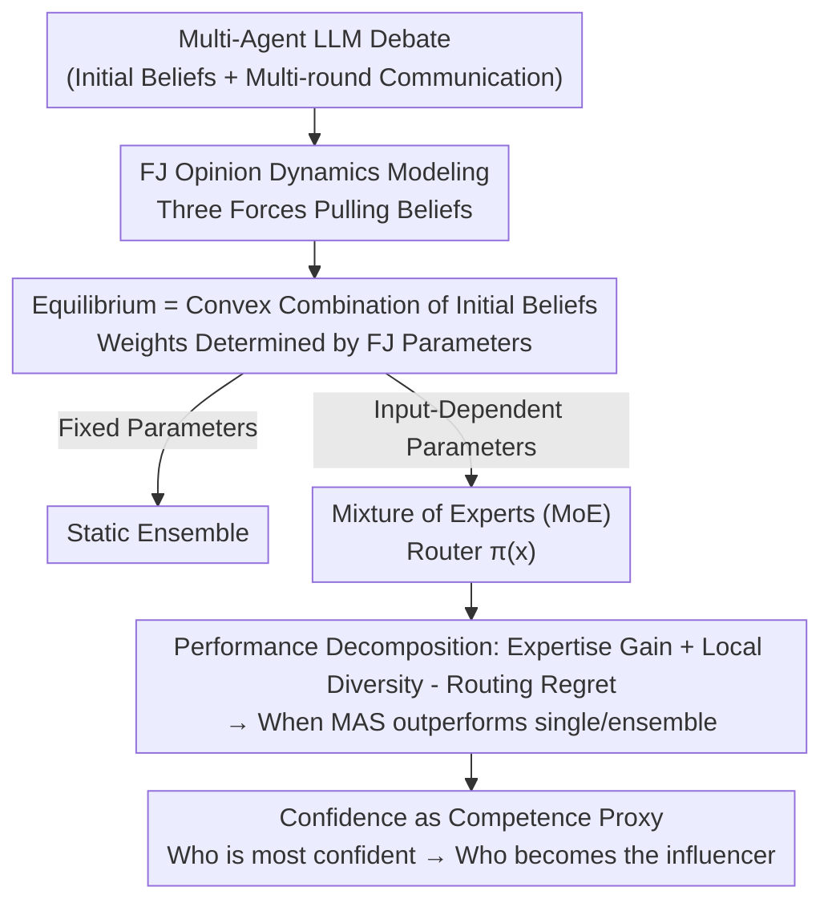

# Multi-Agent Systems are Mixtures of Experts: Who Becomes an Influencer?

**Conference**: ICML 2026  
**arXiv**: [2605.25929](https://arxiv.org/abs/2605.25929)  
**Code**: TBD  
**Area**: Multi-Agent Systems / Multi-Agent LLMs / Theoretical Analysis  
**Keywords**: Multi-Agent LLMs, Opinion Dynamics, Mixture of Experts (MoE), Routing, Influence

## TL;DR
This paper models "multi-LLM agent debates" using **Friedkin-Johnsen (FJ) opinion dynamics** from sociology, proving that FJ parameters are **input-dependent**. This establishes that Multi-Agent Systems (MAS) implement a **Mixture of Experts (MoE) with implicit routing**. The authors theoretically characterize when MAS outperforms single agents or static ensembles and reveal through experiments that "who becomes an influencer" is primarily determined by **confidence (especially relative confidence)**.

## Background & Motivation
**Background**: Organizing multiple LLMs into a Multi-Agent System (MAS)—where they iteratively debate and correct each other—is expected to leverage "complementary expertise for improved decision-making." This approach has gained significant attention in strategic reasoning, negotiation, and generative design.

**Limitations of Prior Work**: Real-world gains from MAS compared to single agents or static ensembles are inconsistent. There is a lack of a **principled framework** to explain how opinions evolve during debates, how influence is distributed, and why some agents are more persuasive. Without such a framework, MAS design remains largely heuristic.

**Key Challenge**: The success of MAS depends on whether "influence flows toward the most competent agent for the given task." However, true **competence is a latent variable** that depends on the specific problem and cannot be directly observed. The challenge lies in determining which signals the "router" should trust; it must rely on **observable proxy variables** (confidence, peer influence, initial opinion alignment), yet the correspondence between these proxies and actual competence is unreliable.

**Goal**: (1) Provide an analytical belief propagation model for LLM debates; (2) Demonstrate the equivalence between this mechanism and MoE; (3) Identify which observable signals drive influence and determine when this "implicit routing" is effective versus when it misplaces trust in incorrect agents.

**Key Insight**: The authors observe that the FJ model (a linear dynamics model widely used for belief propagation in social networks) fits LLM debate trajectories well, and its parameters (stubbornness, retention, influence matrix) **vary with the input problem**. Once parameters become input-dependent, the system is no longer a fixed-weight ensemble but an MoE that switches expert weights based on the input.

**Core Idea**: In short—**view "multi-agent debate convergence" as FJ dynamics, where the input-dependent equilibrium weights $\pi_j(x)$ act as the MoE router**; thus MAS = implicit MoE, and the emergence of influence = the formation of routing.

## Method

### Overall Architecture
This is a theory-driven and empirical paper. The "Method" refers to an analytical framework with a logical chain: **first, characterize the debate using the FJ model** (where each agent's belief is pulled by three forces and converges to an equilibrium); **second, prove that the equilibrium is a convex combination of initial beliefs**—if FJ parameters were fixed, the system would be a static ensemble; **the key transition is that FJ parameters vary with input**, upgrading the system to an MoE where the influence weights $\pi_j(x)$ serve as the input-dependent router; **third, leverage MoE theory** to decompose MAS performance into "expertise gain + local diversity - routing regret," deriving conditions for MAS to outperform single agents/ensembles; **finally, map this to operational signals**—since true competence is unobservable, analyze whether proxies like confidence can approximate it effectively.

### Key Designs

**1. Characterizing Debate via FJ Opinion Dynamics: Beliefs Pulled to Equilibrium**

The FJ model describes the update of each agent $i$'s belief $b_i(t)$ (a probability distribution over the answer set) as a sum of three terms:

$$b_i(t+1)=\underbrace{\gamma_i s_i}_{\text{Attachment to innate belief}}+\underbrace{(1-\gamma_i)\alpha_i b_i(t)}_{\text{Retention of previous state}}+\underbrace{(1-\gamma_i)(1-\alpha_i)\sum_{j}w_{ij}b_j(t)}_{\text{Peer influence pull}}$$

Where $\gamma_i$ is **stubbornness** (innate belief attachment), $\alpha_i$ is the retention weight of the previous state, and $W=[w_{ij}]$ is a row-stochastic influence matrix ($\sum_j w_{ij}=1$, $w_{ii}=0$). In matrix form: $B(t+1) = \Gamma S + H B(t)$. When the spectral radius $\rho(H) < 1$, it converges to a unique equilibrium where each agent's belief is a **convex combination** of all initial beliefs: $b_i^\star = \sum_j m_{ij}s_j$ (Prop 2.1). This means the final debate result is fully described by an analytical, non-negative row-stochastic mixing matrix $M = (I-H)^{-1}\Gamma$. The authors empirically find this linear model sufficient to fit LLM debates without needing complex cascading processes.

**2. Input-Dependent Parameters = MoE: Debate as Implicit Routing**

If FJ parameters $(\Gamma, A, W)$ were fixed, MAS would degrade to a static ensemble—averaging diverse opinions with fixed weights. However, the core observation is that FJ parameters **vary with the input $x$**, i.e., $(\Gamma(x), A(x), W(x))$, meaning the aggregation weights $\pi_j(x)$ also vary. This matches the definition of an MoE (Hypothesis 2.2):

$$b^\star(x)=\sum_{j=1}^{n}\pi_j(x)\,s_j(x)$$

The router $\pi_j(x)$ depends on the input. MAS implicitly implements **adaptive routing**; its performance depends on whether influence is directed toward the agent most competent for the current input. The authors find that routing primarily depends on initial beliefs $s_i(x)$ (which define confidence, competence, and initial alignment).

**3. Performance Decomposition: When MAS Outperforms Single Agents and Ensembles**

Using the MoE perspective and Brier loss $\ell(y,p)=\|p-e_y\|_2^2$, the authors apply "local ambiguity decomposition" (Lemma 2.3). For a given set of observable beliefs $S$, the expected loss of the mixture prediction is $\sum_j a_j(S) r_j(S) - D_{a(S)}(S)$, where the first term rewards "placing weight on locally competent agents" and the second rewards "averaging diverse beliefs." The condition for MAS to outperform the best single agent is (Theorem 2.4):

$$\underbrace{\mathbb{E}[r_{j^*}(S)-\min_j r_j(S)]}_{\text{Expertise Gain}}+\underbrace{\mathbb{E}[D_{\pi(S)}(S)]}_{\text{Local Diversity}}>\underbrace{\mathbb{E}[\delta_\pi(S)]}_{\text{Routing Regret}}$$

Essentially, the "expertise gap from no single agent being optimal everywhere + retained diversity gains" must outweigh the "cost of imperfect routing." Conclusion: Simply adding agents is insufficient—they must have local competence and complementarity, and the router must identify them from observable signals.

**4. Confidence as a Competence Proxy: Who is Most Confident Becomes the Influencer**

Since true competence $r_j(S)$ is unobservable, the router uses proxies. The most natural proxy is **confidence**, defined by the entropy of the initial belief:

$$C_j(S)=1-\frac{1}{\log d}\mathcal{H}(s_j)$$

A confidence-based router takes the form $\pi_j(S)\propto \exp(\beta C_j(S))$. This routing is beneficial only when **confidence is well-calibrated with competence** ($r_j \approx \phi(C_j)$). If agents are "confident but wrong," routing regret $\delta_C(S)$ will be high, potentially performing worse than a static ensemble. The authors distinguish between absolute confidence and **relative confidence** $R_j(S)=C_j(S)/C_{(n-1)}(S)$. They prove that with well-calibrated confidence, hard routing to the most confident agent can strictly outperform the best static ensemble (Prop 2.6/2.7).

### Example: The Confident One Leading the Majority
Fig. 3 illustrates a scenario where a majority of 5 agents initially hold the **wrong** answer. A static ensemble (averaging) would follow the majority. However, one agent with the correct answer is **initially the most confident**. In the FJ debate, it stubbornly holds its ground and concentrates influence ($\pi$) on itself, eventually persuading the majority to change their minds. This is the MoE advantage: utilizing "local expertise + confidence signals" to bypass majority-vote traps. Conversely, if the most confident agent were wrong, this same mechanism would lead the entire system astray.

## Key Experimental Results

### Setup & FJ Fit Quality
Experiments use MMLU-Pro (300 tasks), BBQ (300 tasks), and CSQA (100-task subset). Models include GPT-4o Mini, Qwen2.5-14B-Instruct, and Qwen2.5-72B-Instruct. 5 agents debate for 5 rounds on a complete graph across 3 seeds. Diversity is introduced via persona prompts (e.g., Doctor, Mathematician) and communication styles. The FJ model fits the dynamics remarkably well:

| Metric | Mean ± 95% CI |
|----------|---------------|
| KL Divergence | 0.0470 ± 0.0034 |
| MSE | 0.00198 ± 0.00026 |

FJ parameters show **high variability across samples**, confirming the hypothesis that MAS functions as an input-dependent MoE (Hypothesis 2.2).

### Drivers of Influence (Routing Explainability)
The authors used Random Forests to regress/classify observable variables against "who becomes the most influential agent":

| Analysis | Result |
|------|------|
| Random Forest Regression (Influence) | Test $R^2 \approx 0.7$ |
| Random Forest Classification (Influencer) | Accuracy $\approx 0.9$ |
| Strongest Positive Predictors | Confidence (Absolute + Relative), Competence |
| Secondary Predictors | Persona style (Perceived Confidence), Initial alignment |
| Influence vs. Stubbornness $\gamma$ | Strong positive correlation |

### Key Findings
- **MAS often outperforms ensembles**: MAS consistently beats "static FJ ensembles," proving that aggregation is indeed input-dependent (MoE).
- **Consensus with high influence concentration**: Despite initial diversity, the final round usually converges to a consensus, with influence concentrated on a few agents—this "strong routing" is the subject of analysis.
- **Relative confidence is more predictive than absolute confidence**: This highlights the "social" nature of influence emergence—it’s not just how confident you are, but how much more confident you are than others.
- **Confidence leads to stubbornness**: Confident agents tend to adhere more strictly to their initial beliefs, regardless of alignment with the majority. This poses a risk if routing trust is misplaced.
- **Personas alter influence**: Changing a persona prompt (e.g., to "Expert") can shift an agent's influence, suggesting that "perceived confidence" is a factor in FJ dynamics.

## Highlights & Insights
- **The "MAS = MoE" mapping is the paper's most elegant contribution**: It bridges chaotic, prompt-based multi-agent debates with the mature ML framework of MoE. This provides actionable principles for MAS design—focusing on expertise gain, local diversity, and routing regret.
- **Decoupling influence into observable proxies**: By showing that influencers can be predicted ($R^2=0.7$) using signals like entropy and relative confidence, the paper turns "influence" from a vague concept into a quantifiable metric.
- **Honest identification of failure modes**: The authors point out that "confident errors" + "majority bias" cause the router to misplace trust. This serves as a direct warning for MAS design: agent diversity is not enough; confidence MUST be well-calibrated.

## Limitations & Future Work
- **Task limitation to Multiple-Choice QA**: FJ dynamics are modeled using probability distributions over a discrete set of answers. Extension to open-ended generation or tool-use scenarios remains an open question.
- **"Readout" vs. "Optimized" Router**: The paper explains emergent routing rather than designing an optimal one. The authors suggest using GNNs to learn more accurate routing but acknowledge that complex communication may not be necessary for high performance.
- **Linearity vs. Non-linearity**: While the linear FJ model fits well (KL 0.047), it might miss non-linear persuasion mechanisms that emerge with stronger LLMs or longer debates.
- **Measuring Competence**: Using "belief in the correct answer" as a proxy for competence is not possible in real-world tasks where labels are unknown, limiting the operational utility of calibration analysis.

## Related Work & Insights
- **vs. FJ Safety Framework**: While prior work used FJ to assess safety risks from "stubborn agents," this paper uses the same modeling to focus on performance gains via MoE routing.
- **vs. Classic MoE**: Unlike standard MoE where routers are trained with supervision and ground truth, MAS implements implicit, unsupervised routing through debate.
- **vs. Self-Consistency**: The authors note that methods like Self-Consistency can also achieve routing-like effects; however, MAS allows for the combination of complementary expert models which can be more expressive.

## Rating
- Novelty: ⭐⭐⭐⭐⭐ The "MAS = Implicit MoE" perspective is highly novel and unifying.
- Experimental Thoroughness: ⭐⭐⭐⭐ Extensive analysis across datasets and models, though limited to MCQ tasks.
- Writing Quality: ⭐⭐⭐⭐ Logical progression with clear theoretical motivations.
- Value: ⭐⭐⭐⭐ Provides theoretical principles for "when to use MAS," focusing on local competence, calibration, and routing.

<!-- RELATED:START -->

## Related Papers

- [\[ICLR 2026\] Matching Multiple Experts: On the Exploitability of Multi-Agent Imitation Learning](../../ICLR2026/multi_agent/matching_multiple_experts_on_the_exploitability_of_multi-agent_imitation_learnin.md)
- [\[ICML 2026\] MASPO: Joint Prompt Optimization for LLM-based Multi-Agent Systems](maspo_joint_prompt_optimization_for_llm-based_multi-agent_systems.md)
- [\[ICML 2026\] Securing Multi-Agent Systems Against Corruptions via Node Contribution Backpropagation](securing_multi-agent_systems_against_corruptions_via_node_contribution_backpropa.md)
- [\[ICML 2026\] Voting Protocols as Coordination Mechanisms for Role-Constrained Multi-Agent Tutoring Systems](voting_protocols_as_coordination_mechanisms_for_role-constrained_multi-agent_tut.md)
- [\[ICML 2026\] When Cloud Agents Meet Device Agents: Lessons from Hybrid Multi-Agent Systems](when_cloud_agents_meet_device_agents_lessons_from_hybrid_multi-agent_systems.md)

<!-- RELATED:END -->
