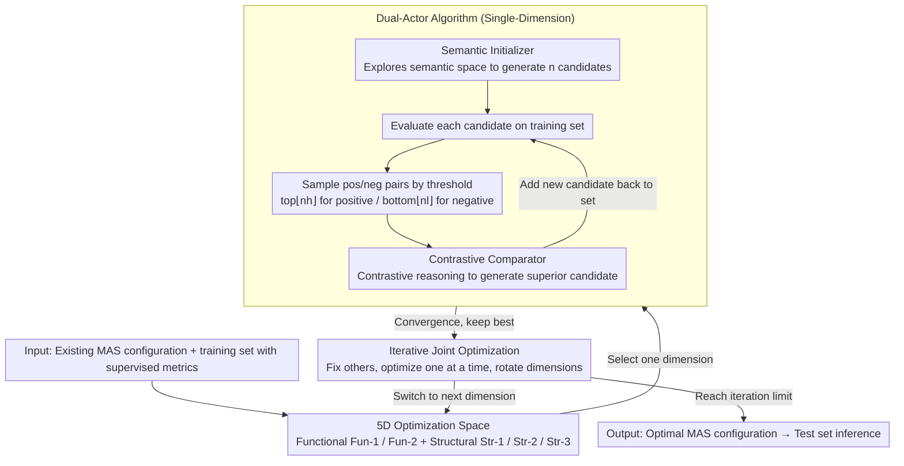

# OMAC: A Holistic Optimization Framework for LLM-Based Multi-Agent Collaboration

**Conference**: ICML 2026 Spotlight  
**arXiv**: [2505.11765](https://arxiv.org/abs/2505.11765)  
**Code**: https://github.com/xiwenchao/OMAC  
**Area**: LLM Agent / Multi-Agent Systems / Code Generation  
**Keywords**: Multi-Agent Systems, Collaborative Optimization, Contrastive Reasoning, Prompt Evolution, Supervised Optimization

## TL;DR
This paper formalizes the optimization space of multi-agent systems (MAS) into five dimensions (two functional and three structural). It utilizes a dual-actor algorithm comprising a "Semantic Initializer" for generation and a "Contrastive Comparator" for contrastive improvement to perform supervised optimization on each dimension. By iteratively and jointly optimizing multiple dimensions, it consistently outperforms baselines such as DyLAN, ADAS, and AFlow on HumanEval, MMLU, and MATH.

## Background & Motivation

**Background**: Multi-agent systems (MAS) have demonstrated capabilities superior to single agents in tasks such as code generation (AgentVerse), reasoning (LLM Debate), and decision-making (Sun 2024). However, most existing MAS rely on manual design—agent roles are defined using human priors or direct LLM generation, and collaboration structures use fixed centralized, decentralized, or hierarchical topologies. A few automated works like DyLAN (dynamic agent team selection), ADAS (prompt evolution), AFlow (MCTS architecture search), and G-Designer/MaAS (architecture search) only optimize single aspects.

**Limitations of Prior Work**: (1) DyLAN uses an unsupervised "agent importance score," lacking supervised signals derived from training data; (2) ADAS, AFlow, G-Designer, and MaAS only optimize one specific aspect (either prompts *or* architecture); (3) None of these methods can simultaneously modify agent functions (prompts/few-shot) and collaboration structures (candidate selection / dynamic participation / communication flow) within a unified framework.

**Key Challenge**: A MAS is essentially an information flow graph where both nodes (agents) and edges (communication links) are optimizable. However, existing methods either modify only nodes or only edges, and there is no general algorithm capable of handling both categories concurrently.

**Goal**: To construct a unified framework that can supervise the optimization of any dimension of a MAS using the same algorithm and iteratively optimize multiple dimensions jointly.

**Key Insight**: After conceptualizing the MAS collaboration process as an information flow graph, the authors identify five core optimizable dimensions—two related to nodes (agent functions) and three related to the graph (structure). They recognize that all five dimensions can be reduced to "optimizing a segment of LLM instructions (plus optional few-shot examples)."

**Core Idea**: Use a pair of LLM-driven actors—the Semantic Initializer explores the semantic space to generate a diverse set of initial prompts, and the Contrastive Comparator analyzes differences between high-scoring and low-scoring pairs to generate superior prompts. This performs supervised contrastive reasoning optimization in each dimension, followed by an "one-dimension-at-a-time" iterative strategy to combine multiple dimensions.

## Method

### Overall Architecture
OMAC takes an existing MAS configuration (multiple agents + collaboration topology) and a training set with supervised metrics (e.g., HumanEval Pass@1) as input, and outputs an optimized set of prompts. Its key insight is that all "adjustable elements" in a MAS—agent prompts, new agents, participation, and information flow—are essentially adjustments to natural language instructions and can thus be handled by the **same algorithm**. It operates on two layers: the lower layer is a **single-dimension optimization algorithm** that iteratively tests one of the five dimensions; the upper layer is **multi-dimension joint optimization**, which rotates through dimensions by "fixing others and optimizing one at a time" to stack the gains from individual dimensions.

### Key Designs

**1. Five-Dimensional Optimization Space: Deconstructing MAS into an Adjustable Information Flow Graph**

Previous MAS optimization papers defined their own optimization targets—DyLAN tuned candidate selection, while ADAS/AFlow focused on architecture search, resulting in fragmented approaches without a common coordinate system. OMAC views a MAS as an information flow graph: nodes represent agents and edges represent communication links. This naturally divides the optimization space into two categories and five non-overlapping dimensions. **Functional dimensions** manage node capabilities: Fun-1 optimizes existing agent prompts and few-shot examples, while Fun-2 constructs entirely new agents. **Structural dimensions** manage the graph shape: Str-1 is the global candidate agent selection controller (who enters the team), Str-2 is the dynamic participation controller for each step (who speaks this round), and Str-3 is the communication flow controller (how edges are routed). Crucially, all five dimensions boil down to "optimizing an LLM prompt," allowing the same algorithm to be applied with different context descriptions. The authors found that each dimension offers independent, stackable improvement potential.

**2. Dual-Actor Algorithm: Semantic Initializer Exploration + Contrastive Comparator Exploitation**

Simply letting an LLM generate prompts is unsupervised exploration, which wastes score signals from the training set. OMAC converts "poor performance" into a supervised signal. The Semantic Initializer receives context (task description + current MAS configuration + dimension specifications + a one-shot example) and performs diverse generation in the semantic space to produce $n$ candidates while maintaining functionality. Each candidate is run through the MAS on the training set to obtain a score. Pairs are sampled based on upper and lower thresholds—taking one positive sample from the top-$\lfloor n h \rfloor$ and one negative sample from the bottom-$\lfloor n l \rfloor$. These are handed to the Contrastive Comparator, which performs contrastive reasoning: "Why is A better than B? Strengthen A's advantages and remove B's flaws to generate a version better than A." The new candidate is added back to the pool. This effectively uses the LLM's own attribution capability for lightweight, gradient-free "pseudo-RL." Only one dimension is changed in a pair to ensure the Comparator can cleanly attribute performance differences to specific modifications.

**3. Iterative Joint Optimization: One Dimension at a Time to Avoid Attribution Confusion**

Optimizing five dimensions simultaneously would lead to a combinatorial explosion and, more importantly, cause the Comparator to lose its attribution capability. If multiple variables change at once, the LLM cannot pinpoint which modification led to the improvement. OMAC chooses serial iteration: it first runs single-dimension optimization independently for each dimension to identify those with the largest gains. For joint optimization, it completes single-dimension optimization for Dim-1 and keeps the best result $\rightarrow$ switches to Dim-2 and runs single-dimension optimization while fixing Dim-1 $\rightarrow$ returns to Dim-1, and so on, until the iteration limit. This ensures only one dimension changes in the contrastive pairs while others remain at their current optimal, making differences interpretable. Ablation studies quantified this: when the Comparator was asked to reason about multiple changing dimensions simultaneously, performance gains were significantly smaller and variance was larger. In practice, joining the two most beneficial functional dimensions or a strong functional dimension with a strong structural dimension yielded the best results.

### A Complete Example: Optimizing Fun-1 on MATH
Consider a default 4-agent MAS for the MATH task. The Semantic Initializer first generates three semantically different prompt candidates: P1 emphasizes "listing intermediate equations step-by-step," P2 emphasizes "estimating magnitude before calculation," and P3 emphasizes "back-substitution verification." Each is run on the training set, yielding Accuracy scores of 34.0, 31.2, and 33.5, respectively. With thresholds $l=h=0.5$, P1 (34.0, highest) is the positive sample and P2 (31.2, lowest) is the negative sample sent to the Contrastive Comparator. It reasons that "P1's intermediate steps make verification evidence-based, while P2's magnitude estimation introduces approximation errors in arithmetic." It then synthesizes P4, which keeps step-by-step equations, removes estimation, and adds back-substitution. P4 achieves 35.0 and becomes the new best in the set. Within a 3-round iteration limit of sampling-contrast-synthesis, the dimension converges to 35.17, a ~4.9% improvement over the default MAS. If a structural dimension (e.g., Str-3) is then joined, this optimized Fun-1 prompt is fixed, and the same process is repeat for Str-3, stacking the gains to approximately 9.6%.

### Loss & Training
OMAC does not update any model parameters; all "optimization" occurs at the prompt level. The supervised signals are the MAS task metrics on the training set (HumanEval Pass@1 / MMLU Accuracy / MATH Accuracy). The base LLM is gpt-3.5-turbo-1106 with a temperature of 0.8. The Semantic Initializer generates 3 candidates per round. The contrastive reasoning iteration limit is 3. Thresholds are $l=h=0.5$. Each experiment is run 3 times, reporting mean ± standard deviation.

## Key Experimental Results

### Main Results
Benchmark tasks: HumanEval (Code Generation, Pass@1), MMLU (General Reasoning, Accuracy), MATH (Arithmetic Reasoning, Accuracy). Default MAS configurations are from DyLAN (7 agents for code, 7 for reasoning, 4 for arithmetic) with a fully connected topology.

| Task | Prev. SOTA | SOTA Score | OMAC Single-Dim Max | Dimension |
|------|------------|------------|---------------------|-----------|
| HumanEval (Pass@1) | AFlow | 85.63 | 89.25 ± 1.30 | Fun-1.4 |
| MMLU (Accuracy) | ADAS | 69.02 | 74.22 ± 2.22 | Fun-1.4 |
| MATH (Accuracy) | AFlow | 32.49 | 35.17 ± 1.96 | Fun-1.1 |

Joint Optimization (3 iterations on MATH task):

| Optimization Strategy | Performance Gain (vs. Default MAS) |
|-----------------------|------------------------------------|
| Best Single Dimension | ~2.9% |
| Joint Iteration (2 strongest dims, 3 rounds) | ~9.6% |

### Ablation Study
OMAC-C: Removing the Contrastive Comparator and only selecting the highest score from the initial set generated by the Semantic Initializer.

| MATH Dimension | OMAC-C | OMAC | Comparator Gain |
|----------------|--------|------|-----------------|
| Str-1 | 32.64 | 33.34 | +0.70 |
| Str-2 | 32.67 | 33.41 | +0.74 |
| Str-3 | 32.76 | 33.70 | +0.94 |
| Fun-1.1 | 34.20 | 35.17 | +0.97 |
| Fun-2 | 32.71 | 33.95 | +1.24 |

### Key Findings
- **All 5 dimensions have independent room for improvement**: Average single-dimension gains were 3.6% for HumanEval, 2.8% for MMLU, and 4.9% for MATH, proving the 5-way division captures orthogonal optimization directions.
- **Functional dimensions usually provide larger gains than structural ones**: Fun-1.x yielded the highest single-dimension improvements across all three tasks, indicating that modifying agent prompts is more direct than modifying collaboration topology.
- **Joint optimization gain exceeds the sum of single dimensions**: On MATH, the best single-dimension gain of 2.9% rose to 9.6% in joint optimization, indicating synergy between structural and functional optimization. The "select two strongest dimensions" strategy consistently outperformed random or weak combinations.
- **Comparator is indispensable**: Removing contrastive reasoning caused a drop across all dimensions for OMAC-C, proving supervised contrastive reasoning is more efficient than pure exploration. However, OMAC-C still outperformed DyLAN, showing the value of diverse exploration by the Semantic Initializer.
- **Reduced inference cost**: Dynamic agent selection and communication flow optimization allowed OMAC to use fewer agents during inference than the baselines, significantly reducing token consumption.

## Highlights & Insights
- **Formalizing MAS optimization space as a 5D coordinate system**: While previous papers defined "optimization" arbitrarily, this work provides a clear graph-theoretic coordinate system (Node Capability × Graph Structure) that covers existing work and is clean and extensible.
- **Contrastive reasoning as a lightweight supervised signal**: Requiring no gradients or RL training, it uses the LLM's own reasoning to translate "poor performance" into "prompt improvement." This is nearly a universal paradigm transferable to any scene involving "optimizing a piece of natural language."
- **"One-dimension-at-a-time" iteration rule**: This seemingly simple engineering choice reflects a clear understanding of the limitations of LLM attribution capabilities. Simultaneous changes to multiple variables lead to incorrect causal attribution, as quantified by ablation studies.
- **Complementary to any basic MAS design**: Since OMAC's input is an "existing MAS configuration" and its output is an "optimized MAS," it can be applied to any manually designed MAS (including future complex ones) for further enhancement.

## Limitations & Future Work
- **Dependence on training set supervised signals**: Not directly applicable to open-ended tasks without clear metrics (e.g., open dialogue quality, long-term agent planning), although the authors performed limited supplementary experiments on GAIA.
- **Optimization quality limited by LLM reasoning capability**: The main experiments used GPT-3.5. When weaker LLMs act as the Comparator, contrastive reasoning may become unstable. GPT-4 experiments are in the appendix but not fully expanded.
- **Combinatorial explosion of joint optimization**: Fully joining 5 dimensions would cost $5^k$ times more than single dimensions ($k$ being iteration rounds), necessitating the selection of only the best two or three dimensions.
- **Neglect of agent role conflicts**: After Fun-2 (creating new agents), role overlaps or contradictions might occur in the MAS, which the paper does not discuss how to detect or handle.
- **Heuristic training data subset sampling**: The appendix suggests that evaluating candidates on subsets of training data saves computation, but there is a lack of theoretical analysis on subset size and sampling strategies.

## Related Work & Insights
- **vs. DyLAN (2024)**: DyLAN uses an unsupervised Agent Importance Score to optimize only candidate selection (Str-1). OMAC uses supervised contrastive reasoning to cover 5 dimensions and outperforms DyLAN even on Str-1.
- **vs. ADAS / AFlow**: These focus on architecture search (prompt evolution / MCTS) optimizing Fun-2 and part of Str-3. OMAC is consistently superior using a more lightweight contrastive reasoning algorithm across broader dimensions.
- **vs. G-Designer / MaAS**: Pure structure search methods. OMAC is no weaker in structural dimensions (beating them on Str-1/2/3) and can additionally optimize functional dimensions.
- **vs. Gradient-based methods (SFT / Prompt tuning)**: These are single-agent approaches unable to handle multi-step MAS collaboration; OMAC replaces gradients with LLM reasoning.
- **vs. RL-based MAS optimization (Shao 2024, Liu 2025)**: Often limited to single-step interactions or shared policies; OMAC handles multi-step, role-specific MAS more naturally.

## Rating
- Novelty: ⭐⭐⭐⭐ The 5D division and dual-actor contrastive reasoning are clear conceptual contributions. While individual components are not revolutionary, their combination creates a new paradigm.
- Experimental Thoroughness: ⭐⭐⭐⭐ 3 classic benchmarks + 2 difficult benchmarks (MBPP/GAIA) + ablation + multiple baseline comparisons, with relatively complete hyperparameter studies.
- Writing Quality: ⭐⭐⭐⭐ Clear framework and intuitive diagrams. Formulas are few, but the "why" behind every design is explained well.
- Value: ⭐⭐⭐⭐ An out-of-the-box optimization suite for practical MAS, with a paradigm transferable to any "natural language instruction optimization" scenario.

<!-- RELATED:START -->

## Related Papers

- [\[ICML 2026\] MASPO: Joint Prompt Optimization for LLM-based Multi-Agent Systems](maspo_joint_prompt_optimization_for_llm-based_multi-agent_systems.md)
- [\[ICML 2026\] MAS-Orchestra: Understanding and Improving Multi-Agent Reasoning Through Holistic Orchestration and Controlled Benchmarks](mas-orchestra_understanding_and_improving_multi-agent_reasoning_through_holistic.md)
- [\[ACL 2026\] ATLAS: Adaptive Trading with LLM AgentS Through Dynamic Prompt Optimization and Multi-Agent Coordination](../../ACL2026/multi_agent/atlas_adaptive_trading_with_llm_agents_through_dynamic_prompt_optimization_and_m.md)
- [\[NeurIPS 2025\] R&D-Agent-Quant: A Multi-Agent Framework for Data-Centric Factors and Model Joint Optimization](../../NeurIPS2025/multi_agent/rd-agent-quant_a_multi-agent_framework_for_data-centric_factors_and_model_joint_.md)
- [\[ACL 2026\] LLM-Based Human-Agent Collaboration and Interaction Systems: A Survey](../../ACL2026/multi_agent/llm-based_human-agent_collaboration_and_interaction_systems_a_survey.md)

<!-- RELATED:END -->
