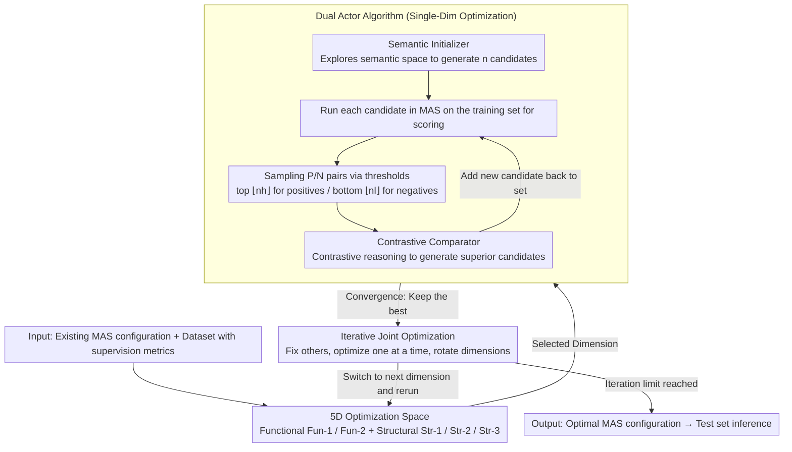

# OMAC: A Holistic Optimization Framework for LLM-Based Multi-Agent Collaboration

**Conference**: ICML 2026 Spotlight  
**arXiv**: [2505.11765](https://arxiv.org/abs/2505.11765)  
**Code**: https://github.com/xiwenchao/OMAC  
**Area**: LLM Agent / Multi-Agent Systems / Code Generation  
**Keywords**: Multi-agent systems, collaborative optimization, contrastive reasoning, prompt evolution, supervised optimization

## TL;DR
This paper formalizes the optimization space of multi-agent systems (MAS) into five dimensions (two functional + three structural). It utilizes a dual-actor algorithm comprising a "Semantic Initializer" for generation and a "Contrastive Comparator" for iterative improvement to perform supervised optimization across each dimension. By iteratively and jointly optimizing multiple dimensions, it consistently outperforms baselines such as DyLAN, ADAS, and AFlow on HumanEval, MMLU, and MATH.

## Background & Motivation

**Background**: Multi-agent systems (MAS) have demonstrated capabilities beyond single agents in tasks like code generation (AgentVerse), reasoning (LLM Debate), and decision-making (Sun 2024). However, existing MAS are mostly manually designed—agent roles rely on human priors or direct LLM generation, and collaborative structures use fixed centralized, decentralized, or hierarchical topologies. A few automated works like DyLAN (dynamic agent team selection), ADAS (prompt evolution), AFlow (MCTS architecture search), and G-Designer/MaAS (architecture search) only optimize single aspects.

**Limitations of Prior Work**: (1) DyLAN uses an unsupervised "agent importance score," lacking supervised signals derived from training data; (2) ADAS, AFlow, G-Designer, and MaAS only optimize one aspect (either prompts *or* architecture); (3) None of these methods can simultaneously modify agent functionality (prompts/few-shot) and collaborative structure (candidate selection / dynamic participation / communication flow) within a unified framework.

**Key Challenge**: MAS is essentially an information flow graph where both nodes (agents) and edges (communication links) are optimizable. However, existing methods modify either nodes or edges and lack a universal algorithm to handle both.

**Goal**: To construct a unified framework capable of supervised optimization for any dimension of a MAS using a single algorithm, while also allowing for iterative joint optimization across multiple dimensions.

**Key Insight**: By conceptualizing the MAS collaboration process as an information flow graph, the authors identify five core optimizable dimensions—two related to nodes (agent functionality) and three related to the graph (structure). They discover that all five dimensions can be reduced to "optimizing a segment of LLM instruction prompts (with optional few-shot examples)."

**Core Idea**: The authors employ a pair of LLM-driven actors: a Semantic Initializer to explore the semantic space and generate a diverse set of initial prompts, and a Contrastive Comparator to identify differences between high-scoring and low-scoring pairs to generate superior prompts. Supervised contrastive reasoning optimization is performed on each dimension, followed by an "one dimension at a time" iterative strategy to jointly optimize multiple dimensions.

## Method

### Overall Architecture
OMAC takes an existing MAS configuration (multiple agents + collaborative topology) and a training set with supervised metrics (e.g., HumanEval Pass@1) as input and outputs a set of optimized prompts. Its key insight is that all "tunable components" in a MAS—agent prompts, additional agents, participant selection, and information flow—are essentially natural language instructions that can be handled by the **same algorithm**. The framework consists of two layers: the lower layer is a **single-dimension optimization algorithm** that iteratively trials improvements for one of the five dimensions; the upper layer is **multi-dimensional joint optimization**, which rotates through multiple dimensions using a "fix others, optimize one" approach to accumulate gains.

### Key Designs

**1. 5D Optimization Space: Deconstructing MAS into a Tunable Information Flow Graph**

Previous MAS optimization papers defined their own targets—DyLAN tuned candidate selection, while ADAS/AFlow focused on architecture search, lacking a common coordinate system. OMAC views MAS as an information flow graph: nodes represent agents and edges represent communication links. This naturally leads to five non-overlapping dimensions across two categories. **Functional dimensions** govern node capabilities: Fun-1 optimizes existing agent prompts and few-shot examples, while Fun-2 constructs entirely new agents. **Structural dimensions** govern graph topology: Str-1 is a global candidate selection controller (who joins the team), Str-2 is a dynamic participation controller for each step (who speaks this round), and Str-3 is a communication flow controller (how edges are routed). Crucially, all five dimensions can be reduced to "optimizing an LLM prompt," allowing the same algorithm to be applied by simply changing the context description. 

**2. Dual Actor Algorithm: Semantic Initializer Exploration + Contrastive Comparator Utilization**

Simply letting an LLM generate prompts is unsupervised exploration that wastes scoring signals from the training set. OMAC converts "poor performance" into a supervised signal. The Semantic Initializer receives context (task description + current MAS configuration + dimension specifications + one-shot example) and performs diverse generation in the semantic space while maintaining functionality, outputting $n$ candidates. Each candidate is run through the MAS on the training set to obtain a score. Samples are then drawn based on thresholds—top-$\lfloor n h \rfloor$ as a positive sample and bottom-$\lfloor n l \rfloor$ as a negative sample—and passed to the Contrastive Comparator. The latter performs contrastive reasoning: "Why is A better than B? Strengthen A's merits, eliminate B's flaws, and generate a version superior to A." The new candidate is added back to the set for the next cycle. This is equivalent to light-weight "pseudo-RL" using the LLM's own attribution capabilities; changing only one dimension per pair ensures the Comparator can cleanly attribute performance differences to specific modifications.

**3. Iterative Joint Optimization: One Dimension at a Time to Avoid Attribution Confusion**

Optimizing five dimensions simultaneously would lead to a combinatorial explosion and, more importantly, cause the Comparator to lose its attribution capability. When multiple variables change, the LLM cannot pinpoint which specific modification led to the improvement. OMAC adopts serial iteration: first, single-dimension optimization is run independently for each dimension to pick those with the highest gains. During joint optimization, it completes single-dimension optimization for dim-1 and retains the best result → switches to dim-2 to run single-dimension optimization while fixing dim-1 → returns to dim-1, and so on, until the iteration limit. This ensures that only one dimension changes in contrastive pairs while others remain at their current optimal state, making the reasons for performance differences interpretable. The authors quantified this via ablation: when the Comparator reasoned about multiple changing dimensions simultaneously, performance gains were significantly smaller and variance was higher. In practice, "joining the two functional dimensions with the largest gains" or "joining the strongest functional + strongest structural dimensions" yielded the best results.

### A Complete Example: Optimizing Fun-1 on MATH
Taking a default 4-agent MAS for the MATH task through single-dimension optimization (optimizing Fun-1, i.e., rewriting an agent prompt): The Semantic Initializer first generates three semantically different prompt candidates—P1 emphasizes "listing intermediate formulas step-by-step," P2 emphasizes "estimating magnitude before calculation," and P3 emphasizes "back-substituting for verification." Each is run in the MAS on the training set, yielding Accuracies of 34.0, 31.2, and 33.5. With thresholds $l=h=0.5$, P1 (34.0, highest) is the positive sample and P2 (31.2, lowest) is the negative sample sent to the Contrastive Comparator. It reasons that "P1's intermediate steps provide a basis for verification, whereas P2's magnitude estimation introduces approximation errors in arithmetic." It then synthesizes P4—retaining step-by-step formulas, removing rough estimation, and adding back-substitution. P4 achieves 35.0 and becomes the new best in the set. After repeating sampling-contrast-synthesis for 3 rounds, the dimension converges to 35.17, a ~4.9% improvement over the default MAS. If then joined with a structural dimension (e.g., Str-3), the optimized Fun-1 prompt is fixed, and the same process is rerun for Str-3, stacking the gains to ~9.6%.

### Loss & Training
OMAC does not update any model parameters; all "optimization" occurs at the prompt level. The supervision signal is the task metric (HumanEval Pass@1 / MMLU Accuracy / MATH Accuracy) on the training set. The base LLM is gpt-3.5-turbo-1106 with a temperature of 0.8. The Semantic Initializer generates 3 candidates per round. The contrastive reasoning iteration limit is 3. Thresholds are $l=h=0.5$. Each experiment is run 3 times, reporting Mean ± Std Dev.

## Key Experimental Results

### Main Results
Benchmarks: HumanEval (Code Generation, Pass@1), MMLU (General Reasoning, Accuracy), MATH (Arithmetic Reasoning, Accuracy). Default MAS configurations are from DyLAN (Code: 7 agents, Reasoning: 7 agents, Arithmetic: 4 agents), all-to-all topology.

| Task | Best Baseline | Baseline Score | OMAC Single-Dim Peak | Dimension |
|------|---------|---------|--------------|------|
| HumanEval (Pass@1) | AFlow | 85.63 | 89.25 ± 1.30 | Fun-1.4 |
| MMLU (Accuracy) | ADAS | 69.02 | 74.22 ± 2.22 | Fun-1.4 |
| MATH (Accuracy) | AFlow | 32.49 | 35.17 ± 1.96 | Fun-1.1 |

Joint Optimization (3 iterations on MATH task):

| Optimization Strategy | Performance Gain (Relative to Default MAS) |
|---------|----------------------|
| Best Single-Dimension | ~2.9% |
| Iterative Joint (Top 2 Dimensions, 3 rounds) | ~9.6% |

### Ablation Study
OMAC-C: Removes the Contrastive Comparator, using only the Semantic Initializer to select the highest score from the initial set.

| MATH Dimension | OMAC-C | OMAC | Comparator Gain |
|----------|--------|------|---------------|
| Str-1 | 32.64 | 33.34 | +0.70 |
| Str-2 | 32.67 | 33.41 | +0.74 |
| Str-3 | 32.76 | 33.70 | +0.94 |
| Fun-1.1 | 34.20 | 35.17 | +0.97 |
| Fun-2 | 32.71 | 33.95 | +1.24 |

### Key Findings
- **All 5 dimensions provide independent improvement space**: Single-dimension optimization yields average gains of 3.6% on HumanEval, 2.8% on MMLU, and 4.9% on MATH, proving the 5D division captures orthogonal optimization directions.
- **Functional dimensions generally yield higher gains than structural dimensions**: Fun-1.x provided the highest single-dimension improvements across all three tasks, suggesting that modifying agent prompts is more direct than modifying collaborative topology.
- **Joint optimization gains exceed the sum of single-dimension gains**: On MATH, the peak single-dimension gain of 2.9% rose to 9.6% when joined, indicating synergy between structural and functional optimization. The "top two dimensions" strategy consistently outperformed random pairs.
- **The Comparator is indispensable**: OMAC-C saw performance drops across all dimensions without contrastive reasoning, proving that supervised contrastive reasoning is more efficient than simple exploration. However, OMAC-C still outperformed DyLAN, showing the inherent value of the Semantic Initializer's diversity.
- **Reduced inference costs**: Optimization of dynamic agent selection and communication flow allows OMAC to use fewer agents during inference than baselines, significantly reducing token consumption.

## Highlights & Insights
- **Formalized MAS Optimization Space as a 5D Coordinate System**: Whereas previous works defined "optimization" idiosyncratically, this paper provides a clear graph-theory coordinate system (Node Capability × Graph Structure) that covers existing work and is easily extensible.
- **Contrastive Reasoning as a Lightweight Supervised Signal**: Without gradients or RL training, the framework uses LLM reasoning to translate "poor performance" into "prompt improvements." This is virtually a universal paradigm transferable to any "natural language optimization" scenario.
- **"One-at-a-time" Iteration Rule**: This engineering choice stems from a critical awareness of LLM attribution limitations—changing multiple variables causes incorrect causal reasoning. This was quantified via ablation.
- **Complementarity with Any MAS Base Design**: Since OMAC's input is an "existing MAS configuration," it can be applied as a booster to any manually designed MAS (including future, more complex ones).

## Limitations & Future Work
- **Dependency on Training Set Supervised Signals**: Not directly applicable to open-ended tasks without clear metrics (e.g., open dialogue quality, long-range agent planning), though the authors conducted limited supplementary experiments on GAIA.
- **Optimization Quality Limited by LLM Reasoning**: The main experiments used GPT-3.5; contrastive reasoning might be unstable with weaker LLMs. GPT-4 experiments are in the appendix but not fully expanded.
- **Combinatorial Explosion in Joint Optimization**: Fully joining 5 dimensions would cost $5^k$ times more compute than single-dimension optimization ($k$ being the iteration rounds), restricting the search to the best few dimensions.
- **Agent Role Conflicts**: The paper does not discuss how to detect or handle role overlap or contradictions that might arise after Fun-2 (adding new agents).
- **Heuristic Training Data Sub-sampling**: Evaluator compute can be saved by using subsets, but the optimal subset size and sampling strategy lack theoretical analysis.

## Related Work & Insights
- **vs DyLAN (2024)**: DyLAN uses unsupervised Agent Importance Scores to optimize only candidate selection (Str-1); OMAC uses supervised contrastive reasoning across 5 dimensions and outperforms DyLAN on Str-1.
- **vs ADAS / AFlow**: These focus on architecture search (prompt evolution / MCTS) covering Fun-2 + partial Str-3; OMAC is consistently superior using lighter-weight contrastive reasoning across wider dimensions.
- **vs G-Designer / MaAS**: These are pure structural search methods; OMAC is competitive in structural dimensions (beating them in Str-1/2/3) while additionally optimizing functional dimensions.
- **vs Gradient-based methods (SFT / prompt tuning)**: Traditionally single-agent strategies that struggle with multi-step MAS collaboration; OMAC replaces gradients with LLM reasoning.
- **vs RL-based MAS Optimization (Shao 2024, Liu 2025)**: These are often limited to single-step interactions or shared policies; OMAC handles multi-step, role-specific MAS more naturally.

## Rating
- Novelty: ⭐⭐⭐⭐ The 5D categorization and dual-actor contrastive reasoning algorithm are clear conceptual contributions. While individual components are not revolutionary, the combination creates a new paradigm.
- Experimental Thoroughness: ⭐⭐⭐⭐ 3 classic benchmarks + 2 difficult benchmarks (MBPP/GAIA) + ablation + multiple baseline comparisons, with fairly complete hyperparameter studies.
- Writing Quality: ⭐⭐⭐⭐ Clear framework, intuitive diagrams, and a clear explanation of the "why" behind each design.
- Value: ⭐⭐⭐⭐ Serves as a plug-and-play optimization kit for practical MAS, with a paradigm transferable to any "natural language instruction optimization" scenario.

<!-- RELATED:START -->

## Related Papers

- [\[ICML 2026\] MASPO: Joint Prompt Optimization for LLM-based Multi-Agent Systems](maspo_joint_prompt_optimization_for_llm-based_multi-agent_systems.md)
- [\[ICLR 2026\] Adaptive Collaboration with Humans: Metacognitive Policy Optimization for Multi-Agent LLMs with Continual Learning](../../ICLR2026/multi_agent/adaptive_collaboration_with_humans_metacognitive_policy_optimization_for_multi-a.md)
- [\[ICML 2026\] MAS-Orchestra: Understanding and Improving Multi-Agent Reasoning Through Holistic Orchestration and Controlled Benchmarks](mas-orchestra_understanding_and_improving_multi-agent_reasoning_through_holistic.md)
- [\[ACL 2026\] ATLAS: Adaptive Trading with LLM AgentS Through Dynamic Prompt Optimization and Multi-Agent Coordination](../../ACL2026/multi_agent/atlas_adaptive_trading_with_llm_agents_through_dynamic_prompt_optimization_and_m.md)
- [\[NeurIPS 2025\] R&D-Agent-Quant: A Multi-Agent Framework for Data-Centric Factors and Model Joint Optimization](../../NeurIPS2025/multi_agent/rd-agent-quant_a_multi-agent_framework_for_data-centric_factors_and_model_joint_.md)

<!-- RELATED:END -->
