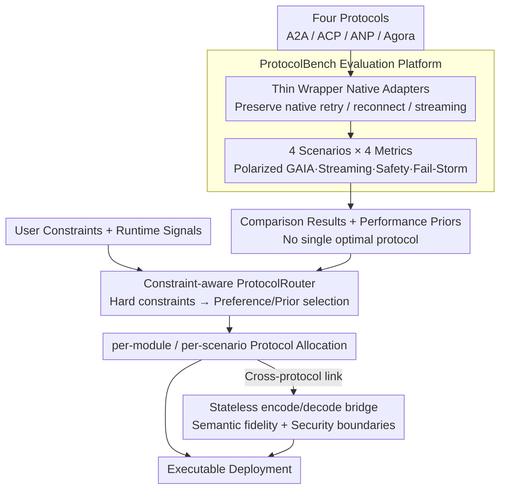

# ProtocolBench: Which LLM MultiAgent Protocol to Choose?

**Conference**: ICML 2026  
**arXiv**: [2510.17149](https://arxiv.org/abs/2510.17149)  
**Code**: To be confirmed  
**Area**: Multi-Agent Systems / Protocol Evaluation / LLM Systems  
**Keywords**: Multi-agent protocols, A2A / ACP / ANP / Agora, Protocol routing, Failure recovery, End-to-end latency

## TL;DR
ProtocolBench presents the first systematic comparison of four major LLM multi-agent communication protocols (A2A, ACP, ANP, Agora) across four axes: task success, end-to-end latency, message byte overhead, and failure robustness. The study reveals that protocol choice results in a 36.5% difference in completion time and a 3.48s difference in latency; it further proposes ProtocolRouter for dynamic scenario-based protocol selection, reducing Fail-Storm recovery time by 18.1%.

## Background & Motivation

**Background**: LLM multi-agent systems are transitioning from research prototypes to production (CAMEL, ChatDev, MetaGPT, AutoGen). Underlying communication relies on various protocols: A2A (Google), ACP (IBM BeeAI), ANP, and Agora. Specialized protocols like MCP handle tool calls, while IoA manages dynamic discovery.

**Limitations of Prior Work**: Protocol selection currently relies on intuition and lacks standardized guidelines: (1) existing benchmarks assume fixed communication mechanisms and only measure task-level outcomes (Zhu 2025, Hyun 2025), treating protocols as black boxes; (2) protocol selection simultaneously affects task success, latency, byte overhead, and robustness, creating tightly coupled trade-offs; (3) fair comparison is difficult—non-protocol factors (model, prompt, hardware, rate limits) must be controlled without using abstraction layers that hide native retry, reconnect, or streaming behaviors; (4) the large space (protocols $\times$ topology $\times$ scale + dynamic failures) requires lightweight, unified logging.

**Key Challenge**: Practitioners seek to identify the "best" protocol, but the answer is highly scenario-dependent (one protocol wins on GAIA, another on Streaming, and a different one on Fail-Storm). No single protocol is optimal across all scenarios. This necessitates scenario-based selection or synthesis rather than selecting one global optimum.

**Goal**: (1) Provide a fair, reproducible protocol evaluation while maintaining native behaviors without abstraction layers; (2) cover core use cases with four metric axes and four scenarios; (3) move beyond evaluation by providing a router to automate protocol selection.

**Key Insight**: Utilize thin wrappers to encapsulate native protocol implementations (without replacing internal retry/streaming logic) to unify logging and metrics. Scenarios cover task quality (GAIA), latency/throughput (Streaming Queue), security (Safety Tech), and failure recovery (Fail-Storm Recovery). The router employs a constraint-aware selection algorithm, treating protocol selection as a learnable problem.

**Core Idea**: Transform "protocol selection" from an implicit assumption into a quantifiable, routable engineering decision. The router does not replace protocols; it performs selection and provides a cross-protocol stateless encode/decode bridge.

## Method

### Overall Architecture

The work consists of two parts: the ProtocolBench evaluation platform and the ProtocolRouter built upon it. ProtocolBench places A2A, ACP, ANP, and Agora into thin wrappers and executes identical workloads across four polarized scenarios (GAIA for quality, Streaming Queue for latency, Safety Tech for safety, Fail-Storm Recovery for recovery). Performance is recorded across four axes (task quality, latency/throughput, byte overhead, robustness). These evaluations reveal that no single protocol is optimal for all scenarios and provide performance priors. ProtocolRouter then formalizes protocol selection as a constraint optimization problem—using evaluation priors, user constraints, and runtime signals to dynamically select protocols per scenario or module. A stateless bridge translates messages between protocols to ensure execution.

### Key Designs

**1. Thin Wrapper for Native Protocols: Preserving Protocol "Personality"**

Conventional benchmarks often mask differences by adding an abstraction layer that treats all protocols as generic RPCs, thereby disabling unique features like A2A's streaming or ANP's reconnection logic. This study uses thin wrappers that expose a unified interface while calling native SDKs internally. Native retry, reconnect, and streaming behaviors remain intact. A unified logging schema allows for comparable metrics across the four axes, while scenarios are shared (same model, prompt, hardware, rate limits) to isolate protocol-specific impacts.

**2. 4 Scenarios × 4 Metrics: Decoupling Coupled Trade-offs**

Protocol selection affects task success, latency, overhead, and robustness simultaneously. Single-scenario evaluations often hide trade-offs by optimizing for a single metric. This work designates a "home" metric for each scenario: GAIA polarizes task quality, Streaming Queue focuses on latency/throughput, Safety Tech on compliance, and Fail-Storm Recovery on robustness. This forces the exposure of which protocol excels in which context—e.g., A2A dominates GAIA and Fail-Storm, while ACP wins in Streaming.

**3. Constraint-aware ProtocolRouter: Formalizing Protocol Selection**

Since no single protocol is universally optimal, static selection is suboptimal. ProtocolRouter formalizes selection as constraint optimization: given hard constraints (e.g., latency $<10\text{s}$, recovery time $<5\text{s}$, safety boundaries) and runtime signals (load, failure state), it selects the best protocol among the four candidates. Granularity can be per-scenario or per-module (e.g., using low-latency ACP for retrieval and robust A2A for recovery). The router uses a stateless encode/decode bridge to translate messages between protocols, preserving application semantics and explicitly marking security boundary transitions.

## Key Experimental Results

### GAIA Document QA (Quality Polarization)

| Protocol | Quality↑ | Success↑ |
|------|--------|---------|
| **A2A** | **2.51** (+7.7%) | **9.29** (+27.6%) |
| ACP | 2.33 | 7.28 |
| ANP | 2.21 | 6.94 |
| Agora | 2.18 | 6.81 |

A2A significantly outstrips others on GAIA (quality +7.7%, success +27.6%).

### Streaming Queue (Latency Polarization)

| Protocol | Mean Latency (s)↓ | Variance↓ | Completion Time (min)↓ |
|------|----------------|---------|------------|
| **ACP** | **9.66** | Lowest | **40.28** |
| A2A | 11.42 | Mid | 47.83 |
| ANP | 12.18 | Mid | 51.20 |
| Agora | 13.14 | High | **54.97** |

ACP achieves the lowest latency and variance; Agora performs worst; the end-to-end completion gap reaches 36.5% (40.28 vs 54.97 min).

### Fail-Storm Recovery (Robustness Polarization)

| Protocol | Post-failure / Pre-failure Answer Retention |
|------|------------------|
| **A2A** | **98.85%** (post 14.57 / pre 14.74) |
| ACP | 92.41% |
| ANP | 86.96% |
| Agora | 81.29% |

A2A shows the highest robustness; Agora suffers a 19% loss under failure conditions.

### ProtocolRouter Gains

| Task | Best Single Protocol Baseline | **ProtocolRouter** | Δ |
|------|--------------|--------------|---|
| Fail-Storm Recovery Time | A2A: 8.00s | **6.55s** | **−18.1%** |
| GAIA Success | A2A: 9.29 | **9.90** | +6.6% |

The router provides precise improvements to target metrics under explicit constraints, rather than blanket domination.

### Key Findings
- **No Single Optimal Protocol**: Each scenario has a "home protocol" (A2A for GAIA/Fail-Storm, ACP for Streaming), proving protocol selection must be scenario-dependent.
- **Significant Impact of Protocol Choice**: Differences of 36.5% in completion time, 3.48s in latency, and 17.56% in robustness are engineering-scale variations, not noise.
- **Router Precision under Constraints**: Constraint-aware selection reduces Fail-Storm recovery time by 18.1%, validating dynamic routing as a viable approach.
- **Opportunities for Per-Module Selection**: Different stages benefit from different protocols (e.g., low-latency ACP for retrieval, robust A2A for recovery).

## Highlights & Insights
- **First Systematic Quantization of Protocol Selection**: While MAS research often focuses on agent roles and prompts, this work reveals that the protocol itself has an order-of-magnitude impact on system behavior.
- **Engineering Rigor in Fair Evaluation**: The decision to use thin wrappers to preserve native retry/streaming behaviors is critical; existing benchmarks often mask these differences through abstraction.
- **Decoupled Scenario-Axis Design**: The 4 scenario $\times$ 4 metric framework exposes trade-offs, making the "where to use what" discussion quantifiable.
- **Evaluation-to-Action Loop**: ProtocolRouter provides an automated, executable mechanism alongside the evaluation; stateless bridges allow the router to operate without breaking application semantics.

## Limitations & Future Work
- Evaluation is limited to four mainstream protocols; adjacent standards like MCP, IoA, and LMOS are not currently included.
- Scenarios are polarized; coverage for long-tail use cases (e.g., cross-organization security negotiation, dynamic agent discovery) is insufficient.
- The router is currently constraint-aware and rule-based; RL-based or learned routers could be explored.
- Stateless bridges may lose information for certain stateful features (e.g., A2A streaming sessions).
- Evaluation of security dimensions (authentication, encryption, zero-trust) is superficial and requires deeper investigation.

## Related Work & Insights
- **vs. MultiAgentBench (Zhu 2025)**: That benchmark fixes the protocol to evaluate agent collaboration; this work specifically evaluates the protocol.
- **vs. Frameworks (LangChain, AutoGen)**: These frameworks often hardcode communication patterns; this work reveals the impact of the communication pattern itself.
- **vs. Network Protocol Benchmarks**: While mature frameworks exist for TCP/HTTP, LLM multi-agent protocols have lacked systematic evaluation until now.
- **Insight**: Protocol selection is a first-class engineering decision and should be automated. The scenario-axis evaluation template is applicable to any "no one-size-fits-all" tool selection problem (e.g., vector DBs, serialization formats).

## Rating
- Novelty: ⭐⭐⭐⭐⭐ First systematic LLM multi-agent protocol benchmark and router.
- Experimental Thoroughness: ⭐⭐⭐⭐⭐ Comprehensive coverage across 4 protocols, 4 scenarios, and 4 metrics with quantified trade-offs.
- Writing Quality: ⭐⭐⭐⭐ Clear architectural diagrams; data-dense but provides clear take-home conclusions.
- Value: ⭐⭐⭐⭐⭐ Directly serves production MAS engineering; ProtocolRouter is immediately applicable.

<!-- RELATED:START -->

## Related Papers

- [\[ICLR 2026\] Which LLM Multi-Agent Protocol to Choose?](../../ICLR2026/multi_agent/which_llm_multi-agent_protocol_to_choose.md)
- [\[ICML 2026\] MASPO: Joint Prompt Optimization for LLM-based Multi-Agent Systems](maspo_joint_prompt_optimization_for_llm-based_multi-agent_systems.md)
- [\[ICML 2026\] E-mem: Multi-Agent Based Episodic Context Reconstruction for LLM Agent Memory](e-mem_multi-agent_based_episodic_context_reconstruction_for_llm_agent_memory.md)
- [\[ICML 2026\] Beyond Majority Voting: LLM Aggregation by Leveraging Higher-Order Information](beyond_majority_voting_llm_aggregation_by_leveraging_higher-order_information.md)
- [\[ICML 2026\] EngiAgent: Fully Connected Coordination of LLM Agents for Solving Open-ended Engineering Problems with Feasible Solutions](engiagent_fully_connected_coordination_of_llm_agents_for_solving_open-ended_engi.md)

<!-- RELATED:END -->
